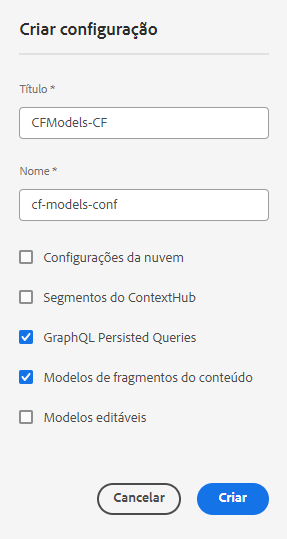

# Como modelar seu conteúdo {#model-your-content}

Nesta parte da [Jornada de desenvolvedores headless do AEM](overview.md), você aprenderá a modelar sua estrutura de conteúdo. Em seguida, estabeleça essa estrutura no Adobe Experience Manager (AEM) usando modelos de fragmentos de conteúdo e fragmentos de conteúdo, para a reutilização em outros canais.

## A história até agora {#story-so-far}

No início, [Saiba mais sobre o Desenvolvimento headless do CMS](learn-about.md) abordou a entrega de conteúdo headless e por que ela é usada. Em seguida, a [Introdução ao AEM Headless as a Cloud Service](getting-started.md) descreveu o AEM Headless no contexto de seu próprio projeto.

No documento anterior da jornada do AEM Headless, [Caminho para a sua primeira experiência utilizando o AEM Headless](path-to-first-experience.md), você aprendeu as etapas necessárias para implementar seu primeiro projeto. Depois de lê-lo, você pode fazer o seguinte:

* Entenda e explique considerações importantes de planejamento para a criação do seu conteúdo
* Entenda e explique as etapas para implementar o headless, dependendo dos requisitos do nível de integração.
* Organizar as ferramentas e configurações necessárias do AEM.
* Conheça as práticas recomendadas para que você possa tornar sua jornada headless perfeita, manter a geração de conteúdo eficiente e garantir que o conteúdo seja entregue rapidamente.

Este artigo se baseia nesses fundamentos para que você entenda como preparar seu próprio projeto do AEM Headless.

## Objetivo {#objective}

* **Público-alvo**: iniciante
* **Objetivo**: aprender a modelar sua estrutura de conteúdo e estabelecer essa estrutura usando modelos de fragmentos de conteúdo e fragmentos de conteúdo do AEM:
   * Conheça conceitos e terminologias relacionados à modelagem de dados/conteúdo.
   * Saiba por que a modelagem de conteúdo é necessária para a entrega de conteúdo headless.
   * Saiba como estabelecer essa estrutura utilizando modelos de fragmentos de conteúdo do AEM (e criar conteúdo com fragmentos de conteúdo).
   * Saiba como modelar seu conteúdo através de princípios com amostras básicas.

>[!NOTE]
>
>A Modelagem de Dados é um campo grande, pois é usada ao desenvolver Bancos de Dados Relacionais. Há muitos livros e fontes de informação online disponíveis.
>
>Essa jornada considera apenas os aspectos que são de interesse ao modelar dados para uso com o AEM Headless.

## Modelagem de conteúdo {#content-modeling}

*O mundo é grande e complexo*.

Talvez, mas talvez não. Certamente é um mundo ***complicado*** lá fora, e a modelagem de dados é usada para definir uma representação simplificada de uma subseção muito (muito) pequena, usando as informações específicas necessárias para um determinado propósito.

>[!NOTE]
>
>Como o AEM lida com o conteúdo, essa jornada se refere à modelagem de dados como Modelagem de conteúdo.

Por exemplo:

Existem muitas escolas, mas todas têm muitas coisas em comum:

* Um local
* Um diretor
* Muitos professores
* Muitos membros não docentes
* Muitos alunos
* Muitos ex-professores
* Muitos ex-alunos
* Muitas salas de aula
* Uma grande quantidade de livros
* Uma grande quantidade de equipamentos
* Muitas atividades extracurriculares
* e assim por diante....

Mesmo em um exemplo tão pequeno, a lista pode parecer infinita. Mas se você quiser que seu aplicativo execute apenas uma tarefa simples, limite as informações ao essencial.

Por exemplo, para realizar a publicidade de eventos especiais para todas as escolas da área, as seguintes informações são necessárias:

* Nome da escola
* Local da escola
* Diretor
* Tipo de evento
* Data do evento
* Professor organizador do evento

### Conceitos  {#concepts}

O que você deseja descrever é chamado de **Entidades** - basicamente as &quot;coisas&quot; sobre as quais você deseja armazenar informações.

As informações que você deseja armazenar sobre eles são os **Atributos** (propriedades), como Nome e Qualificações dos professores.

Há várias **Relações** entre as entidades. Por exemplo, geralmente uma escola tem apenas um diretor e muitos professores (e geralmente o diretor também é professor).

O processo de análise e definição dessas informações, junto com as relações entre elas, é chamado de **Modelagem de conteúdo**.

### Básico {#basics}

Muitas vezes, você deve começar elaborando um **Esquema Conceitual** que descreve as entidades e seus relacionamentos. Geralmente, é um esquema de alto nível (conceitual).

Depois que isso estiver estável, você pode traduzir os modelos em um **Esquema lógico** que descreve as entidades, juntamente com os atributos, e as relações. Nesse nível, examine as definições cuidadosamente para eliminar a duplicação e otimizar o design.

>[!NOTE]
>
>Às vezes, essas duas etapas são mescladas, frequentemente dependendo da complexidade do seu cenário.

Por exemplo, você precisa de entidades separadas para `Head Teacher` e `Teacher` ou simplesmente um atributo adicional no modelo `Teacher`?

### Garantia da integridade de dados {#data-integrity}

A integridade de dados é necessária para garantir a precisão e a consistência do conteúdo em todo o ciclo de vida. Isso inclui garantir que os autores de conteúdo possam entender facilmente o que armazenar, para que os itens a seguir sejam fundamentais:

* uma estrutura clara
* uma estrutura o mais concisa possível (sem sacrificar a precisão)
* validação de campos individuais
* quando apropriado, restringir o conteúdo de campos específicos ao que é relevante

### Eliminação da redundância de dados {#data-redundancy}

A redundância de dados ocorre quando as mesmas informações são armazenadas duas vezes na estrutura de conteúdo. Isso deve ser evitado, pois pode gerar confusão na criação do conteúdo e erros na consulta; sem falar no mau uso do espaço de armazenamento.

### Otimização e desempenho {#optimization-and-performance}

Ao otimizar sua estrutura, você pode melhorar o desempenho, tanto para criação de conteúdo quanto para consultas.

Tudo é um ato de equilíbrio, mas criar uma estrutura muito complexa, ou com muitos níveis, pode ser confuso para os autores que geram o conteúdo. Além disso, isso pode afetar seriamente o desempenho se a consulta tiver que acessar vários Fragmentos de conteúdo aninhados (referenciados) para recuperar o conteúdo necessário.

## Modelagem de conteúdo para AEM headless {#content-modeling-for-aem-headless}

A Modelagem de dados é um conjunto de técnicas estabelecidas, frequentemente usadas ao desenvolver bancos de dados de relacionamento. Então o que a Modelagem de conteúdo significa para o AEM Headless?

### Por quê? {#why}

Para garantir que seu aplicativo possa solicitar e receber o conteúdo necessário do AEM de forma consistente e eficiente, esse conteúdo deve ser estruturado.

Isso significa que o aplicativo sabe antecipadamente a forma de resposta e, portanto, como processá-la. Isso é mais fácil do que receber conteúdo de forma livre, que deve ser analisado para determinar o que contém e, portanto, como pode ser usado.

### Introdução a como? {#how}

O AEM usa Fragmentos de conteúdo para fornecer as estruturas necessárias para a entrega headless do conteúdo aos seus aplicativos.

A estrutura do modelo de conteúdo é:

* realizada pela definição do Modelo de fragmento de conteúdo,
* usada como base dos Fragmentos de conteúdo usados para a geração de conteúdo.

>[!NOTE]
>
>Os Modelos de fragmento de conteúdo também são usados como a base dos Esquemas da GraphQL do AEM, usados para recuperar conteúdo. Falaremos mais sobre isso em uma próxima sessão.

As solicitações de conteúdo são feitas usando a API GraphQL do AEM, uma implementação personalizada da API GraphQL padrão. A API do AEM GraphQL permite realizar consultas (complexas) nos fragmentos de conteúdo, com cada consulta de acordo com um tipo de modelo específico.

O conteúdo retornado pode ser usado pelos seus aplicativos.

## Criar a estrutura com Modelos de fragmento de conteúdo {#create-structure-content-fragment-models}

Os Modelos de fragmentos de conteúdo fornecem vários mecanismos que permitem definir a estrutura do conteúdo.

Um Modelo de fragmento de conteúdo descreve uma entidade.

>[!NOTE]
>Você deve ativar a funcionalidade de Fragmento de conteúdo no Navegador de configuração para poder criar modelos.

>[!TIP]
>
>O modelo deve ser nomeado para que o autor de conteúdo saiba qual modelo selecionar ao criar um Fragmento de conteúdo.

Dentro de um modelo:

1. **Tipos de dados** permitem definir os atributos individuais.
Por exemplo, defina o campo com o nome de um professor como **Texto** e seus anos de serviço como **Número**.
1. Os tipos de dados **Referência de conteúdo** e **Referência de fragmento** permitem criar relações com outro conteúdo no AEM.
1. O tipo de dados **Referência de fragmento** permite que você realize vários níveis de estrutura aninhando os Fragmentos de conteúdo (de acordo com o tipo de modelo). Isso é essencial para a modelagem de conteúdo.

Por exemplo:

### Tipos de dados {#data-types}

O AEM fornece os seguintes tipos de dados para você modelar o conteúdo:

* Texto em linha única
* Texto multilinha
* Número
* Booleano
* Data e hora
* Enumeração
* Tags
* Referência de fragmento / UUID de referência de fragmento
* Referência de conteúdo / UUID de referência de conteúdo
* Objeto JSON
* Espaço reservado da guia

### Referências e conteúdo aninhado {#references-nested-content}

Dois tipos de dados fornecem referências ao conteúdo fora de um fragmento específico:

* **Referência de conteúdo**
Isso fornece uma referência simples a outro conteúdo de qualquer tipo.
Por exemplo, você pode fazer referência a uma imagem em um local especifico.

* **Referência de fragmento**
Isso fornece referências a outros Fragmentos de conteúdo.
Esse tipo de referência é usado para criar conteúdo aninhado, introduzindo as relações necessárias para modelar o conteúdo.
O tipo de dados pode ser configurado para permitir que os autores de fragmento:
   * Editem o fragmento referenciado diretamente.
   * Crie um fragmento de conteúdo, com base no modelo apropriado

### Criar Modelos de fragmentos do conteúdo {#creating-content-fragment-models}

No início, você deve ativar os Modelos de fragmentos de conteúdo no site. Isso é feito no Navegador de Configuração em **Ferramentas** > **Geral** > **Navegador de Configuração**. Você pode optar por configurar a entrada global ou criar uma configuração. Por exemplo:

>[!NOTE]
>
>Consulte Recursos adicionais - Fragmentos de conteúdo no navegador de configuração

Em seguida, os Modelos de fragmentos de conteúdo podem ser criados e a estrutura definida. Isso pode ser feito no Console de fragmentos de conteúdo. No console, selecione o painel para Modelos de fragmento de conteúdo, navegue até a pasta apropriada e use **Criar** para abrir a caixa de diálogo **Novo modelo de fragmento de conteúdo**.

Depois de criado, você pode editar seu modelo. Por exemplo:

>[!NOTE]
>
>Consulte Recursos adicionais - Modelos de fragmento de conteúdo.

## Uso do modelo para criar conteúdo com Fragmentos de conteúdo {#use-content-to-author-content}

Fragmentos de conteúdo são sempre baseados em um Modelo de fragmento de conteúdo. O modelo fornece a estrutura, o fragmento retém o conteúdo.

### Seleção do modelo apropriado {#select-model}

A primeira etapa para realmente criar o conteúdo é criar um Fragmento de conteúdo. Isso é feito usando a opção **Criar** da guia **Fragmentos de conteúdo** do Console de fragmentos de conteúdo.

### Criação e edição de conteúdo estruturado {#create-edit-structured-content}

Após a criação do fragmento, é possível abri-lo no Editor de fragmento de conteúdo. Aqui você pode fazer o seguinte:

* Edite o conteúdo no modo normal ou de tela cheia.
* Formate o conteúdo como Texto completo, Texto sem formatação ou Markdown.
* Crie e gerencie variações de seu conteúdo.
* Associar conteúdo.
* Editar os metadados.
* Mostrar a estrutura da árvore.
* Visualizar a representação JSON.

### Criação de fragmentos de conteúdo {#creating-content-fragments}

Após selecionar o modelo apropriado, um fragmento de conteúdo é aberto para edição no editor de fragmento de conteúdo:

>[!NOTE]
>
>Consulte Recursos adicionais - Trabalhar com fragmentos de conteúdo.

## Introdução a alguns exemplos {#getting-started-examples}

Para ver uma estrutura básica de amostra, consulte Amostra da estrutura do fragmento de conteúdo.

## O que vem a seguir {#whats-next}

Agora que você aprendeu a modelar a estrutura e criar um conteúdo que é dependente dela, a próxima etapa é [Aprender a usar consultas GraphQL para acessar e recuperar conteúdo dos fragmentos de conteúdo](access-your-content.md). Ele apresenta e discute o GraphQL e, em seguida, examina alguns exemplos de consultas para ver como as coisas funcionam na prática.

## Recursos adicionais {#additional-resources}

* [Trabalhar com fragmentos de conteúdo](/help/sites-cloud/administering/content-fragments/overview.md) - a página introdutória para fragmentos de conteúdo
   * [Fragmentos de conteúdo no navegador de configuração](/help/sites-cloud/administering/content-fragments/setup.md#enable-content-fragment-functionality-configuration-browser) - habilitar a funcionalidade de fragmento de conteúdo no navegador de configuração
   * [Modelos de fragmentos de conteúdo](/help/sites-cloud/administering/content-fragments/managing-content-fragment-models.md) - criação e edição dos modelos de fragmentos de conteúdo
   * [Gerenciamento de fragmentos de conteúdo](/help/sites-cloud/administering/content-fragments/managing.md) - criação e criação de fragmentos de conteúdo; esta página leva você a outras seções detalhadas
* [Esquemas GraphQL do AEM](access-your-content.md) - como o GraphQL trabalha com modelos
* [Amostra da estrutura do fragmento de conteúdo](/help/headless/graphql-api/sample-queries.md#content-fragment-structure-graphql)
* [Introdução ao AEM Headless](https://experienceleague.adobe.com/docs/experience-manager-learn/getting-started-with-aem-headless/graphql/overview.html?lang=pt-BR) - Uma breve série de tutoriais em vídeo que fornece uma visão geral do uso de recursos do AEM Headless, incluindo a modelagem de conteúdo e o GraphQL
   * [Noções básicas sobre a modelagem do GraphQL](https://experienceleague.adobe.com/docs/experience-manager-learn/getting-started-with-aem-headless/graphql/video-series/modeling-basics.html?lang=pt-BR) - Saiba como definir e usar fragmentos de conteúdo no Adobe Experience Manager (AEM) para usar com o GraphQL.
