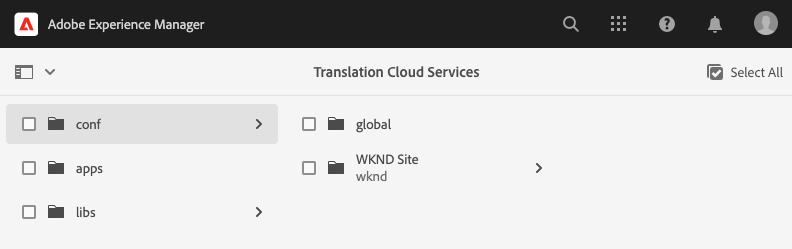

# Configurar conector de tradução {#configure-connector}

Saiba como conectar AEM a um serviço de tradução.

## A História Até Agora {#story-so-far}

No documento anterior da jornada de localização sem periféricos AEM, [Comece com AEM localização sem periféricos](learn-about.md) você aprendeu a organizar o conteúdo sem periféricos e como AEM ferramentas de localização funcionam e agora deve:

* Entenda a importância da estrutura de conteúdo para a localização.
* Entenda como o AEM armazena conteúdo sem interface.
* Familiarize-se com AEM ferramentas de localização.

Este artigo se baseia nesses fundamentos para que você possa realizar a primeira etapa de configuração e configurar um serviço de tradução, que será usado posteriormente na jornada para traduzir o conteúdo.

## Objetivo {#objective}

Este documento ajuda você a entender como configurar um conector de AEM para o serviço de tradução escolhido. Depois de ler, você deve:

* Entenda os parâmetros importantes da Estrutura de integração de tradução no AEM.
* Pode configurar sua própria conexão com o serviço de tradução.

## O Quadro de Integração de Tradução {#tif}

AEM Estrutura de integração de tradução integra-se com serviços de tradução de terceiros para orquestrar a tradução de conteúdo AEM. Envolve três etapas básicas.

1. Conecte-se ao seu provedor de serviços de tradução.
1. Crie uma configuração da Estrutura de integração de tradução.
1. Associe a configuração ao seu conteúdo.

## Conexão com um provedor de serviços de tradução {#connect-translation-provider}

A primeira etapa é escolher qual serviço de tradução deseja usar. Há muitas opções para os serviços de tradução humana e de máquina disponíveis para AEM. Consulte a seção [Recursos adicionais](#additional-resources) para obter uma seleção de opções disponíveis.

A maioria dos provedores oferecerá um pacote de tradutor para ser instalado. Para os fins desta jornada, usaremos o Microsoft Translator, que AEM fornece uma licença de avaliação pronta para uso. Consulte a seção [Additional Resources](#additional-resources) para obter mais informações sobre esse provedor.

Se você escolher outro provedor, precisará instalar o pacote de conectores de acordo com as instruções fornecidas pelo serviço de tradução.

>[!NOTE]
>
>Usar o Microsoft Translator pronto para uso no AEM não requer configuração adicional e funciona como está sem configuração de conector adicional.
>
>Se você optar por usar o conector do Microsoft Translator para fins de teste, não será necessário executar as etapas nas próximas duas seções, mas leia-as para que você esteja familiarizado com quando precisar conectar seu conector preferencial.
>
>A licença de avaliação do conector do Microsoft Translator não se destina a fins de produção e, se você decidir licenciá-la, precisará seguir as próximas etapas detalhadas na seção [Additional Resources](#additional-resources) no final deste documento para configurar essa licença.

## Criar uma configuração de integração de tradução {#create-config}

Primeiro, é necessário criar uma configuração de estrutura de integração de tradução para especificar como traduzir o conteúdo. A configuração inclui as seguintes informações:

* Qual provedor de serviços de tradução usar
* Se a tradução humana ou de máquina deve ser realizada
* Traduzir ou não outro conteúdo associado ao Fragmento do conteúdo, como tags

Para criar uma nova configuração de tradução:

1. No menu de navegação global, clique ou toque em **Ferramentas** -> **Cloud Services** -> **Cloud Services de tradução**.
1. Navegue até o local em que deseja criar a configuração na estrutura do conteúdo. Geralmente, isso se baseia em um projeto específico ou pode ser global.
   * Por exemplo, nesse caso, uma configuração pode ser feita globalmente para aplicar a todo o conteúdo ou apenas para o projeto WKND.

   

1. Forneça as seguintes informações nos campos e clique ou toque em **Create**.
   1. Selecione **Tipo de configuração** no menu suspenso. Selecione **Integração de Tradução** na lista.
   1. Insira um **Title** para sua configuração. O **Título** identifica a configuração no console **Cloud Services**, bem como nas listas suspensas de propriedade da página.
   1. Opcionalmente, digite um **Name** para usar no nó do repositório que armazena a configuração.

   

1. Toque ou clique em **Create** e a janela **Edit Configuration** é exibida, onde você pode configurar as propriedades de configuração.

1. Lembre-se de que os Fragmentos de conteúdo são armazenados como ativos no AEM. Toque ou clique na guia **Assets**.


1. Forneça as seguintes informações.

   1. **Método de tradução**  - Selecione  **Tradução de máquina ou** Tradução  **** humana, dependendo do seu provedor de tradução. Para os propósitos dessa jornada, assumiremos a tradução automática.
   1. **Provedores de tradução**  - Selecione o conector instalado para o serviço de tradução na lista.
   1. **Categoria de conteúdo**  - Selecione a categoria mais apropriada para direcionar melhor a tradução (somente para tradução automática).
   1. **Traduzir ativos do fragmento de conteúdo** - ???
   1. **Traduzir ativos**  - Marque essa opção para traduzir os ativos.
   1. **Traduzir metadados**  - Verifique isso para traduzir metadados de ativos.
   1. **Traduzir tags**  - Verifique isso para traduzir tags associadas ao ativo.
   1. **Tradução de execução automática**  - verifique essa propriedade se deseja que as traduções sejam enviadas automaticamente para o serviço de tradução.

1. Toque ou clique em **Salvar e fechar**.

Agora você configurou o conector para o serviço de tradução.

## Associar a configuração ao seu conteúdo {#associate}

AEM é uma ferramenta flexível e eficiente e oferece suporte a vários serviços de tradução simultâneos por meio de vários conectores e várias configurações. Configurar isso está além do escopo dessa jornada, mas significa que você precisa especificar quais conectores e configurações devem ser usados para traduzir o conteúdo.

Para fazer isso, navegue até a raiz do idioma do conteúdo. Para nosso exemplo, isso é

```text
/content/dam/<your-project>/en
```

1. Vá para a navegação global e vá para **Navegação** -> **Ativos** -> **Arquivos**.
1. No console Assets, selecione a raiz de idioma para configurar e clique ou toque em **Properties**.
1. Toque ou clique na guia **Cloud Services**.
1. Em **Cloud Service Configurations**, na lista suspensa **Add Configuration**, selecione o conector. Ele deve aparecer na lista suspensa quando você tiver instalado seu pacote como [descrito anteriormente.](#connect-translation-provider)
1. Em **Cloud Service Configurations** na lista suspensa **Add Configuration**, selecione também a configuração.
1. Toque ou clique em **Salvar e fechar**.


## O que vem a seguir {#what-is-next}

Agora que você concluiu esta parte da jornada de localização sem cabeçalho, é necessário:

* Entenda os parâmetros importantes da Estrutura de integração de tradução no AEM.
* Pode configurar sua própria conexão com o serviço de tradução.

Aproveite esse conhecimento e prossiga com sua jornada de localização sem periféricos AEM revisando o documento [Configure as regras de tradução,](translation-rules.md) onde você aprenderá a definir qual conteúdo traduzir.

## Recursos adicionais {#additional-resources}

Embora seja recomendável seguir para a próxima parte da jornada de localização sem cabeçalho revisando o documento [Configurar regras de tradução](translation-rules.md), os seguintes são alguns recursos adicionais e opcionais que fazem um mergulho mais profundo em alguns conceitos mencionados neste documento, mas eles não são solicitados a continuar na jornada sem cabeçalho.

* [Configuração da estrutura de integração de tradução](/help/sites-cloud/administering/translation/integration-framework.md)  - saiba como configurar a estrutura de integração de tradução para se integrar a serviços de tradução de terceiros.
* [Conexão com o Microsoft Translator](/help/sites-cloud/administering/translation/connect-ms-translator.md)  - O AEM fornece uma conta de avaliação do Microsoft Translation para fins de teste.
