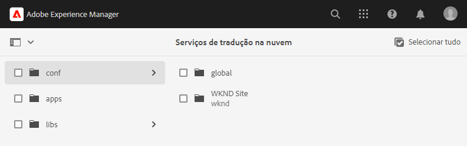
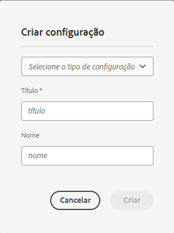
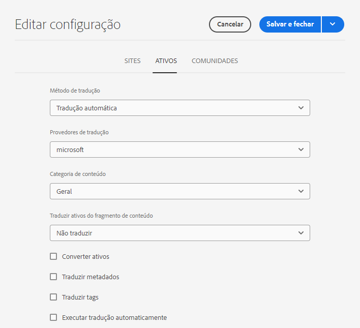
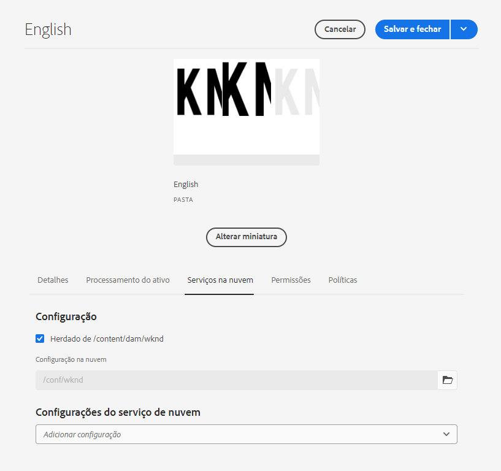

# Configurar a integração da tradução {#configure-integration}

Saiba como conectar o AEM a um serviço de tradução.

## A história até agora {#story-so-far}

No documento anterior da jornada de tradução headless do AEM, [Introdução à tradução headless no AEM](learn-about.md), você aprendeu a organizar o conteúdo headless e descobriu como funcionam as ferramentas de tradução do AEM. Agora, você deverá:

* Compreender a importância da estrutura de conteúdo para a tradução.
* Entenda como o AEM armazena conteúdo headless.
* Se familiarizar com as ferramentas de tradução do AEM.

Este artigo se baseia nesses fundamentos para que você possa realizar a primeira etapa e configurar um serviço de tradução, que será usado posteriormente na jornada para traduzir o conteúdo.

## Objetivo {#objective}

Este documento ajuda você a entender como configurar uma integração do AEM com o serviço de tradução escolhido. Depois de ler esse documento, você deverá:

* Compreender os parâmetros fundamentais da estrutura de integração de tradução no AEM.
* Ser capaz de configurar sua própria conexão com o serviço de tradução.

## A estrutura de integração de tradução {#tif}

A estrutura de integração de tradução (TIF) do AEM integra-se a serviços de tradução de terceiros para orquestrar a tradução de conteúdo do AEM. Isso envolve três etapas básicas.

1. Conectar ao provedor de serviços de tradução.
1. Criar uma configuração da estrutura de integração de tradução.
1. Associar a configuração ao seu conteúdo.

As seções a seguir descrevem essas etapas com mais detalhes.

## Conexão com um provedor de serviços de tradução {#connect-translation-provider}

A primeira etapa é escolher qual serviço de tradução usar. Há muitas opções de serviços de tradução humana e tradução automática disponíveis para o AEM. A maioria dos provedores oferece um pacote de tradutor para instalação. Consulte a seção [Recursos adicionais](#additional-resources) para obter uma seleção de opções disponíveis.

>[!NOTE]
>
>O especialista em tradução geralmente é responsável por escolher qual serviço de tradução usar, mas o administrador normalmente é responsável por instalar o pacote do conector de tradução necessário.

Para os propósitos desta jornada, usamos o Microsoft Translator, fornecido pelo AEM juntamente com uma licença de avaliação pronta para uso. Consulte a seção [Recursos adicionais](#additional-resources) para obter mais informações sobre esse provedor.

Se você escolher outro provedor, o administrador deverá instalar o pacote do conector de acordo com as instruções fornecidas pelo serviço de tradução.

>[!NOTE]
>
>O Microsoft Translator pronto para uso funciona bem no AEM sem necessidade de configurações adicionais. As configurações do conector também não precisam ser alteradas.
>
>Se você optar por usar o conector do Microsoft Translator para fins de teste, não será necessário executar as etapas das próximas duas seções: [Criar uma configuração de integração de tradução](#create-config) e [Associar a configuração ao seu conteúdo](#associate). No entanto, é recomendável lê-las para que você esteja familiarizado com as etapas para quando precisar configurar seu conector de preferência.
>
>A licença de avaliação do conector do Microsoft Translator não se destina a fins de produção e, caso decida adquirir uma licença, o(a) administrador(a) do sistema deverá seguir as etapas detalhadas na seção [Recursos adicionais](#additional-resources) ao final deste documento para configurá-la.

## Criar uma configuração de integração de tradução {#create-config}

Depois que o pacote do conector do seu serviço de tradução de preferência for instalado, você deverá criar uma configuração da estrutura de integração de tradução para esse serviço. A configuração inclui as seguintes informações:

* Qual provedor de serviços de tradução usar
* Se deve ser realizada tradução humana ou automática
* Se outros conteúdos associados ao Fragmento de conteúdo, como tags, devem ou não ser traduzidos

Para criar uma configuração de tradução:

1. No menu de navegação global, selecione **Ferramentas** > **Serviços em nuvem** > **Serviços de tradução em nuvem**.
1. Navegue até o local em que deseja criar a configuração na estrutura de conteúdo. Geralmente, ela é baseada em um projeto específico, mas também pode ser global.
   * Por exemplo, nesse caso, pode-se criar uma configuração global que se aplique a todo o conteúdo ou uma configuração específica para o projeto WKND.

   

1. Forneça as seguintes informações nos campos e selecione **Criar**.
   1. Selecione o **Tipo de configuração** no menu suspenso. Selecione **Integração de tradução** na lista.
   1. Insira um **Título** para sua configuração. O **Título** identifica a configuração no console dos **Cloud Services**, bem como nas listas suspensas de propriedades da página.
   1. Opcionalmente, insira um **Nome** para o nó do repositório que armazena a configuração.

   

1. Selecione **Criar** e a janela **Editar Configuração** será exibida, onde você poderá definir as propriedades de configuração.

1. Lembre-se de que os Fragmentos de conteúdo são armazenados como ativos no AEM. Selecione a guia **Assets**.



1. Forneça as seguintes informações.

   1. **Método de tradução** - selecione **Tradução automática** ou **Tradução humana**, dependendo do seu provedor de tradução. Para os fins desta jornada, vamos pressupor o uso de tradução automática.
   1. **Provedores de tradução** - selecione na lista o conector instalado para o serviço de tradução.
   1. **Categoria de conteúdo** - selecione a categoria mais apropriada para direcionar melhor a tradução (somente para tradução automática).
   1. **Traduzir ativos de fragmento de conteúdo**: marque essa opção para traduzir ativos associados aos Fragmentos de conteúdo.
   1. **Traduzir ativos**: marque essa opção para traduzir os ativos.
   1. **Traduzir metadados**: marque essa opção para traduzir metadados de ativos.
   1. **Traduzir tags**: marque essa opção para traduzir tags associadas ao ativo.
   1. **Executar tradução automaticamente** - marque essa propriedade se desejar que as traduções sejam enviadas automaticamente para o serviço de tradução.
   1. **Desativar tradução somente de atualização**: quando essa opção estiver marcada, a atualização do projeto de tradução enviará todos os campos traduzíveis para tradução, e não apenas os alterados desde a última tradução. A atualização do projeto de tradução será abordada posteriormente na jornada.
   1. **Habilitar campos do modelo de conteúdo para tradução**: marque essa opção para que a configuração de tradução reconheça automaticamente os campos nos Modelos de conteúdo com base no sinalizador **Traduzível**.

1. Selecione **Salvar e fechar**.

Você concluiu a configuração do conector para o serviço de tradução.

## Associar a configuração ao seu conteúdo {#associate}

O AEM é uma ferramenta flexível e eficiente que tem compatibilidade com diversos serviços de tradução simultâneos, por meio de vários conectores e configurações. A definição dessa configuração está fora do escopo desta jornada. No entanto, essa flexibilidade significa que você deve especificar quais conectores e configurações devem ser usados para traduzir o conteúdo, associando essa configuração ao seu conteúdo.

Para fazer isso, navegue até a raiz do idioma do conteúdo. Para os fins do nosso exemplo, isto é

```text
/content/dam/<your-project>/en
```

1. Vá para a navegação global e vá para **Navegação** > **Assets** > **Arquivos**.
1. No console de ativos, selecione a raiz do idioma a ser configurada e selecione **Propriedades**.
1. Selecione a guia **Cloud Services**.
1. Em **Configurações do Cloud Service**, na lista suspensa **Adicionar configuração**, selecione seu conector. Ele deve aparecer na lista suspensa quando você tiver instalado o pacote, conforme [descrito anteriormente](#connect-translation-provider).
1. Em **Configurações do Cloud Service**, na lista suspensa **Adicionar configuração**, selecione também a sua configuração.
1. Selecione **Salvar e fechar**.



## O que vem a seguir {#what-is-next}

Agora que você concluiu esta parte da jornada de tradução headless, você deve:

* Compreender os parâmetros fundamentais da estrutura de integração de tradução no AEM.
* Ser capaz de configurar sua própria conexão com o serviço de tradução.

Desenvolva esse conhecimento e prossiga com sua jornada de tradução headless do AEM, revisando a seguir o documento [Traduzir conteúdo](translation-rules.md), onde você aprende a usar sua configuração até o momento para realmente traduzir seu conteúdo.

## Recursos adicionais {#additional-resources}

Embora seja recomendável seguir para a próxima parte da jornada de tradução headless revisando o documento [Configurar regras de tradução](translation-rules.md), veja a seguir alguns recursos adicionais e opcionais que aprofundam alguns conceitos mencionados neste documento, mas que não são necessários para continuar na jornada.

*  [Configuração da estrutura de integração de tradução](/help/sites-cloud/administering/translation/integration-framework.md) - revise uma lista de conectores de tradução selecionados e saiba como configurar a estrutura de integração de tradução para integrar-se a serviços de tradução de terceiros.
* [Conexão com o Microsoft Translator](/help/sites-cloud/administering/translation/connect-ms-translator.md) - o AEM fornece uma conta de avaliação do Microsoft Translation para fins de teste.
