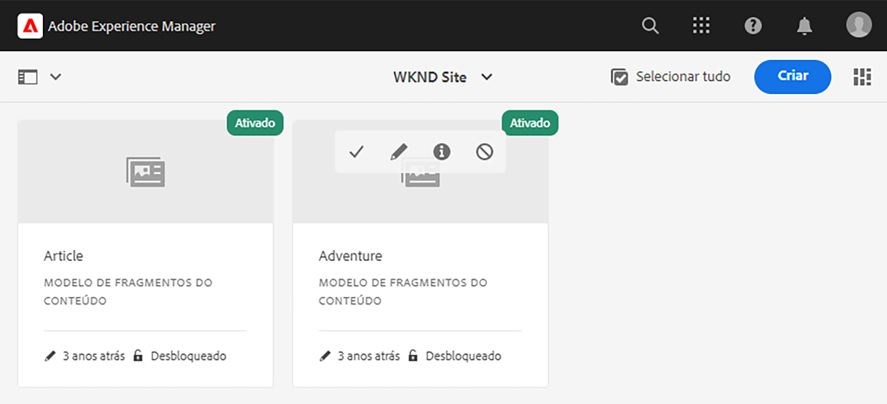
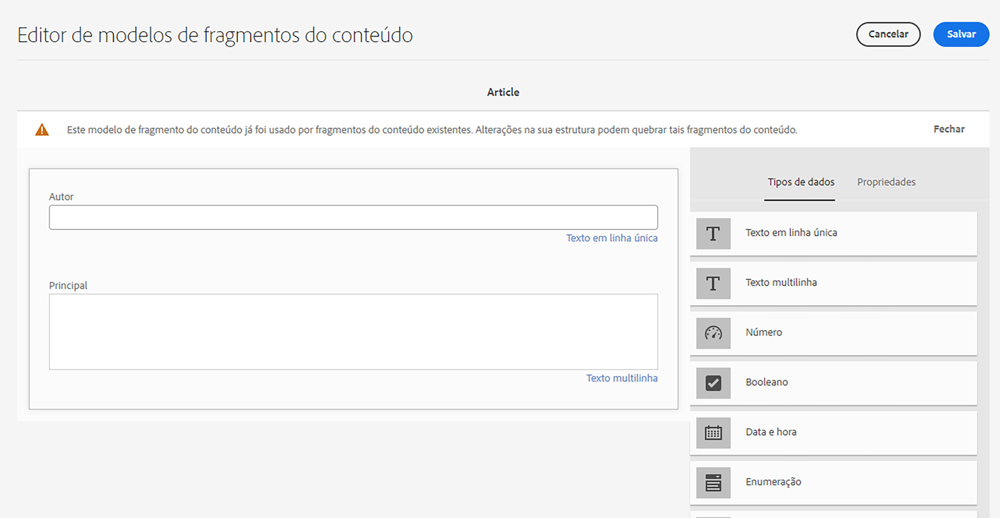
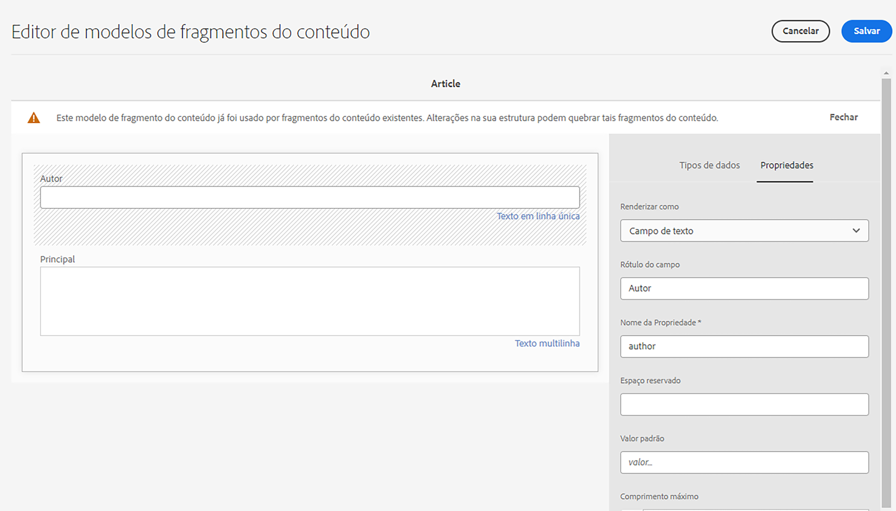

# Introdução à AEM tradução headless {#getting-started}

Saiba como organizar o conteúdo sem periféricos e como funcionam AEM ferramentas de tradução.

## A História Até Agora {#story-so-far}

No documento anterior da jornada de tradução AEM sem periféricos, [Saiba mais sobre o conteúdo sem periféricos e como traduzir em AEM](learn-about.md) você aprendeu a teoria básica do que é um CMS sem periféricos e agora deve:

* Entenda os conceitos básicos de entrega de conteúdo sem periféricos.
* Familiarize-se com o modo como o AEM suporta headless e tradução.

Este artigo se baseia nesses fundamentos para que você entenda como o AEM armazena e gerencia o conteúdo sem interface e como você pode usar as ferramentas de tradução AEM para traduzir esse conteúdo.

## Objetivo {#objective}

Este documento ajuda você a entender como começar a traduzir o conteúdo sem cabeçalho no AEM. Depois de ler, você deve:

* Entenda a importância da estrutura de conteúdo para a tradução.
* Entenda como o AEM armazena conteúdo sem interface.
* Familiarize-se com AEM ferramentas de tradução.

## Requisitos e pré-requisitos {#requirements-prerequisites}

Há vários requisitos antes de começar a traduzir o conteúdo de AEM sem cabeçalho.

### Conhecimento {#knowledge}

* Experiência de tradução de conteúdo em um CMS
* Experiência usando os recursos básicos de um CMS em larga escala
* Possuir um conhecimento prático AEM tratamento básico
* Noções básicas do serviço de tradução que você está usando
* Ter uma compreensão básica do conteúdo que você está traduzindo

>[!TIP]
>
>Se você não estiver familiarizado com o uso de um CMS em larga escala como AEM, considere revisar a documentação [Manuseio básico](/help/sites-cloud/authoring/getting-started/basic-handling.md) antes de continuar. A documentação de Manuseio básico não faz parte da jornada, portanto, retorne a esta página quando terminar.

### Ferramentas {#tools}

* Acesso à sandbox para testes de tradução do conteúdo
* Credenciais para se conectar ao serviço de tradução preferencial
* Ser membro do grupo `project-administrators` no AEM

## Estrutura é chave {#content-structure}

AEM conteúdo, seja ele impróprio ou tradicional, é orientado por sua estrutura. AEM impõe poucos requisitos à estrutura de conteúdo, mas uma consideração cuidadosa da hierarquia de conteúdo como parte do planejamento do projeto pode tornar a tradução muito mais simples.

>[!TIP]
>
>Plano de tradução logo no início do projeto sem cabeça. Trabalhe em conjunto com o gerente do projeto e os arquitetos de conteúdo antecipadamente.
>
>Um Gerente de projeto de internacionalização pode ser necessário como uma pessoa separada, cuja responsabilidade é definir qual conteúdo deve ser traduzido e o que não, e qual conteúdo traduzido pode ser modificado pelos produtores de conteúdo regionais ou locais.

## Como o AEM armazena conteúdo headless {#headless-content-in-aem}

Para o especialista em tradução, não é importante entender em profundidade como o AEM gerencia o conteúdo sem interface. Entretanto, familiarizar-se com os conceitos e a terminologia básicos será útil, pois você poderá usar as ferramentas de tradução AEM mais tarde. O mais importante é que você precisa entender seu próprio conteúdo e como ele é estruturado para traduzi-lo efetivamente.

### Modelos de conteúdo {#content-models}

Para que o conteúdo sem cabeçalho seja entregue de forma consistente em canais, regiões e idiomas, o conteúdo deve ser altamente estruturado. AEM usa Modelos de conteúdo para aplicar essa estrutura. Pense nos Modelos de conteúdo como um tipo de modelo ou padrão para criar conteúdo sem interface. Como cada projeto tem suas próprias necessidades, cada projeto define seus próprios Modelos de fragmento de conteúdo. AEM não tem requisitos ou estrutura fixos para esses modelos.

O arquiteto de conteúdo funciona no início do projeto para definir essa estrutura. Como especialista em tradução, você deve trabalhar em conjunto com o arquiteto de conteúdo para entender e organizar o conteúdo.

>[!NOTE]
>
>É de responsabilidade do arquiteto de conteúdo definir os Modelos de conteúdo. O especialista em tradução só deve conhecer a sua estrutura, conforme descrito nas etapas a seguir.

Como os Modelos de conteúdo definem a estrutura do seu conteúdo, é necessário saber quais campos de seus modelos devem ser traduzidos. Geralmente, você trabalha com o arquiteto de conteúdo para definir isso. Para navegar pelos campos de seus modelos de conteúdo, siga as etapas abaixo.

1. Navegue até **Ferramentas** -> **Ativos** -> **Modelos de fragmento de conteúdo**.
1. Os Modelos de fragmentos de conteúdo geralmente são armazenados em uma estrutura de pastas. Toque ou clique na pasta do seu projeto.
1. Os modelos estão listados. Toque ou clique no modelo para ver os detalhes.
   
1. O **Editor do Modelo de fragmento de conteúdo** é aberto.
   1. A coluna da esquerda contém os campos do modelo. Essa coluna nos interessa.
   1. A coluna direita contém os campos que podem ser adicionados ao modelo. Essa coluna pode ser ignorada.
      
1. Toque ou clique em um dos campos do modelo. AEM marca e os detalhes desse campo são mostrados na coluna direita.
   

Anote o campo **Nome da propriedade** para todos os campos que devem ser traduzidos. Você precisará dessas informações posteriormente na jornada. Esses **Nome da propriedade** s são necessários para informar AEM quais campos do seu conteúdo devem ser traduzidos.

>[!TIP]
>
>Geralmente, o arquiteto de conteúdo fornece ao especialista de tradução o **Nome da propriedade** s de todos os campos necessários para a tradução. Esses nomes de campo são necessários para posteriormente na jornada. As etapas anteriores são fornecidas para a compreensão do especialista em tradução.

### Fragmentos de conteúdo {#content-fragments}

Os Modelos de conteúdo são usados pelos autores de conteúdo para criar o conteúdo sem cabeçalho real. Os autores de conteúdo selecionam qual modelo basear seu conteúdo em um e, em seguida, criam Fragmentos de conteúdo. Fragmentos de conteúdo são instâncias dos modelos e representam o conteúdo real que deve ser entregue sem periféricos.

Se os Modelos de conteúdo forem os padrões do conteúdo, os Fragmentos de conteúdo serão o conteúdo real baseado nesses padrões. Os Fragmentos de conteúdo representam o conteúdo que deve ser traduzido.

Os Fragmentos de conteúdo são gerenciados como ativos no AEM como parte do gerenciamento de ativos digitais (DAM). Isso é importante, pois todos estão localizados no caminho `/content/dam`.

## Estrutura de conteúdo recomendada {#recommended-structure}

Conforme recomendado anteriormente, trabalhe com seu arquiteto de conteúdo para determinar a estrutura de conteúdo apropriada para seu próprio projeto. No entanto, a seguinte estrutura é comprovada, simples e intuitiva e é bastante eficaz.

Defina uma pasta base para o seu projeto em `/content/dam`.

```text
/content/dam/<your-project>
```

O idioma em que o conteúdo é criado é chamado de raiz de idioma. No nosso exemplo, é o inglês e deve estar abaixo deste caminho.

```text
/content/dam/<your-project>/en
```

Todo o conteúdo do projeto que pode precisar ser localizado deve ser colocado na raiz do idioma.

```text
/content/dam/<your-project>/en/<your-project-content>
```

As traduções devem ser criadas como pastas irmãs ao lado da raiz do idioma, com o nome da pasta representando o código de idioma ISO-2 do idioma. Por exemplo, alemão teria o seguinte caminho.

```text
/content/dam/<your-project>/de
```

>[!NOTE]
>
>O arquiteto de conteúdo geralmente é responsável pela criação dessas pastas de idioma. Se não forem criadas, AEM não poderá criar trabalhos de tradução posteriormente.

A estrutura final pode ser parecida com a seguinte.

```text
/content
    |- dam
        |- your-project
            |- en
                |- some
                |- exciting
                |- headless
                |- content
            |- de
            |- fr
            |- it
            |- ...
        |- another-project
        |- ...
```

Você deve anotar o caminho específico do conteúdo, pois ele será necessário posteriormente para configurar a tradução.

>[!NOTE]
>
>Geralmente, é responsabilidade do arquiteto de conteúdo definir a estrutura de conteúdo, mas pode colaborar com o especialista em tradução.
>
>Ela é detalhada aqui para ser completa.

## Ferramentas de tradução AEM {#translation-tools}

Agora que você entende o que são Fragmentos de conteúdo e a importância da estrutura de conteúdo, podemos observar como traduzir esse conteúdo. As ferramentas de tradução em AEM são bastante poderosas, mas são simples de entender em alto nível.

* **Conector de tradução**  - o conector é o link entre o AEM e o serviço de tradução utilizado.
* **Regras de tradução**  - As regras definem qual conteúdo em caminhos específicos deve ser traduzido.
* **Projetos de tradução**  - Os projetos de tradução reúnem conteúdo que deve ser abordado como um único esforço de tradução e rastreia o progresso da tradução, interagindo com o conector para transmitir o conteúdo a ser traduzido e recebê-lo de volta do serviço de tradução.

Geralmente, você só configura o conector uma vez para a instância e para as regras por projeto sem periféricos. Em seguida, você usa projetos de tradução para traduzir seu conteúdo e manter suas traduções atualizadas continuamente.

## O que vem a seguir {#what-is-next}

Agora que você concluiu esta parte da jornada de tradução sem cabeçalho, é necessário:

* Entenda a importância da estrutura de conteúdo para a tradução.
* Entenda como o AEM armazena conteúdo sem interface.
* Familiarize-se com AEM ferramentas de tradução.

Aproveite esse conhecimento e prossiga com sua jornada de tradução sem periféricos AEM revisando o documento [Configure the translation connector](configure-connector.md), onde você aprenderá a se conectar AEM a um serviço de tradução.|

## Recursos adicionais {#additional-resources}

Embora seja recomendável seguir para a próxima parte da jornada de tradução sem periféricos revisando o documento [Configurar o conector de tradução](configure-connector.md), os seguintes são alguns recursos adicionais e opcionais que fazem um mergulho mais profundo em alguns conceitos mencionados neste documento, mas eles não são solicitados a continuar na jornada sem periféricos.

* [AEM Manuseio básico](/help/sites-cloud/authoring/getting-started/basic-handling.md)  - saiba mais sobre as noções básicas da interface do usuário do AEM para navegar confortavelmente e executar tarefas essenciais, como encontrar seu conteúdo.
* [Identificação de conteúdo para traduzir](/help/sites-cloud/administering/translation/rules.md)  - saiba como as regras de tradução identificam o conteúdo que precisa ser traduzido.
* [Configuração da estrutura de integração de tradução](/help/sites-cloud/administering/translation/integration-framework.md)  - saiba como configurar a estrutura de integração de tradução para se integrar a serviços de tradução de terceiros.
* [Gerenciamento de projetos de tradução](/help/sites-cloud/administering/translation/managing-projects.md)  - saiba como criar e gerenciar projetos de tradução automática e humana no AEM.
