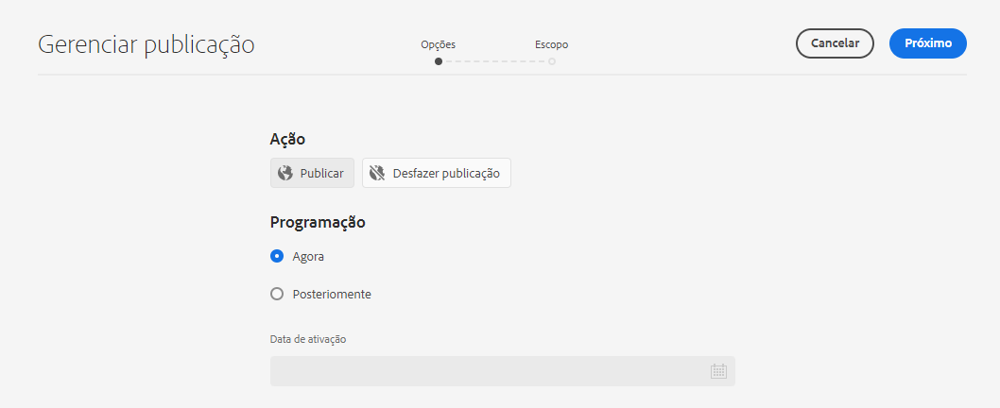
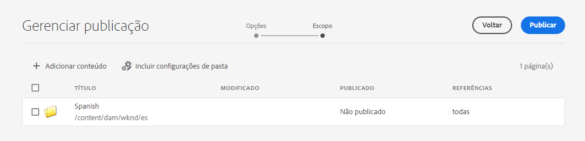
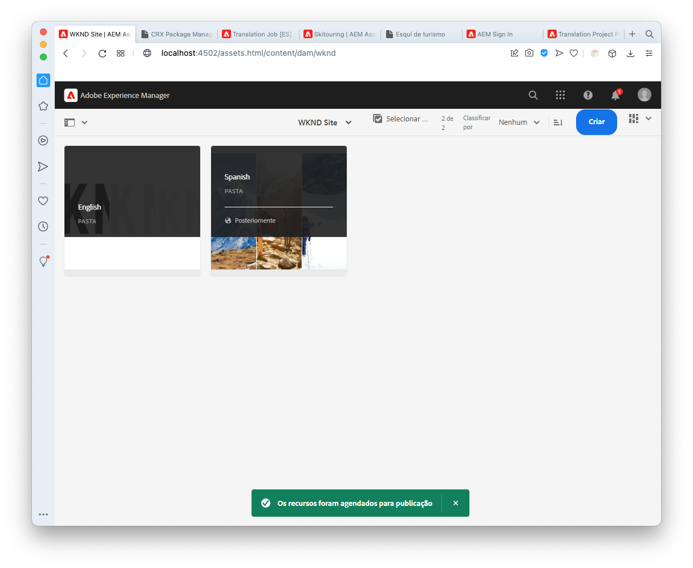
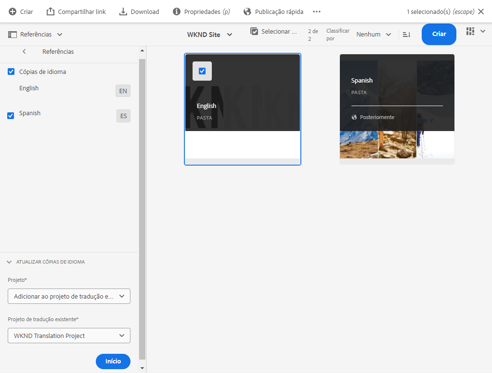
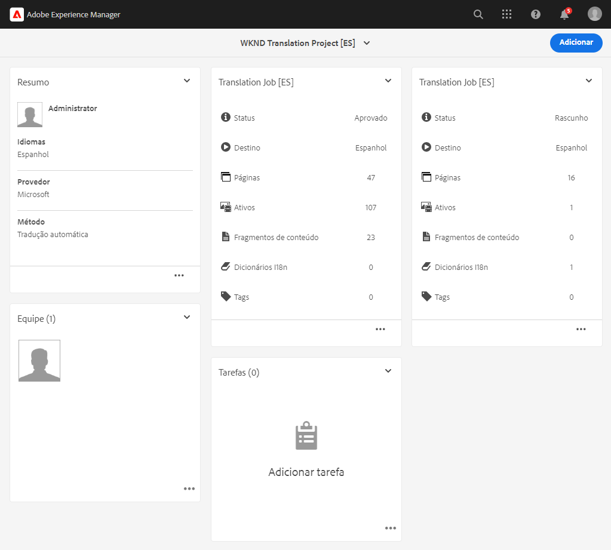
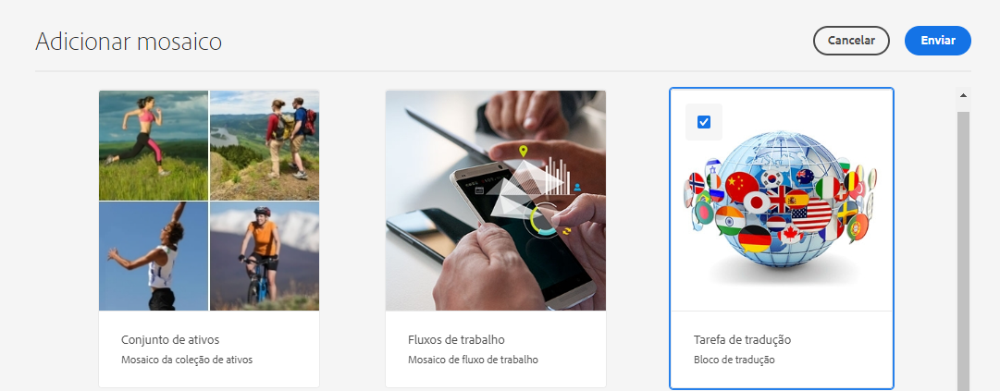
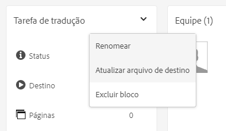
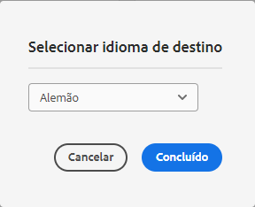

# Publicar conteúdo headless traduzido {#publish-content}

Saiba como publicar seu conteúdo traduzido e atualizar as traduções como atualizações de conteúdo.

## A história até agora {#story-so-far}

No documento anterior da jornada de tradução headless do AEM, [Traduzir conteúdo](configure-connector.md), você aprendeu a usar os Projetos de tradução do AEM para traduzir conteúdo headless. Agora você deve:

* Entender o que é um projeto de tradução.
* Ser capaz de criar novos projetos de tradução.
* Usar os projetos de tradução para traduzir o conteúdo headless.

Agora que sua tradução inicial foi concluída, este artigo o orienta pela próxima etapa da publicação desse conteúdo e o que fazer para atualizar suas traduções como o conteúdo subjacente nas alterações de raiz do idioma.

## Objetivo {#objective}

Este documento ajuda você a entender como publicar conteúdo headless no AEM e criar um fluxo de trabalho contínuo para manter suas traduções atualizadas. Após ler este documento, você deve:

* Entender o modelo de publicação do autor do AEM.
* Saber como publicar seu conteúdo traduzido.
* Ser capaz de implementar um modelo de atualização contínuo para o conteúdo traduzido.

## Modelo de publicação do autor do AEM {#author-publish}

Antes de publicar seu conteúdo, é uma boa ideia entender o modelo de publicação do autor do AEM. De forma simples, o AEM divide os usuários do sistema em dois grupos.

1. Aqueles que criam e gerenciam o conteúdo e o sistema
1. Aqueles que consomem o conteúdo do sistema

Portanto, o AEM é fisicamente separado em duas instâncias.

1. A instância do **autor** é o sistema no qual os autores e administradores de conteúdo trabalham para criar e gerenciar conteúdo.
1. A instância de **publicação** é o sistema que entrega o conteúdo para os consumidores.

Depois que o conteúdo é criado na instância de criação, ele deve ser transferido para a instância de publicação para que esteja disponível para consumo. O processo de transferência do autor para a publicação é chamado de **publicação**.

## Publicar seu conteúdo traduzido {#publishing}

Quando estiver satisfeito com o estado do seu conteúdo traduzido, ele deve ser publicado para que os serviços headless possam consumi-lo. Normalmente, essa tarefa não é de responsabilidade do especialista em tradução, mas está documentada aqui para ilustrar o fluxo de trabalho completo.

>[!NOTE]
>
>Geralmente, quando a tradução é concluída, o especialista em tradução informa aos proprietários do conteúdo que as traduções estão prontas para publicação. Os proprietários do conteúdo os publicam.
>
>As etapas a seguir são fornecidas para fins de integridade.

A maneira mais simples de publicar as traduções é navegar até a pasta de ativos do projeto.

```text
/content/dam/<your-project>/
```

Nesse caminho, você tem subpastas para cada idioma de tradução e pode escolher qual publicar.

1. Vá para **Navegação** > **Assets** > **Arquivos** e abra a pasta do projeto.
1. Aqui você vê a pasta raiz do idioma e todas as outras pastas de idioma. Selecione o idioma ou idiomas localizados que deseja publicar.
   
1. Selecione **Gerenciar Publicação**.
1. Na janela **Gerenciar publicação**, verifique se **Publicar** é automaticamente selecionado em **Ação** e se **Agora** é selecionado em **Agendamento**. Selecione **Próximo**.
   
1. Na próxima janela **Gerenciar publicação**, confirme se os caminhos adequados estão selecionados. Selecione **Publicar**.
   
1. O AEM confirma a ação de publicação com uma mensagem pop-up na parte inferior da tela.
   

Seu conteúdo headless traduzido foi publicado. Agora ele pode ser acessado e consumido pelos seus serviços headless.

>[!TIP]
>
>Você pode selecionar vários itens (ou seja, várias pastas de idioma) durante a publicação para publicar várias traduções de uma vez.

Há opções adicionais ao publicar seu conteúdo, como agendar um horário de publicação, mas isso está além do escopo desta jornada. Consulte a seção [Recursos adicionais](#additional-resources) ao final do documento para obter mais informações.

## Atualizar o conteúdo traduzido {#updating-translations}

A tradução raramente é uma atividade pontual. Normalmente, seus autores de conteúdo continuam a adicionar e modificar conteúdo na raiz do idioma depois que a tradução inicial é concluída. Isso significa que também é necessário atualizar o conteúdo traduzido.

Requisitos específicos do projeto definem a frequência com que você precisa atualizar suas traduções e qual processo de decisão é seguido antes de executar uma atualização. Depois de decidir atualizar suas traduções, o processo no AEM é muito simples. Como a tradução inicial foi baseada em um projeto de tradução, as atualizações também serão.

No entanto, assim como antes, o processo é um pouco diferente se você opta por criar automaticamente ou manualmente seu projeto de tradução.

### Atualizar um projeto de tradução criado automaticamente {#updating-automatic-project}

1. Navegue até **Navegação** > **Assets** > **Arquivos**. Lembre-se de que o conteúdo headless no AEM é armazenado como ativos conhecidos como Fragmentos de conteúdo.
1. Selecione a raiz do idioma do projeto. Nesse caso, selecionamos `/content/dam/wknd/en`.
1. Selecione o seletor do painel e exiba o painel **Referências**.
1. Selecione **Cópias de idioma**.
1. Marque a caixa de seleção **Cópias de idioma**.
1. Expanda a seção **Atualizar cópias de Idioma** na parte inferior do painel de referências.
1. Na lista suspensa **Projeto**, selecione **Adicionar a um projeto de tradução existente**.
1. Na lista suspensa **Projeto de tradução existente**, selecione o projeto criado para a tradução inicial.
1. Selecione **Iniciar**.



O conteúdo é adicionado ao projeto de tradução existente. Para exibir o projeto de tradução:

1. Navegue até **Navegação** > **Projetos**.
1. Selecione o projeto que você acabou de atualizar.
1. Selecione o idioma ou um dos idiomas atualizados.

Você vê que um novo cartão de tarefa foi adicionado ao projeto. Neste exemplo, outra tradução em espanhol foi adicionada.



Observe que as estatísticas listadas no novo cartão (número de ativos e fragmentos de conteúdo) são diferentes. Isso ocorre porque o AEM reconhece o que mudou desde a última tradução e inclui somente o conteúdo que deve ser traduzido. Isso inclui a nova tradução do conteúdo atualizado e a primeira tradução do novo conteúdo.

A partir deste ponto, você [inicia e gerencia seu trabalho de tradução da mesma forma que fazia com o original](translate-content.md#using-translation-project).

### Atualizar um projeto de tradução criado manualmente {#updating-manual-project}

Para atualizar uma tradução, é possível adicionar um novo trabalho ao projeto existente, responsável pela tradução do conteúdo atualizado.

1. Navegue até **Navegação** > **Projetos**.
1. Selecione o projeto que você precisa atualizar.
1. Selecione o botão **Adicionar** na parte superior da janela.
1. Na janela **Adicionar Bloco**, selecione **Trabalho de Tradução** e **Enviar**.

   

1. No cartão do novo trabalho de tradução, selecione o botão divisa na parte superior do cartão e selecione **Atualizar destino** para definir o idioma de destino da nova tarefa.

   

1. Na caixa de diálogo **Selecionar idioma de destino**, use o menu suspenso para selecionar o idioma e selecione **Concluído**.

   

1. Depois que o idioma de destino do novo trabalho de tradução for definido, selecione o botão de reticências na parte inferior do cartão de tarefa para exibir os detalhes da tarefa.
1. A tarefa fica vazia quando é criada pela primeira vez. Adicione conteúdo ao trabalho tocando ou clicando no botão **Adicionar** e usando o navegador de caminho [como você fez antes ao criar originalmente o projeto de tradução](translate-content.md##manually-creating).

>[!TIP]
>
>Os filtros potentes do navegador de caminho podem ser úteis novamente para localizar apenas o conteúdo que foi atualizado.
>
>Você pode saber mais sobre o navegador de caminho na [seção de recursos adicionais](#additional-resources).

A partir deste ponto, você [inicia e gerencia seu trabalho de tradução da mesma forma que fazia com o original](translate-content.md#using-translation-project).

## Fim da jornada? {#end-of-journey}

Parabéns! Você concluiu a jornada de tradução headless. Agora você deve:

* Tenha uma visão geral do que é a entrega de conteúdo headless.
* Tenha uma compreensão básica dos recursos headless do AEM.
* Entenda os recursos de tradução do AEM e como eles estão relacionados ao conteúdo headless.
* Ser capaz de começar a traduzir seu próprio conteúdo headless.

Agora você está pronto para traduzir seu próprio conteúdo headless no AEM. No entanto, o AEM é uma ferramenta poderosa e há muitas opções adicionais disponíveis. Confira alguns dos recursos adicionais disponíveis na [seção Recursos adicionais](#additional-resources) para saber mais sobre os recursos que você viu nesta jornada.

## Recursos adicionais {#additional-resources}

* [Gerenciamento de projetos de tradução](/help/sites-cloud/administering/translation/managing-projects.md) - Saiba mais sobre os detalhes de projetos de tradução e recursos adicionais, como fluxos de trabalho de tradução humana e projetos multilíngues.
* [Conceitos de criação](/help/sites-cloud/authoring/author-publish.md) - Saiba mais sobre o modelo de criação e publicação do AEM em detalhes. Este documento está focado na criação de páginas em vez de Fragmentos de conteúdo, mas a teoria ainda se aplica.
* [Publicar páginas](/help/sites-cloud/authoring/sites-console/publishing-pages.md) - Saiba mais sobre os recursos adicionais disponíveis ao publicar conteúdo. Este documento está focado na criação de páginas em vez de Fragmentos de conteúdo, mas a teoria ainda se aplica.
* [Ambiente e ferramentas de criação](/help/sites-cloud/authoring/path-selection.md#path-selection) - O AEM fornece vários mecanismos para organização e edição de conteúdo, incluindo um navegador de caminho robusto.
