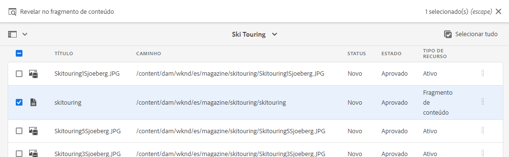

# Traduzir conteúdo {#translate-content}

Use o conector e as regras de tradução para traduzir o conteúdo sem cabeçalho.

## A História Até Agora {#story-so-far}

No documento anterior da jornada de tradução AEM sem cabeçalho, [Configurar regras de tradução](translation-rules.md) você aprendeu a usar AEM regras de tradução para identificar seu conteúdo de tradução. Agora você deve:

* Entenda o que as regras de tradução fazem.
* Pode definir suas próprias regras de tradução.

Agora que seu conector e as regras de tradução estão configurados, este artigo o orienta pela próxima etapa da tradução do conteúdo sem periféricos.

>[!NOTE]
>
>Se você ignorou o [Configurar regras de tradução](translation-rules.md) etapa dessa jornada, pois você está no canal de pré-lançamento AEM as a Cloud Service, não precisa se preocupar com as regras de tradução, conforme mencionado neste documento.

## Objetivo {#objective}

Este documento ajuda você a entender como usar AEM projetos de tradução junto com o conector e suas regras de tradução para traduzir o conteúdo. Após ler este documento, você deve:

* Entenda o que é um projeto de tradução.
* Pode criar novos projetos de tradução.
* Use projetos de tradução para traduzir o conteúdo sem periféricos.

## Criação de um projeto de tradução {#creating-translation-project}

Os projetos de tradução permitem gerenciar a tradução de conteúdo AEM sem periféricos. Um projeto de tradução reúne o conteúdo a ser traduzido para outros idiomas em um local para uma exibição central do esforço de tradução.

Quando o conteúdo é adicionado a um projeto de tradução, um trabalho de tradução é criado para ele. Os trabalhos fornecem comandos e informações de status que você usa para gerenciar os workflows de tradução humana e tradução automática que são executados nos recursos.

Os projetos de tradução podem ser criados de duas formas:

1. Selecione a raiz de idioma do conteúdo e AEM criar automaticamente o projeto de tradução com base no caminho do conteúdo.
1. Crie um projeto vazio e selecione manualmente o conteúdo a ser adicionado ao projeto de tradução

Ambas as abordagens são válidas, geralmente, apenas diferentes com base na persona que está executando a tradução:

* O Gerenciador de projetos de tradução (TPM) geralmente precisa da flexibilidade de selecionar manualmente o conteúdo para o projeto de tradução.
* Se o proprietário do conteúdo também for responsável pela tradução, permitir que AEM crie o projeto automaticamente com base no caminho de conteúdo selecionado geralmente é mais fácil.

Ambas as abordagens são exploradas nas seções a seguir.

### Criação automática de um projeto de tradução com base no caminho do conteúdo {#automatically-creating}

Para os proprietários de conteúdo que também são responsáveis pela tradução, geralmente é mais fácil ter AEM criar automaticamente o projeto de tradução. Para ter AEM criar automaticamente um projeto de tradução com base no caminho do conteúdo:

1. Navegar para **Navegação** -> **Ativos** -> **Arquivos**. Lembre-se de que o conteúdo sem periféricos no AEM é armazenado como ativos conhecidos como Fragmentos de conteúdo.
1. Selecione a raiz do idioma do projeto. Nesse caso, selecionamos `/content/dam/wknd/en`.
1. Toque ou clique no seletor do painel e mostre o **Referências** painel.
1. Toque ou clique em **Cópias de idioma**.
1. Verifique a **Cópias de idioma** caixa de seleção.
1. Expanda a seção **Atualizar Cópias de Idioma** na parte inferior do painel de referências.
1. No **Projeto** lista suspensa, selecione **Criar projeto(s) de tradução**.
1. Forneça um título apropriado para o seu projeto de tradução.
1. Toque ou clique **Iniciar**.


Você receberá uma mensagem informando que o projeto foi criado.

>[!NOTE]
>
>Pressupõe-se que a estrutura linguística necessária para as traduções já tenha sido criada como parte da [definição da sua estrutura de conteúdo.](getting-started.md#content-structure) Isso deve ser feito em colaboração com o arquiteto de conteúdo.
>
>Se as pastas de idioma não forem criadas com antecedência, você não poderá criar cópias de idioma conforme descrito nas etapas anteriores.

### Criação manual de um projeto de tradução ao selecionar o conteúdo {#manually-creating}

Para gerentes de projeto de tradução, geralmente é necessário selecionar manualmente o conteúdo específico para incluir em um projeto de tradução. Para criar esse projeto de tradução manual, você deve começar criando um projeto vazio e depois selecionar o conteúdo a ser adicionado.

1. Navegar para **Navegação** -> **Projetos**.
1. Toque ou clique **Criar** -> **Pasta** para criar uma pasta para seus projetos.
   * Isso é opcional, mas útil para organizar seus esforços de tradução.
1. No **Criar projeto** , adicione uma **Título** para a pasta e toque ou clique em **Criar**.

   

1. Toque ou clique na pasta para abrir a pasta.
1. Na nova pasta do projeto, toque ou clique em **Criar** -> **Projeto**.
1. Os projetos são baseados em modelos. Toque ou clique no botão **Projeto de tradução** modelo para selecioná-lo e tocar ou clicar **Próximo**.

   

1. No **Básico** , digite um nome para o novo projeto.

   

1. No **Avançado** use a guia **Idioma de destino** lista suspensa para selecionar os idiomas nos quais o conteúdo deve ser traduzido. Toque ou clique em **Criar**.

   

1. Toque ou clique **Abrir** na caixa de diálogo de confirmação.

   

O projeto foi criado, mas não contém conteúdo para tradução. A próxima seção detalha como o projeto está estruturado e como adicionar conteúdo.

## Usar um projeto de tradução {#using-translation-project}

Os projetos de tradução são projetados para coletar todo o conteúdo e tarefas relacionadas a um esforço de tradução em um único local, tornando sua tradução simples e fácil de gerenciar.

Para exibir o projeto de tradução:

1. Navegar para **Navegação** -> **Projetos**.
1. Toque ou clique no projeto criado na seção anterior.


O projeto é dividido em vários cartões.

* **Resumo** - Este cartão mostra as informações básicas do cabeçalho do projeto, incluindo o proprietário, o idioma e o provedor de tradução.
* **Tarefa de tradução** - Este cartão ou estes cartões apresentam uma visão geral do trabalho de tradução real, incluindo o status, o número de ativos, etc. Geralmente há uma tarefa por idioma com o código de idioma ISO-2 anexado ao nome da tarefa.
* **Equipe** - Este cartão mostra os usuários que estão colaborando neste projeto de tradução. Essa jornada não aborda esse tópico.
* **Tarefas** - Tarefas adicionais associadas à tradução do conteúdo, como fazer itens ou itens de fluxo de trabalho. Essa jornada não aborda esse tópico.

A forma como você usa um projeto de tradução depende de como ele foi criado: automaticamente por AEM ou manualmente.

### Usar um projeto de tradução criado automaticamente {#using-automatic-project}

Ao criar automaticamente o projeto de tradução, o AEM avalia o conteúdo sem cabeçalho no caminho selecionado com base nas regras de tradução definidas anteriormente. Com base nessa avaliação, ele extrai o conteúdo que requer tradução para um novo projeto de tradução.

Para ver os detalhes do conteúdo sem cabeçalho incluído neste projeto:

1. Toque ou clique no botão de reticências na parte inferior da **Tarefa de tradução** cartão.
1. O **Tarefa de tradução** lista todos os itens na tarefa.
   
1. Toque ou clique em uma linha para ver os detalhes dessa linha, tendo em mente que uma linha pode representar vários itens de conteúdo a serem traduzidos.
1. Toque ou clique na caixa de seleção de um item de linha para ver outras opções, como a opção para excluí-lo do trabalho ou exibi-lo nos consoles Fragmentos de conteúdo ou Ativos .


Normalmente, o conteúdo do trabalho de tradução começa no **Rascunho** , conforme indicado pelo **Estado** na coluna **Tarefa de tradução** janela.

Para iniciar o trabalho de tradução, volte para a visão geral do projeto de tradução e toque ou clique no botão divisa na parte superior do **Tarefa de tradução** e selecione **Iniciar**.


AEM agora se comunica com sua configuração de tradução e seu conector para enviar o conteúdo para o serviço de tradução. Você pode visualizar o progresso da tradução retornando ao **Tarefa de tradução** e exibindo a **Estado** coluna das entradas.


As traduções da máquina retornam automaticamente com um estado de **Aprovado**. A tradução humana permite mais interação, mas está além do escopo dessa jornada.

### Usar um projeto de tradução criado manualmente {#using-manual-project}

Ao criar manualmente um projeto de tradução, o AEM cria os trabalhos necessários, mas não seleciona automaticamente qualquer conteúdo para incluir. Isso permite que o gerente do projeto de tradução tenha flexibilidade para escolher e escolher qual conteúdo traduzir.

Para adicionar conteúdo a um trabalho de tradução:

1. Toque ou clique no botão de reticências na parte inferior de uma das **Tarefa de tradução** cartões.
1. Veja que a tarefa não contém conteúdo. Toque ou clique no botão **Adicionar** na parte superior da janela e, em seguida, **Ativos/páginas** no menu suspenso .

   

1. Um navegador de caminho é aberto, permitindo que você selecione especificamente qual conteúdo adicionar. Localize o conteúdo e toque ou clique para selecionar.

   

1. Toque ou clique **Selecionar** para adicionar o conteúdo selecionado à tarefa.
1. No **Traduzir** , especifique que deseja **Criar Cópia de Idioma**.

   

1. O conteúdo agora está incluído na tarefa.

   

1. Toque ou clique na caixa de seleção de um item de linha para ver outras opções, como a opção para excluí-lo do trabalho ou exibi-lo nos consoles Fragmentos de conteúdo ou Ativos .


1. Repita essas etapas para incluir todo o conteúdo necessário na tarefa.

>[!TIP]
>
>O navegador de caminho é uma ferramenta poderosa que permite pesquisar, filtrar e navegar pelo seu conteúdo. Toque ou clique no botão **Somente conteúdo/Filtros** botão para alternar o painel lateral e revelar filtros avançados como **Data de modificação** ou **Status da tradução**.
>
>Você pode saber mais sobre o navegador de caminho no [seção recursos adicionais.](#additional-resources)

Você pode usar as etapas anteriores para adicionar o conteúdo necessário a todos os idiomas (tarefas) do projeto. Após selecionar todo o conteúdo, você pode iniciar a tradução.

Normalmente, o conteúdo do trabalho de tradução começa no **Rascunho** , conforme indicado pelo **Estado** na coluna **Tarefa de tradução** janela.

Para iniciar o trabalho de tradução, volte para a visão geral do projeto de tradução e toque ou clique no botão divisa na parte superior do **Tarefa de tradução** e selecione **Iniciar**.


AEM agora se comunica com sua configuração de tradução e seu conector para enviar o conteúdo para o serviço de tradução. Você pode visualizar o progresso da tradução retornando ao **Tarefa de tradução** e exibindo a **Estado** coluna das entradas.


As traduções da máquina retornam automaticamente com um estado de **Aprovado**. A tradução humana permite mais interação, mas está além do escopo dessa jornada.

## Revisar conteúdo traduzido {#reviewing}

[Como visto anteriormente,](#using-translation-project) o conteúdo traduzido por máquina volta ao AEM com o status de **Aprovado** uma vez que se presume que, devido à utilização da tradução automática, não é necessária qualquer intervenção humana. No entanto, é claro que ainda é possível rever o conteúdo traduzido.

Basta ir para o trabalho de tradução concluído e selecionar um item de linha tocando ou clicando na caixa de seleção. O ícone **Revelar no fragmento do conteúdo** é mostrada na barra de ferramentas.



Toque ou clique nesse ícone para abrir o fragmento de conteúdo traduzido no console do editor para ver os detalhes do conteúdo traduzido.


Você pode modificar ainda mais o fragmento de conteúdo, conforme necessário, desde que tenha a permissão adequada, mas a edição de fragmentos de conteúdo está além do escopo dessa jornada. Consulte a [Recursos adicionais](#additional-resources) no final deste documento para obter mais informações sobre este tópico.

O objetivo do projeto é coletar todos os recursos relacionados a uma tradução em um único local para facilitar o acesso e ter uma visão geral clara. No entanto, como você pode ver ao exibir os detalhes de um item traduzido, as próprias traduções fluem de volta para a pasta de ativos do idioma de tradução. Neste exemplo, a pasta é

```text
/content/dam/wknd/es
```

Se você navegar para essa pasta por meio de **Navegação** -> **Arquivos** -> **Ativos**, você verá o conteúdo traduzido.


AEM estrutura de tradução recebe as traduções do conector de tradução e cria automaticamente a estrutura de conteúdo com base na raiz de idioma e usando as traduções fornecidas pelo conector.

É importante entender que esse conteúdo não é publicado e, portanto, não está disponível para seus serviços headless. Aprenderemos sobre essa estrutura de publicação de autores e veremos como publicar nosso conteúdo traduzido na próxima etapa da jornada de tradução.

## Tradução humana {#human-translation}

Se o seu serviço de tradução fornecer tradução humana, o processo de revisão oferecerá mais opções. Por exemplo, as traduções retornam ao projeto com o status **Rascunho** e devem ser revisadas e aprovadas ou rejeitadas manualmente.

A tradução humana está além do escopo dessa jornada de localização. Consulte a [Recursos adicionais](#additional-resources) no final deste documento para obter mais informações sobre este tópico. No entanto, além das opções de aprovação adicionais, o fluxo de trabalho para traduções humanas é o mesmo que traduções de máquina conforme descrito nesta jornada.

## O que vem a seguir {#what-is-next}

Agora que você concluiu esta parte da jornada de tradução sem cabeçalho, é necessário:

* Entenda o que é um projeto de tradução.
* Pode criar novos projetos de tradução.
* Use projetos de tradução para traduzir o conteúdo sem periféricos.

Aproveite esse conhecimento e prossiga com sua jornada de tradução sem periféricos de AEM ao próximo revisar o documento [Publicar conteúdo traduzido](publish-content.md) onde você aprenderá a publicar seu conteúdo traduzido e como atualizar essas traduções conforme o conteúdo raiz do idioma mudar.

## Recursos adicionais {#additional-resources}

Embora seja recomendável seguir para a próxima parte da jornada de tradução sem periféricos revisando o documento [Publicar conteúdo traduzido,](publish-content.md) a seguir estão alguns recursos adicionais e opcionais que aprofundam alguns conceitos mencionados neste documento, mas não é necessário que eles continuem na jornada sem periféricos.

* [Gerenciamento de projetos de tradução](/help/sites-cloud/administering/translation/managing-projects.md) - Saiba mais sobre os detalhes de projetos de tradução e recursos adicionais, como fluxos de trabalho de tradução humana e projetos multilíngues.
* [Ambiente e ferramentas de criação](/help/sites-cloud/authoring/fundamentals/environment-tools.md##path-selection) - AEM fornece vários mecanismos para organização e edição de conteúdo, incluindo um navegador de caminho robusto.
