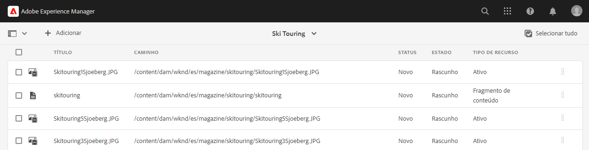

# Traduzir conteúdo headless {#translate-content}

Use a integração de tradução para traduzir o conteúdo headless.

## A história até agora {#story-so-far}

No documento anterior da jornada de tradução AEM headless, [Configurar conector de tradução](configure-connector.md), você aprendeu sobre a estrutura de tradução no AEM. Agora você deve:

* Compreender os parâmetros fundamentais da estrutura de integração de tradução no AEM.
* Ser capaz de configurar sua própria conexão com o serviço de tradução.

Agora que seu conector está configurado, este artigo o orienta ao longo da próxima etapa da tradução de conteúdo headless.

## Objetivo {#objective}

Este documento o ajuda a entender como usar os projetos de tradução do AEM junto ao conector para traduzir conteúdo. Depois de ler este documento, você deverá:

* Entender o que é um projeto de tradução.
* Ser capaz de criar novos projetos de tradução.
* Usar os projetos de tradução para traduzir o conteúdo headless.

## Criação de um projeto de tradução {#creating-translation-project}

Os projetos de tradução permitem gerenciar a tradução de conteúdo AEM headless. Um projeto de tradução reúne o conteúdo a ser traduzido para outros idiomas em um local para permitir uma visualização centralizada do esforço de tradução.

Quando conteúdo é adicionado a um projeto de tradução, um trabalho de tradução é criado para ele. Os trabalhos fornecem comandos e informações de status que são usados para gerenciar os fluxos de trabalho de tradução humana e tradução automática que são executados nos recursos.

Projetos de tradução podem ser criados de duas formas:

1. Selecione a raiz de idioma do conteúdo e o AEM criará automaticamente o projeto de tradução com base no caminho do conteúdo.
1. Crie um projeto vazio e selecione manualmente o conteúdo a ser adicionado ao projeto de tradução

Ambas as abordagens são válidas e geralmente diferem apenas com base em quem está executando a tradução:

* O gerente de projetos de tradução (TPM) geralmente precisa da flexibilidade de selecionar manualmente o conteúdo para o projeto de tradução.
* Se o proprietário do conteúdo também for responsável pela tradução, permitir que o AEM crie o projeto automaticamente com base no caminho do conteúdo selecionado geralmente é mais fácil.

Ambas as abordagens são exploradas nas seções a seguir.

### Criação automática de um projeto de tradução com base no caminho do conteúdo {#automatically-creating}

Para proprietários de conteúdo que também são responsáveis pela tradução, geralmente é mais fácil deixar o AEM criar automaticamente o projeto de tradução. Para fazer o AEM criar automaticamente um projeto de tradução com base no caminho do conteúdo:

1. Navegue até **Navegação** > **Assets** > **Arquivos**. Lembre-se de que o conteúdo headless no AEM é armazenado como ativos conhecidos como Fragmentos de conteúdo.
1. Selecione a raiz do idioma do projeto. Nesse caso, selecionamos `/content/dam/wknd/en`.
1. Selecione o seletor do painel e exiba o painel **Referências**.
1. Selecione **Cópias de idioma**.
1. Marque a caixa de seleção **Cópias de idioma**.
1. Expanda a seção **Atualizar cópias de Idioma** na parte inferior do painel de referências.
1. Na lista suspensa **Projeto**, selecione **Criar projeto(s) de tradução**.
1. Forneça um título apropriado para o projeto de tradução.
1. Selecione **Iniciar**.


Você receberá uma mensagem informando que o projeto foi criado.

>[!NOTE]
>
>Pressupõe-se que a estrutura necessária para os idiomas das traduções já tenha sido criada como parte da [definição da sua estrutura de conteúdo](getting-started.md#content-structure). Isso deve ser feito em colaboração com o arquiteto de conteúdo.
>
>Se as pastas de idioma não forem criadas com antecedência, você não será capaz de criar cópias de idioma conforme descrito nas etapas anteriores.

### Criação manual de um projeto de tradução selecionando o conteúdo {#manually-creating}

Para gerentes de projeto de tradução, geralmente é necessário selecionar manualmente o conteúdo específico para incluir em um projeto de tradução. Para criar esse projeto de tradução manual, você deve começar criando um projeto vazio e depois selecionar o conteúdo a ser adicionado.

1. Navegue até **Navegação** > **Projetos**.
1. Selecione **Criar** > **Pasta** para criar uma pasta para seus projetos.
   * Isso é opcional, mas útil para organizar seus esforços de tradução.
1. Na janela **Criar Projeto**, adicione um **Título** para a pasta e selecione **Criar**.

   

1. Selecione a pasta para abrir a pasta.
1. Na nova pasta do projeto, selecione **Criar** > **Projeto**.
1. Os projetos são baseados em modelos. Selecione o modelo do **Projeto de tradução** para selecioná-lo e selecione **Próximo**.

   

1. Na guia **Básico**, digite um nome para o novo projeto.

   

1. Na guia **Avançado**, use o menu suspenso **Idioma de Destino** para selecionar os idiomas nos quais seu conteúdo deve ser traduzido. Selecione **Criar**.

   

1. Selecione **Abrir** no diálogo de confirmação.

   

O projeto foi criado, mas não contém conteúdo para tradução. A próxima seção detalha como o projeto está estruturado e como adicionar conteúdo.

## Usar um projeto de tradução {#using-translation-project}

Os projetos de tradução são projetados para coletar o conteúdo e as tarefas relacionadas a um esforço de tradução em um único local, tornando sua tradução simples e fácil de gerenciar.

Para exibir o projeto de tradução:

1. Navegue até **Navegação** > **Projetos**.
1. Selecione o projeto criado na seção anterior.


O projeto é dividido em vários cartões.

* **Resumo** — este cartão mostra as informações básicas do cabeçalho do projeto, incluindo o proprietário, o idioma e o provedor de tradução.
* **Tarefa de tradução** - Este cartão ou estes cartões apresentam uma visão geral do trabalho de tradução real, incluindo o status, o número de ativos, etc. Geralmente, há uma tarefa por idioma com o código de idioma ISO-2 anexado ao nome da tarefa.
* **Equipe** — este cartão mostra os usuários que estão colaborando neste projeto de tradução. Essa jornada não aborda esse tópico.
* **Tarefas** — tarefas adicionais associadas à tradução do conteúdo, como itens por fazer ou itens de fluxo de trabalho. Essa jornada não aborda esse tópico.

A forma como você usa um projeto de tradução depende de como ele foi criado: automaticamente pelo AEM ou manualmente.

### Usar um projeto de tradução criado automaticamente {#using-automatic-project}

Ao criar automaticamente o projeto de tradução, AEM avalia o conteúdo headless no caminho selecionado. Com base nessa avaliação, ele extrai o conteúdo que requer tradução para um novo projeto de tradução. Ele descobre quais campos traduzir com base nos campos sinalizados como **Traduzível** pelo arquiteto de conteúdo.

Para ver os detalhes do conteúdo headless incluído neste projeto:

1. Selecione o botão de reticências na parte inferior do cartão **Tarefa de tradução**.
1. A janela **Tarefa de tradução** lista todos os itens na tarefa.
   
1. Selecione uma linha para ver os detalhes dela, tendo em mente que uma linha pode representar vários itens de conteúdo a serem traduzidos.
1. Marque a caixa de seleção de um item de linha para ver outras opções, como a opção para excluí-lo da tarefa ou exibi-lo nos Fragmentos de conteúdo ou nos consoles do Assets.


Normalmente, o conteúdo do trabalho de tradução começa no estado de **Rascunho**, conforme indicado pela coluna **Estado** na janela **Tarefa de tradução**.

Para iniciar o trabalho de tradução, volte para a visão geral do projeto de tradução e clique no botão de divisa na parte superior do cartão **Trabalho de tradução** e selecione **Iniciar**.


O AEM agora se comunica com sua configuração de tradução e conector para enviar o conteúdo para o serviço de tradução. Você pode visualizar o progresso da tradução retornando à janela **Tarefa de tradução** e exibindo a coluna **Estado** das entradas.


As traduções automáticas retornam automaticamente com um estado de **Aprovado**. A tradução humana permite mais interação, mas está além do escopo dessa jornada.

### Usar um projeto de tradução criado manualmente {#using-manual-project}

Ao criar manualmente um projeto de tradução, o AEM cria as tarefas necessárias, mas não seleciona automaticamente qualquer conteúdo para incluir nessas tarefas. Isso permite que o gerente do projeto de tradução tenha flexibilidade para escolher qual conteúdo traduzir.

Para adicionar conteúdo a uma tarefa de tradução:

1. Selecione o botão de reticências na parte inferior de um dos cartões de **Tarefa de tradução**.
1. Veja se a tarefa não contém conteúdo. Selecione o botão **Adicionar** na parte superior da janela e, em seguida, **Assets/Páginas** no menu suspenso.

   

1. Um navegador de caminho é aberto, permitindo que você selecione especificamente qual conteúdo adicionar. Localize o conteúdo e selecione.

   

1. Selecione **Selecionar** para adicionar o conteúdo selecionado ao trabalho.
1. Na caixa de diálogo **Traduzir**, especifique que deseja **Criar Cópia de Idioma**.

   

1. O conteúdo agora está incluído na tarefa.

   

1. Marque a caixa de seleção de um item de linha para ver outras opções, como a opção para excluí-lo da tarefa ou exibi-lo nos Fragmentos de conteúdo ou nos consoles do Assets.


1. Repita essas etapas para incluir todo o conteúdo necessário na tarefa.

>[!TIP]
>
>O navegador de caminho é uma ferramenta poderosa que permite pesquisar, filtrar e navegar pelo seu conteúdo. Selecione o botão **Somente conteúdo/Filtros** para alternar o painel lateral e revelar filtros avançados como **Data de Modificação** ou **Status da Tradução**.
>
>Você pode saber mais sobre o navegador de caminho na [seção de recursos adicionais](#additional-resources).

Você pode usar as etapas anteriores para adicionar o conteúdo necessário a todos os idiomas (tarefas) do projeto. Após selecionar todo o conteúdo, você pode iniciar a tradução.

Normalmente, o conteúdo do trabalho de tradução começa no estado de **Rascunho**, conforme indicado pela coluna **Estado** na janela **Tarefa de tradução**.

Para iniciar o trabalho de tradução, volte para a visão geral do projeto de tradução e selecione o botão de divisa na parte superior do cartão **Trabalho de tradução** e selecione **Iniciar**.


O AEM agora se comunica com sua configuração de tradução e conector para enviar o conteúdo para o serviço de tradução. Você pode visualizar o progresso da tradução retornando à janela **Tarefa de tradução** e exibindo a coluna **Estado** das entradas.


As traduções automáticas retornam automaticamente com um estado de **Aprovado**. A tradução humana permite mais interação, mas está além do escopo dessa jornada.

## Revisar conteúdo traduzido {#reviewing}

[Como visto anteriormente](#using-translation-project), o conteúdo de tradução automática volta ao AEM com o status **Aprovado**, pois se presume que, devido à utilização de tradução automática, não é necessária qualquer intervenção humana. No entanto, ainda é possível revisar o conteúdo traduzido.

Basta ir até o trabalho de tradução concluído e selecionar um item da linha tocando ou clicando na caixa de seleção. O ícone **Revelar no Fragmento de conteúdo** é exibido na barra de ferramentas.


Selecione esse ícone para abrir o fragmento de conteúdo traduzido no console do editor e ver os detalhes do conteúdo traduzido.


Você pode modificar ainda mais o fragmento de conteúdo conforme necessário, desde que tenha a permissão adequada, mas a edição de fragmentos de conteúdo está além do escopo desta jornada. Consulte a seção [Recursos Adicionais](#additional-resources) no final deste documento para obter mais informações sobre este tópico.

O objetivo do projeto é coletar todos os recursos relacionados a uma tradução em um único local para facilitar o acesso e dar uma visão geral clara. No entanto, como você pode ver ao visualizar os detalhes de um item traduzido, as próprias traduções voltam para a pasta de recursos do idioma da tradução. Neste exemplo, a pasta é

```text
/content/dam/wknd/es
```

Se você navegar até esta pasta por meio da **Navegação** > **Arquivos** > **Assets**, verá o conteúdo traduzido.


A estrutura de tradução do AEM recebe as traduções do conector de tradução e cria automaticamente a estrutura de conteúdo, com base na raiz de idioma e usando as traduções fornecidas pelo conector.

É importante entender que esse conteúdo não foi publicado e, portanto, não está disponível para serviços headless. Você aprende sobre essa estrutura de criação-publicação e vê como publicar conteúdo traduzido na próxima etapa da jornada de tradução.

## Tradução humana {#human-translation}

Se o seu serviço de tradução fornecer tradução humana, o processo de revisão oferecerá mais opções. Por exemplo, as traduções retornam ao projeto com o status de **Rascunho** e devem ser revisadas e aprovadas ou rejeitadas manualmente.

A tradução humana está fora do escopo dessa jornada de localização. Consulte a seção [Recursos adicionais](#additional-resources) no final deste documento para obter mais informações sobre este tópico. No entanto, além das opções de aprovação adicionais, o fluxo de trabalho para traduções humanas é o mesmo das traduções automáticas, conforme descrito nesta jornada.

## O que vem a seguir {#what-is-next}

Agora que você concluiu esta parte da jornada de tradução headless, você deve:

* Entender o que é um projeto de tradução.
* Ser capaz de criar novos projetos de tradução.
* Usar os projetos de tradução para traduzir o conteúdo headless.

Desenvolva esse conhecimento e continue sua jornada de tradução headless do AEM revisando a seguir o documento [Publicar conteúdo traduzido](publish-content.md), onde você aprende a publicar seu conteúdo traduzido e como atualizar essas traduções conforme o conteúdo da raiz do idioma mudar.

## Recursos adicionais {#additional-resources}

Embora seja recomendável seguir para a próxima parte da jornada de tradução headless revisando o documento [Publicar conteúdo traduzido](publish-content.md), a seguir estão alguns recursos adicionais e opcionais que aprofundam alguns conceitos mencionados neste documento, mas não são necessários para continuar na jornada headless.

* [Gerenciamento de projetos de tradução](/help/sites-cloud/administering/translation/managing-projects.md) - Saiba mais sobre os detalhes de projetos de tradução e recursos adicionais, como fluxos de trabalho de tradução humana e projetos multilíngues.
* [Ambiente e ferramentas de criação](/help/sites-cloud/authoring/path-selection.md#path-selection) - O AEM fornece vários mecanismos para organização e edição de conteúdo, incluindo um navegador de caminhos robusto.
