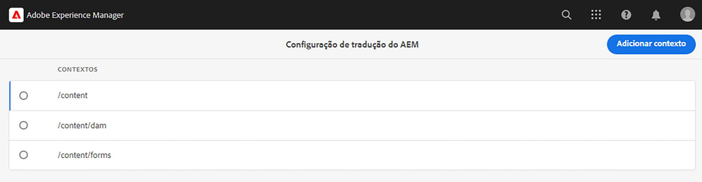
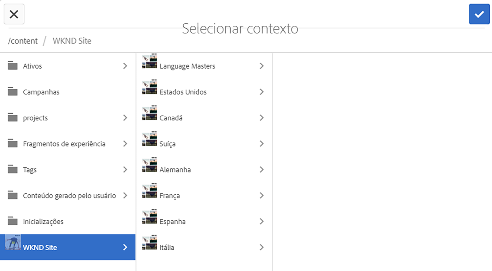
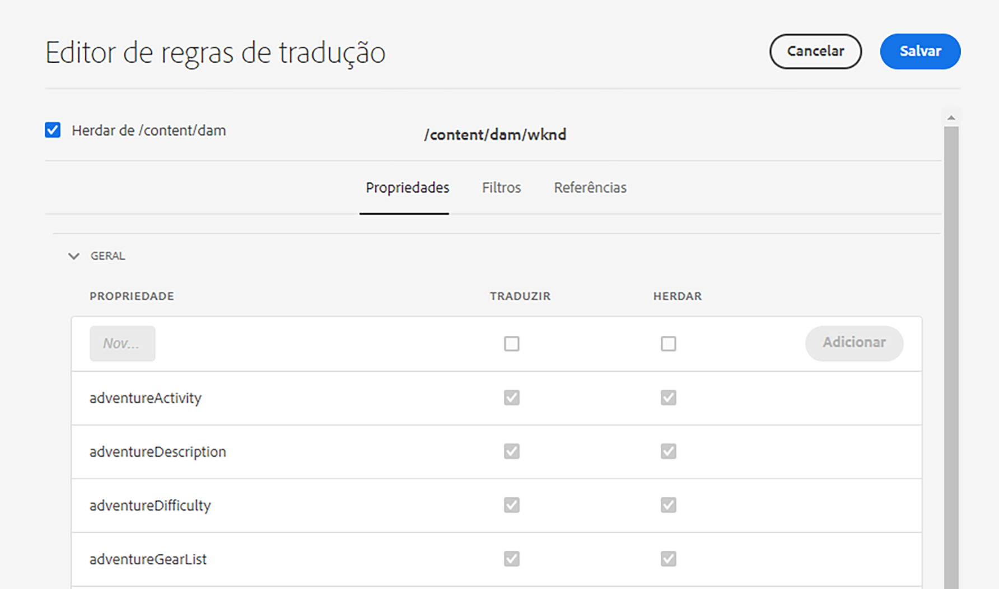
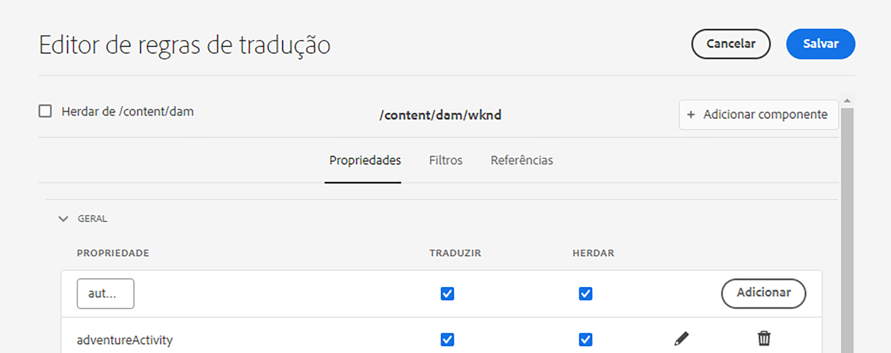

# Configurar regras de tradução {#configure-translation-rules}

Saiba como definir regras de tradução para identificar o conteúdo a ser traduzido.

## A história até agora {#story-so-far}

No documento anterior da jornada de tradução headless do AEM, [Configurar integração de tradução](configure-connector.md), você aprendeu a instalar e configurar sua integração de tradução e agora deve:

* Compreender os parâmetros fundamentais da estrutura de integração de tradução no AEM.
* Ser capaz de configurar sua própria conexão com o serviço de tradução.

Agora que sua integração está configurada, este artigo o orienta pela próxima etapa de identificação do conteúdo que deve ser traduzido.

>[!CAUTION]
>
>Essa etapa da jornada de documentação só é necessária se você não estiver utilizando o sinalizador **Traduzível** em fragmentos de conteúdo.
>
>* O sinalizador **Traduzível** cria regras de tradução automaticamente, sem necessidade de intervenção.
>* O sinalizador **Traduzível** é usado somente se a configuração da estrutura de integração de tradução estiver definida como **[Habilitar campos do modelo de conteúdo para tradução](/help/sites-cloud/administering/translation/integration-framework.md)**.
>* Habilitar essa opção na configuração de TIF substitui quaisquer regras de tradução criadas manualmente.|

## Objetivo {#objective}

Este documento ajuda você a entender como usar as regras de tradução do AEM para identificar o conteúdo da tradução. Depois de ler este documento, você deverá:

* Entenda o que as regras de tradução fazem.
* Ser capaz de definir suas próprias regras de tradução.

## Regras de tradução {#translation-rules}

Os fragmentos de conteúdo, que representam o conteúdo headless, podem conter muitas informações organizadas por campos estruturados. Dependendo das necessidades do projeto, é provável que nem todos os campos em um Fragmento de conteúdo precisem ser traduzidos.

As regras de tradução identificam o conteúdo que faz parte, ou não, dos projetos de tradução. Quando o conteúdo é traduzido, o AEM extrai ou obtém o conteúdo com base nessas regras. Dessa forma, somente o conteúdo que deve ser traduzido é enviado para o serviço de tradução.

As regras de tradução incluem as seguintes informações:

* O caminho do conteúdo ao qual a regra se aplica
   * A regra também se aplica aos descendentes do conteúdo
* Os nomes das propriedades que contêm o conteúdo a ser traduzido
   * A propriedade pode ser específica para um tipo de recurso específico ou para todos os tipos de recurso

Visto que os modelos de fragmentos de conteúdo, que definem a estrutura dos fragmentos de conteúdo, são exclusivos de seu próprio projeto, é vital configurar regras de tradução para que o AEM saiba quais elementos dos modelos de conteúdo devem ser traduzidos.

>[!TIP]
>
>Geralmente, o arquiteto de conteúdo fornece ao especialista em tradução o **Nome da Propriedade** s de todos os campos necessários para tradução. Esses nomes são necessários para configurar as regras de tradução. Como especialista em tradução, você [pode encontrar esses **Nomes de propriedade** por conta própria](getting-started.md#content-modlels), conforme descrito anteriormente nesta jornada.

## Criar regras de tradução {#creating-rules}

Várias regras podem ser criadas para dar suporte a requisitos complexos de tradução. Por exemplo, um projeto no qual você está trabalhando pode exigir que todos os campos do modelo sejam traduzidos, enquanto em outro projeto apenas os campos de descrição devem ser traduzidos, e os títulos não devem ser traduzidos.

As regras de tradução são projetadas para lidar com tais cenários. No entanto, neste exemplo, ilustramos como criar regras com foco em uma configuração simples e única.

Existe um console de **Configuração de tradução** disponível para configurar regras de tradução. Para acessá-lo:

1. Navegue até **Ferramentas** > **Geral**.
1. Selecione **Configurações de tradução**.

Na interface de usuário da **Configuração de tradução**, há várias opções disponíveis para suas regras de tradução. Aqui destacamos as etapas mais necessárias e típicas de uma configuração básica de localização headless.

1. Selecione **Adicionar Contexto** para adicionar um caminho. Esse é o caminho do conteúdo que deve ser afetado pela regra.
   
1. Use o navegador de caminho para selecionar o caminho necessário e selecione **Confirmar** para salvar. Lembre-se, os fragmentos de conteúdo, que possuem conteúdo headless, geralmente estão localizados em `/content/dam/<your-project>`.
   
1. Selecione o contexto criado e selecione **Editar**. Isso abre o **editor de regras de tradução** para configurar as propriedades.
   
1. Por padrão, todas as configurações são herdadas do caminho principal, neste caso: `/content/dam`. Desmarque a opção **Herdar de`/content/dam`** para adicionar novos campos à configuração.
1. Quando desmarcada, na seção **Geral** da lista, adicione os nomes de propriedade dos Modelos de fragmento de conteúdo que você [identificou anteriormente como campos para tradução](getting-started.md#content-models).
   1. No campo **Nova Propriedade**, digite o nome da propriedade. Observe que as opções **Traduzir** e **Herdar** são verificadas automaticamente.
   1. Selecione **Adicionar**.
   1. Repita essas etapas para todos os campos que devem ser traduzidos.
   1. Selecione **Salvar**.
      

Agora, você configurou as regras de tradução.

## Uso avançado {#advanced-usage}

Há várias propriedades adicionais que podem ser configuradas como parte das regras de tradução. Além disso, você pode especificar suas regras manualmente como XML, o que permite maior especificidade e flexibilidade.

Esses recursos geralmente não são necessários para começar a localização do seu conteúdo headless, mas você pode ler mais sobre eles na seção [Recursos adicionais](#additional-resources), caso esteja interessado.

## O que vem a seguir {#what-is-next}

Agora que você concluiu esta parte da jornada de tradução headless, você deve:

* Entenda o que as regras de tradução fazem.
* Ser capaz de definir suas próprias regras de tradução.

Desenvolva esse conhecimento e prossiga com sua jornada de tradução headless do AEM, revisando a seguir o documento [Traduzir conteúdo](translate-content.md), onde você aprende como a integração e as regras funcionam juntas para traduzir conteúdo headless.

## Recursos adicionais {#additional-resources}

Embora seja recomendável seguir para a próxima parte da jornada de tradução headless revisando o documento [Traduzir conteúdo](translate-content.md), a seguir estão alguns recursos adicionais e opcionais que aprofundam alguns conceitos mencionados neste documento, mas não são necessários para continuar na jornada headless.

* [Identificar conteúdo a ser traduzido](/help/sites-cloud/administering/translation/rules.md) - Saiba como as regras de tradução identificam o conteúdo que precisa ser traduzido.
