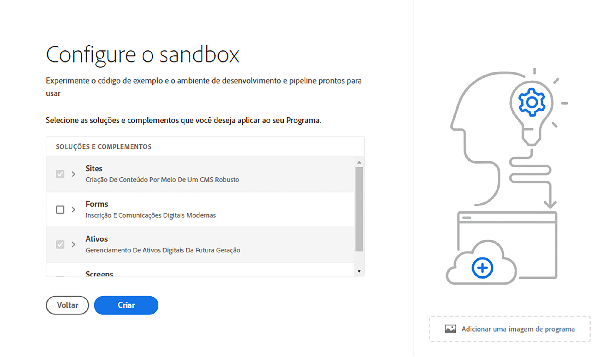

# Criar um programa {#create-program}

Nesta parte do [integração do jornada,](overview.md) você aprenderá a usar o Cloud Manager para criar seu primeiro programa.

## Objetivo {#objective}

Depois de revisar o documento anterior nesta jornada de integração, [Acessar o Cloud Manager,](cloud-manager.md) você garantiu o acesso apropriado ao Cloud Manager. Agora você pode criar seu primeiro programa.

Depois de ler este documento, você poderá:

* Entender e explicar o que é um programa.
* Saber a diferença entre programas de produção e de sandbox.
* Crie seu próprio programa.

## O que é um programa? {#programs}

Os programas são o mais alto nível de organização no Cloud Manager. Dependendo da sua licença da Adobe, os programas permitem organizar sua solução e conceder acesso a membros de uma equipe específica a esses programas.

Os programas do Cloud Manager representam conjuntos de ambientes do Cloud Manager. Esses programas oferecem suporte a conjuntos lógicos de iniciativas de negócios, normalmente correspondentes a um contrato de nível de serviço (SLA) licenciado. Por exemplo, um programa pode representar os recursos do Adobe Experience Manager (AEM) para dar suporte a um site público global de uma organização, enquanto outro programa representa um DAM central interno.

Recordando o exemplo teórico da WKND Travel and Adventure Enterprises, que é um locatário com foco em mídias relacionadas a viagens, eles podem ter dois programas. Um programa AEM Sites para a divisão WKND Magazine e um programa AEM Assets para a divisão WKND Media. Os diferentes membros da equipe teriam então acesso a diferentes programas devido à sua própria divisão das necessidades de trabalho.

Há dois tipos diferentes de programas:

* Um **programa de produção** é criado para permitir o tráfego direto em seu site. Esse é o seu ambiente “real”.
* Um **programa de sandbox** é normalmente criado para fins de treinamento, execução de demonstrações, capacitação, POCs ou documentação.

Como atendem a diferentes objetivos, os ambientes têm opções diferentes. No entanto, o processo de criação é semelhante. Nesta jornada de integração, você cria um ambiente de sandbox.

>[!TIP]
>
>Se você precisar criar um programa de produção, consulte [Recursos adicionais](#additional-resources) para obter um link para a documentação que descreve os programas em detalhes.

## Criação de um programa de sandbox {#create-sandbox}

1. Faça logon no Cloud Manager, em [my.cloudmanager.adobe.com](https://my.cloudmanager.adobe.com/), e selecione a organização apropriada.

1. Na página de destino do Cloud Manager, clique em **Adicionar programa** no canto superior direito da tela.

   

1. No assistente de criação de programas, selecione **Configurar uma sandbox**, forneça um nome de programa e toque ou clique **Continuar**.

   

1. No **Configurar sua sandbox** , é possível escolher quais soluções você deseja ativar no programa de sandbox. As soluções **Sites** e **Assets** estão sempre incluídas em programas de sandbox e são selecionadas automaticamente. Isso é suficiente para seu exemplo de integração. Clique em **Criar**.

   

Você verá um cartão de novo programa de sandbox na página de destino com um indicador de status, conforme o processo de configuração avança.

Quando o programa estiver concluído, os membros de sua organização serão atribuídos à **Desenvolvedor** O perfil de produto pode fazer logon no Cloud Manager e gerenciar os repositórios Git do Cloud Manager.

## O que vem a seguir {#whats-next}

Agora que seu primeiro programa foi criado, você pode criar ambientes para ele. Continue sua jornada de integração revisando em seguida o documento [Criar ambientes.](create-environments.md)

## Recursos adicionais {#additional-resources}

A seguir estão recursos adicionais e opcionais se quiser ir além do conteúdo da jornada de integração.

* [Programas e tipos de programas](/help/implementing/cloud-manager/getting-access-to-aem-in-cloud/program-types.md) - Saiba mais sobre a hierarquia do Cloud Manager e como os diferentes tipos de programas se encaixam em sua estrutura e a diferença entre eles.
* [Criação de programas do sandbox](/help/implementing/cloud-manager/getting-access-to-aem-in-cloud/creating-sandbox-programs.md) - Saiba como usar o Cloud Manager para criar seu próprio programa de sandbox para treinamentos, demonstrações, POCs ou outros fins de não produção.
* [Criação de programas de produção](/help/implementing/cloud-manager/getting-access-to-aem-in-cloud/creating-production-programs.md) - Saiba como usar o Cloud Manager para criar seu próprio programa de produção para hospedar o tráfego direto.
* [Uso do Adobe Cloud Manager - Programas](https://experienceleague.adobe.com/docs/experience-manager-learn/cloud-service/cloud-manager/programs.html?lang=pt-BR) - Os programas do Cloud Manager representam conjuntos de ambientes do AEM que oferecem suporte a conjuntos lógicos de iniciativas de negócios, normalmente correspondendo a um SLA (contrato de nível de serviço) adquirido.
* [Perfis de produto e de equipe do AEM as a Cloud Service](/help/onboarding/aem-cs-team-product-profiles.md) - Saiba como os perfis de produto e de equipe do AEM as a Cloud Service podem conceder e limitar o acesso às soluções da Adobe licenciadas.
