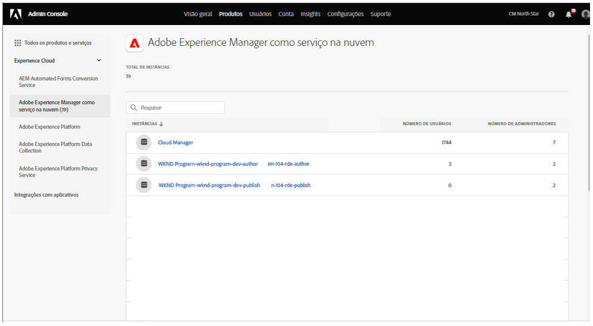
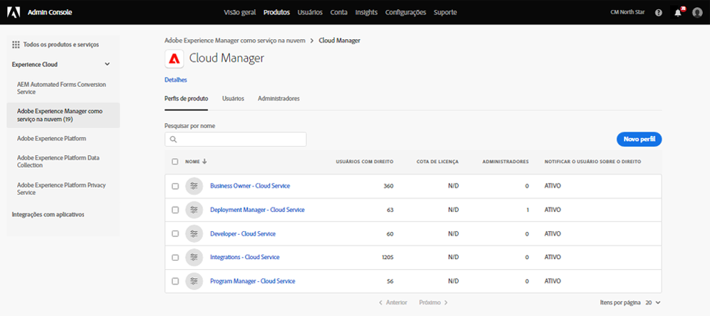

# Perfis de notificação {#notification-profiles}

Saiba como criar perfis de usuários no Admin Console para gerenciar o recebimento de notificações de email importantes.

## Visão geral {#overview}

Periodicamente, o Adobe entra em contato com os usuários com relação aos ambientes do AEM as a Cloud Service. Além das notificações no produto, a Adobe também usa ocasionalmente emails para notificações. Há dois tipos de notificações por email:

* **Notificação de Incidente** - Estas notificações são enviadas durante um incidente ou quando a Adobe identificou um problema potencial de disponibilidade com seu ambiente do AEM as a Cloud Service.
* **Notificação proativa** - Estas notificações são enviadas quando um membro da equipe de suporte da Adobe deseja fornecer orientação sobre uma possível otimização ou recomendação que pode beneficiar seu ambiente do AEM as a Cloud Service.

Os usuários também podem receber essas notificações para programas específicos com base em suas [permissões de grupo personalizadas.](/help/implementing/cloud-manager/custom-permissions.md)

Além disso, a atribuição de grupos à notificação proativa é suportada, e usuários e grupos podem ser atribuídos diretamente aos perfis de produto.

* Os usuários nos grupos de notificação incidentes e proativa receberão notificações para todos os programas por padrão.
* No entanto, se os usuários não quiserem receber todas as notificações, eles poderão usar permissões de LEITURA personalizadas para especificar quais notificações de programa desejam receber.

Para que os usuários corretos recebam essas notificações, é necessário configurar e atribuir perfis de usuários conforme é descrito neste documento.

## Pré-requisitos {#prerequisites}

Visto que os perfis de usuários são criados e mantidos no Admin Console, antes de criá-los para suas notificações, você deve:

* Ter permissões para adicionar e editar associações de perfil.
* Ter um perfil Adobe Admin Console válido.

## Criar novos perfis de produto do Cloud Manager {#create-profiles}

Para configurar corretamente o recebimento de notificações, crie dois perfis de usuário. Essas etapas são executadas apenas uma vez.

1. Faça logon no Admin Console em [`https://adminconsole.adobe.com`.](https://adminconsole.adobe.com)

1. Certifique-se de estar na organização correta.

1. Na página **Visão geral**, selecione **Adobe Experience Manager as a Cloud Service** no cartão **Produtos e serviços**.

   

1. Navegue até a instância do **Cloud Manager** a partir da lista de todas as instâncias.

   

1. Você pode ver a lista de todos os perfis de produto configurados do Cloud Manager.

   

1. Clique em **Novo perfil** e forneça as seguintes informações:

   * **Nome do perfil do produto**: `Incident Notification - Cloud Service`
   * **Nome de exibição**: `Incident Notification - Cloud Service`
   * **Descrição**: perfil do Cloud Manager para os usuários que receberão notificações durante um incidente ou quando o Adobe identificar um possível problema de disponibilidade com seu ambiente do AEM as a Cloud Service.
      * Os usuários com permissões de LEITURA personalizadas em programas específicos receberão notificações somente desses programas se optarem por usar permissões personalizadas.

1. Clique em **Salvar**.

1. Clique em **Novo perfil** mais uma vez e forneça os seguintes detalhes:

   * **Nome do perfil do produto**: `Proactive Notification - Cloud Service`
   * **Nome de exibição**: `Proactive Notification - Cloud Service`
   * **Descrição**: Perfil do Cloud Manager para usuários que receberão notificações quando um membro da equipe de suporte da Adobe quiser fornecer orientação sobre uma possível otimização ou recomendação para fazer com a configuração do ambiente do AEM as a Cloud Service
      * Os usuários com permissões de LEITURA personalizadas em programas específicos receberão notificações somente desses programas se optarem por usar permissões personalizadas.

1. Clique em **Salvar**.

Seus dois novos perfis de notificação são criados.

>[!NOTE]
>
>É importante que o **nome do perfil do produto** do Cloud Manager seja exatamente o mesmo fornecido. Copie e cole o nome do perfil do produto fornecido para evitar erros. Quaisquer desvios ou erros de digitação farão com que as notificações não sejam enviadas conforme desejado.
>
>Em caso de erro ou se os perfis não tiverem sido definidos, a Adobe assumirá como padrão a notificação de usuários existentes atribuídos aos perfis de **Desenvolvedor do Cloud Manager** ou **Gerenciador de implantação**.

## Atribuir usuários aos perfis de notificação {#add-users}

Agora que os perfis foram criados, é necessário atribuir os usuários apropriados. Você pode fazer isso ao criar novos usuários ou ao atualizar usuários existentes.

### Adicionar novos usuários aos perfis {#new-user}

Siga estas etapas para adicionar usuários para os quais as IDs federadas ainda não foram configuradas.

1. Identifique os usuários ou grupos que devem receber notificações incidentes ou proativas.

1. Faça logon no Admin Console em [`https://adminconsole.adobe.com`](https://adminconsole.adobe.com) se ainda não estiver conectado.

1. Certifique-se de ter selecionado a organização apropriada.

1. Na página **Visão geral**, selecione **Adobe Experience Manager as a Cloud Service** no cartão **Produtos e serviços**.

   

1. Se a ID federareda dos membros da equipe ainda não tiver sido configurada, selecione a guia **Usuários** na navegação superior, em seguida, selecione **Adicionar usuário**. Caso contrário, pule para a seção [Adicionar usuários existentes aos perfis.](#existing-users)

   

1. Na caixa de diálogo **Adicionar usuários à equipe**, digite a ID de email do usuário que deseja adicionar e selecione `Adobe ID` para o **tipo de ID**.

1. Clique no botão de mais sob o título **Selecionar produtos** para iniciar a seleção do produto.

1. Selecione **Adobe Experience Manager as a Cloud Service** e atribua um ou ambos os novos perfis ao usuário.

   * **Notificação de incidente - Cloud Service**
   * **Notificação proativa - Cloud Service**

1. Clique em **Salvar** e um email de boas-vindas será enviado ao usuário adicionado.

O usuário convidado agora receberá as notificações. Os usuários com permissões de LEITURA personalizadas em programas específicos receberão notificações somente desses programas se optarem por usar permissões personalizadas.

Repita essas etapas para os usuários de sua equipe que você gostaria que recebesse notificações.

### Adicionar usuários existentes aos perfis {#existing-user}

Siga estas etapas para adicionar usuários para os quais já existem IDs federadas.

1. Identifique os usuários ou grupos que devem receber notificações incidentes ou proativas.

1. Faça logon no Admin Console em [`https://adminconsole.adobe.com`](https://adminconsole.adobe.com) se ainda não estiver conectado.

1. Certifique-se de ter selecionado a organização apropriada.

1. Na página **Visão geral**, selecione **Adobe Experience Manager as a Cloud Service** no cartão **Produtos e serviços**.

1. Selecione a guia **Usuários** na navegação superior.

1. Se o Federated ID já existir para o membro da equipe que você deseja adicionar a um perfil de notificação, localize esse usuário na lista e clique nele. Caso contrário, pule para a seção [Adicionar novos usuários aos perfis.](#add-user)

1. Na seção **Produtos** da janela de detalhes do usuário, clique no botão reticências e selecione **Editar**.

1. Na janela **Editar produtos**, clique no botão de lápis abaixo do cabeçalho **Selecionar produtos** para iniciar a seleção de produtos.

1. Selecione **Adobe Experience Manager as a Cloud Service** e atribua um ou ambos os novos perfis ao usuário.

   * **Notificação de incidente - Cloud Service**
   * **Notificação proativa - Cloud Service**

1. Clique em **Salvar** e um email de boas-vindas será enviado ao usuário adicionado.

O usuário convidado agora receberá as notificações. Os usuários com permissões de LEITURA personalizadas em programas específicos receberão notificações somente desses programas se optarem por usar permissões personalizadas.

Repita essas etapas para os usuários de sua equipe que você gostaria que recebesse notificações.

## Recursos adicionais {#additional-resources}

A seguir estão recursos adicionais e opcionais se quiser ir além do conteúdo da jornada de integração.

* [Centro de Ações](/help/operations/actions-center.md) - Utilize o Centro de Ações para agir de forma conveniente em incidentes e outras informações importantes.
