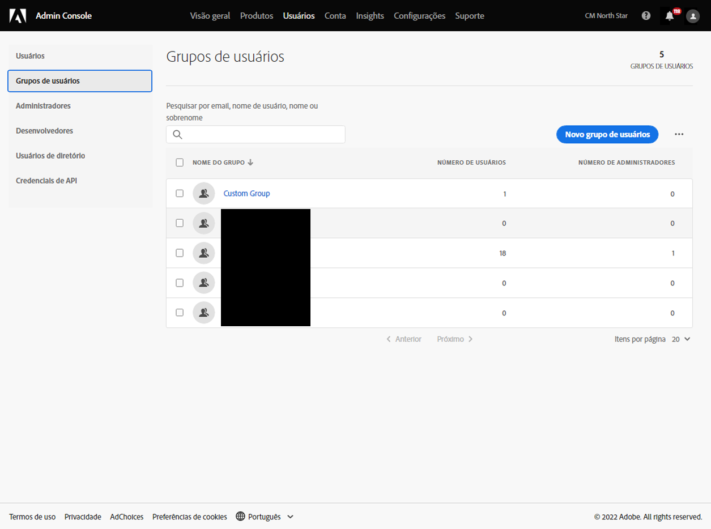
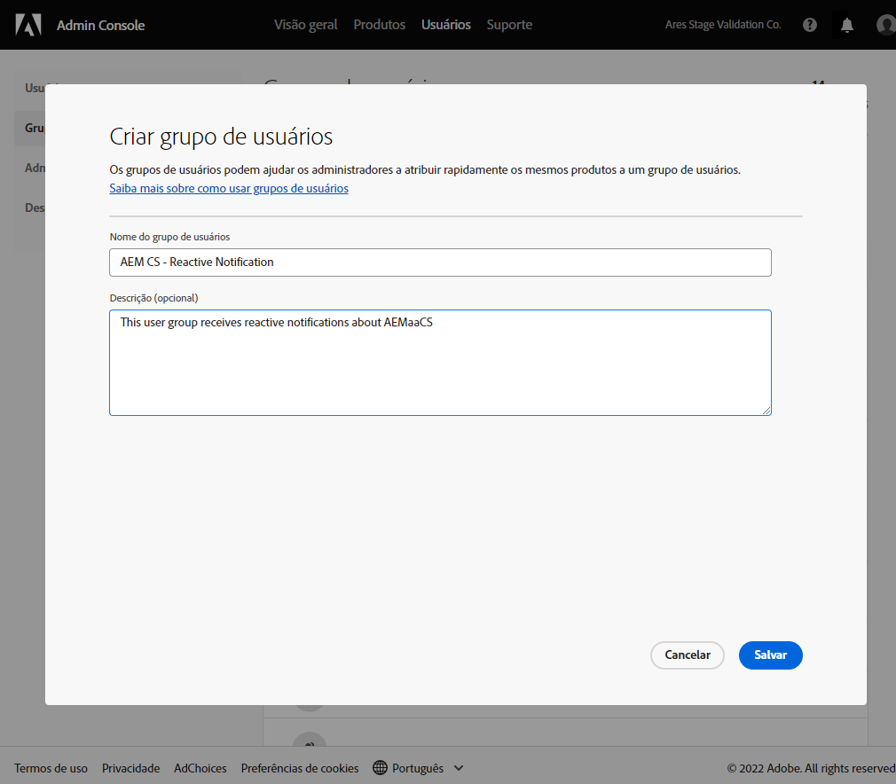
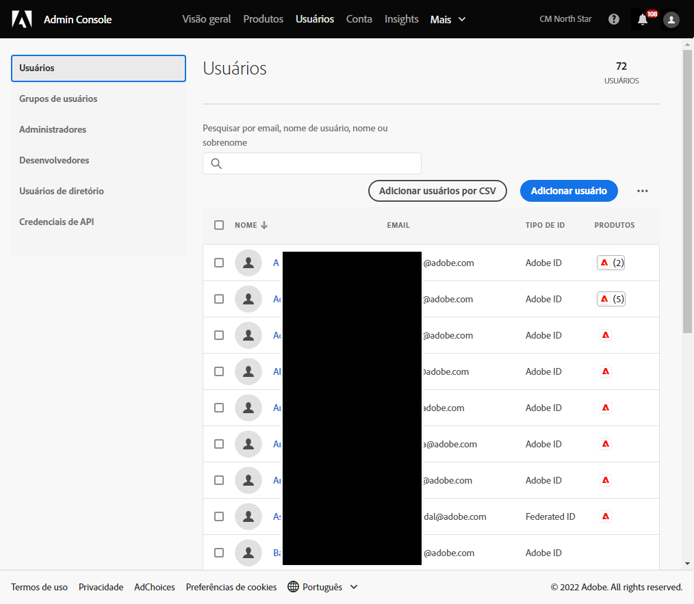
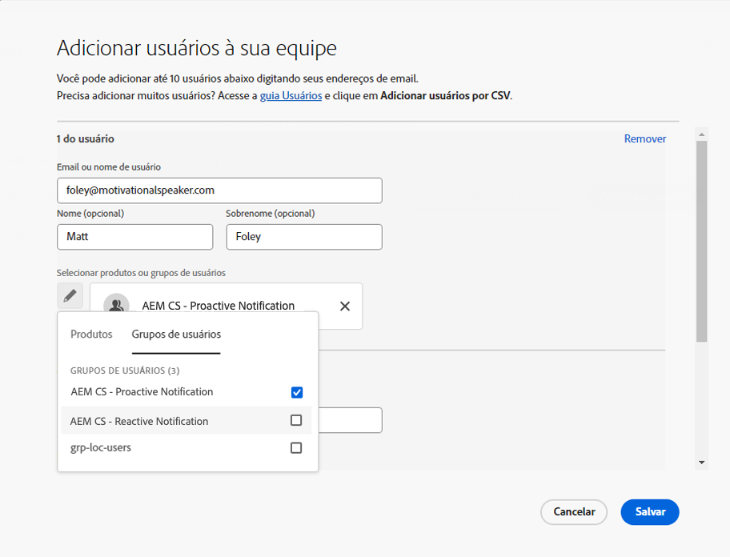
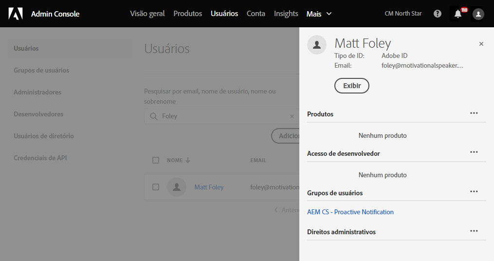

# Grupos de usuários para notificações {#user-groups}

Saiba como criar um grupo de usuários no Admin Console para gerenciar o recebimento de notificações por email importantes.

## Visão geral {#overview}

De tempos em tempos, o Adobe precisa entrar em contato com relação aos ambientes as a Cloud Service AEM. Além da notificação no produto, o Adobe também usa ocasionalmente emails para essas notificações. Existem dois tipos de notificação:

* **Notificação reativa** - Essas notificações são enviadas durante um incidente ou quando o Adobe identificou um problema potencial de disponibilidade com seu ambiente as a Cloud Service AEM.
* **Notificação proativa** - Essas notificações são enviadas quando um membro da equipe de suporte do Adobe deseja fornecer orientação sobre uma possível otimização ou recomendação que pode beneficiar seu ambiente as a Cloud Service AEM.

Para que os usuários corretos recebam essas notificações, é necessário configurar os grupos de usuários.

## Pré-requisitos {#prerequisites}

Como os grupos de usuários são criados e mantidos no Admin Console, antes de criar grupos de usuários para notificações, você deve:

* Ter permissões para adicionar e editar associações de grupo.
* Ter um perfil Adobe Admin Console válido.

## Criar grupos de usuários para notificação {#create-groups}

Para configurar corretamente o recebimento de notificações, será necessário criar dois grupos de usuários. Essas etapas só devem ser feitas uma vez.

1. Faça logon no Admin Console at [`https://adminconsole.adobe.com`.](https://adminconsole.adobe.com)

1. Clique no botão **Usuários** e depois a guia **Grupos de usuários** no painel de navegação esquerdo.

   

1. Clique no botão **Novo grupo de usuários** e forneça um **Nome do grupo de usuários** exatamente como especificado e uma opção opcional **Descrição**.

   * Os nomes de grupo devem corresponder ao seguinte. Não ajuste nem altere os nomes dos grupos.
      * `AEM CS - Reactive Notification`
      * `AEM CS - Proactive Notification`

   

1. Clique em **Salvar**.

1. Repita as etapas para o segundo grupo.

Nos casos em que os grupos não estão definidos, o Adobe notificará os usuários existentes com o Cloud Manager **Desenvolvedor** ou **Implantação** perfis.

## Adicionar usuários aos grupos {#add-users}

Agora que os grupos foram criados, é necessário atribuir os usuários apropriados. Você pode fazer isso ao criar novos usuários ou ao atualizar usuários existentes.

### Adicionar novos usuários a grupos {#new-user}

1. Faça logon no Admin Console at [`https://adminconsole.adobe.com`](https://adminconsole.adobe.com) se você ainda não estiver conectado.

1. Clique no botão **Usuários** e depois a guia **Usuários** no painel de navegação esquerdo.

   

1. Clique no botão **Adicionar usuário** e forneça o endereço de email do usuário. Opcionalmente, também é possível fornecer um nome e sobrenome.

   * Se o usuário já existir, o Admin Console corresponderá ao endereço de email e preencherá os campos previamente.

1. Clique no sinal de mais abaixo dos campos de nome de usuário e clique no botão **Grupos de usuários** na janela pop-up para selecionar os grupos do usuário.

   

1. Clique em **Salvar** para salvar o novo usuário.

Repita essas etapas para cada usuário para o qual você precisa atribuir os grupos de notificação.

### Adicionar usuários existentes a grupos {#existing-user}

1. Faça logon no Admin Console at [`https://adminconsole.adobe.com`](https://adminconsole.adobe.com) se você ainda não estiver conectado.

1. Clique no botão **Usuários** e depois a guia **Usuários** no painel de navegação esquerdo.

   

1. Clique na linha do usuário que deseja adicionar a um grupo de notificação. Um painel que revela os detalhes do usuário é aberto.

1. Clique no ícone de reticências no lado direito do **Grupos de usuários** no painel de detalhes.