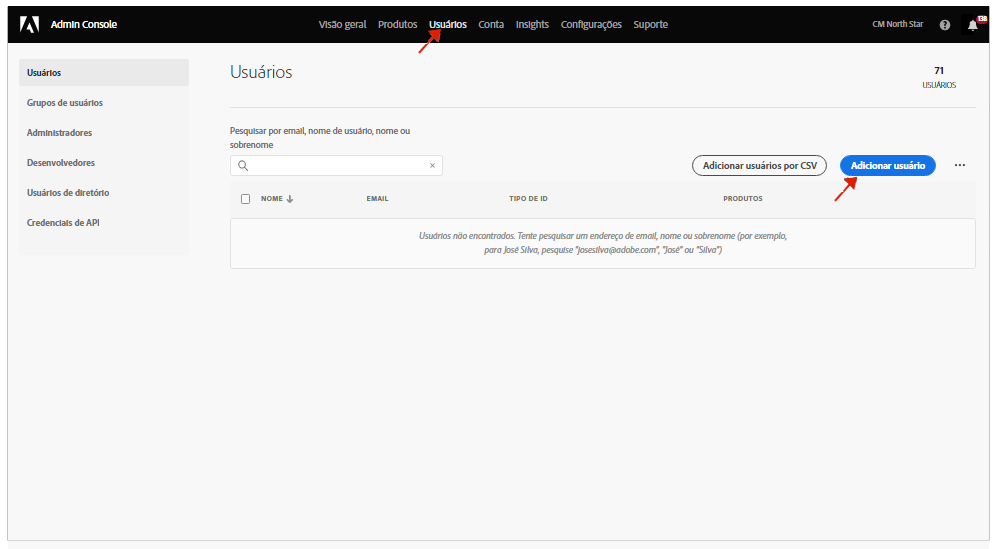

# Grupos de usuários para notificações {#user-groups}

Saiba como criar um grupo de usuários no Admin Console para gerenciar o recebimento de notificações por email importantes.

## Visão geral {#overview}

Periodicamente, a Adobe precisa entrar em contato com os usuários com relação aos ambientes do AEM as a Cloud Service. Além das notificações no produto, a Adobe também usa ocasionalmente emails para notificações. Há dois tipos de notificações por email:

* **Notificação de Incidente** - Estas notificações são enviadas durante um incidente ou quando a Adobe identificou um problema potencial de disponibilidade com seu ambiente do AEM as a Cloud Service.
* **Notificação proativa** - Estas notificações são enviadas quando um membro da equipe de suporte da Adobe deseja fornecer orientação sobre uma possível otimização ou recomendação que pode beneficiar seu ambiente do AEM as a Cloud Service.

Para que os usuários corretos recebam essas notificações, é necessário configurar e atribuir grupos de usuários e descritos neste documento.

## Pré-requisitos {#prerequisites}

Como os grupos de usuários são criados e mantidos no Admin Console, antes de criar grupos de usuários para notificações, você deve:

* Ter permissões para adicionar e editar associações de grupo.
* Ter um perfil Adobe Admin Console válido.

## Criar novos perfis de produto do Cloud Manager {#create-groups}

Para configurar corretamente o recebimento de notificações, será necessário criar dois grupos de usuários. Estas etapas só devem ser feitas uma vez.

1. Faça logon no Admin Console em [`https://adminconsole.adobe.com`.](https://adminconsole.adobe.com)

1. Na página **Visão geral**, selecione **Adobe Experience Manager as a Cloud Service** no cartão **Produtos e serviços**.

   

1. Navegue até a instância do **Cloud Manager** a partir da lista de todas as instâncias.

   

1. Você verá a lista de todos os perfis de produto pré-configurados do Cloud Manager.

   

1. Clique em **Novo perfil** e forneça as seguintes informações:

   * **Nome do perfil do produto**: `Incident Notification - Cloud Service`
   * **Nome de exibição**: `Incident Notification - Cloud Service`
   * **Descrição**: Perfil do Cloud Manager para os usuários que receberão notificações durante um incidente ou quando a Adobe identificar um possível problema de disponibilidade com seu ambiente do AEM as a Cloud Service

1. Clique em **Salvar**.

1. Clique em **Novo perfil** mais uma vez e forneça os seguintes detalhes:

   * **Nome do perfil do produto**: `Proactive Notification - Cloud Service`
   * **Nome de exibição**: `Proactive Notification - Cloud Service`
   * **Descrição**: Perfil do Cloud Manager para usuários que receberão notificações quando um membro da equipe de suporte da Adobe quiser fornecer orientação sobre uma possível otimização ou recomendação para fazer com a configuração do ambiente do AEM as a Cloud Service

1. Clique em **Salvar**.

Seus dois novos grupos de notificação são criados.

>[!NOTE]
>
>É importante que o **nome do perfil do produto** do Cloud Manager seja exatamente o mesmo fornecido. Copie e cole o nome de perfil de produto fornecido para evitar erros. Quaisquer desvios ou erros de digitação farão com que as notificações não sejam enviadas conforme desejado.
>
>Em caso de erro ou se os perfis não tiverem sido definidos, a Adobe assumirá como padrão a notificação de usuários existentes atribuídos aos perfis de **Desenvolvedor do Cloud Manager** ou **Gerenciador de implantação**.

## Atribua os usuários aos novos perfis de produto de notificação {#add-users}

Agora que os grupos foram criados, é necessário atribuir os usuários apropriados. Você pode fazer isso ao criar novos usuários ou ao atualizar usuários existentes.

### Adicionar novos usuários aos grupos {#new-user}

Siga estas etapas para adicionar usuários para os quais as IDs federadas ainda não foram configuradas.

1. Identifique o(s) usuário(s) que deve(m) receber notificações incidentes ou proativas.

1. Faça logon no Admin Console em [`https://adminconsole.adobe.com`](https://adminconsole.adobe.com) se ainda não estiver conectado.

1. Na página **Visão geral**, selecione **Adobe Experience Manager as a Cloud Service** no cartão **Produtos e serviços**.

   

1. Se a ID federareda dos membros da equipe ainda não tiver sido configurada, selecione a guia **Usuários** na navegação superior, em seguida, selecione **Adicionar usuário**. Caso contrário, pule para a seção [Adicionar usuários existentes a grupos.](#existing-users)

   

1. Na caixa de diálogo **Adicionar usuários à equipe**, digite a ID de email do usuário que deseja adicionar e selecione `Adobe ID` para o **tipo de ID**.

1. Clique no botão de mais sob o título **Selecionar produtos** para iniciar a seleção do produto.

1. Selecione **Adobe Experience Manager as a Cloud Service** e atribua um ou os dois novos grupos ao usuário.

   * **Notificação de incidente - Cloud Service**
   * **Notificação proativa - Cloud Service**

1. Clique em **Salvar** e um email de boas-vindas será enviado ao usuário adicionado.

O usuário convidado agora receberá as notificações. Repita essas etapas para os usuários de sua equipe que você gostaria que recebesse notificações.

### Adicionar usuários existentes a grupos {#existing-user}

Siga estas etapas para adicionar usuários para os quais já existem IDs federadas.

1. Identifique o(s) usuário(s) que deve(m) receber notificações incidentes ou proativas.

1. Faça logon no Admin Console em [`https://adminconsole.adobe.com`](https://adminconsole.adobe.com) se ainda não estiver conectado.

1. Na página **Visão geral**, selecione **Adobe Experience Manager as a Cloud Service** no cartão **Produtos e serviços**.

1. Selecione a guia **Usuários** na navegação superior.

1. Se a ID Federada já existir para o membro da equipe que você deseja adicionar a um grupo de notificação, localize esse usuário na lista e clique nele. Caso contrário, pule para a seção [Adicionar novos usuários a grupos.](#add-user)

1. Na seção **Produtos** da janela de detalhes do usuário, clique no botão reticências e selecione **Editar**.

1. Na janela **Editar produtos**, clique no botão de lápis abaixo do cabeçalho **Selecionar produtos** para iniciar a seleção de produtos.

1. Selecione **Adobe Experience Manager as a Cloud Service** e atribua um ou mais dos grupos novos ao usuário.

   * **Notificação de incidente - Cloud Service**
   * **Notificação proativa - Cloud Service**

1. Clique em **Salvar** e um email de boas-vindas será enviado ao usuário adicionado.

O usuário convidado agora receberá as notificações. Repita essas etapas para os usuários de sua equipe que você gostaria que recebesse notificações.
