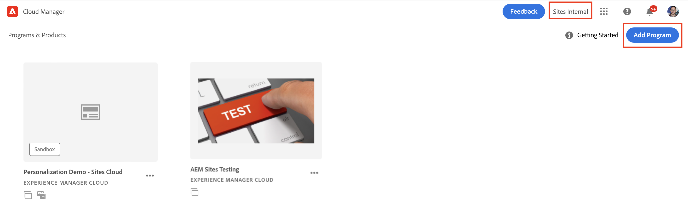
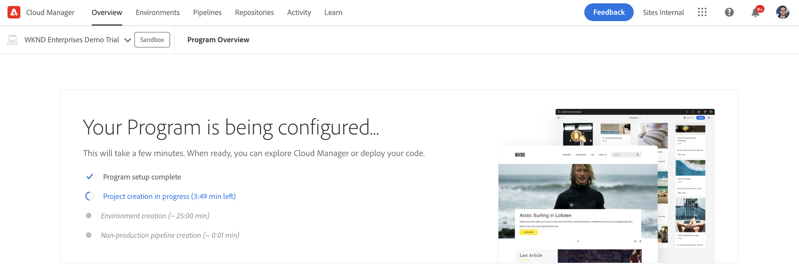
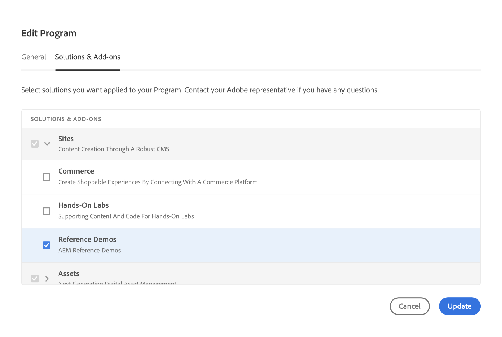

# Criar programa {#creating-a-program}

Saiba como configurar um novo programa e pipeline para implantar o complemento.

## A História Até Agora {#story-so-far}

No documento anterior da jornada de Criação AEM de Site Rápido, [Entender A Instalação Do Complemento De Demonstração De Referência,](installation.md) você aprendeu como funciona o processo de instalação do Suplemento de Demonstrações de Referência, ilustrando como as diferentes partes funcionam juntas. Agora você deve:

* Ter uma compreensão básica do Cloud Manager.
* Entenda como os pipelines entregam conteúdo e configuração ao AEM.
* Veja como os modelos podem criar novos sites pré-preenchidos com conteúdo de demonstração com apenas alguns cliques.

Este artigo se baseia nesses fundamentos e toma a primeira etapa de configuração para criar um programa para fins de teste e usa um pipeline para implantar o conteúdo complementar.

## Objetivo {#objective}

Este documento ajuda você a entender como configurar um novo programa e pipeline para implantar o complemento. Depois de ler, você deve:

* Entenda como usar o Cloud Manager para criar um novo programa.
* Saiba como ativar o Suplemento de Demonstrações de Referência para o novo programa.
* Pode executar um pipeline para implantar o conteúdo complementar.

## Criar um programa {#create-program}

Depois de fazer logon no Cloud Manager, você pode criar um novo programa de sandbox para fins de teste e demonstração.

>[!NOTE]
>
>Seu usuário deve ser membro do **Proprietário da empresa** no Cloud Manager em sua organização para criar programas.

1. Faça logon no Adobe Cloud Manager em [my.cloudmanager.adobe.com](https://my.cloudmanager.adobe.com/).

1. Depois de fazer logon, verifique se você está na organização correta, marcando-a no canto superior direito da tela. Se você for membro apenas de uma organização, essa etapa não será necessária.

   

1. Toque ou clique **Adicionar programa** na parte superior direita da janela.

1. No **Vamos criar seu programa** verifique se **Adobe Experience Manager** é selecionado em **Produtos** e toque ou clique em **Continuar**.

   

1. Na próxima caixa de diálogo:

   * Forneça uma **Nome do programa** para descrever seu programa.
   * Toque ou clique **Configurar uma sandbox** para seu **Objetivo do programa**

   Em seguida, toque ou clique em **Criar**.

   

1. Você é levado para a tela de visão geral do programa, onde pode observar o processo de criação do programa. O Cloud Manager fornece estimativas do tempo restante. Você pode sair dessa tela enquanto o programa é criado e retornar posteriormente, se necessário.

   

1. Após a conclusão, o Cloud Manager apresenta uma visão geral incluindo os ambientes e pipelines criados automaticamente.

   

1. Edite os detalhes do programa clicando no nome do programa no canto superior esquerdo da página e, na lista suspensa, selecione **Editar programa**.

   

1. No **Editar programa** , alterne para a caixa de diálogo **Soluções e complementos** guia .

   

1. No **Soluções e complementos** , expanda a **Sites** na lista e, em seguida, verifique **Demonstrações de referência**. Toque ou clique **Atualizar**.

   

1. O complemento agora é ativado como uma opção, mas seu conteúdo deve ser implantado para AEM estar disponível. De volta à página de visão geral do programa, toque ou clique em **Iniciar** para iniciar o pipeline para implantar o conteúdo complementar no AEM.

   

1. O pipeline é iniciado e você é levado a uma página detalhando o progresso da implantação. Você pode sair dessa tela enquanto o programa é criado e retornar posteriormente, se necessário.

   

Quando o pipeline estiver concluído, o complemento e seu conteúdo de demonstração estarão disponíveis para uso no ambiente de criação do AEM.

## O que vem a seguir {#what-is-next}

Agora que você concluiu esta parte da jornada AEM Reference Demo Add-On (Complemento de demonstração de referência), deve:

* Entenda como usar o Cloud Manager para criar um novo programa.
* Saiba como ativar o Suplemento de Demonstrações de Referência para o novo programa.
* Pode executar um pipeline para implantar o conteúdo complementar.

Aproveite esse conhecimento e prossiga com sua jornada de complementos de demonstração de referência AEM revisando o documento em seguida [Criar um site de demonstração,](create-site.md) onde você aprenderá a criar um site de demonstração no AEM com base em uma biblioteca de modelos pré-configurados que foram implantados pelo pipeline.

## Recursos adicionais {#additional-resources}

* [Documentação do Cloud Manager](https://experienceleague.adobe.com/docs/experience-manager-cloud-service/onboarding/onboarding-concepts/cloud-manager-introduction.html) - Se quiser obter mais detalhes sobre os recursos do Cloud Manager, consulte diretamente os documentos técnicos detalhados.
