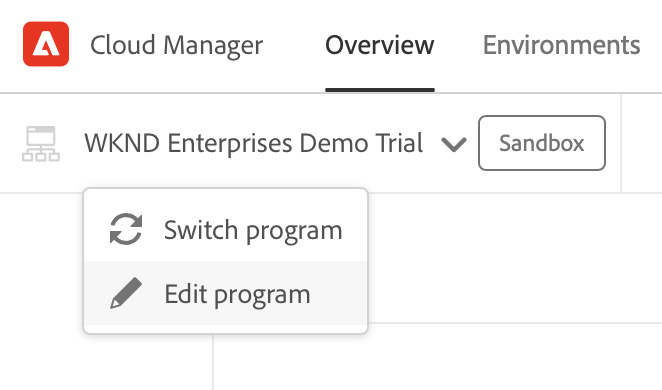

# Criar programa {#creating-a-program}

Saiba como configurar um novo programa e pipeline para implantar o complemento.

## A história até agora {#story-so-far}

No documento anterior da jornada do Complemento de demonstrações de referência do AEM, [Entender a instalação do complemento de demonstração de referência,](installation.md) você aprendeu como funciona o processo de instalação do Complemento de demonstrações de referência, ilustrando como as diferentes partes funcionam juntas. Agora você deve:

* Ter uma compreensão básica do Cloud Manager.
* Entender como os pipelines entregam conteúdo e configuração ao AEM.
* Veja como os modelos podem criar novos sites pré-preenchidos com conteúdo de demonstração com apenas alguns cliques.

Este artigo se baseia nesses fundamentos e aborda a primeira etapa de configuração para criar um programa para fins de teste e usa um pipeline para implantar o conteúdo complementar.

## Objetivo {#objective}

Este documento ajuda você a entender como configurar um novo programa e um pipeline para implantar o complemento. Depois de ler esse documento, você deverá:

* Entender como usar o Cloud Manager para criar um novo programa.
* Saber como ativar o complemento de demonstrações de referência para o novo programa.
* Poder executar um pipeline para implantar o conteúdo complementar.

## Criar um programa {#create-program}

Depois de fazer logon no Cloud Manager, você pode criar um novo programa de sandbox para fins de teste e demonstração.

>[!NOTE]
>
>Seu usuário deve ser membro do **Proprietário da empresa** no Cloud Manager em sua organização para criar programas.

1. Faça logon no Adobe Cloud Manager em [my.cloudmanager.adobe.com](https://my.cloudmanager.adobe.com/).

1. Depois de fazer logon, verifique se você está na organização correta, marcando-a no canto superior direito da tela. Se você for membro apenas de uma organização, essa etapa não será necessária.

   

1. Toque ou clique em **Adicionar programa** na parte superior direita da janela.

1. Na caixa de diálogo **Vamos criar seu programa** verifique se **Adobe Experience Manager** está selecionado em **Produtos** e toque ou clique em **Continuar**.

   

1. Na próxima caixa de diálogo:

   * Forneça um **Nome de programa** para descrever o programa.
   * Toque ou clique em **Configurar uma sandbox** para o **Objetivo do programa**

   Toque ou clique em **Criar**.

   

1. Você é levado para a tela de visão geral do programa, onde pode observar o processo de criação do programa. O Cloud Manager fornece estimativas do tempo restante. Você pode sair dessa tela enquanto o programa é criado e retornar posteriormente, se necessário.

   

1. Após a conclusão, o Cloud Manager apresenta uma visão geral incluindo os ambientes e pipelines criados automaticamente.

   

1. Edite os detalhes do programa clicando no nome do programa no canto superior esquerdo da página e, na lista suspensa, selecione **Editar programa**.

   

1. Na caixa de diálogo **Editar programa**, alterne para a guia **Soluções &amp; Complementos**.

   

1. Na guia **Soluções &amp; Complementos**, expanda a entrada **Sites** na lista e, em seguida, marque a opção **Demonstrações de referência**. Se você também quiser criar demonstrações para o AEM Screens, marque a opção **Screens** na lista também. Toque ou clique em **Atualizar**.

   

1. O complemento agora é ativado como uma opção, mas seu conteúdo deve ser implantado para o AEM estar disponível. De volta à página de visão geral do programa, toque ou clique em **Iniciar** para iniciar o pipeline para implantar o conteúdo complementar no AEM.

   

1. O pipeline é iniciado e você é direcionado a uma página detalhando o progresso da implantação. Você pode sair dessa tela enquanto o programa é criado e retornar posteriormente, se necessário.

   

Quando o pipeline estiver concluído, o complemento e seu conteúdo de demonstração estarão disponíveis para uso no ambiente de criação do AEM.

## O que vem a seguir {#what-is-next}

Agora que concluiu esta parte da jornada do complemento de demonstração de referência do AEM, você deve:

* Entender como usar o Cloud Manager para criar um novo programa.
* Saber como ativar o complemento de demonstrações de referência para o novo programa.
* Poder executar um pipeline para implantar o conteúdo complementar.

Aproveite esse conhecimento e prossiga com sua jornada de Complementos de demonstração de referência do AEM revendo o documento [Criar um site de demonstração,](create-site.md) em que você aprenderá a criar um site de demonstração no AEM com base em uma biblioteca de modelos pré-configurados que foram implantados pelo pipeline.

## Recursos adicionais {#additional-resources}

* [Documentação do Cloud Manager](https://experienceleague.adobe.com/docs/experience-manager-cloud-service/onboarding/onboarding-concepts/cloud-manager-introduction.html?lang=pt_BR) - Se quiser obter mais detalhes sobre os recursos do Cloud Manager, consulte diretamente os documentos técnicos detalhados.
