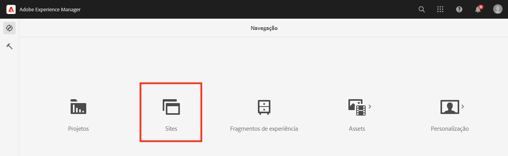
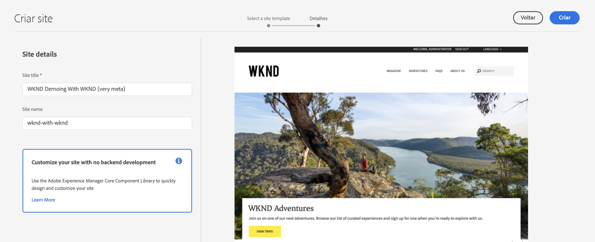
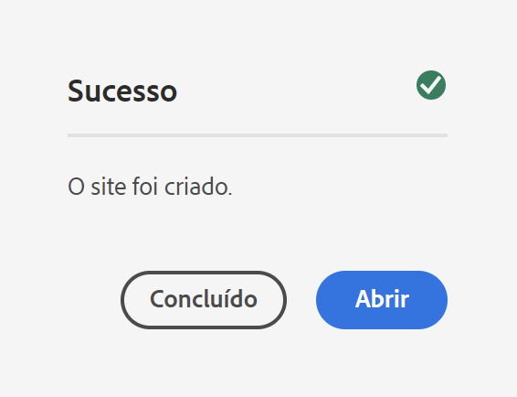
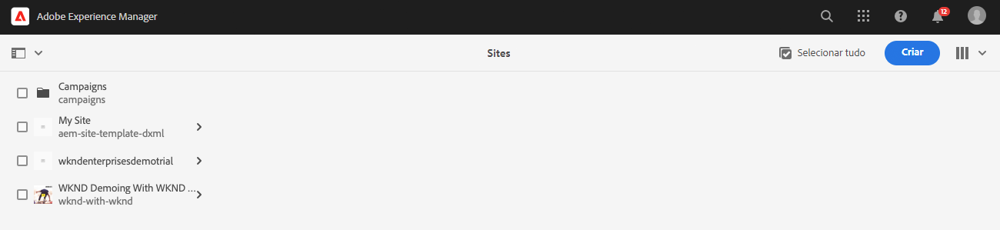
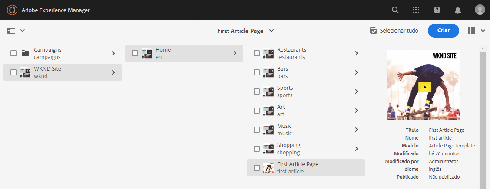
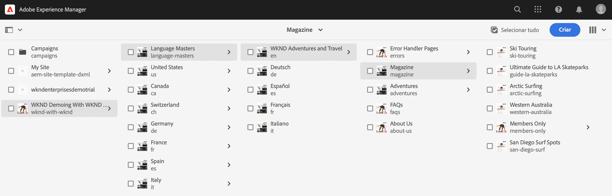
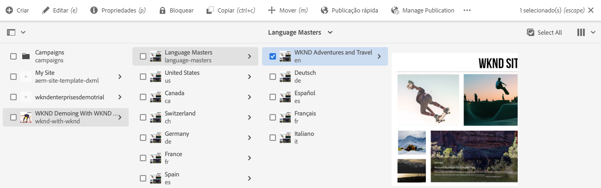

# Criar site de demonstração {#creating-a-site}

Crie um site de demonstração no AEM com base em uma biblioteca de modelos pré-configurados.

## A história até agora {#story-so-far}

No documento anterior da jornada do complemento de demonstrações de referência do AEM, [Criar programa,](create-program.md) você concluiu a primeira etapa de configuração para criar um programa para fins de teste e usou um pipeline para implantar o conteúdo complementar. Agora você deve:

* Saiba como usar o Cloud Manager para criar um programa.
* Saber como ativar o complemento de demonstrações de referência para o novo programa.
* Poder executar um pipeline para implantar o conteúdo complementar.

Este artigo descreve a próxima etapa do processo, criando um site ou projeto do AEM Screens no AEM com base nos modelos do complemento de demonstração de referência.

## Objetivo {#objective}

Este documento ajuda você a entender como criar um site com base nos modelos do complemento de demonstração de referência. Depois de ler esse documento, você deverá:

* Entender como acessar o ambiente de criação do AEM.
* Saber como criar um site com base em um modelo.
* Entender as noções básicas de navegação na estrutura do site e edição de uma página.

## Criar um site de demonstração ou um projeto do Screens {#create-site}

Depois que o pipeline tiver implantado o complemento de demonstração de referência, você poderá acessar o ambiente de criação do AEM para criar sites de demonstração com base no conteúdo complementar.

1. Na página de visão geral do programa no Cloud Manager, selecione o link para o ambiente de criação do AEM.

   

1. No menu principal do AEM, selecione **Sites**.

   

1. No console Sites, selecione **Criar** no canto superior direito da tela e selecione **Site do modelo** no menu suspenso.

   

1. O assistente de criação de sites é iniciado. Na coluna da esquerda, é possível ver os modelos de demonstração que o pipeline implantou na instância de criação. Selecione um para selecioná-lo e mostrar detalhes na coluna direita. Se quiser testar ou ver uma demonstração do AEM Screens, certifique-se de escolher a **Modelo de site da We.Cafe**. Selecione **Próximo**.

   

1. Na próxima tela, forneça um título para o site ou projeto do Screens. É possível fornecer um nome de site ou gerá-lo a partir do título, se omitido. Selecione **Criar**.

   * O título do site aparece na barra de título dos navegadores.
   * O nome do site se torna parte do URL.
   * O nome do site deve estar em conformidade com as convenções de nomenclatura de página do AEM, cujos detalhes estão disponíveis na seção [Recursos adicionais](#additional-resources).

   

1. A criação do site é confirmada com uma caixa de diálogo. Selecionar **Concluído**.

   

Você criou seu próprio site de demonstração.

## Usar o site de demonstração {#use-site}

Agora que o site de demonstração foi criado, você pode navegar e usá-lo como faria com qualquer outro site no AEM.

1. O site agora aparece no console Sites.

   

1. No canto superior direito da tela, verifique se a exibição do console está definida como **Exibição de coluna**.

   

1. Selecione o site para explorar sua estrutura e conteúdo. A exibição de coluna é expandida continuamente à medida que você navega pela árvore de conteúdo do site de demonstração.

   

1. Selecione uma página para selecioná-la e **Editar** na barra de ferramentas.

   

1. É possível editar a página como qualquer outra página de conteúdo do AEM, permitindo adicionar ou editar componentes ou ativos e testar as funcionalidades do AEM.

   

Parabéns. Agora você pode explorar o conteúdo do site de demonstração e descobrir tudo o que o AEM tem a oferecer através do conteúdo de práticas recomendadas do complemento de demonstração de referência.

Crie sites adicionais com base em outros modelos para explorar mais funcionalidades do AEM.

## O que vem a seguir {#what-is-next}

Agora que concluiu esta parte da jornada do complemento de demonstração de referência do AEM, você deve:

* Entender como acessar o ambiente de criação do AEM.
* Saber como criar um site com base em um modelo.
* Entender as noções básicas de navegação na estrutura do site e edição de uma página.

Agora, é possível testar os recursos do AEM usando conteúdo complementar. Você tem duas opções para continuar sua jornada:

* Se quiser ver uma demonstração completa e testar o conteúdo do AEM Screens, certifique-se de implantar um site com base no **Modelo de site da We.Cafe** conforme descrito anteriormente e continuar a [Ative o AEM Screens para seu site de demonstração.](screens.md)
* Se você deseja apenas ver uma demonstração do conteúdo dos sites, continue para [Gerencie Seus Sites De Demonstração,](manage.md) onde você aprende sobre as ferramentas disponíveis para ajudá-lo a gerenciar seus sites de demonstração e como removê-los.

## Recursos adicionais {#additional-resources}

* [Documentação do Cloud Manager](https://experienceleague.adobe.com/docs/experience-manager-cloud-service/onboarding/onboarding-concepts/cloud-manager-introduction.html?lang=pt_BR) - se quiser obter mais detalhes sobre os recursos do Cloud Manager, consulte diretamente os documentos técnicos detalhados.
* [Criar Site](/help/sites-cloud/administering/site-creation/create-site.md) - saiba como usar o AEM para criar um site usando modelos de site para definir o estilo e a estrutura do site.
* [Convenções de nomenclatura de página do AEM](/help/sites-cloud/authoring/fundamentals/organizing-pages.md#page-name-restrictions-and-best-practices). - Consulte esta página para entender as convenções de organização das páginas do AEM.
* [Manuseio básico do AEM](/help/sites-cloud/authoring/getting-started/basic-handling.md): consulte este documento se você for novo no AEM para entender os conceitos básicos, como navegação e organização do console.
