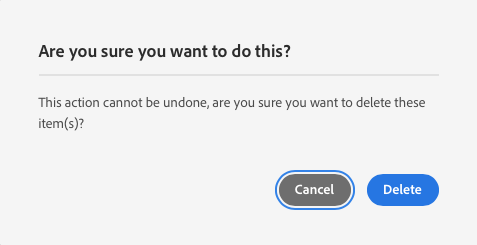

# Gerencie seus sites de demonstração {#manage-demo-sites}

Saiba mais sobre as ferramentas disponíveis para ajudá-lo a gerenciar seus sites de demonstração e como removê-los.

## A História Até Agora {#story-so-far}

No documento anterior da jornada de Criação AEM de Site Rápido, [Criar Site,](create-site.md) você criou um novo site de demonstração com base nos modelos do Reference Demo Add-On. Agora você deve:

* Entenda como acessar o ambiente de criação do AEM.
* Saiba como criar um site com base em um modelo.
* Entenda as noções básicas de navegação na estrutura do site e edição de uma página.

Agora que você tem seu próprio site de demonstração para explorar, este artigo descreve as ferramentas disponíveis para ajudá-lo a gerenciar seus sites de demonstração e como removê-los.

## Objetivo {#objective}

Este documento ajuda você a entender como gerenciar os sites de demonstração criados. Depois de ler, você deve:

* Entenda como acessar os Utilitários de demonstração de autoatendimento.
* Saiba quais utilitários estão disponíveis para você.
* Como excluir um site ou modelo de demonstração existente.

## Acesso aos utilitários de demonstração de autoatendimento {#accessing-utilities}

Agora que você tem seus próprios sites de demonstração, você provavelmente gostaria de saber como gerenciá-los. O pipeline não só implantou os modelos do site para fornecer conteúdo aos sites de demonstração, como também implantou um conjunto de utilitários para gerenciar esses sites.

1. Na barra de navegação global AEM, selecione **Ferramentas** -> **Demonstrações de referência** -> **Utilitários de demonstração de referência**.

   

1. O Reference Demo Utilities é uma coleção de funcionalidades úteis que ajudarão a configurar e monitorar seu ambiente Adobe Experience Manager. A exibição inicial é a **Painel**, que serve como uma verificação de status do ambiente e de sua funcionalidade de demonstração.

   

Os Utilitários de demonstração de autoatendimento fornecem várias ferramentas.

* **Excluir sites** - Selecione o Site que deseja excluir nesta instância do Adobe Experience Manager. Lembre-se de que essa é uma ação destrutiva e não pode ser desfeita uma vez iniciada.
* **Excluir modelos de site** - Selecione o Modelo de Site que deseja excluir nesta instância do Adobe Experience Manager. Antes de excluir um Modelo de site, verifique se todos os sites que fazem referência ao modelo também foram excluídos. Lembre-se de que essa é uma ação destrutiva e não pode ser desfeita uma vez iniciada.
* **Cache de Autor Principal** - Isso buscará vários recursos na instância do Adobe Experience Manager, acelerando seus tempos de busca. Pode levar alguns segundos.
* **Aplicativo Android** - Ferramentas para instalar e iniciar o aplicativo Android de demonstração. Crie um site com base no **Aplicativo de página única WKND** para preencher esta página. Uso de um dispositivo Android, emulador ou Bluestacks.
* **Preferências do usuário** - Desative as caixas de diálogo do pop-up tutorial.
* **Configurar GraphQL** - Configure rapidamente o ponto de extremidade GraphQL global.

## Exclusão de sites de demonstração e modelos {#deleting}

Depois de testar um conjunto de funcionalidades de AEM, talvez você não precise mais do seu site de demonstração ou mesmo do modelo no qual ele se baseia. É fácil excluir sites de demonstração e modelos de site.

1. Acesse o **Utilitários de demonstração de referência** e toque ou clique **Excluir sites**.

   

1. Os sites disponíveis são apresentados em uma lista. Verifique o site ou sites que deseja excluir e toque ou clique em **Excluir**.

   >[!CAUTION]
   >
   >A exclusão de site e modelo é uma ação destrutiva e não pode ser desfeita uma vez iniciada.

1. Confirme a exclusão do site na caixa de diálogo.

   

1. AEM exclui o site ou sites selecionados e mostra seu progresso onde a variável **Excluir** anteriormente.

   

O site agora é excluído.

É possível excluir modelos da mesma maneira no cabeçalho **Excluir modelos de site** no **Utilitários de demonstração de referência**.

>[!CAUTION]
>
>Antes de excluir um Modelo de site, verifique se todos os sites que fazem referência ao modelo também foram excluídos.

## Fim da Jornada? {#end-of-journey}

Parabéns! Você concluiu a jornada do complemento Demonstrações de referência AEM! Agora você deve:

* Ter uma compreensão básica do Cloud Manager e entender como os pipelines fornecem conteúdo e configuração ao AEM.
* Entenda como usar o Cloud Manager para criar um novo programa.
* Saiba como ativar o Suplemento de Demonstrações de Referência para o novo programa e executar um pipeline para implantar o conteúdo complementar.
* Entenda como acessar o ambiente de criação de AEM para criar um site com base em um modelo.
* Entenda como acessar os Utilitários de demonstração de autoatendimento.
* Saiba como excluir um site ou modelo de demonstração existente.

Agora você está pronto para explorar os recursos do AEM usando seus próprios sites de demonstração. No entanto, AEM é uma ferramenta poderosa e há muitas opções adicionais disponíveis. Confira alguns dos recursos adicionais disponíveis no [Seção Recursos adicionais](#additional-resources) para saber mais sobre os recursos que você viu nesta jornada.

## Recursos adicionais {#additional-resources}

* [Documentação do Cloud Manager](https://experienceleague.adobe.com/docs/experience-manager-cloud-service/onboarding/onboarding-concepts/cloud-manager-introduction.html) - Se quiser obter mais detalhes sobre os recursos do Cloud Manager, consulte diretamente os documentos técnicos detalhados.
* [Criar Site](/help/sites-cloud/administering/site-creation/create-site.md) - Saiba como usar o AEM para criar um site usando modelos de site para definir o estilo e a estrutura do site.
* [AEM convenções de nomenclatura de página.](/help/sites-cloud/authoring/fundamentals/organizing-pages.md#page-name-restrictions-and-best-practices) - Consulte esta página para entender as convenções para organizar AEM páginas.
* [Manuseio básico de AEM](/help/sites-cloud/authoring/getting-started/basic-handling.md) - Explore este documento se você é novo em AEM para entender conceitos básicos como navegação e organização do console.
* [AEM documentação técnica as a Cloud Service](https://experienceleague.adobe.com/docs/experience-manager-cloud-service.html?lang=pt-BR) - Se já tiver um conhecimento profundo da AEM, poderá consultar diretamente os documentos técnicos aprofundados.
* [Modelos de site](/help/sites-cloud/administering/site-creation/site-templates.md) - Se você quiser saber mais sobre a estrutura dos modelos de site e como eles são usados para criar sites, consulte este documento.
