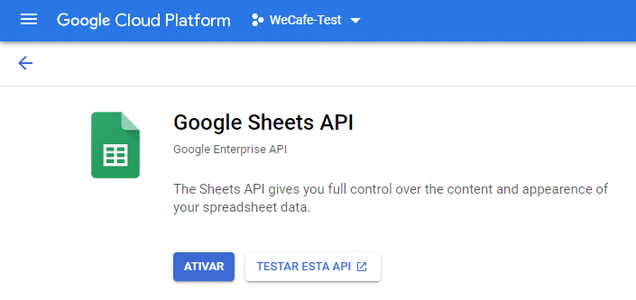

# Ativar o AEM Screens para o seu site de demonstração {#enable-screens}

Saiba mais sobre as etapas que permitem uma experiência completa do AEM Screens as a Cloud Service em seu site de demonstração.

>[!NOTE]
>
>A demonstração do AEM Screens exige que o complemento do Screens seja adicionado ao programa do Cloud Manager. Saiba mais [aqui](https://experienceleague.adobe.com/docs/experience-manager-cloud-service/content/screens-as-cloud-service/onboarding-screens-cloud/adding-screens-addon/add-on-new-program-screens-cloud.html) como adicioná-lo.

## A história até agora {#story-so-far}

No documento anterior da jornada do complemento de demonstrações de referência do AEM, [Criar site de demonstração,](create-site.md) você criou um site de demonstração com base nos modelos do complemento de demonstração de referência. Agora você deve:

* Entender como acessar o ambiente de criação do AEM.
* Saber como criar um site com base em um modelo.
* Entender as noções básicas de navegação na estrutura do site e edição de uma página.

Agora que você tem seu próprio site de demonstração para explorar e entender as ferramentas que ajudam a gerenciar seus sites de demonstração, habilite a experiência as a Cloud Service completa do AEM Screens para seus sites de demonstração.

## Objetivo {#objective}

O complemento de demonstrações de referência do AEM contém conteúdo do AEM Screens para a We.Cafe, uma empresa do setor de cafeterias. Este documento ajuda você a entender como executar a configuração de demonstração da We.Cafe no contexto do AEM Screens. Depois de ler, você deve:

* Ter noções básicas do AEM Screens.
* Entender o conteúdo de demonstração da We.Cafe.
* Saber como configurar o AEM Screens para a We.Cafe.
   * Saber como criar um projeto do Screens para a We.Cafe.
   * Ser capaz de configurar um serviço de clima simulado usando o Google Sheets e APIs.
   * Simular a alteração dinâmica do conteúdo do Screens com base no seu “serviço meteorológico”.
   * Instalar e usar o reprodutor do Screens.

## Informações sobre o Screens {#understand-screens}

O AEM Screens as a Cloud Service é uma solução de sinalização digital que permite aos profissionais de marketing criar e gerenciar experiências digitais dinâmicas em escala. Com o AEM Screens as a Cloud Service, você pode criar experiências envolventes e dinâmicas de sinalização digital, destinadas ao consumo em espaços públicos.

>[!TIP]
>
>Para obter todos os detalhes do AEM Screens as a Cloud Service, consulte a seção [Recursos adicionais](#additional-resources) no final deste documento.

Ao instalar o complemento de demonstrações de referência de AEM, você tem automaticamente o conteúdo da We.Cafe para AEM Screens disponível em seu ambiente de criação de demonstração. As etapas descritas na seção [Implantar um projeto de demonstração do Screens](#deploy-project) ajude você a ativar a experiência completa do AEM Screens, publicando esse conteúdo e implantando em reprodutores de mídia, entre outros.

## Informações sobre o conteúdo de demonstração {#demo-content}

A cafeteria We.Cafe é composta por três lojas em três locais nos EUA. Todas as três lojas têm três experiências semelhantes:

* Um menu board acima do balcão, com dois ou três painéis verticais
* Uma tela de entrada voltada para a rua com um painel horizontal ou vertical convidando os clientes para a loja
* Um quiosque de autoatendimento rápido, para evitar a fila, com um tablet vertical

>[!NOTE]
>
>Somente a exibição de entrada pode ser testada na versão atual da demonstração. Outras exibições seguirão em uma versão futura.
>
>O quiosque não está incluído na versão atual da demonstração. Ele será incluído em uma versão futura.

Pressupõe-se que a filial de Nova York esteja em uma loja menor que não tem muito espaço e, como tal:

* O menu board tem apenas dois painéis verticais em vez de três como em São Francisco e San Jose
* A exibição de entrada está posicionada verticalmente em vez de horizontalmente

>[!NOTE]
>
>Se você decidir se conectar ao Cloud Service do Screens no [Conectar o Screens as a Cloud Service](#connect-screens) crie os locais como pastas em exibições. Consulte a seção [Recursos adicionais](#additional-resources) no final deste documento para obter mais informações sobre exibições.

### Layouts da cafeteria {#care-layouts}

As filiais da We.Cafe têm os seguintes layouts.


>[!NOTE]
>
>As medidas para as telas estão em polegadas.

### Entrada {#entrance}

A exibição de entrada é segmentada pelo dia e altera a primeira imagem de manhã para a tarde. Em cada passagem da sequência, ele também anuncia uma preparação especial de café diferente, usando uma sequência incorporada medida para reproduzir um item diferente a cada vez.

A última imagem nos canais de entrada também é direcionada (ou seja, alterada dinamicamente) com base na temperatura exterior, que pode ser simulada conforme descrito na [Criar fonte de dados simulada](#data-source) seção.

## Implantar um projeto de demonstração do Screens {#deploy-project}

Para usar o conteúdo de demonstração na sandbox que você criou na [Criar programa](create-program.md) etapa, um site deve ser criado com base em um modelo.

Se você ainda não criou um site de demonstração da We.Cafe, siga as mesmas etapas descritas na seção [Criar Site de Demonstração](create-site.md). Ao selecionar o modelo, basta escolher o **Modelo do site da We.Cafe**.


Depois que o assistente for concluído, você encontrará o conteúdo implantado no Sites e poderá navegar e explorar como faria com qualquer outro conteúdo.


Agora que você tem o conteúdo de demonstração da We.Cafe, você tem uma escolha sobre como deseja testar o AEM Screens:

* Se você quiser explorar apenas o conteúdo no console do AEM Sites, basta começar a explorar e descobrir mais na seção [Recursos adicionais](#additional-resources). nenhuma outra ação é necessária.
* Se quiser experimentar todos os recursos dinâmicos do AEM Screens, continue para a próxima seção, [Alterar dinamicamente o conteúdo do Screens.](#dynamically-change)

## Alterar dinamicamente o conteúdo do Screens {#dynamically-change}

Assim como o AEM Sites, o AEM Screens pode alterar o conteúdo dinamicamente com base no contexto. A demonstração da We.Cafe tem canais configurados para mostrar conteúdos diferentes dependendo da temperatura atual. Para simular esta experiência, você deve criar seu próprio serviço de clima simples.

### Criar fonte de dados simulada {#data-source}

Como é difícil alterar o tempo durante uma demonstração ou durante os testes, as alterações de temperatura devem ser simuladas. Um serviço meteorológico é simulado armazenando um valor de temperatura em uma planilha do Google que o AEM ContextHub chama para recuperar a temperatura.

#### Criar chave da API do Google {#create-api-key}

Primeiro, você deve criar uma chave de API do Google para facilitar a troca de dados.

1. Faça logon em uma conta do Google.
1. Abra o Cloud Console usando este link `https://console.cloud.google.com`.
1. Crie um projeto clicando no nome atual do projeto na parte superior esquerda da barra de ferramentas depois da variável **Google Cloud Platform** rótulo.

   

1. Na caixa de diálogo do seletor de projeto, clique em **NOVO PROJETO**.

   

1. Dê um nome ao projeto e clique em **CRIAR**.

   

1. Verifique se o novo projeto está selecionado e, usando o menu de hambúrguer no painel do Cloud Console, selecione **APIs e serviços**.

   

1. No painel esquerdo da janela APIs e serviços, clique em **Credenciais** na parte superior da janela e, em seguida, clique em **CRIAR CREDENCIAIS** e **Chave da API**.

   

1. Na caixa de diálogo, copie a nova chave de API e salve para uso posterior. Clique em **FECHAR** para que você possa sair da caixa de diálogo.

#### Habilitar a API do Google Sheets {#enable-sheets}

Para permitir a troca de dados do Google Sheets usando sua chave de API, você deve ativar a API do Google Sheets.

1. Retorne ao Google Cloud Console em `https://console.cloud.google.com` para o seu projeto e use o menu de hambúrguer para selecionar **APIs e serviços -> Biblioteca**.

   

1. Na tela Biblioteca de API, procure **API do Google Sheets**, em seguida, clique nela.

   

1. No **API do Google Sheets** clique em **ATIVAR**.

   

#### Criar planilha do Google Sheets {#create-spreadsheet}

Agora você pode criar uma planilha do Google Sheets para armazenar seus dados meteorológicos.

1. Ir para `https://docs.google.com` e crie uma planilha do Google Sheets.
1. Defina a temperatura inserindo `32` na célula A2.
1. Compartilhe o documento clicando em **Compartilhar** na parte superior direita da janela e abaixo de **Obter link**, clique em **Alterar**.

   

1. Copie o link para a próxima etapa.

   

1. Localize a ID da planilha.

   * A ID da planilha é a sequência aleatória de caracteres no link da planilha copiada após `d/` e antes `/edit`.
   * Por exemplo:
      * Se o URL for `https://docs.google.com/spreadsheets/d/1cNM7j1B52HgMdsjf8frCQrXpnypIb8NkJ98YcxqaEP30/edit#gid=0`
      * A ID da planilha é `1cNM7j1B52HgMdsjf8frCQrXpnypIb8NkJ98YcxqaEP30`.

1. Copie a ID da planilha para uso futuro.

#### Testar seu serviço meteorológico {#test-weather-service}

Agora que você criou sua fonte de dados como uma planilha do Google Sheets e habilitou o acesso via API, teste-a para garantir que seu “serviço meteorológico” esteja acessível.

1. Abra um navegador da Web.

1. Insira a seguinte solicitação, substituindo a ID da planilha e os valores da chave da API que você salvou anteriormente.

   ```
   https://sheets.googleapis.com/v4/spreadsheets/<yourSheetID>/values/Sheet1?key=<yourAPIKey>
   ```

1. Se receber dados JSON semelhantes aos seguintes, você configurou corretamente.

   ```json
   {
     "range": "Sheet1!A1:Z1000",
     "majorDimension": "ROWS",
     "values": [
       [],
       [
         "32"
       ]
     ]
   }
   ```

O AEM Screens pode usar esse mesmo serviço para acessar os dados meteorológicos simulados configurados na próxima etapa.

### Configurar o ContextHub {#configure-contexthub}

O AEM Screens pode alterar o conteúdo dinamicamente com base no contexto. A demonstração da We.Cafe tem canais configurados para mostrar conteúdo diferente dependendo da temperatura atual usando o AEM ContextHub.

>[!TIP]
>
>Para obter os detalhes completos do ContextHub, consulte a seção [Recursos adicionais](#additional-resources) no final deste documento.

Quando o conteúdo da tela é exibido, o ContextHub chama seu serviço meteorológico para encontrar a temperatura atual e determinar qual conteúdo será exibido.

Para fins de demonstração, os valores na planilha podem ser alterados. O ContextHub reconhece esse fato e o conteúdo se ajusta no canal de acordo com a temperatura atualizada.

1. Na instância do autor do AEMaaCS, acesse **Navegação global -> Ferramentas -> Sites -> ContextHub**.
1. Selecione o contêiner de configuração que tem o mesmo nome que você deu ao projeto quando você criou o projeto do Screens a partir do **Modelo do site We.Cafe**.
1. Selecione **Configuração -> Configuração do ContextHub -> Google Sheets** e, em seguida, clique em **Próximo** no canto superior direito.
1. A configuração já deve ter dados JSON pré-configurados. Há dois valores que devem ser alterados:
   1. Substituir `[your Google Sheets id]` com a ID da planilha que [que você salvou anteriormente](#create-spreadsheet).
   1. Substituir `[your Google API Key]` com a chave de API que [que você salvou anteriormente](#create-api-key).
1. Clique em **Salvar**.

Agora você pode alterar o valor da temperatura em sua planilha do Google e o ContextHub atualiza o Screens dinamicamente à medida que &quot;vê a mudança climática&quot;.

### Testar dados dinâmicos {#test-dynamic}

Agora que o AEM Screens e o ContextHub estão conectados ao serviço meteorológico, você pode testá-los para ver como o Screens pode atualizar o conteúdo dinamicamente.

1. Acesse a instância do autor da sandbox.
1. Navegue até o console Sites por meio de **Navegação global -> Sites** e selecione a seguinte página **Telas -> &lt;nome-do-projeto> -> Canais -> Entrance Morning (Portrait)**.

   

1. Clique em **Editar** na barra de ferramentas ou digite a tecla de atalho `e` para poder editar a página.

1. No editor, é possível ver o conteúdo. Uma imagem é realçada em azul com um ícone de direcionamento no canto.

   

1. Altere a temperatura inserida na planilha de 32 para 70 e veja o conteúdo mudar.

   

Baseado na mudança de temperatura congelante de 32°F (0°C) para confortáveis 70°F (21°C), a imagem em destaque mudou de uma xícara de chá quente para um café gelado.

>[!IMPORTANT]
>
>Use a solução Google Sheets descrita apenas para fins de demonstração. A Adobe não oferece suporte ao uso do Google Sheets em ambientes de produção.

## Conectar o Screens as a Cloud Service {#connect-screens}

Se você também quiser configurar uma experiência real de sinalização digital, incluindo um reprodutor que é executado em um dispositivo de sinalização digital ou em seu computador, siga as próximas etapas.

Como alternativa, você pode visualizar a demonstração simplesmente no Editor de canais no AEMaaCS.

>[!TIP]
>
>Para obter os detalhes completos do Editor de canais, consulte a seção [Recursos adicionais](#additional-resources) no final deste documento.

### Configurar o AEM Screens as a Cloud Service {#configure-screens}

Primeiro, você deve publicar seu conteúdo de demonstração do Screens no AEM Screens as a Cloud Service e configurar o serviço.

1. Publique o conteúdo do seu projeto de demonstração do Screens.
1. Navegue até Screens as a Cloud Service em `https://experience.adobe.com/screens` e faça logon.
1. Na parte superior direita da tela, verifique se você está na organização correta.

   

1. Ao lado do canto superior esquerdo, clique no **Editar configurações** ícone, em forma de engrenagem.

   

1. Forneça os URLs das instâncias de criação e publicação do AEMaaCS onde você criou o site de demonstração e clique em **Salvar**.

   

1. Depois de conectado às instâncias de demonstração, o Screens obtém o conteúdo do canal. Clique em **Canais** no painel esquerdo para que você possa ver os canais publicados. Pode levar algum tempo para que as informações sejam preenchidas. Você pode clicar no botão azul **Sincronizar**, na parte superior direita da tela, para atualizar as informações.

   

1. Clique em **Exibições** no painel esquerdo. Você ainda não criou nenhuma para sua demonstração. Você pode simular os locais da We.Cafe criando pastas para cada um. Clique em **Criar** no canto superior direito da tela e selecione **Pasta**.

   

1. Na caixa de diálogo, forneça um nome de pasta, como **San Jose** e clique em **Criar**.

1. Abra a pasta clicando nela e, em seguida, clique em **Criar** no canto superior direito e selecione **Exibir**.

1. Forneça um nome à exibição e clique em **Criar**.

   

1. Após a criação da exibição, clique no nome da exibição para abrir a tela de detalhes da exibição. A exibição deve ser atribuída a um canal que foi sincronizado do site de demonstração. Clique em **Atribuir canal** na parte superior direita da tela.

   

1. Na caixa de diálogo, selecione o canal e clique em **Atribuir**.

   

Você pode repetir essas etapas para seus locais e exibições adicionais. Após a conclusão, você vinculou seu site de demonstração ao AEM Screens e concluiu a configuração necessária.

Você pode visualizar a demonstração no Editor de canais no AEMaaCS.

### Usar reprodutor do Screens {#screens-player}

Para exibir o conteúdo como em uma tela real, você pode baixar o reprodutor e configurá-lo localmente. O AEM Screens as a Cloud Service entrega o conteúdo ao seu reprodutor

#### Gerar um código de registro {#registration-code}

Primeiro, você deve criar um código de registro para conectar com segurança um reprodutor ao AEM Screens as a Cloud Service.

1. Navegue até Screens as a Cloud Service em `https://experience.adobe.com/screens` e faça logon.
1. Na parte superior direita da tela, verifique se você está na organização correta.

   

1. No painel esquerdo, clique em **Gerenciamento do reprodutor -> Códigos de registro** e clique em **Criar código** na parte superior direita da tela.


1. Insira um nome para o código e clique em **Criar**.

   

1. Depois que o código é criado, ele aparece na lista. Clique para copiar o código.

   

#### Instalar e configurar reprodutor {#install-player}

1. Baixe o reprodutor da sua plataforma em `https://download.macromedia.com/screens/` e instale-o.
1. Execute o reprodutor e alterne para a **Configuração** guia.
1. Role para baixo, clique em e confirme ambos **Redefinir para fábrica** e **Alterar para o modo Nuvem** opções.

   

1. O reprodutor muda automaticamente para a variável **Registro do reprodutor** guia. Insira o código gerado anteriormente e clique em **Registrar**.

   

1. Alterne para a guia **Informações do sistema** para confirmar que o reprodutor foi registrado.

   

#### Atribuir reprodutor a uma exibição {#assign-player}

1. Navegue até o Screens as a Cloud Service, em `https://experience.adobe.com/screens`, e faça logon.
1. Na parte superior direita da tela, verifique se você está na organização correta.

   

1. No painel esquerdo, clique em **Gerenciamento de reprodutores -> Reprodutores** e você verá o reprodutor instalado e registrado anteriormente.

   

1. Clique no nome do reprodutor para abrir os detalhes. Clique em **Atribuir à exibição** na parte superior direita da tela.

   

1. Na caixa de diálogo, selecione a exibição criada anteriormente e clique em **Selecionar**.

   

#### Reprodução! {#playback}

Depois de atribuir uma exibição a um reprodutor, o AEM Screens as a Cloud Service entrega o conteúdo ao seu reprodutor, onde ele fica visível.


## O que vem a seguir {#what-is-next}

Agora que concluiu esta parte da jornada do complemento de demonstração de referência do AEM, você deve:

* Ter noções básicas do AEM Screens.
* Entender o conteúdo de demonstração da We.Cafe.
* Saber como configurar o AEM Screens para a We.Cafe.

Agora você está pronto para explorar os recursos do AEM Screens usando seus próprios sites de demonstração. Prossiga para a próxima seção da jornada, [Gerenciar sites de demonstração,](manage.md) onde você aprenderá sobre as ferramentas disponíveis para ajudá-lo a gerenciar seus sites de demonstração e como removê-los.

Você também pode conferir alguns dos recursos adicionais disponíveis na [Seção recursos adicionais](#additional-resources) para saber mais sobre os recursos que viu nesta jornada.

## Recursos adicionais {#additional-resources}

* [Documentação do ContextHub](/help/sites-cloud/authoring/personalization/contexthub.md) — saiba como o ContextHub pode ser usado para personalizar o conteúdo com base no contexto do usuário, além das condições meteorológicas.
* [Uso de chaves de API — Documentação do Google](https://developers.google.com/maps/documentation/javascript/get-api-key) — uma referência útil para obter detalhes sobre o uso de chaves de API do Google.
* [Exibições](/help/screens-cloud/creating-content/creating-displays-screens-cloud.md) — saiba mais sobre o que é uma exibição no AEM Screens e o que ela pode fazer.
* [Baixar reprodutor](/help/screens-cloud/managing-players-registration/installing-screens-cloud-player.md) — saiba como acessar o reprodutor do Screens e como instalá-lo.
* [Registrar reprodutor](/help/screens-cloud/managing-players-registration/registering-players-screens-cloud.md) — saiba como configurar e registrar um reprodutor no projeto do AEM Screens.
* [Atribuir o reprodutor a uma exibição](/help/screens-cloud/managing-players-registration/assigning-player-display.md) — configure um reprodutor para exibir seu conteúdo.
