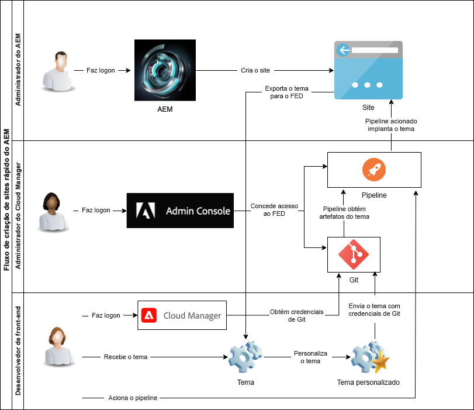

# Entenda o Cloud Manager e o fluxo de trabalho de Criação rápida de sites {#understand-cloud-manager}

{{traditional-aem}}

Saiba mais sobre o Cloud Manager e como ele se vincula ao novo processo de criação rápida de sites.

>[!TIP]
>
>Se sua função for exclusivamente de desenvolvimento front-end, você pode pular para o artigo [Recuperar informações de acesso do repositório Git](retrieve-access.md) nesta jornada.
>
>Se você for um administrador do AEM, um administrador do Cloud Manager, for responsável pelas tarefas de desenvolvimento front-end e de administrador ou se desejar apenas entender o processo completo de desenvolvimento front-end no AEM, continue lendo o documento atual e prossiga com esta jornada.

## Objetivo {#objective}

Este documento ajuda você a entender como a ferramenta de Criação rápida de sites do AEM funciona e fornece uma visão geral do fluxo de ponta a ponta. Depois de ler esse documento, você deverá:

* Entenda como o AEM Sites e o Cloud Manager trabalham juntos para facilitar o desenvolvimento de front-end
* Veja como a etapa de personalização de front-end é totalmente dissociada do AEM e não requer conhecimento sobre ele.

Este documento se concentra no entendimento dessas partes fundamentais da solução de Criação rápida de sites antes de passar para a próxima etapa da jornada, onde iniciaremos a configuração.

Embora seja recomendável prosseguir com esta jornada passo a passo, se você já compreende que o AEM Sites e o Cloud Manager trabalham juntos e deseja começar diretamente com a configuração, é possível [pular para a próxima etapa da jornada](create-site.md).

## Função de responsabilidade {#responsible-role}

Essa parte da jornada se aplica aos administradores do AEM e do Cloud Manager.

## Requisitos e pré-requisitos {#requirements-prerequisites}

Há vários requisitos antes de começar a criar e personalizar sites usando a ferramenta de Criação rápida de sites.

Como essa jornada se destina a desenvolvedores de front-end, administradores e combinações de todas as funções, os requisitos para todos eles estão listados aqui.

É importante entender que, para o desenvolvedor de front-end, não é necessário acesso ou conhecimento sobre o AEM.

### Conhecimento {#knowledge}

| Conhecimento | Função |
|---|---|
| Compreender as ferramentas e processos padrão de desenvolvimento front-end | Desenvolvedor front-end |
| Conhecimento básico sobre como criar e gerenciar sites no AEM | Administrador do AEM |
| Conhecimento básico do Cloud Manager | Administrador do Cloud Manager |

Para o desenvolvedor front-end, não é necessário conhecimento sobre o AEM.

### Ferramentas {#tools}

| Ferramenta  | Função |
|---|---|
| Ambiente de desenvolvimento front-end preferencial | Desenvolvedor front-end |
| npm | Desenvolvedor front-end |
| webpack | Desenvolvedor front-end |
| Acesso ao Cloud Manager | Administrador do Cloud Manager |
| Ocupar uma função de **Proprietário da empresa** no Cloud Manager | Administrador do Cloud Manager |
| Ser um administrador de sistema no Cloud Manager | Administrador do Cloud Manager |
| Acesso ao Admin Console | Administrador do Cloud Manager |
| Ocupar uma função de **Gerenciador de implantação** no Cloud Manager | Administrador do Cloud Manager |
| Ocupar uma função de **Gerenciador de implantação** no Cloud Manager | Desenvolvedor front-end |

Para o desenvolvedor front-end, não é necessário usar o AEM.

>[!TIP]
>
>Se não estiver familiarizado com as funções do Cloud Manager e o gerenciamento de funções, consulte o documento Permissões baseadas em funções na seção [Recursos Adicionais](#additional-resources).

## Cloud Manager {#cloud-manager}

O Cloud Manager é um componente essencial do AEM as a Cloud Service e serve como ponto de entrada único para a plataforma.

Para oferecer suporte a clientes com configurações de desenvolvimento corporativo, o AEM as a Cloud Service integra-se totalmente ao Cloud Manager e seus pipelines de CI/CD criados com propósitos específicos. A ferramenta de Criação rápida de sites estende esses recursos para oferecer suporte a pipelines dedicados de desenvolvimento front-end.

Para os fins dessa jornada, não é necessário compreender completamente o Cloud Manager. Basicamente, o Cloud Manager consiste em vários níveis de estrutura.

* **LOCATÁRIO** - cada cliente recebe um locatário.
* **PROGRAMAS** - cada locatário tem um ou mais programas, que geralmente refletem as soluções licenciadas do cliente.
* **AMBIENTES** - cada programa tem vários ambientes, um de produção para conteúdo dinâmico, um para preparo e outro para fins de desenvolvimento.
* **REPOSITÓRIO** - os ambientes têm repositórios Git, nos quais o código do aplicativo e do front-end são mantidos.
* **FERRAMENTAS E FLUXOS DE TRABALHO** - pipelines gerenciam a implantação do código dos repositórios para os ambientes.

Geralmente, um exemplo é útil na contextualização dessa hierarquia.

* A WKND Travel and Adventure Enterprises pode ser um **locatário** que se concentra em mídias relacionadas a viagens.
* O locatário da WKND Travel and Adventure Enterprises pode ter dois **programas**: um programa Sites para a WKND Magazine e um programa Assets para a WKND Media.
* Os programas da WKND Magazine e WKND Media teriam **ambientes** de desenvolvimento, preparação e produção.

## O fluxo de desenvolvimento front-end para criação rápida de sites {#flow}

Em geral, o fluxo é simples e intuitivo, mesmo que você ainda não tenha uma experiência extensa com o Cloud Manager.

1. O administrador do AEM faz logon em um ambiente do AEM e cria um novo site usando um modelo de site.
1. O administrador do Cloud Manager cria um pipeline de front-end no Cloud Manager. O pipeline orquestra a implantação do código de um repositório Git para um ambiente do AEM.
1. O administrador do AEM exporta o tema do site da instância do AEM do programa e o fornece ao desenvolvedor front-end.
1. O administrador do Cloud Manager concede ao desenvolvedor de front-end o acesso ao repositório Git do AEM, onde as personalizações podem ser confirmadas.
1. O desenvolvedor front-end recupera credenciais de acesso para acessar o Git e o pipeline.
1. O desenvolvedor front-end personaliza o tema e realiza um teste com o conteúdo real do site por meio de um proxy e, em seguida, confirma as alterações no repositório Git.
1. O desenvolvedor front-end executa o pipeline para implantar as personalizações de tema no ambiente de produção do programa.

A principal vantagem de usar a ferramenta de criação rápida de sites é que o desenvolvedor de front-end puro é responsável apenas pela personalização. O desenvolvedor front-end não tem interação com o AEM, nem precisa de conhecimento sobre ele.

{{add-cm-allowlist-frontend-pipeline}}

## O que vem a seguir {#what-is-next}

Agora que concluiu esta parte da jornada de Criação rápida de sites do AEM, você deve:

* Entenda como o AEM Sites e o Cloud Manager trabalham juntos para facilitar o desenvolvimento de front-end
* Veja como a etapa de personalização de front-end é totalmente dissociada do AEM e não requer conhecimento sobre ele.

Desenvolva esse conhecimento e prossiga com sua jornada de Criação rápida de sites do AEM, revisando a seguir o documento [Criar site a partir de modelo](create-site.md), onde você aprende a criar rapidamente um novo site do AEM usando um modelo.

## Recursos adicionais {#additional-resources}

Embora seja recomendável seguir para a próxima parte da jornada de Criação Rápida de Sites revisando o documento [Criar Site a partir de Modelo](create-site.md), os recursos opcionais a seguir fornecerão uma melhor explicação dos conceitos mencionados neste documento. Porém, eles não são obrigatórios para continuar na jornada.

* [Documentação do Cloud Manager](https://experienceleague.adobe.com/docs/experience-manager-cloud-service/onboarding/onboarding-concepts/cloud-manager-introduction.html?lang=pt_BR) - se quiser obter mais detalhes sobre os recursos do Cloud Manager, consulte diretamente os documentos técnicos detalhados.
* [Permissões baseadas em função](https://experienceleague.adobe.com/docs/experience-manager-cloud-manager/using/requirements/role-based-permissions.html?lang=pt_BR) - o Cloud Manager tem funções pré-configuradas com permissões apropriadas. Consulte este documento para obter detalhes sobre estas funções e sobre como administrá-las.
* [npm](https://www.npmjs.com) - temas do AEM usados para criar sites rapidamente se baseiam em npm.
* [webpack](https://webpack.js.org) - temas do AEM usados para criar sites rapidamente dependem do webpack.
