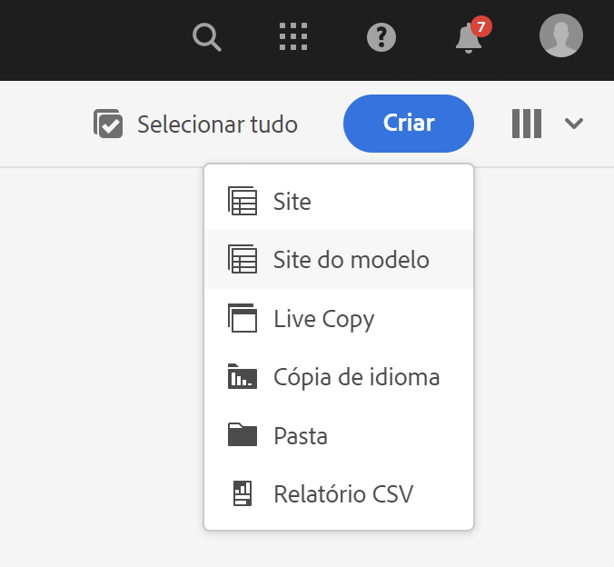
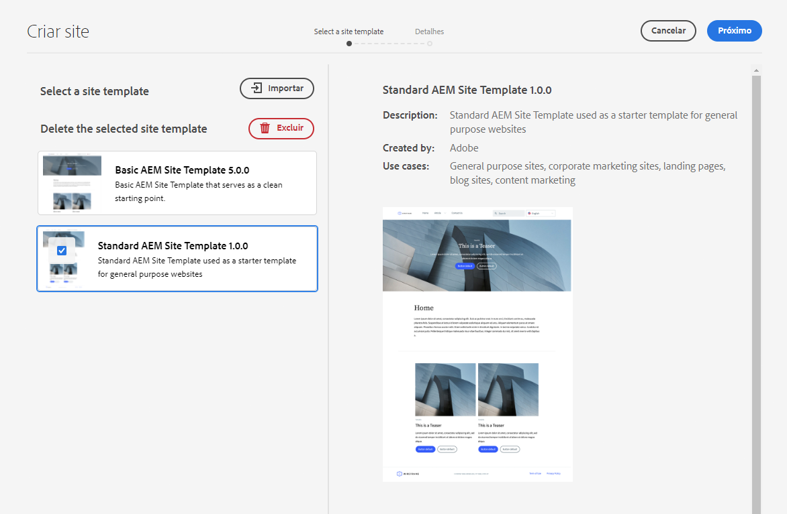
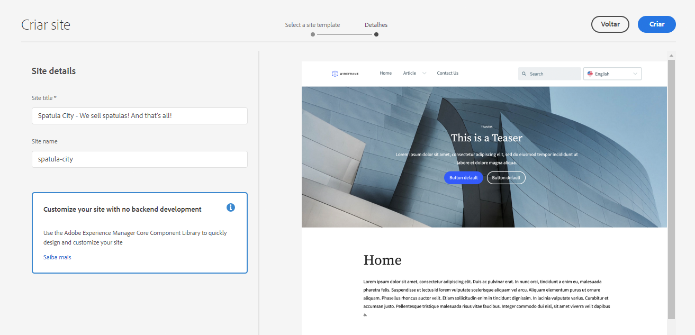
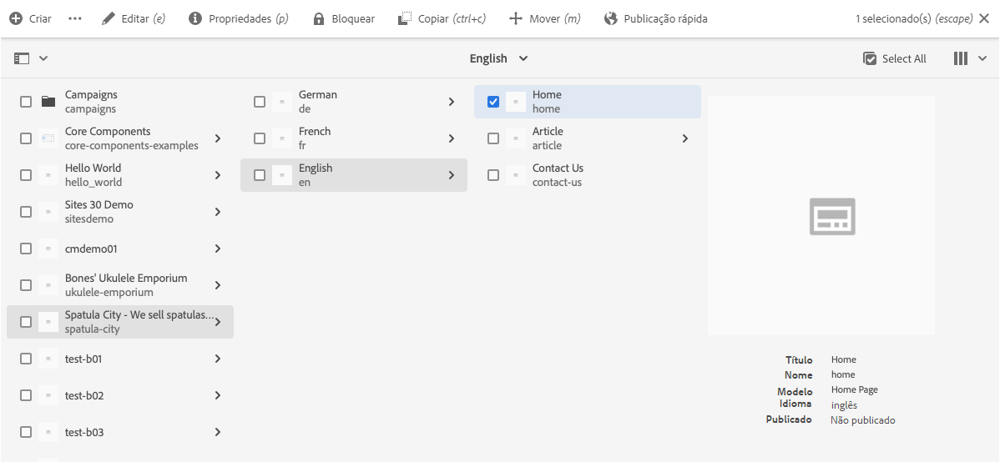
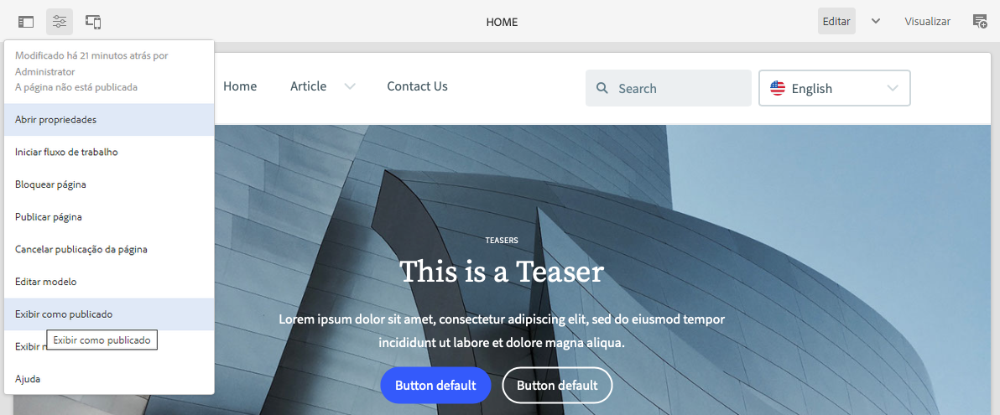
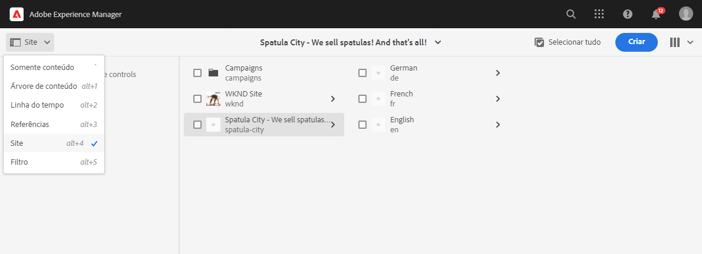
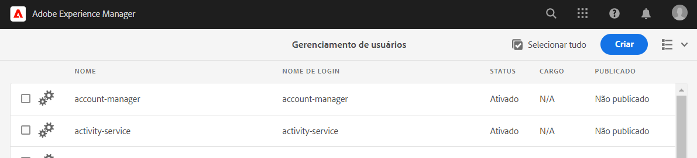
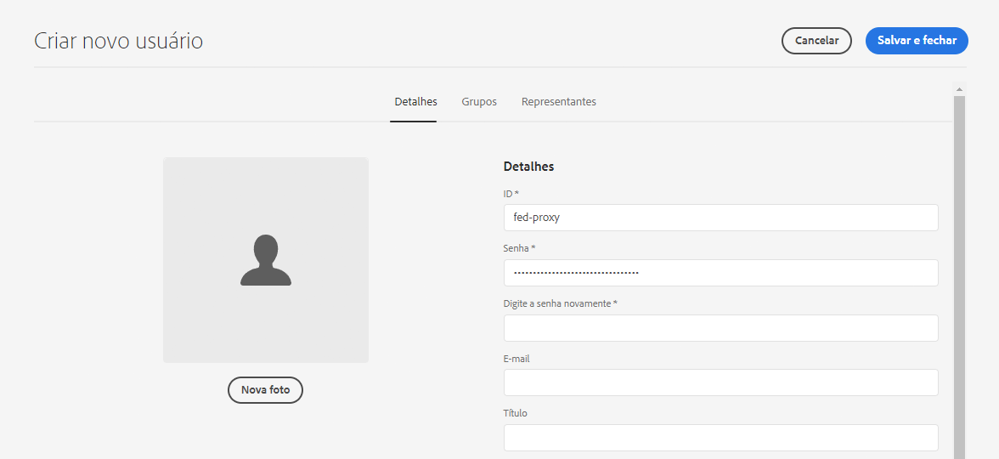
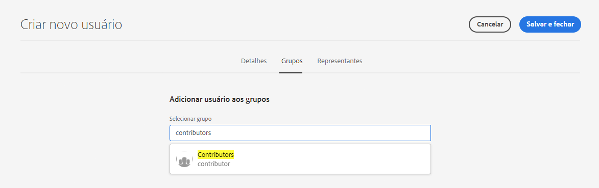

# Criar site a partir de modelo {#create-site-from-template}

{{traditional-aem}}

Saiba como criar rapidamente um site do AEM usando um modelo de site.

## A história até agora {#story-so-far}

No documento anterior da jornada de Criação rápida de sites do AEM, [Entenda o Cloud Manager e o fluxo de trabalho de Criação rápida de sites](cloud-manager.md), você aprendeu sobre o Cloud Manager e como ele se vincula ao novo processo de Criação rápida de sites e agora deve:

* Entenda como o AEM Sites e o Cloud Manager trabalham juntos para facilitar o desenvolvimento de front-end
* Veja como a etapa de personalização de front-end é totalmente dissociada do AEM e não requer conhecimento sobre ele.

Este artigo se baseia nesses fundamentos para que você possa executar a primeira etapa de configuração e criar um site para um modelo, que pode ser personalizado posteriormente usando ferramentas de front-end.

## Objetivo {#objective}

Este documento ajuda você a entender como criar rapidamente um site do AEM usando um modelo de site. Depois de ler esse documento, você deverá:

* Entenda como obter modelos de site do AEM.
* Saiba como criar um site usando um modelo.
* Veja como baixar o modelo do seu novo site para fornecer ao desenvolvedor de front-end.

## Função de responsabilidade {#responsible-role}

Essa parte da jornada se aplica ao administrador do AEM.

## Modelos de site {#site-templates}

Os modelos de site são uma maneira de combinar conteúdo básico do site em um pacote conveniente e reutilizável. Os modelos de site geralmente contêm o conteúdo básico e a estrutura do site, bem como informações de estilo para iniciar o novo site rapidamente. A estrutura real é a seguinte:

* `files`: pasta com o kit de interface, arquivo XD e possivelmente outros arquivos
* `previews`: pasta com capturas de tela do modelo de site
* `site`: pacote de conteúdo do conteúdo que é copiado para cada site criado a partir deste modelo, como modelos de página, páginas, etc.
* `theme`: fontes do tema do modelo para modificar a aparência do site, incluindo CSS, JavaScript, etc.

Os modelos são eficientes porque são reutilizáveis para que os autores de conteúdo possam criar um site rapidamente. E como é possível ter vários modelos disponíveis na instalação do AEM, você tem a flexibilidade para atender a várias necessidades do negócio.

>[!NOTE]
>
>O modelo de site não deve ser confundido com modelos de página. Os modelos de site descritos aqui definem a estrutura geral de um site. Um modelo de página define a estrutura e o conteúdo inicial de uma página individual.

## Obter um modelo de site {#obtaining-template}

A maneira mais simples de começar é [baixar a versão mais recente do Modelo de Site Padrão do AEM do repositório do GitHub](https://github.com/adobe/aem-site-template-standard/releases).

Após o download, você pode carregá-lo no ambiente do AEM como faria com qualquer outro pacote. Consulte a [seção Recursos adicionais](#additional-resources) para obter detalhes sobre como trabalhar com pacotes se precisar de mais informações sobre este tópico.

>[!TIP]
>
>O modelo de site padrão do AEM pode ser personalizado para atender às necessidades do seu projeto e evitar a necessidade de mais personalizações. No entanto, esse tópico está fora do escopo desta jornada. Consulte a documentação do GitHub sobre o modelo de site padrão para obter mais informações.

>[!TIP]
>
>Você também pode optar por criar o modelo a partir da origem como parte do fluxo de trabalho do projeto. No entanto, esse tópico está fora do escopo desta jornada. Consulte a documentação do GitHub sobre o modelo de site padrão para obter mais informações.

## Instalar um modelo de site {#installing-template}

Usar um modelo para criar um site é fácil.

1. Faça logon no ambiente de criação do AEM e navegue até o console de sites

   * `https://<your-author-environment>.adobeaemcloud.com/sites.html/content`

1. Selecione **Criar** no canto superior direito da tela e, no menu suspenso, selecione **Site do modelo**.

   

1. No assistente Criar Site, selecione **Importar** na parte superior da coluna à esquerda.

   

1. No navegador de arquivos, localize o modelo [que você baixou anteriormente](#obtaining-template) e selecione **Carregar**.

1. Depois de carregado, ele aparece na lista de modelos disponíveis. Selecione-a para selecioná-la (o que também revela informações sobre o modelo na coluna direita) e selecione **Avançar**.

   

1. Forneça um título para o site. É possível fornecer um nome de site ou gerá-lo a partir do título, se omitido.

   * O título do site aparece na barra de título dos navegadores.
   * O nome do site se torna parte do URL.

1. Selecione **Criar** e o novo site será criado a partir do modelo de site.

   

1. Na caixa de diálogo de confirmação exibida, selecione **Concluído**.

   

1. No console Sites, os novos sites estarão visíveis e poderão ser navegados para explorar sua estrutura básica, conforme definido pelo modelo.

   

Os autores de conteúdo agora podem começar a criar.

## É necessária mais personalização? {#customization-required}

Os modelos de site são muito eficientes e flexíveis, e vários podem ser criados para um projeto, permitindo variações de site de fácil criação. Dependendo do nível de personalização já executado no modelo de site utilizado, talvez você nem precise de mais personalizações do front-end.

* Se o site não requer mais personalizações, parabéns. Sua jornada termina aqui.
* Se ainda precisar personalizar mais detalhes do front-end ou se quiser apenas entender o processo completo caso precise personalizar futuramente, continue lendo.

## Página de exemplo {#example-page}

Se você precisar personalizar mais o front-end, lembre-se de que o desenvolvedor de front-end pode não estar familiarizado com os detalhes do seu conteúdo. Portanto, é uma boa ideia fornecer ao desenvolvedor um caminho para um conteúdo característico que possa ser usado como base de referência, à medida que o tema é personalizado. Um exemplo típico é a página inicial do idioma principal do site.

1. No navegador de sites, navegue até a página inicial do idioma principal do site, selecione a página para selecioná-la e, em seguida, selecione **Editar** na barra de menu.

   

1. No editor, selecione o botão **Informações da página** na barra de ferramentas e **Exibir conforme publicado**.

   

1. Na guia que é aberta, copie o caminho do conteúdo da barra de endereços. Será algo parecido com `/content/<your-site>/en/home.html?wcmmode=disabled`.

   

1. Salve o caminho para fornecer posteriormente ao desenvolvedor de front-end.

## Baixar o tema {#download-theme}

Agora que o site foi criado, o tema do site conforme gerado pelo modelo pode ser baixado e fornecido ao desenvolvedor de front-end para personalização.

1. No console de sites, exiba o painel **Site**.

   

1. Selecione a raiz do novo site e selecione **Baixar fontes de tema** no painel do site.

   

Agora você tem uma cópia dos arquivos da fonte do tema nos arquivos baixados.

## Configurar usuário proxy {#proxy-user}

Para que o desenvolvedor de front-end visualize as personalizações usando o conteúdo real do AEM do site, é necessário configurar um usuário proxy.

1. Na navegação principal do AEM, vá para **Ferramentas** > **Segurança** > **Usuários**.
1. No console de gerenciamento de usuários, selecione **Criar**.

   
1. Na janela **Criar novo usuário**, você deverá ao menos fornecer:
   * **ID** - Anote esse valor, pois ele deve ser fornecido ao desenvolvedor front-end.
   * **Senha** - Salve esse valor com segurança em um cofre de senhas, pois ele deve ser fornecido ao desenvolvedor front-end.

   

1. Na guia **Grupos**, adicione o usuário proxy ao grupo `contributors`.
   * Digitar o termo `contributors` aciona o recurso de preenchimento automático do AEM, para facilitar a seleção do grupo.

   

1. Selecione **Salvar e fechar**.

Agora você concluiu a configuração. Agora os autores de conteúdo podem começar a criar conteúdo no site; a preparação para personalização de front-end começa na próxima etapa da jornada.

## O que vem a seguir {#what-is-next}

Agora que concluiu esta parte da jornada de Criação rápida de sites do AEM, você deve:

* Entenda como obter modelos de site do AEM.
* Saiba como criar um site usando um modelo.
* Veja como baixar o modelo do seu novo site para fornecer ao desenvolvedor de front-end.

Desenvolva esse conhecimento e prossiga com sua jornada de Criação rápida de sites do AEM, revisando a seguir o documento [Configurar o pipeline](pipeline-setup.md), onde você criará um pipeline de front-end para gerenciar a personalização do tema do site.

## Recursos adicionais {#additional-resources}

Embora seja recomendável seguir para a próxima parte da jornada de Criação rápida de sites revisando o documento [Configurar o pipeline](pipeline-setup.md), os recursos opcionais a seguir fornecerão uma melhor explicação dos conceitos mencionados neste documento. Porém, eles não são obrigatórios para continuar na jornada.

* [Modelo de site padrão do AEM](https://github.com/adobe/aem-site-template-standard) - Este é o repositório GitHub do modelo de site padrão do AEM.
* [Organizando páginas](/help/sites-cloud/authoring/sites-console/organizing-pages.md) - Este guia detalha como organizar as páginas do seu site do AEM.
* [Criando Páginas](/help/sites-cloud/authoring/sites-console/creating-pages.md) - Este guia detalha como adicionar novas páginas ao site.
* [Gerenciando Páginas](/help/sites-cloud/authoring/sites-console/managing-pages.md) - Este guia detalha como gerenciar as páginas do site, incluindo movimentação, cópia e exclusão.
* [Como trabalhar com pacotes](/help/implementing/developing/tools/package-manager.md) - Os pacotes permitem a importação e exportação de conteúdo do repositório. Este documento explica como trabalhar com pacotes no AEM 6.5, o que também se aplica ao AEMaaCS.
* [Documentação de administração do site](/help/sites-cloud/administering/site-creation/create-site.md) - Consulte os documentos técnicos sobre criação de sites para obter mais detalhes sobre os recursos da ferramenta de Criação rápida de sites.
* [Criar ou adicionar formulários a uma página do AEM Sites](/help/forms/create-or-add-an-adaptive-form-to-aem-sites-page.md) - Conheça as técnicas passo a passo e as práticas recomendadas para integrar formulários no seu site, otimizando suas experiências digitais para obter o máximo impacto.
