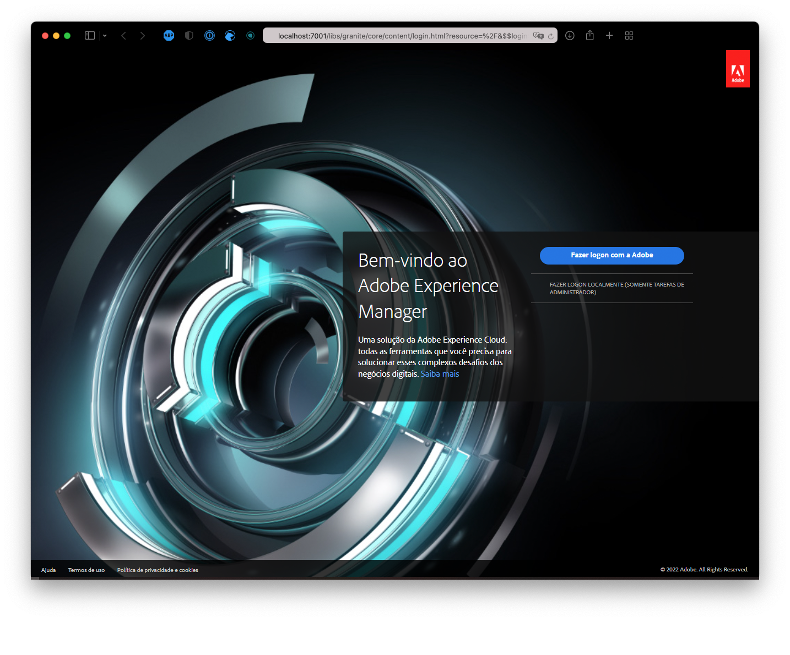

# Personalizar o tema do site {#customize-the-site-theme}

{{traditional-aem}}

Saiba como o tema do site é criado, como personalizar e como testar usando conteúdo dinâmico do AEM.

## A história até agora {#story-so-far}

No documento anterior da jornada de Criação rápida de sites do AEM, [Recuperar informações de acesso do repositório Git](retrieve-access.md), você aprendeu como o desenvolvedor de front-end usa o Cloud Manager para acessar as informações do repositório Git; agora, você deverá:

* Entender, em nível superior, o que é o Cloud Manager.
* Recuperar suas credenciais para acessar o Git do AEM e poder confirmar as personalizações.

Essa parte da jornada dá o próximo passo, se aprofunda no tema do site e mostra como personalizá-lo e, em seguida, confirmar essas personalizações usando as credenciais de acesso recuperadas.

## Objetivo {#objective}

Este documento explica como o tema de site do AEM é criado, como personalizá-lo e como testá-lo usando conteúdo dinâmico do AEM. Depois de ler esse documento, você deverá:

* Entender a estrutura básica do tema do site e como editá-la.
* Compreender como testar as personalizações de tema usando conteúdo real do AEM por meio de um proxy local.
* Saber como confirmar as alterações no repositório Git do AEM.

## Função de responsabilidade {#responsible-role}

Essa parte da jornada se aplica ao desenvolvedor de front-end.

## Entender a estrutura do tema {#understand-theme}

Extraia o tema fornecido pelo administrador do AEM para onde deseja editar o tema e abra-o no seu editor preferido.


Você pode ver que o tema é um projeto front-end típico. As partes mais importantes da estrutura são:

* `src/main.ts`: o principal ponto de entrada do seu tema JS e CSS
* `src/site`: arquivos JS e CSS que se aplicam a todo o site
* `src/components`: arquivos JS e CSS específicos para componentes do AEM
* `src/resources`: arquivos estáticos como ícones, logotipos e fontes

>[!TIP]
>
>Se quiser saber mais sobre o tema de sites padrão do AEM, consulte o link do GitHub na seção [Recursos adicionais](#additional-resources) no final deste documento.

Quando estiver confortável com a estrutura do projeto de tema, inicie o proxy local para que possa ver quaisquer personalizações de tema em tempo real com base no conteúdo real do AEM.

## Iniciar o proxy local {#starting-proxy}

1. Na linha de comando, navegue até a raiz do tema no computador local.
1. Execute `npm install` e o npm recupera dependências e instala o projeto.

   

1. Execute `npm run live` e o servidor proxy é iniciado.

   

1. Quando o servidor proxy é iniciado, ele abre automaticamente um navegador para `http://localhost:7001/`. Selecione **ENTRAR LOCALMENTE (SOMENTE TAREFAS DE ADMINISTRADOR)** e entre com as credenciais de usuário proxy fornecidas pelo administrador do AEM.

   

   >[!TIP]
   >
   >Se você não tiver essas credenciais, fale com o administrador referenciando a [seção Configurar usuário proxy do artigo Criar site a partir de um modelo](/help/journey-sites/quick-site/create-site.md#proxy-user) desta jornada.

1. Depois de fazer logon, altere o URL no navegador de modo que aponte o caminho para o conteúdo de amostra que o administrador do AEM forneceu.

   * Por exemplo, se o caminho fornecido foi `/content/<your-site>/en/home.html?wcmmode=disabled`
   * Você alteraria o URL para `http://localhost:7001/content/<your-site>/en/home.html?wcmmode=disabled`

   

Você pode navegar pelo site para explorar o conteúdo. O site é extraído dinamicamente da instância AEM ativa para que você possa fazer suas personalizações de tema comparando-as ao conteúdo real.

## Personalizar o tema {#customize-theme}

Agora você pode começar a personalizar o tema. Este é um exemplo simples para ilustrar como você pode ver suas alterações ativas por meio do proxy.

1. No editor, abra o arquivo `<your-theme-sources>/src/site/_variables.scss`

   

1. Edite a variável `$color-background` e defina-a com um valor diferente de branco. Neste exemplo, `orange` é usada.

   

1. Ao salvar o arquivo, você pode ver que o servidor proxy reconhece a alteração através da linha `[Browsersync] File event [change]`.

   

1. Ao retornar ao navegador do servidor proxy, a alteração fica visível imediatamente.

   

Você pode continuar personalizando o tema com base nos requisitos fornecidos pelo administrador do AEM.

## Confirmar as alterações {#committing-changes}

Depois que as personalizações forem concluídas, é possível confirmá-las no repositório Git do AEM. Primeiro, você deve clonar o repositório no computador local.

1. Na linha de comando, navegue até o local em que deseja clonar o repositório.
1. Execute o comando que você [recuperou anteriormente do Cloud Manager](retrieve-access.md). Deve ser semelhante a `git clone https://git.cloudmanager.adobe.com/<my-org>/<my-program>/`. Use o nome de usuário e a senha do Git que [você recuperou na parte anterior desta jornada](retrieve-access.md).

   

1. Mova o projeto de tema que você estava editando para o repositório clonado com um comando semelhante a `mv <site-theme-sources> <cloned-repo>`
1. No diretório do repositório clonado, confirme os arquivos de tema que você acabou de mover com os seguintes comandos.

   ```text
   git add .
   git commit -m "Adding theme sources"
   git push
   ```

1. As personalizações são enviadas para o repositório Git do AEM.

   

Suas personalizações agora estão armazenadas com segurança no repositório Git do AEM.

## O que vem a seguir {#what-is-next}

Agora que concluiu esta parte da jornada de Criação rápida de sites do AEM, você deve:

* Entender a estrutura básica do tema do site e como editá-la.
* Compreender como testar as personalizações de tema usando conteúdo real do AEM por meio de um proxy local.
* Saber como confirmar as alterações no repositório Git do AEM.

Desenvolva esse conhecimento e prossiga com sua jornada de Criação rápida de sites do AEM, revisando a seguir o documento [Implante seu tema personalizado](deploy-theme.md), onde você aprenderá a implantar o tema usando o pipeline de front-end.

## Recursos adicionais {#additional-resources}

Embora seja recomendável seguir para a próxima parte da jornada de Criação Rápida de Sites revisando o documento [Implante Seu Tema Personalizado](deploy-theme.md), os recursos opcionais a seguir fornecerão uma melhor explicação dos conceitos mencionados neste documento. Porém, eles não são obrigatórios para continuar na jornada.

* [Tema do site do AEM](https://github.com/adobe/aem-site-template-standard-theme-e2e) - este é o repositório GitHub do Tema do site do AEM.
* [npm](https://www.npmjs.com) - temas do AEM usados para criar sites rapidamente se baseiam em npm.
* [webpack](https://webpack.js.org) - temas do AEM usados para criar sites rapidamente dependem do webpack.
