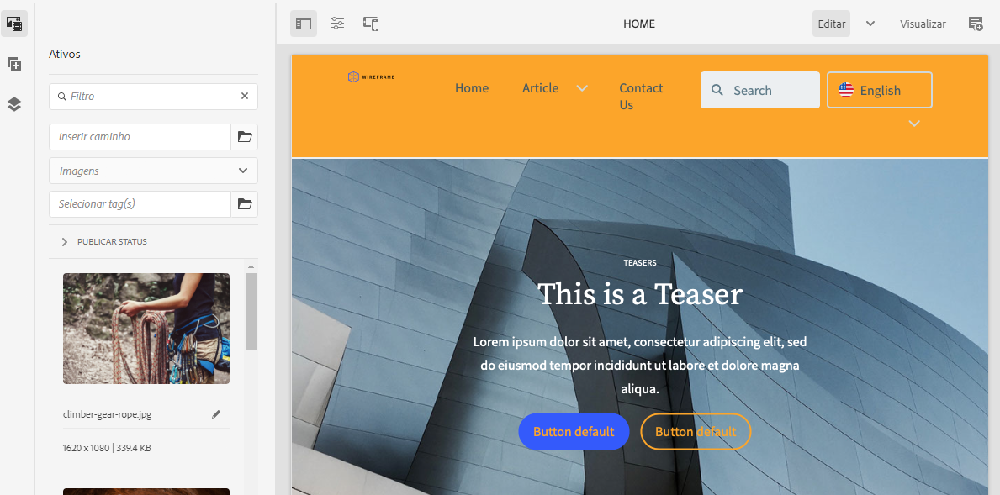

# Implantar um tema personalizado {#deploy-your-customized-theme}

{{traditional-aem}}

Saiba como implantar o tema do site usando o pipeline.

## A história até agora {#story-so-far}

No documento anterior da jornada de Criação rápida de sites do AEM, [Personalizar o tema do site](customize-theme.md), você aprendeu como o tema é criado, como personalizá-lo e como testá-lo usando conteúdo dinâmico do AEM; agora, você deve:

* Entender a estrutura básica do tema do site e como editá-la.
* Compreender como testar as personalizações de tema usando conteúdo real do AEM por meio de um proxy local.
* Saber como confirmar as alterações no repositório Git do AEM.

Agora você pode ir para a etapa final e usar o pipeline para implantá-los.

## Objetivo {#objective}

Este documento explica como implantar o tema usando o pipeline. Depois de ler esse documento, você deverá:

* Saber como acionar uma implantação de pipeline.
* Compreender como verificar o status da implantação.

## Função de responsabilidade {#responsible-role}

Essa parte da jornada se aplica ao desenvolvedor de front-end.

## Iniciar o pipeline {#start-pipeline}

Depois de confirmar as alterações de personalização de tema no repositório Git do AEM, você poderá executar [o pipeline que o administrador criou](pipeline-setup.md) para implantar as alterações.

1. Faça logon no Cloud Manager [como você fez para recuperar as informações de acesso do Git](retrieve-access.md) e acesse seu programa. Na guia **Visão geral**, você verá um cartão para **Pipelines**.

   

1. Selecione as reticências ao lado do pipeline que você precisa iniciar. No menu suspenso, selecione **Executar**.

   

1. Na caixa de diálogo de confirmação **Executar pipeline**, selecione **Sim**.

   

1. Na lista de pipelines, a coluna de status indica que o pipeline agora está em execução.

   

## Verificar status do pipeline {#pipeline-status}

É possível verificar o status do pipeline para ver os detalhes do progresso dele a qualquer momento.

1. Selecione as reticências ao lado do pipeline.

   

1. A janela de detalhes do pipeline mostra o detalhamento do progresso do pipeline.

   

>[!TIP]
>
>Na janela de detalhes do pipeline, você pode selecionar **Baixar log** para qualquer etapa do pipeline para fins de depuração, caso haja falha em alguma etapa. A depuração do pipeline está fora do escopo dessa jornada. Consulte os documentos técnicos do Cloud Manager na seção [Recursos adicionais](#additional-resources) desta página.

## Validar as personalizações implantadas {#view-customizations}

Quando o pipeline estiver concluído, você poderá informar o administrador para validar as alterações. Então, o administrador irá:

1. Abrir o ambiente de criação do AEM.
1. Navegue até [o site que o administrador criou anteriormente](create-site.md).
1. Editar uma das páginas de conteúdo.
1. Consultar as alterações aplicadas.

## Fim da jornada? {#end-of-journey}

Parabéns. Você concluiu a jornada de criação rápida de site do AEM. Agora você deve:

* Compreender como o Cloud Manager e o pipeline de front-end operam para gerenciar e implantar personalizações de front-end.
* Descobrir como criar um site do AEM com base em um modelo e como baixar o tema do site.
* Como integrar um desenvolvedor front-end para que ele possa acessar o repositório Git do AEM.
* Como personalizar e testar um tema usando conteúdo de proxy do AEM e confirmar essas alterações no Git do AEM.
* Como implantar a personalização de front-end usando o pipeline.

Agora você está pronto para personalizar os temas de seu próprio site do AEM. No entanto, antes de começar a criar fluxos de trabalho diferentes usando vários pipelines de front-end, consulte o documento [Desenvolvimento de sites com o pipeline de front-end](/help/implementing/developing/introduction/developing-with-front-end-pipelines.md). Ele pode ajudar a obter o máximo de seu desenvolvimento em front-end:

* Mantendo uma única fonte de verdade.
* Separando as preocupações.

O AEM é uma ferramenta eficiente, e há muitas opções adicionais disponíveis. Confira alguns dos recursos adicionais disponíveis na [seção Recursos adicionais](#additional-resources) para saber mais sobre os recursos que você viu nesta jornada.

## Recursos adicionais {#additional-resources}

Veja a seguir alguns recursos adicionais que explicam melhor alguns conceitos mencionados neste documento.

* [Usar o painel Site para gerenciar o tema do site](/help/sites-cloud/administering/site-creation/site-rail.md) - conheça os recursos avançados do painel Site que ajudarão você a personalizar e gerenciar facilmente o tema do seu site, incluindo o download de fontes de temas e o gerenciamento de versões de temas.
* [Documentação técnica do AEM as a Cloud Service](https://experienceleague.adobe.com/docs/experience-manager-cloud-service.html?lang=pt-BR) - se você já conhece bem o AEM, poderá consultar diretamente os documentos técnicos detalhados.
* [Documentação do Cloud Manager](https://experienceleague.adobe.com/docs/experience-manager-cloud-service/onboarding/onboarding-concepts/cloud-manager-introduction.html?lang=pt_BR) - se desejar obter mais detalhes sobre os recursos do Cloud Manager, consulte diretamente os documentos técnicos detalhados.
* [Permissões baseadas em função](https://experienceleague.adobe.com/docs/experience-manager-cloud-manager/using/requirements/role-based-permissions.html?lang=pt_BR) - o Cloud Manager tem funções pré-configuradas com permissões apropriadas. Consulte este documento para obter detalhes sobre estas funções e sobre como administrá-las.
* [Repositórios do Cloud Manager](/help/implementing/cloud-manager/managing-code/managing-repositories.md): se precisar de mais informações sobre como configurar e gerenciar repositórios Git para seu projeto do AEMaaCS, consulte este documento.
* [Configurar pipeline de CI/CD - Cloud Services](/help/implementing/cloud-manager/configuring-pipelines/introduction-ci-cd-pipelines.md): consulte este documento para saber mais detalhes sobre a configuração de pipelines, tanto de pilha completa quanto de front-end.
* [Modelo de site padrão do AEM](https://github.com/adobe/aem-site-template-standard) - este é o repositório GitHub do modelo de site padrão do AEM.
* [Tema de site do AEM](https://github.com/adobe/aem-site-template-standard-theme-e2e) - este é o repositório GitHub do tema de site do AEM.
* [npm](https://www.npmjs.com) - temas do AEM usados para criar sites rapidamente se baseiam em npm.
* [webpack](https://webpack.js.org) - temas do AEM usados para criar sites rapidamente dependem do webpack.
* [Organizando páginas](/help/sites-cloud/authoring/sites-console/organizing-pages.md) - Este guia detalha como organizar páginas do site do AEM.
* [Criando Páginas](/help/sites-cloud/authoring/sites-console/creating-pages.md) - Este guia detalha como adicionar novas páginas ao site.
* [Gerenciando Páginas](/help/sites-cloud/authoring/sites-console/managing-pages.md) - Este guia detalha como gerenciar as páginas do site, incluindo movimentação, cópia e exclusão.
* [Como trabalhar com pacotes](/help/implementing/developing/tools/package-manager.md) - Os pacotes permitem a importação e exportação de conteúdo do repositório. Este documento explica como trabalhar com pacotes no AEM 6.5, o que também se aplica ao AEMaaCS.
* [Jornada de integração](/help/journey-onboarding/overview.md) - este guia serve como ponto de partida para garantir que suas equipes estejam preparadas e tenham acesso ao AEM as a Cloud Service.
* [Documentação do Adobe Experience Manager Cloud Manager](https://experienceleague.adobe.com/docs/experience-manager-cloud-manager/using/introduction-to-cloud-manager.html?lang=pt-BR) - explore a documentação do Cloud Manager para obter detalhes completos sobre seus recursos.
* [Documentação de administração do site](/help/sites-cloud/administering/site-creation/create-site.md) - consulte os documentos técnicos sobre criação de sites para obter mais detalhes sobre os recursos da ferramenta Criação rápida de sites.
* [Desenvolvimento de sites com o pipeline de front-end](/help/implementing/developing/introduction/developing-with-front-end-pipelines.md): este documento descreve algumas considerações que devem ser levadas em conta para aproveitar todo o potencial do processo de desenvolvimento do pipeline de front-end.
