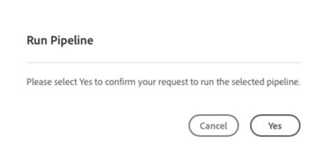
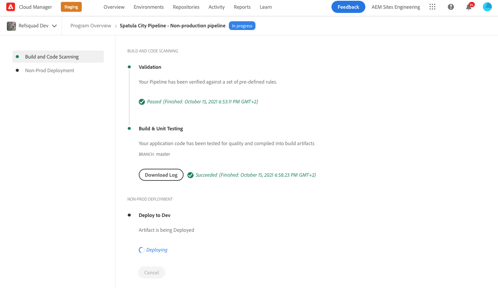

# Implantar o Tema Personalizado {#deploy-your-customized-theme}

Saiba como implantar o tema do site usando o pipeline.

## A História Até Agora {#story-so-far}

No documento anterior da jornada de Criação AEM de Site Rápido, [Personalizar o Tema do Site,](customize-theme.md) você aprendeu como o tema é criado, como personalizá-lo e como testá-lo usando conteúdo de AEM ao vivo, e agora deve:

* Entenda a estrutura básica do tema do site e como editá-lo.
* Veja como testar as personalizações de tema usando conteúdo de AEM real por proxy local.
* Saiba como confirmar as alterações no repositório Git AEM.

Agora você pode dar a etapa final e usar o pipeline para implantá-los.

## Objetivo {#objective}

Este documento explica como implantar o tema usando o pipeline. Depois de ler, você deve:

* Saiba como acionar uma implantação de pipeline.
* Consulte como verificar o status da implantação.

## Função responsável {#responsible-role}

Essa parte da jornada se aplica ao desenvolvedor de front-end.

## Inicie o pipeline {#start-pipeline}

Depois de confirmar as alterações de personalização de tema no repositório Git AEM, você poderá executar [o pipeline que o administrador criou](pipeline-setup.md) para implantar as alterações.

1. Fazer logon no Cloud Manager [como você fez para recuperar as informações de acesso do git](retrieve-access.md) E acesse seu programa. No **Visão geral** você verá um cartão para **Pipelines**.

   

1. Toque ou clique no elipse ao lado do pipeline que você precisa iniciar. No menu suspenso , selecione **Executar**.

   

1. No **Executar pipeline** caixa de diálogo de confirmação, toque ou clique **Sim**.

   

1. Na lista de pipelines, a coluna status indica que o pipeline agora está em execução.

   

## Verificar Status do Pipeline {#pipeline-status}

Você pode verificar o status do pipeline para ver os detalhes de seu progresso a qualquer momento.

1. Toque ou clique no elipse ao lado do pipeline.

   

1. A janela de detalhes do pipeline mostra o detalhamento do progresso do pipeline.

   

>[!TIP]
>
>Na janela de detalhes do pipeline, toque ou clique em **Baixar registro** para qualquer etapa do pipeline para fins de depuração, se houver falha em alguma etapa. A depuração do pipeline está além do escopo dessa jornada. Consulte os documentos técnicos do Cloud Manager na seção [Recursos adicionais](#additional-resources) desta página.

## Validar as personalizações implantadas {#view-customizations}

Quando o pipeline estiver concluído, você poderá informar o administrador para validar as alterações. O administrador irá então:

1. Abra o ambiente de criação do AEM.
1. Navegar para [o site que o administrador criou anteriormente.](create-site.md)
1. Edite uma das páginas de conteúdo.
1. Consulte as alterações aplicadas.

## Fim da Jornada? {#end-of-journey}

Parabéns! Você concluiu a jornada de Criação de Site Rápido AEM! Agora você deve:

* Entenda como o Cloud Manager e o pipeline de front-end funcionam para gerenciar e implantar personalizações de front-end.
* Saiba como criar um site de AEM com base em um modelo e como baixar o tema do site.
* Como integrar um desenvolvedor front-end para que ele possa acessar o repositório Git AEM.
* Como personalizar e testar um tema usando conteúdo AEM proxied e confirmar essas alterações em AEM git.
* Como implantar a personalização de front-end usando o pipeline.

Agora você está pronto para personalizar os temas de seu próprio site AEM. No entanto, antes de começar a criar fluxos de trabalho diferentes usando vários pipelines de front-end, revise o documento [Desenvolvimento de sites com o pipeline front-end.](/help/implementing/developing/introduction/developing-with-front-end-pipelines.md) Ele ajudará você a aproveitar ao máximo o seu desenvolvimento de front-end ao:

* Manter uma única fonte de verdade.
* Manter uma separação de preocupações.

AEM é uma ferramenta poderosa e há muitas opções adicionais disponíveis. Confira alguns dos recursos adicionais disponíveis no [Seção Recursos adicionais](#additional-resources) para saber mais sobre os recursos que você viu nesta jornada.

## Recursos adicionais {#additional-resources}

Veja a seguir alguns recursos adicionais que aprofundam alguns conceitos mencionados neste documento.

* [Usar o painel do site para gerenciar o tema do site](/help/sites-cloud/administering/site-creation/site-rail.md) - Conheça os recursos avançados do painel Site para ajudá-lo a personalizar e gerenciar facilmente o tema do site, incluindo o download de fontes de temas e o gerenciamento de versões de temas.
* [AEM documentação técnica as a Cloud Service](https://experienceleague.adobe.com/docs/experience-manager-cloud-service.html?lang=pt-BR) - Se já tiver um conhecimento profundo da AEM, poderá consultar diretamente os documentos técnicos aprofundados.
* [Documentação do Cloud Manager](https://experienceleague.adobe.com/docs/experience-manager-cloud-service/onboarding/onboarding-concepts/cloud-manager-introduction.html) - Se quiser obter mais detalhes sobre os recursos do Cloud Manager, consulte diretamente os documentos técnicos detalhados.
* [Permissões baseadas em função](https://experienceleague.adobe.com/docs/experience-manager-cloud-manager/using/requirements/role-based-permissions.html) - O Cloud Manager tem funções pré-configuradas com permissões apropriadas. Consulte este documento para obter detalhes sobre essas funções e como administrá-las.
* [Repositórios do Cloud Manager](/help/implementing/cloud-manager/managing-code/cloud-manager-repositories.md) - Se você precisar de mais informações sobre como configurar e gerenciar repositórios git para seu projeto AEMaaCS, consulte este documento.
* [Configurar pipeline de CI/CD - Cloud Services](/help/implementing/cloud-manager/configuring-pipelines/introduction-ci-cd-pipelines.md) - Saiba mais detalhes sobre a configuração de pipelines, tanto a pilha completa quanto o front-end, neste documento.
* [Modelo de Site Padrão AEM](https://github.com/adobe/aem-site-template-standard) - Este é o repositório GitHub do modelo de site padrão do AEM.
* [Tema do Site AEM](https://github.com/adobe/aem-site-template-standard-theme-e2e) - Este é o repositório GitHub do Tema do Site AEM.
* [npm](https://www.npmjs.com) - AEM temas usados para criar sites rapidamente se baseiam em npm.
* [webpack](https://webpack.js.org) - AEM temas usados para criar sites rapidamente dependem do webpack.
* [Criar e organizar páginas](/help/sites-cloud/authoring/fundamentals/organizing-pages.md) - Este guia detalha como gerenciar páginas do seu AEM Site se você quiser personalizá-lo ainda mais após criá-lo a partir do modelo.
* [Como trabalhar com o pacote](/help/implementing/developing/tools/package-manager.md) - Os pacotes permitem a importação e exportação de conteúdo do repositório. Este documento explica como trabalhar com pacotes no AEM 6.5, que também se aplica ao AEMaaCS.
* [Jornada de integração](/help/journey-onboarding/home.md) - Este guia serve como ponto de partida para garantir que suas equipes estejam configuradas e tenham acesso a AEM as a Cloud Service.
* [Documentação do Adobe Experience Manager Cloud Manager](https://experienceleague.adobe.com/docs/experience-manager-cloud-manager/using/introduction-to-cloud-manager.html?lang=pt-BR) - Explore a documentação do Cloud Manager para obter detalhes completos sobre seus recursos.
* [Documentação de administração do site](/help/sites-cloud/administering/site-creation/create-site.md) - Consulte os documentos técnicos sobre a criação do site para obter mais detalhes sobre os recursos da ferramenta de Criação rápida de sites.
* [Desenvolvimento de sites com o pipeline front-end](/help/implementing/developing/introduction/developing-with-front-end-pipelines.md) - Este documento descreve algumas considerações que devem ser levadas em conta para tirar todo o potencial do processo de desenvolvimento front-end usando o pipeline front-end.
