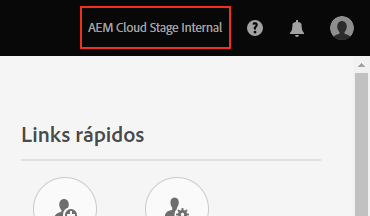

# Conceder acesso ao desenvolvedor de front-end {#grant-fed-access}

{{traditional-aem}}

Integre os desenvolvedores de front-end no Cloud Manager para que eles tenham acesso ao repositório do Git e pipeline de site do AEM.

## A história até agora {#story-so-far}

No documento anterior da jornada de Criação rápida de sites do AEM, [Configurar o pipeline](pipeline-setup.md), você aprendeu a criar um pipeline de front-end para gerenciar a personalização do tema do site; agora, você deverá:

* Entender o que é um pipeline de front-end.
* Saber como configurar um pipeline de front-end no Cloud Manager.

Agora é necessário conceder ao desenvolvedor front-end o acesso ao Cloud Manager por meio do processo de integração, para que ele possa acessar o repositório Git do AEM e o pipeline que você criou.

## Objetivo {#objective}

O processo de conceder o acesso ao Cloud Manager e atribuir funções aos usuários é chamado de integração. Este documento fornecerá uma visão geral das etapas mais importantes para a integração de um desenvolvedor front-end e, após a leitura, você saberá:

* Como adicionar um desenvolvedor front-end como usuário.
* Como conceder as funções necessárias ao desenvolvedor front-end.

>[!TIP]
>
>Caso precise de detalhes adicionais sobre o processo, há uma jornada de documentação completa dedicada à integração de sua equipe ao AEM as a Cloud Service, vinculada na [seção Recursos adicionais](#additional-resources) deste documento.

## Função de responsabilidade {#responsible-role}

Essa parte da jornada se aplica ao administrador do Cloud Manager.

## Requisitos {#requirements}

* Você precisa ser um membro com a função **Proprietário da empresa** no Cloud Manager.
* Você precisa ser um **Administrador de sistema** no Cloud Manager.
* Você precisa ter acesso ao Admin Console.

## Adicionar o desenvolvedor front-end como usuário {#add-fed-user}

Primeiro, é necessário adicionar o desenvolvedor de front-end como usuário, usando o Admin Console.

1. Faça logon no Admin Console, em [https://adminconsole.adobe.com/](https://adminconsole.adobe.com/).

1. Depois de fazer logon, você verá uma página de visão geral semelhante à imagem a seguir.

   

1. Certifique-se de estar na organização apropriada, verificando o nome da organização no canto superior direito da tela.

   

1. Selecione **Adobe Experience Manager as a Cloud Service** no cartão **Produtos e serviços**.

   

1. Você verá a lista de perfis de produto pré-configurados do Cloud Manager. Caso não veja esses perfis, entre em contato com o administrador do Cloud Manager, pois talvez você não tenha as permissões corretas em sua organização.

   

1. Para atribuir o desenvolvedor front-end aos perfis corretos, selecione a guia **Usuários** e, em seguida, o botão **Adicionar usuário**.

   

1. Na caixa de diálogo **Adicionar usuários à equipe**, digite a ID de email do usuário que deseja adicionar. Para o tipo de ID, selecione Adobe ID caso o Federated ID ainda não tenha sido configurado para os membros da equipe.

   

1. Na seleção do **Produto**, selecione o sinal de adição e o **Adobe Experience Manager as a Cloud Service** e atribua os perfis de produto **Gerente de Implantação** e **Desenvolvedor** ao usuário.

   

1. Selecione **Salvar** e um email de boas-vindas será enviado ao desenvolvedor front-end que você adicionou como usuário.

O desenvolvedor de front-end convidado pode acessar o Cloud Manager clicando no link do email de boas-vindas e fazendo logon usando sua Adobe ID.

## Transmissão para o desenvolvedor de front-end {#handover}

Com um convite de email para o Cloud Manager a caminho do desenvolvedor de front-end, você e o administrador do AEM agora podem fornecer as informações restantes necessárias ao desenvolvedor de front-end para iniciar a personalização.

* Um [caminho para o conteúdo típico](#example-page)
* A fonte do tema que [você baixou](#download-theme)
* As [credenciais de usuário do proxy](#proxy-user)
* O nome do programa ou o URL que leva a ele, [copiado do Cloud Manager](pipeline-setup.md#login)
* Requisitos de design de front-end

## O que vem a seguir {#what-is-next}

Agora que concluiu esta parte da jornada de criação rápida de site do AEM, você deve saber:

* Como adicionar um desenvolvedor front-end como usuário.
* Como conceder as funções necessárias ao desenvolvedor front-end.

Desenvolva esse conhecimento e prossiga com sua jornada de Criação rápida de sites do AEM, revisando a seguir o documento [Recuperar informações de acesso do repositório Git](retrieve-access.md), que alterna a perspectiva exclusivamente para o desenvolvedor de front-end e explica como ele usa o Cloud Manager para acessar as informações do repositório Git.

## Recursos adicionais {#additional-resources}

Embora seja recomendável seguir para a próxima parte da jornada de Criação rápida de sites revisando o documento [Recuperar credenciais do desenvolvedor de front-end](retrieve-access.md), os recursos opcionais a seguir fornecerão uma melhor explicação dos conceitos mencionados neste documento. Porém, eles não são obrigatórios para continuar na jornada.

* [Jornada de integração](/help/journey-onboarding/overview.md) - este guia serve como ponto de partida para garantir que suas equipes estejam preparadas e tenham acesso ao AEM as a Cloud Service.
