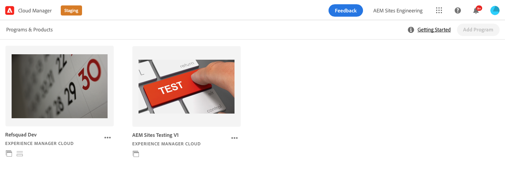
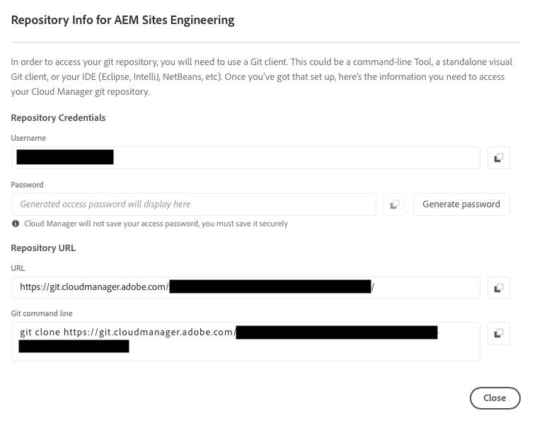

# Recuperar informações de acesso do repositório Git {#retrieve-access}

{{traditional-aem}}

Saiba como o desenvolvedor de front-end usa o Cloud Manager para acessar informações do repositório Git.

## A história até agora {#story-so-far}

Se você for um desenvolvedor de front-end responsável apenas pela personalização do tema do site, não precisará de conhecimento sobre como o AEM foi configurado e poderá pular para a seção [Objetivo](#objective) deste documento.

Se você também desempenha a função de administrador e desenvolvedor de front-end do Cloud Manager ou do AEM, aprendeu no documento anterior da jornada de Criação rápida de sites do AEM, [Conceder acesso ao desenvolvedor de front-end](grant-access.md), como integrar o desenvolvedor de front-end para que ele tenha acesso ao repositório Git, e agora você deve saber:

* Como adicionar um desenvolvedor front-end como usuário.
* Como conceder as funções necessárias ao desenvolvedor front-end.

Este artigo avança para a próxima etapa e mostra como o desenvolvedor de front-end utiliza o acesso do Cloud Manager para recuperar credenciais e acessar o repositório Git do AEM.

Agora que há um site criado com base em um modelo e um pipeline configurado, o desenvolvedor de front-end foi integrado e tem todas as informações necessárias, este artigo afasta a atenção dos administradores e se volta exclusivamente para a função de desenvolvedor de front-end.

## Objetivo {#objective}

Este documento explica como você, na função de desenvolvedor de front-end, pode acessar o Cloud Manager e recuperar credenciais de acesso ao repositório Git do AEM. Depois de ler, você:

* Entender, em nível superior, o que é o Cloud Manager.
* Recuperar suas credenciais para acessar o Git do AEM e poder confirmar as personalizações.

## Função de responsabilidade {#responsible-role}

Essa parte da jornada se aplica ao desenvolvedor de front-end.

## Requisitos {#requirements}

A ferramenta de Criação rápida de sites permite que desenvolvedores de front-end trabalhem de maneira independente sem qualquer conhecimento do AEM ou como ele está configurado. No entanto, o administrador do Cloud Manager deve integrar o desenvolvedor de front-end na equipe do projeto e o administrador do AEM deve fornecer algumas informações necessárias. Certifique-se de ter as seguintes informações antes de continuar.

* Do administrador do AEM:
   * Arquivos de tema de origem a serem personalizados
   * Caminho para uma página de exemplo a ser usada como base de referência
   * Credenciais de usuário proxy para testar suas personalizações em relação ao conteúdo ativo do AEM
   * Requisitos de concepção de front-end
* Do administrador do Cloud Manager:
   * Um email de boas-vindas do Cloud Manager que o informa sobre o acesso
   * O nome do programa ou o URL que leva a ele dentro do Cloud Manager

Se algum desses itens estiver faltando, entre em contato com o administrador do AEM ou do Cloud Manager.

Presume-se que o desenvolvedor de front-end tenha ampla experiência com fluxos de trabalho de desenvolvimento de front-end e ferramentas comuns instaladas, incluindo:

* Git
* npm
* webpack
* Um editor preferencial

## Noções básicas sobre o Cloud Manager {#understanding-cloud-manager}

O Cloud Manager permite que as organizações gerenciem por conta própria o AEM na nuvem. Inclui uma estrutura de integração contínua e entrega contínua (CI/CD) que permite que as equipes de TI e os parceiros de implementação acelerem a entrega de personalizações ou atualizações, sem comprometer o desempenho ou a segurança.

Para o desenvolvedor de front-end, é o gateway para:

* Acessar informações do repositório Git do AEM para confirmar as personalizações de front-end.
* Iniciar o pipeline de implantação para suas personalizações.

O administrador do Cloud Manager terá integrado você como um usuário do Cloud Manager. Você deve ter recebido um email de boas-vindas semelhante ao seguinte.

Se não recebeu esse email, entre em contato com o administrador do Cloud Manager.

## Acessar o Cloud Manager {#access-cloud-manager}

1. Faça logon no Adobe Experience Cloud em [my.cloudmanager.adobe.com](https://my.cloudmanager.adobe.com/) ou clique no link fornecido no email de boas-vindas.

1. O Cloud Manager lista os vários programas disponíveis. Selecione aquele que você precisa acessar, conforme fornecido pelo administrador do Cloud Manager. Se esse for seu primeiro projeto de front-end para AEMaaCS, você provavelmente terá apenas um programa disponível.

   

Você está vendo uma visão geral do seu programa. Sua página será diferente, mas semelhante a este exemplo.

## Recuperar informações de acesso do repositório  {#repo-access}

1. Na seção **Pipelines** da página do Cloud Manager, selecione o botão **Acessar informações do repositório**.

   

1. A caixa de diálogo **Informações do repositório** será aberta.

   

1. Selecione o botão **Gerar senha** para criar uma senha para você mesmo.

1. Salve a senha gerada em um gerenciador de senhas seguro. A senha nunca será exibida novamente.

1. Copie também os campos **username** e **linha de comando Git**. Você usará essas informações posteriormente para acessar o repositório.

1. Selecione **Fechar**.

## O que vem a seguir {#what-is-next}

Agora que concluiu esta parte da jornada de Criação rápida de sites do AEM, você deve:

* Entender, em nível superior, o que é o Cloud Manager.
* Recuperar suas credenciais para acessar o Git do AEM e poder confirmar as personalizações.

Desenvolva esse conhecimento e prossiga com sua jornada de Criação rápida de sites do AEM revisando a seguir o documento [Personalizar o tema do site](customize-theme.md), onde você aprenderá como o tema do site é criado, como personalizá-lo e como testá-lo usando conteúdo dinâmico do AEM.

## Recursos adicionais {#additional-resources}

Embora seja recomendável seguir para a próxima parte da jornada de Criação Rápida de Sites revisando o documento [Personalizar o Tema do Site](customize-theme.md), os recursos opcionais a seguir fornecerão uma melhor explicação dos conceitos mencionados neste documento. Porém, eles não são obrigatórios para continuar na jornada.

* [Documentação do Adobe Experience Manager Cloud Manager](https://experienceleague.adobe.com/docs/experience-manager-cloud-manager/using/introduction-to-cloud-manager.html?lang=pt-BR) - Explore a documentação do Cloud Manager para obter detalhes completos sobre os recursos.
