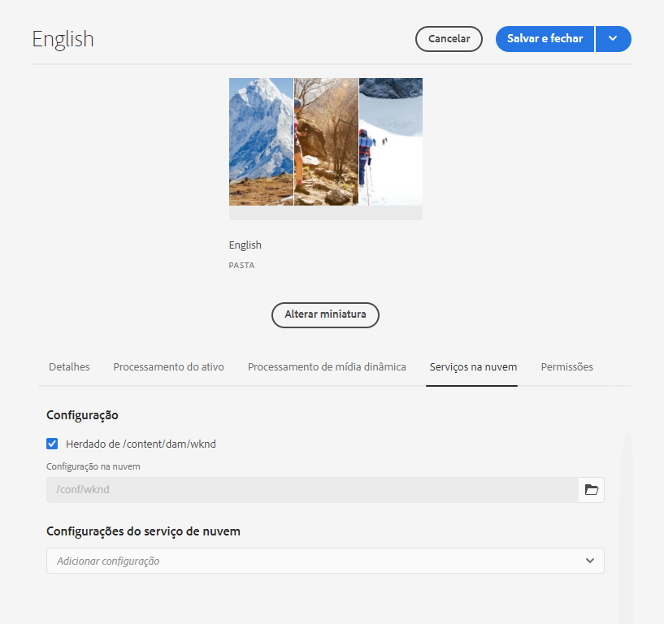

# Configurar o conector de tradução {#configure-connector}

Saiba como conectar AEM a um serviço de tradução.

## A História Até Agora {#story-so-far}

No documento anterior da jornada de tradução do AEM Sites, [Introdução à tradução do AEM Sites](learn-about.md) você aprendeu a organizar seu conteúdo e como funcionam AEM ferramentas de tradução e agora deve:

* Entenda a importância da estrutura de conteúdo para a tradução.
* Entenda como o AEM armazena conteúdo.
* Familiarize-se com AEM ferramentas de tradução.

Este artigo se baseia nesses fundamentos para que você possa realizar a primeira etapa de configuração e configurar um serviço de tradução, que será usado posteriormente na jornada para traduzir o conteúdo.

## Objetivo {#objective}

Este documento ajuda você a entender como configurar um conector de AEM para o serviço de tradução escolhido. Depois de ler, você deve:

* Entenda os parâmetros importantes da Estrutura de integração de tradução no AEM.
* Pode configurar sua própria conexão com o serviço de tradução.

## O Quadro de Integração de Tradução {#tif}

AEM TIF (Translation Integration Framework) integra-se a serviços de tradução de terceiros para orquestrar a tradução de conteúdo AEM. Envolve três etapas básicas.

1. Conecte-se ao seu provedor de serviços de tradução.
1. Crie uma configuração da Estrutura de integração de tradução.
1. Associe a configuração ao seu conteúdo.

As seções a seguir descrevem essas etapas com mais detalhes.

## Conexão com um provedor de serviços de tradução {#connect-translation-provider}

A primeira etapa é escolher qual serviço de tradução deseja usar. Há muitas opções para os serviços de tradução humana e de máquina disponíveis para AEM. A maioria dos provedores oferece um pacote de tradutor a ser instalado. Consulte a [Recursos adicionais](#additional-resources) para obter uma seleção de opções disponíveis.

>[!NOTE]
>
>O especialista em tradução geralmente é responsável por escolher qual serviço de tradução usar, mas o administrador normalmente é responsável por instalar o pacote de conector de tradução necessário.

Para os propósitos dessa jornada, usamos o Microsoft Translator, que AEM fornece uma licença de avaliação pronta para uso. Consulte a [Recursos adicionais](#additional-resources) para obter mais informações sobre esse provedor.

Se você escolher outro provedor, o administrador deverá instalar o pacote de conectores de acordo com as instruções fornecidas pelo serviço de tradução.

>[!NOTE]
>
>Usar o Microsoft Translator pronto para uso no AEM não requer configuração adicional e funciona como está sem configuração adicional do conector.
>
>Se optar por usar o conector do Microsoft Translator para fins de teste, não será necessário executar as etapas nas próximas duas seções: [Criar uma configuração de integração de tradução](#create-config) e [Associe a configuração ao seu conteúdo.](#associate) No entanto, é recomendável lê-las para que você esteja familiarizado com as etapas para quando precisar configurar o conector preferencial.
>
>A licença de avaliação do conector do Microsoft Translator não se destina a fins de produção e, se você decidir licenciá-lo, o administrador do sistema deve seguir as etapas detalhadas no [Recursos adicionais](#additional-resources) no final deste documento para configurar essa licença.

## Criar uma configuração de integração de tradução {#create-config}

Depois que o pacote de conectores do seu serviço de tradução preferido for instalado, você deverá criar uma configuração de Estrutura de Integração de Tradução para esse serviço. A configuração inclui as seguintes informações:

* Qual provedor de serviços de tradução usar
* Se a tradução humana ou de máquina deve ser realizada
* Traduzir ou não outro conteúdo associado às páginas, como tags

Para criar uma nova configuração de tradução:

1. No menu de navegação global, clique ou toque em **Ferramentas** -> **Cloud Services** -> **Cloud Services de tradução**.
1. Navegue até o local em que deseja criar a configuração na estrutura do conteúdo. Geralmente, isso se baseia em um projeto específico ou pode ser global.
   * Por exemplo, nesse caso, uma configuração pode ser feita globalmente para aplicar a todo o conteúdo ou apenas para o projeto WKND.

   

1. Clique ou toque em **Criar** na barra de ferramentas para criar a nova configuração.
1. Forneça as seguintes informações nos campos e clique ou toque em **Criar**.
   1. Selecionar **Tipo de configuração** no menu suspenso . Selecionar **Integração de tradução** na lista.
   1. Insira um **Título** para sua configuração. O **Título** identifica a configuração no **Cloud Services** , bem como nas listas suspensas de propriedade da página.
   1. Opcionalmente, digite uma **Nome** para usar no nó do repositório que armazena a configuração.

   

1. Toque ou clique **Criar** e **Editar configuração** é exibida onde você pode configurar as propriedades de configuração.

1. Como seu conteúdo é gerenciado como sites, toque ou clique no link **Sites** guia .


1. Forneça as seguintes informações.

   1. **Método de tradução** - Selecionar **Tradução Automática** ou **Tradução humana** dependendo do seu provedor de tradução. Para os propósitos dessa jornada, supomos tradução automática.
   1. **Provedores de tradução** - Selecione o conector instalado para o serviço de tradução na lista.
   1. **Categoria de conteúdo** - Selecione a categoria mais apropriada para direcionar melhor a tradução (somente para tradução automática).
   1. **Traduzir ativos da página** - Selecionar **Uso do fluxo de trabalho de tradução de sites** para traduzir os ativos associados às páginas dos sites.
   1. **Traduzir cadeias de caracteres do componente** - Marque essa opção para traduzir informações do componente.
   1. **Traduzir tags** - Verifique isso para traduzir tags associadas à página.
   1. **Executar tradução automaticamente** - Marque essa propriedade se desejar que as traduções sejam enviadas automaticamente para o serviço de tradução.

1. Toque ou clique em **Salvar e fechar**.

Agora você configurou o conector para o serviço de tradução.

## Associar a configuração ao seu conteúdo {#associate}

AEM é uma ferramenta flexível e eficiente e oferece suporte a vários serviços de tradução simultâneos por meio de vários conectores e várias configurações. A configuração dessa configuração está além do escopo dessa jornada. No entanto, essa flexibilidade significa que você deve especificar quais conectores e configurações devem ser usados para traduzir o conteúdo, associando essa configuração ao seu conteúdo.

Para fazer isso, navegue até a raiz do idioma do conteúdo. Para nosso exemplo, isso é

```text
/content/<your-project>/en
```

1. Acesse a navegação global e acesse **Navegação** -> **Ativos** -> **Arquivos**.
1. No console Assets, selecione a raiz de idioma a ser configurada e clique ou toque em **Propriedades**.
1. Toque ou clique no botão **Cloud Services** guia .
1. Em **Configurações de Cloud Service** no **Adicionar configuração** selecione o conector. Ele deve aparecer na lista suspensa quando você tiver instalado seu pacote como [descrita anteriormente.](#connect-translation-provider)
1. Em **Configurações de Cloud Service** no **Adicionar configuração** selecione também a configuração.
1. Toque ou clique em **Salvar e fechar**.



## O que vem a seguir {#what-is-next}

Agora que você concluiu esta parte da jornada de tradução do AEM Sites, deve:

* Entenda os parâmetros importantes da Estrutura de integração de tradução no AEM.
* Pode configurar sua própria conexão com o serviço de tradução.

Aproveite esse conhecimento e continue sua jornada de tradução do AEM Sites revisando o documento [Configurar regras de tradução,](translation-rules.md) onde você aprenderá a definir qual conteúdo traduzir.

## Recursos adicionais {#additional-resources}

Embora seja recomendável seguir para a próxima parte da jornada de tradução revisando o documento [Configurar regras de tradução](translation-rules.md) a seguir estão alguns recursos adicionais e opcionais que aprofundam alguns conceitos mencionados neste documento, mas não é necessário que eles continuem na jornada.

* [Configuração da estrutura de integração de tradução](/help/sites-cloud/administering/translation/integration-framework.md) - Revise uma lista de conectores de tradução selecionados e saiba como configurar a Estrutura de integração de tradução para integrar com serviços de tradução de terceiros.
* [Conexão com o Microsoft Translator](/help/sites-cloud/administering/translation/connect-ms-translator.md) - AEM fornece uma conta de tradução Microsoft de avaliação para fins de teste.
