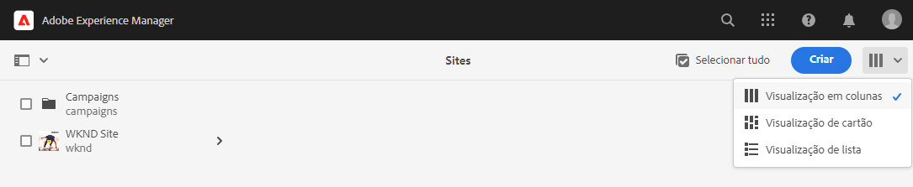
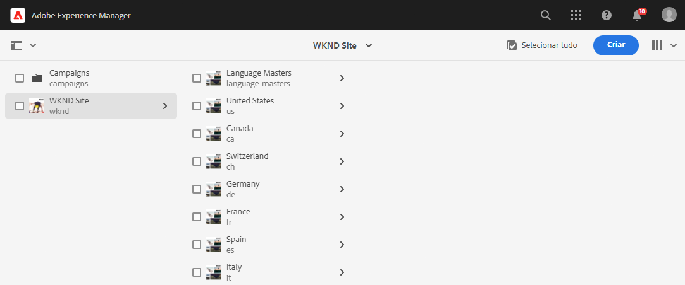
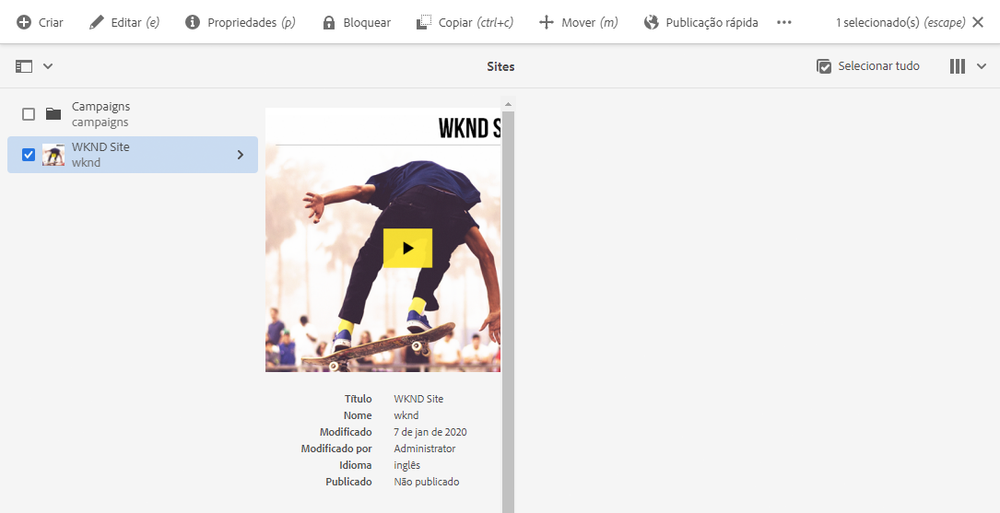
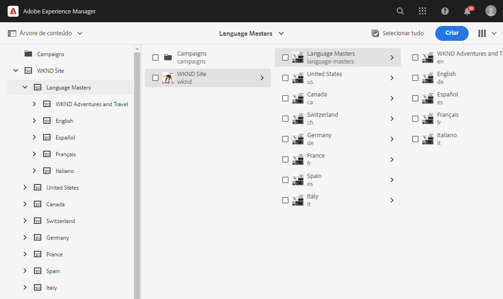
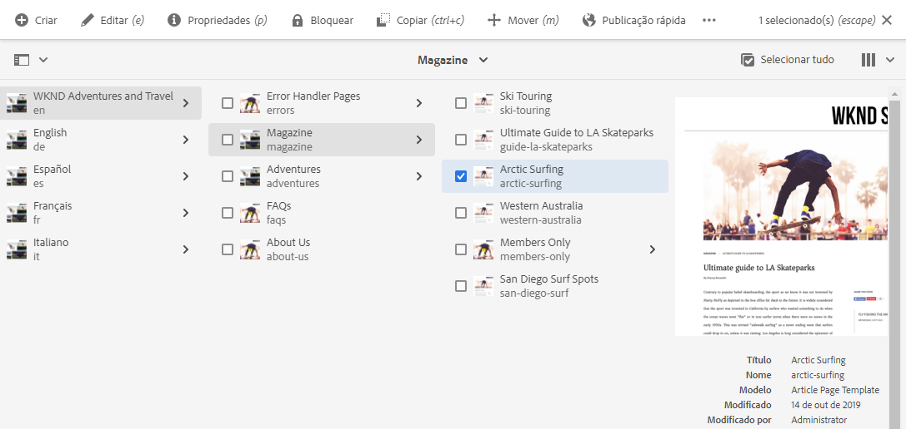
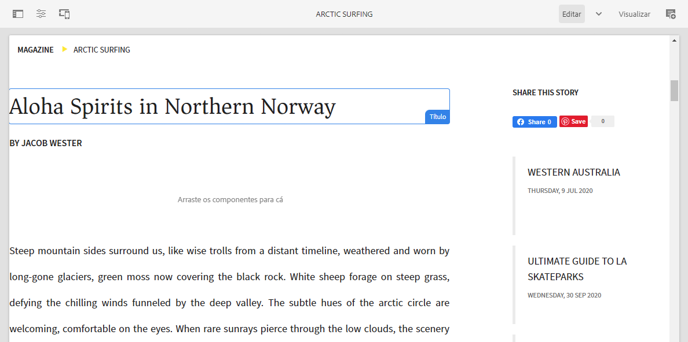

# Introdução à tradução do AEM Sites {#getting-started}

Saiba como organizar o conteúdo do AEM Sites e como funcionam as ferramentas de tradução do AEM.

## A história até agora {#story-so-far}

No documento anterior da jornada de tradução do AEM Sites, [Saiba mais sobre o conteúdo do AEM Sites e como traduzir no AEM](learn-about.md), você aprendeu a teoria básica do AEM Sites, e agora deve:

* Entender os conceitos básicos da criação de conteúdo do AEM Sites.
* Estar familiarizado com o suporte à tradução do AEM.

Este artigo se baseia nesses fundamentos para que você entenda como o AEM armazena e gerencia conteúdo e como você pode usar as ferramentas de tradução do AEM para traduzir esse conteúdo.

## Objetivo {#objective}

Este documento ajuda você a entender como começar a traduzir conteúdo de sites no AEM. Depois de ler esse documento, você deverá:

* Compreender a importância da estrutura de conteúdo para a tradução.
* Compreender como o AEM armazena conteúdo.
* Se familiarizar com as ferramentas de tradução do AEM.

## Requisitos e pré-requisitos {#requirements-prerequisites}

Há vários requisitos antes de começar a traduzir o conteúdo do AEM.

### Conhecimento {#knowledge}

* Experiência em tradução de conteúdo em um CMS
* Experiência no uso de recursos básicos de um CMS em larga escala
* Possuir um conhecimento prático no manuseio básico do AEM
* Noções básicas do serviço de tradução que você está usando
* Ter uma compreensão básica do conteúdo que você está traduzindo

>[!TIP]
>
>Se você não estiver familiarizado com o uso de um CMS em larga escala como o AEM, considere revisar a documentação de [Manuseio básico](/help/sites-cloud/authoring/getting-started/basic-handling.md) antes de continuar. A documentação de Manuseio básico não faz parte da jornada. Assim, retorne a esta página quando terminar.

### Ferramentas {#tools}

* Acesso à sandbox para testes de tradução do conteúdo
* Credenciais para se conectar ao serviço de tradução de sua preferência
* Ser membro do grupo `project-administrators` no AEM

## Como o AEM armazena conteúdo {#content-in-aem}

Para o especialista em tradução, não é importante entender em detalhes como o AEM gerencia o conteúdo. No entanto, estar familiarizado com os conceitos básicos e a terminologia é útil quando você usar as ferramentas de tradução do AEM posteriormente. Mais importante ainda, você precisa entender seu próprio conteúdo e como ele está estruturado para traduzi-lo com eficácia.

### Console do Sites {#sites-console}

O console do Sites oferece uma visão geral da estrutura do seu conteúdo, facilitando a navegação e o gerenciamento do conteúdo por meio da criação de novas páginas, da movimentação e cópia de páginas e da publicação de conteúdo.

Para acessar o console Sites:

1. No menu de navegação global, clique ou toque em **Navegação** -> **Sites**.
1. O console Sites é aberto no nível superior do seu conteúdo.
1. Certifique-se de que a **Exibição de coluna** esteja selecionada, usando o seletor de exibições na parte superior direita da janela.

   

1. Ao tocar ou clicar em um item em uma coluna, ele mostra o conteúdo abaixo na hierarquia na coluna à direita.

   

1. Ao tocar ou clicar na caixa de seleção de um item em uma coluna, esse item será selecionado e mostrará os seus detalhes na coluna à direita, revelando várias ações disponíveis para o item selecionado na barra de ferramentas acima.

   

1. Ao tocar ou clicar no seletor do painel na parte superior esquerda, também é possível mostrar a exibição de **Árvore de conteúdo** para obter uma visão geral em árvore do seu conteúdo.

   

Com essas ferramentas simples, você pode navegar intuitivamente pela sua estrutura de conteúdo.

>[!NOTE]
>
>O arquiteto de conteúdo normalmente define a estrutura do conteúdo, enquanto os autores de conteúdo criam o conteúdo dentro dessa estrutura.
>
>Como especialista em tradução, é importante entender como navegar por essa estrutura e compreender onde o conteúdo está localizado.

### Editor de página {#page-editor}

O console Sites permite navegar pelo conteúdo e fornece uma visão geral de sua estrutura. Para ver os detalhes de uma página individual, é necessário usar o editor de sites.

Para editar uma página:

1. Use o console Sites para localizar e selecionar uma página. Lembre-se de que é necessário tocar ou clicar na caixa de seleção de uma página individual para selecioná-la.

   

1. Toque na opção **Editar** na barra de ferramentas.
1. O editor de sites é aberto com a página selecionada carregada para edição em uma nova guia do navegador.
1. Passar o mouse sobre o conteúdo ou tocar nele revela seletores de componentes individuais. Os componentes são os blocos de arrastar e soltar que formam a página.

   

É possível retornar ao console do Sites a qualquer momento, alternando de volta para essa guia no navegador. Usando o editor de sites, é possível visualizar rapidamente o conteúdo da página da maneira que os autores de conteúdo e seu público-alvo a verão.

>[!NOTE]
>
>Os autores de conteúdo criam o conteúdo do site usando o editor de sites.
>
>Como especialista em tradução, é importante simplesmente entender como visualizar os detalhes desse conteúdo usando o editor de sites.

## Estrutura é fundamental {#content-structure}

O conteúdo do AEM é orientado por sua estrutura. O AEM impõe poucos requisitos à estrutura de conteúdo, mas uma consideração cuidadosa da hierarquia de conteúdo como parte do planejamento do projeto pode tornar a tradução muito mais simples.

>[!TIP]
>
>Planeje a tradução bem no início do projeto do AEM. Trabalhe em conjunto com o gerente do projeto e os arquitetos de conteúdo antecipadamente.
>
>Pode ser necessário um gerente de projetos de internacionalização como uma pessoa separada, cuja responsabilidade é definir qual conteúdo deve ser traduzido e qual não, além de qual conteúdo traduzido poderá ser modificado pelos produtores de conteúdo regionais ou locais.

## Estrutura de conteúdo recomendada {#recommended-structure}

Conforme recomendado anteriormente, trabalhe com seu arquiteto de conteúdo para determinar a estrutura de conteúdo apropriada para seu próprio projeto. No entanto, a seguinte estrutura é comprovada, simples e intuitiva, além de ser bastante eficaz.

Defina uma pasta base para o seu projeto em `/content`.

```text
/content/<your-project>
```

O idioma em que o conteúdo é criado é chamado de raiz de idioma. No nosso exemplo, é o inglês e deve estar dentro deste caminho.

```text
/content/<your-project>/en
```

Todo o conteúdo do projeto que pode precisar ser localizado deve ser colocado na raiz de idioma.

```text
/content/<your-project>/en/<your-project-content>
```

As traduções devem ser criadas como pastas irmãs ao lado da raiz de idioma, com o nome da pasta representando o código ISO-2 do idioma. Por exemplo, o alemão teria o seguinte caminho.

```text
/content/<your-project>/de
```

>[!NOTE]
>
>O arquiteto de conteúdo geralmente é responsável pela criação dessas pastas de idioma. Se não forem criadas, o AEM não será capaz de criar trabalhos de tradução posteriormente.

A estrutura final pode ficar parecida com a seguinte.

```text
/content
    |- your-project
        |- en
            |- some
            |- exciting
            |- sites
            |- content
        |- de
        |- fr
        |- it
        |- ...
    |- another-project
    |- ...
```

Você deve tomar nota do caminho específico do seu conteúdo, pois ele será necessário posteriormente para configurar sua tradução.

>[!NOTE]
>
>Geralmente, é responsabilidade do arquiteto de conteúdo definir a estrutura de conteúdo, geralmente em colaboração com o especialista em tradução.
>
>Ela é detalhada aqui para oferecer completude.

## Ferramentas de tradução do AEM {#translation-tools}

Agora que você entende o console e o editor de sites, além da importância da estrutura de conteúdo, podemos ver como traduzir o conteúdo. As ferramentas de tradução do AEM são bastante poderosas, mas são simples de entender em nível superior.

* **Conector de tradução** - O conector é o vínculo entre o AEM e o serviço de tradução usado.
* **Regras de tradução** - As regras definem qual conteúdo localizado em caminhos específicos deve ser traduzido.
* **Projetos de tradução** - Os projetos de tradução reúnem conteúdo que deve ser tratado como um único esforço de tradução e acompanha o progresso da tradução, interagindo com o conector para transmitir o conteúdo a ser traduzido e recebê-lo de volta do serviço de tradução.

Geralmente, você só configura o conector para a instância e as regras uma vez por projeto. Então, você usa projetos de tradução para traduzir seu conteúdo e manter suas traduções atualizadas continuamente.

## O que vem a seguir {#what-is-next}

Agora que concluiu esta parte da jornada de tradução do AEM Sites, você deve:

* Compreender a importância da estrutura de conteúdo para a tradução.
* Compreender como o AEM armazena conteúdo.
* Se familiarizar com as ferramentas de tradução do AEM.

Desenvolva esse conhecimento e continue sua jornada de tradução do AEM Sites revisando o documento [Configurar o conector de tradução](configure-connector.md), onde você aprenderá como conectar o AEM a um serviço de tradução.|

## Recursos adicionais {#additional-resources}

Embora seja recomendável seguir para a próxima parte da jornada de tradução revisando o documento [Configurar o conector de tradução](configure-connector.md), a seguir estão alguns recursos adicionais e opcionais que aprofundam alguns conceitos mencionados neste documento, mas não são necessários para continuar na jornada.

* [Manuseio básico do AEM](/help/sites-cloud/authoring/getting-started/basic-handling.md) - Conheça as noções básicas da interface de usuário do AEM para navegar e executar tarefas essenciais confortavelmente, como encontrar seu conteúdo.
* [Identificação do conteúdo a ser traduzido](/help/sites-cloud/administering/translation/rules.md) - Saiba como as regras de tradução identificam o conteúdo que precisa ser traduzido.
* [Configuração da estrutura de integração de tradução](/help/sites-cloud/administering/translation/integration-framework.md) - Saiba como configurar a Estrutura de integração de tradução para integrar-se a serviços de tradução de terceiros.
* [Gerenciamento de projetos de tradução](/help/sites-cloud/administering/translation/managing-projects.md) - Saiba como criar e gerenciar projetos de tradução automática e humana no AEM.
