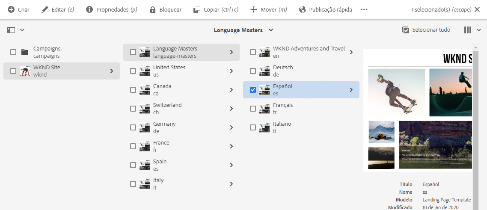
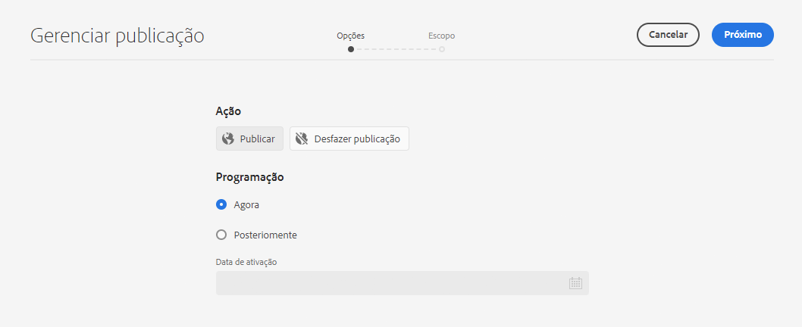
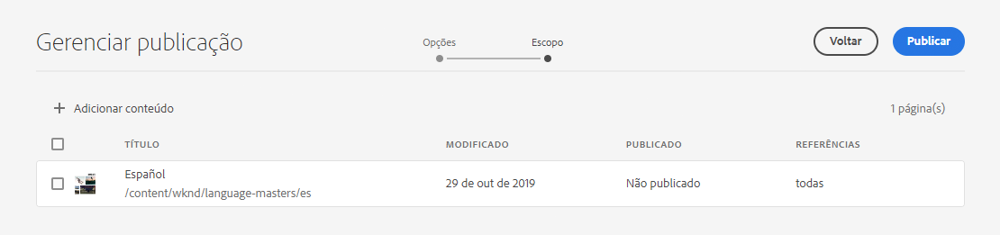
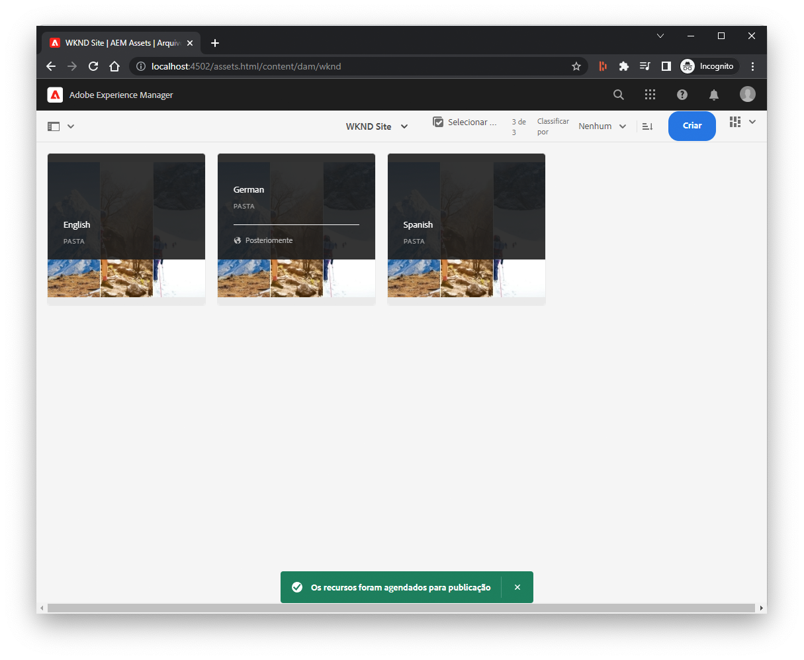
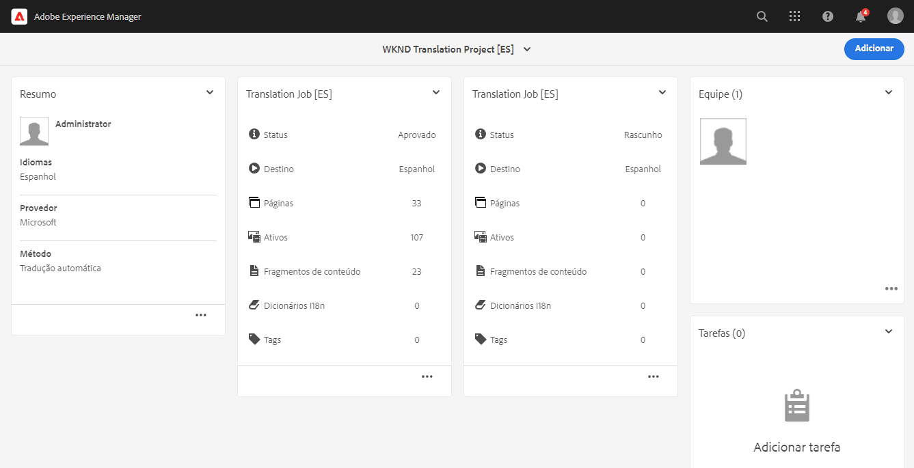
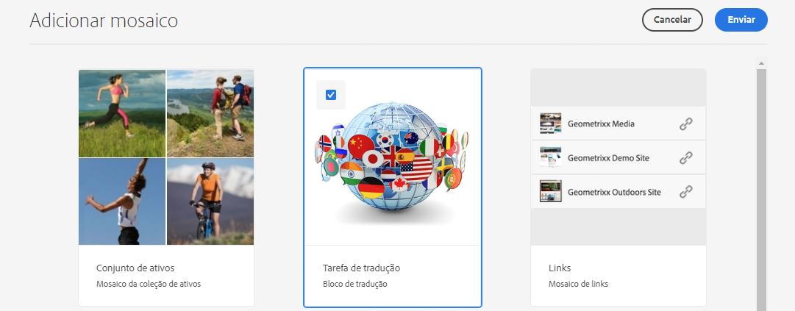
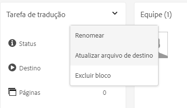
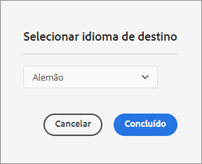

# Publicar conteúdo traduzido {#publish-content}

Saiba como publicar seu conteúdo traduzido e atualizar as traduções como atualizações de conteúdo.

## A História Até Agora {#story-so-far}

No documento anterior da jornada de tradução do AEM Sites, [Traduzir conteúdo,](configure-connector.md) você aprendeu a usar AEM Projetos de tradução para traduzir o conteúdo. Agora você deve:

* Entenda o que é um projeto de tradução.
* Pode criar novos projetos de tradução.
* Use projetos de tradução para traduzir o conteúdo.

Agora que sua tradução inicial foi concluída, este artigo o orienta pela próxima etapa da publicação desse conteúdo e o que fazer para atualizar suas traduções como o conteúdo subjacente nas alterações de raiz do idioma.

## Objetivo {#objective}

Este documento ajuda você a entender como publicar conteúdo no AEM e criar um fluxo de trabalho contínuo para manter suas traduções atualizadas. Após ler este documento, você deve:

* Entenda o modelo de AEM de publicação de autor.
* Saiba como publicar seu conteúdo traduzido.
* É possível implementar um modelo de atualização contínuo para o seu conteúdo traduzido.

## Modelo de publicação do autor do AEM {#author-publish}

Antes de publicar seu conteúdo, é uma boa ideia entender AEM modelo de publicação do autor. Em termos simplificados, AEM divide os usuários do sistema em dois grupos.

1. Aqueles que criam e gerenciam o conteúdo e o sistema
1. Aqueles que consomem o conteúdo do sistema

Portanto, AEM é fisicamente separado em duas instâncias.

1. O **autor** instância é o sistema no qual os autores e administradores de conteúdo trabalham para criar e gerenciar conteúdo.
1. O **publicar** A instância é o sistema que entrega o conteúdo para os consumidores.

Depois que o conteúdo é criado na instância do autor, ele deve ser transferido para a instância de publicação para que esteja disponível para consumo. O processo de transferência do autor para a publicação é chamado **publicação**.

## Publicar seu conteúdo traduzido {#publishing}

Quando estiver satisfeito com o estado do conteúdo traduzido, ele deverá ser publicado para que possa ser acessado e consumido. Normalmente, essa tarefa não é da responsabilidade do especialista em tradução, mas está documentada aqui para ilustrar o fluxo de trabalho completo.

>[!NOTE]
>
>Geralmente, quando a tradução é concluída, o especialista em traduções informa aos proprietários do conteúdo que as traduções estão prontas para publicação. Os proprietários do conteúdo os publicam.
>
>As etapas a seguir são fornecidas para fins de integridade.

A maneira mais simples de publicar as traduções é navegar até a pasta do projeto.

```text
/content/<your-project>/
```

Nesse caminho, você tem subpastas para cada idioma de tradução e pode escolher qual publicar.

1. Ir para **Navegação** -> **Sites** -> **Arquivos** e abra a pasta do projeto.
1. Aqui você vê a pasta raiz do idioma e todas as outras pastas de idioma. Selecione o idioma ou idiomas localizados que deseja publicar.
   
1. Toque ou clique **Gerenciar publicação**.
1. No **Gerenciar publicação** verifique se **Publicar** é automaticamente selecionado em **Ação** e que **Agora** é selecionado em **Agendamento**. Toque ou clique em **Próximo**.
   
1. No próximo **Gerenciar publicação** , confirme se os caminhos adequados estão selecionados. Toque ou clique **Publicar**.
   
1. AEM confirma a ação de publicação com uma mensagem pop-up na parte inferior da tela.
   

Seu conteúdo traduzido foi publicado! Agora ele pode ser acessado e consumido.

>[!TIP]
>
>Você pode selecionar vários itens (ou seja, várias pastas de idioma) ao publicar para publicar várias traduções de uma vez.

Há opções adicionais ao publicar seu conteúdo, como agendar um tempo de publicação, que estão além do escopo desta jornada. Consulte a [Recursos adicionais](#additional-resources) no final do documento para obter mais informações.

## Atualização do seu conteúdo traduzido {#updating-translations}

A tradução raramente é um exercício pontual. Normalmente, seus autores de conteúdo continuam a adicionar e modificar seu conteúdo na raiz do idioma depois que a tradução inicial é concluída. Isso significa que também é necessário atualizar o conteúdo traduzido.

Requisitos específicos do projeto definem a frequência com que você precisa atualizar suas traduções e qual processo de decisão é seguido antes de executar uma atualização. Depois de decidir atualizar suas traduções, o processo no AEM é muito simples. Como a tradução inicial foi baseada em um projeto de tradução, também há atualizações.

No entanto, como antes, o processo é um pouco diferente se você optar por criar automaticamente seu projeto de tradução ou criar manualmente seu projeto de tradução.

### Atualização de um projeto de tradução criado automaticamente {#updating-automatic-project}

1. Navegar para **Navegação** -> **Ativos** -> **Arquivos**. Lembre-se de que o conteúdo no AEM é armazenado em `/content`.
1. Selecione a raiz do idioma do projeto. Nesse caso, selecionamos `/content/wknd/en`.
1. Toque ou clique no seletor do painel e mostre o **Referências** painel.
1. Toque ou clique em **Cópias de idioma**.
1. Verifique a **Cópias de idioma** caixa de seleção.
1. Expanda a seção **Atualizar Cópias de Idioma** na parte inferior do painel de referências.
1. No **Projeto** lista suspensa, selecione **Adicionar a um projeto de tradução existente**.
1. No **Projeto de tradução existente** selecione o projeto criado para a tradução inicial.
1. Toque ou clique **Atualizar**.


O conteúdo é adicionado ao projeto de tradução existente. Para exibir o projeto de tradução:

1. Navegar para **Navegação** -> **Projetos**.
1. Toque ou clique no projeto que você acabou de atualizar.
1. Toque ou clique no idioma ou em um dos idiomas atualizados.

Você vê que um novo cartão de trabalho foi adicionado ao projeto. Neste exemplo, foi adicionada outra tradução em espanhol.



Você pode notar que as estatísticas listadas no novo cartão são diferentes. Isso ocorre porque o AEM reconhece o que mudou desde a última tradução e inclui apenas o conteúdo que precisa ser traduzido. Isso inclui a retradução do conteúdo atualizado, bem como a primeira tradução do novo conteúdo.

A partir deste ponto, você [inicie e gerencie seu trabalho de tradução da mesma forma que fazia o original.](translate-content.md#using-translation-project)

### Atualização de um projeto de tradução criado manualmente {#updating-manual-project}

Para atualizar uma tradução, você pode adicionar um novo trabalho ao projeto existente responsável pela tradução do conteúdo atualizado.

1. Navegar para **Navegação** -> **Projetos**.
1. Toque ou clique no projeto que você precisa atualizar.
1. Toque ou clique no botão **Adicionar** na parte superior da janela.
1. No **Adicionar mosaico** janela, toque ou clique **Tarefa de tradução** e depois **Enviar**.

   

1. No cartão do novo trabalho de tradução, toque ou clique no botão divisa na parte superior do cartão e selecione **Atualizar Target** para definir o idioma do target do novo job.

   

1. No **Selecione o idioma de destino** , use o menu suspenso para selecionar o idioma e toque ou clique em **Concluído**.

   

1. Depois que o idioma alvo do novo trabalho de tradução for definido, toque ou clique no botão de reticências na parte inferior do cartão de trabalho para exibir os detalhes do trabalho.
1. A tarefa fica vazia quando é criada pela primeira vez. Adicione conteúdo à tarefa tocando ou clicando no link **Adicionar** e usando o navegador de caminho [como você fez antes ao criar originalmente o projeto de tradução.](translate-content.md##manually-creating)

>[!TIP]
>
>Os filtros potentes do navegador de caminho podem ser úteis novamente para localizar apenas o conteúdo que foi atualizado.
>
>Você pode saber mais sobre o navegador de caminho no [seção recursos adicionais.](#additional-resources)

A partir deste ponto, você [inicie e gerencie seu trabalho de tradução da mesma forma que fazia o original.](translate-content.md#using-translation-project)

## Fim da Jornada? {#end-of-journey}

Parabéns! Você concluiu a jornada de tradução do AEM Sites! Agora você deve:

* Ter uma compreensão básica AEM recursos de gerenciamento de conteúdo.
* Entenda AEM recursos de tradução e como eles estão relacionados ao conteúdo de seus sites.
* Tenha a capacidade de começar a traduzir seu próprio conteúdo.

Agora você está pronto para traduzir seu próprio conteúdo no AEM. No entanto, AEM é uma ferramenta poderosa e há muitas opções adicionais disponíveis. Confira alguns dos recursos adicionais disponíveis no [Seção Recursos adicionais](#additional-resources) para saber mais sobre os recursos que você viu nesta jornada.

## Recursos adicionais {#additional-resources}

* [Gerenciamento de projetos de tradução](/help/sites-cloud/administering/translation/managing-projects.md) - Saiba mais sobre os detalhes de projetos de tradução e recursos adicionais, como fluxos de trabalho de tradução humana e projetos multilíngues.
* [Conceitos de criação](/help/sites-cloud/authoring/getting-started/concepts.md) - Saiba mais sobre o modelo de criação e publicação de AEM. Este documento está focado na criação de páginas em vez de Fragmentos de conteúdo, mas a teoria ainda se aplica.
* [Publicar páginas](/help/sites-cloud/authoring/fundamentals/publishing-pages.md) - Saiba mais sobre os recursos adicionais disponíveis ao publicar conteúdo. Este documento está focado na criação de páginas em vez de Fragmentos de conteúdo, mas a teoria ainda se aplica.
* [Ambiente e ferramentas de criação](/help/sites-cloud/authoring/fundamentals/environment-tools.md##path-selection) - AEM fornece vários mecanismos para organização e edição de conteúdo, incluindo um navegador de caminho robusto.
