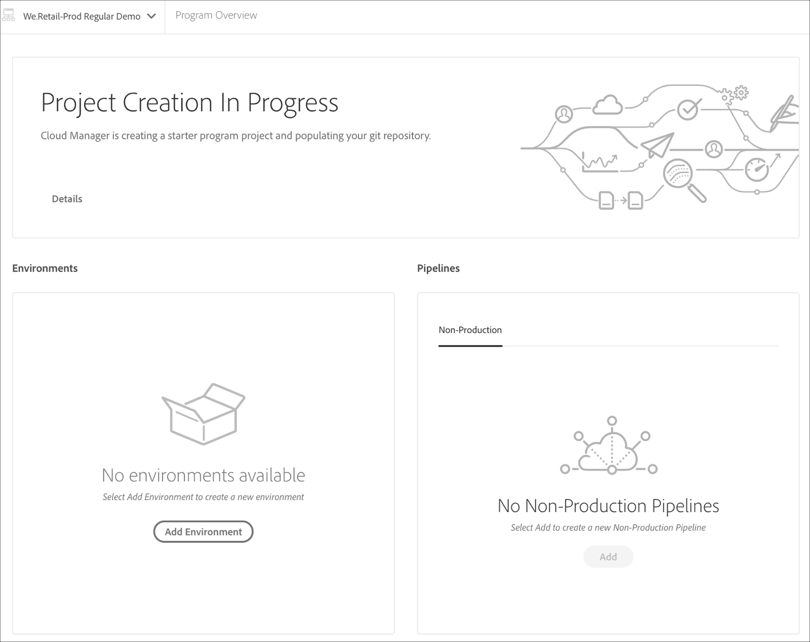

# Creating an AEM Application Project {#aem-application-project}

## Usar o Assistente para criar um projeto de aplicativo AEM {#using-wizard-to-create-an-aem-application-project}

Para ajudar a iniciar novos clientes, o Cloud Manager agora pode criar um projeto AEM mínimo como ponto de partida. Esse processo se baseia no [**AEM Project Archetype **](https://github.com/Adobe-Marketing-Cloud/aem-project-archetype).


Siga as etapas abaixo para criar um projeto de aplicativo AEM no Cloud Manager:

1. Quando você fizer logon no Cloud Manager e a configuração básica do programa for concluída, uma chamada especial para o cartão de ação será exibida na tela **Visão geral** , se o repositório estiver vazio.

   

1. Clique em **Criar** para navegar até a tela **Criar uma Ramificação e Projeto** .

   

1. O título Criação **de projeto em andamento** é exibido na tela Visão geral *do* programa.

   

1. Quando a criação do programa estiver concluída, o bloco **Adicionar ambiente** aparecerá na página Visão geral *do* programa.
   

   Consulte [Gerenciamento de ambientes](/help/implementing/cloud-manager/manage-environments.md) para saber como adicionar ou gerenciar ambientes.

## Configuração do projeto {#setting-up-your-project}

### Modificando Detalhes de Configuração do Projeto {#modifying-project-setup-details}

Para ser criado e implantado com êxito com o Cloud Manager, os projetos AEM existentes precisam seguir algumas regras básicas:

* Os projetos devem ser construídos com o Apache Maven.
* Deve haver um arquivo *pom.xml* na raiz do repositório Git. Esse arquivo *pom.xml* pode fazer referência a quantos submódulos (que por sua vez podem ter outros submódulos etc.) conforme necessário.

* Você pode adicionar referências a repositórios de artefatos Maven adicionais em seus arquivos *pom.xml* . No entanto, o acesso a repositórios de artefatos protegidos por senha ou pela rede não é suportado.
* Os pacotes de conteúdo implantáveis são detectados ao verificar se há arquivos *zip* do pacote de conteúdo contidos em um diretório chamado *target*. Qualquer número de submódulos pode produzir pacotes de conteúdo.

* Os artefatos do Dispatcher que podem ser implantados são descobertos pela varredura de arquivos *zip* (novamente, contidos em um diretório chamado *target*) que têm diretórios chamados *conf* e *conf.d*.

* Se houver mais de um pacote de conteúdo, a ordem de implantações de pacote não é garantida. Se uma ordem específica for necessária, as dependências do pacote de conteúdo poderão ser usadas para definir a ordem. Os pacotes podem ser [ignorados](#skipping-content-packages) da implantação.


## Criar detalhes do ambiente {#build-environment-details}

O Cloud Manager cria e testa seu código usando um ambiente de compilação especializado. Esse ambiente tem os seguintes atributos:

* O ambiente de compilação é baseado no Linux, derivado do Ubuntu 18.04.
* O Apache Maven 3.6.0 está instalado.
* A versão do Java instalada é o Oracle JDK 8u202.
* Existem outros pacotes de sistema instalados que são necessários:

   * bzip2
   * descompactar
   * libpng
   * imagemagick
   * gráfico

* Outros pacotes podem ser instalados no momento da criação, conforme descrito [abaixo](#installing-additional-system-packages).
* Cada construção é feita num ambiente intocado; o contêiner de compilação não mantém nenhum estado entre as execuções.
* Maven é sempre executado com o comando: *mvn —batch-mode clean org.jacoco:jacoco-maven-plugin:prepare-agent package*
* O Maven é configurado no nível do sistema com um arquivo settings.xml que inclui automaticamente o repositório público do Adobe **Artifato** . (Consulte o Repositório [do](https://repo.adobe.com/) Adobe Public Maven para obter mais detalhes).


## Variáveis de ambiente {#environment-variables}

### Variáveis de ambiente padrão {#standard-environ-variables}

Em alguns casos, os clientes acham necessário variar o processo de criação com base nas informações sobre o programa ou pipeline.

Por exemplo, se a miniificação do JavaScript em tempo de criação estiver sendo feita, por meio de uma ferramenta como gulp, pode haver um desejo de usar um nível de miniificação diferente ao criar um ambiente dev em vez de construir para o estágio e a produção.

Para suportar isso, o Cloud Manager adiciona essas variáveis de ambiente padrão ao contêiner de compilação para cada execução.

| **Nome da variável** | **Definição** |
|---|---|
| CM_BUILD | Sempre definido como &quot;true&quot; |
| RAMIFICAÇÃO | A ramificação configurada para a execução |
| CM_PIPELINE_ID | O identificador de pipeline numérico |
| CM_PIPELINE_NAME | O nome do pipeline |
| CM_PROGRAM_ID | O identificador numérico do programa |
| CM_PROGRAM_NAME | O nome do programa |
| ARTIFTS_VERSION | Para um pipeline de estágio ou produção, a versão sintética gerada pelo Cloud Manager |
| CM_AEM_PRODUCT_VERSION | O nome da versão |


### Variáveis de ambiente personalizadas {#custom-environ-variables}

Em alguns casos, o processo de compilação de um cliente pode depender de variáveis de configuração específicas que não seriam adequadas para serem inseridas no repositório git. O Cloud Manager permite que essas variáveis sejam configuradas por um representante da Adobe, cliente a cliente. Essas variáveis são armazenadas em um local de armazenamento seguro e são visíveis apenas no contêiner de compilação do cliente específico. Os clientes que desejarem usar esse recurso precisam entrar em contato com o representante da Adobe para configurar suas variáveis.

Depois de configuradas, essas variáveis estarão disponíveis como variáveis de ambiente. Para usá-las como propriedades Maven, é possível referenciá-las no arquivo pom.xml, possivelmente em um perfil como descrito acima:

```xml
        <profile>
            <id>cmBuild</id>
            <activation>
                  <property>
                        <name>env.CM_BUILD</name>
                  </property>
            </activation>
            <properties>
                  <my.custom.property>${env.MY_CUSTOM_PROPERTY}</my.custom.property>  
            </properties>
        </profile>
```

>[!NOTE]
>
>Os nomes das variáveis de ambiente podem conter apenas caracteres alfanuméricos e sublinhado (_). Por convenção, os nomes devem ser todos maiúsculos.

## Ativar perfis Maven no Cloud Manager {#activating-maven-profiles-in-cloud-manager}

Em alguns casos limitados, pode ser necessário variar um pouco o processo de compilação ao ser executado no Gerenciador de nuvem em vez de quando é executado em estações de trabalho de desenvolvedor. Nesses casos, os Perfis [](https://maven.apache.org/guides/introduction/introduction-to-profiles.html) Maven podem ser usados para definir como a compilação deve ser diferente em ambientes diferentes, incluindo o Cloud Manager.

A ativação de um Perfil Maven dentro do ambiente de compilação do Cloud Manager deve ser feita procurando pela variável de ambiente CM_BUILD descrita acima. Em contrapartida, um perfil destinado a ser usado somente fora do ambiente de criação do Cloud Manager deve ser feito procurando o absentido dessa variável.

Por exemplo, se você quiser enviar uma mensagem simples somente quando a compilação for executada dentro do Cloud Manager, você deve fazer o seguinte:

```xml
        <profile>
            <id>cmBuild</id>
            <activation>
                  <property>
                        <name>env.CM_BUILD</name>
                  </property>
            </activation>
            <build>
                <plugins>
                    <plugin>
                        <artifactId>maven-antrun-plugin</artifactId>
                        <version>1.8</version>
                        <executions>
                            <execution>
                                <phase>initialize</phase>
                                <configuration>
                                    <target>
                                        <echo>I'm running inside Cloud Manager!</echo>
                                    </target>
                                </configuration>
                                <goals>
                                    <goal>run</goal>
                                </goals>
                            </execution>
                        </executions>
                    </plugin>
                </plugins>
            </build>
        </profile>
```

>[!NOTE]
>
>Para testar esse perfil em uma estação de trabalho de desenvolvedor, você pode ativá-lo na linha de comando (com `-PcmBuild`) ou no Ambiente de desenvolvimento integrado (IDE).

E se você quiser enviar uma mensagem simples somente quando a criação for executada fora do Gerenciador de nuvem, você faria isso:

```xml
        <profile>
            <id>notCMBuild</id>
            <activation>
                  <property>
                        <name>!env.CM_BUILD</name>
                  </property>
            </activation>
            <build>
                <plugins>
                    <plugin>
                        <artifactId>maven-antrun-plugin</artifactId>
                        <version>1.8</version>
                        <executions>
                            <execution>
                                <phase>initialize</phase>
                                <configuration>
                                    <target>
                                        <echo>I'm running outside Cloud Manager!</echo>
                                    </target>
                                </configuration>
                                <goals>
                                    <goal>run</goal>
                                </goals>
                            </execution>
                        </executions>
                    </plugin>
                </plugins>
            </build>
        </profile>
```


## Instalação de pacotes adicionais do sistema {#installing-additional-system-packages}

Algumas compilações exigem a instalação de pacotes adicionais do sistema para funcionar totalmente. Por exemplo, uma compilação pode chamar um script Python ou ruby e, como resultado, precisa ter um interpretador de idioma apropriado instalado. Isso pode ser feito chamando o plug-in [exec-maven](https://www.mojohaus.org/exec-maven-plugin/) para chamar a APT. Essa execução geralmente deve estar envolvida em um perfil Maven específico do Cloud Manager. Por exemplo, para instalar o python:

```xml
        <profile>
            <id>install-python</id>
            <activation>
                <property>
                        <name>env.CM_BUILD</name>
                </property>
            </activation>
            <build>
                <plugins>
                    <plugin>
                        <groupId>org.codehaus.mojo</groupId>
                        <artifactId>exec-maven-plugin</artifactId>
                        <version>1.6.0</version>
                        <executions>
                            <execution>
                                <id>apt-get-update</id>
                                <phase>validate</phase>
                                <goals>
                                    <goal>exec</goal>
                                </goals>
                                <configuration>
                                    <executable>apt-get</executable>
                                    <arguments>
                                        <argument>update</argument>
                                    </arguments>
                                </configuration>
                            </execution>
                            <execution>
                                <id>install-python</id>
                                <phase>validate</phase>
                                <goals>
                                    <goal>exec</goal>
                                </goals>
                                <configuration>
                                    <executable>apt-get</executable>
                                    <arguments>
                                        <argument>install</argument>
                                        <argument>-y</argument>
                                        <argument>--no-install-recommends</argument>
                                        <argument>python</argument>
                                    </arguments>
                                </configuration>
                            </execution>
                        </executions>
                    </plugin>
                </plugins>
            </build>
        </profile>
```

Essa mesma técnica pode ser usada para instalar pacotes específicos de idioma, ou seja, usar `gem` para RubyGems ou `pip` para pacotes Python.

>[!NOTE]
>
>Instalar um pacote do sistema dessa maneira **não** o instala no ambiente de tempo de execução usado para executar o Adobe Experience Manager. Se precisar de um pacote do sistema instalado no ambiente AEM, entre em contato com seu representante da Adobe.

## Ignorando pacotes de conteúdo {#skipping-content-packages}

No Cloud Manager, as compilações podem produzir qualquer número de pacotes de conteúdo.
Por vários motivos, pode ser desejável produzir um pacote de conteúdo, mas não implantá-lo. Isso pode ser útil, por exemplo, ao criar pacotes de conteúdo usados apenas para teste ou que serão reempacotados por outra etapa do processo de compilação, ou seja, como um subpacote de outro pacote.

Para acomodar esses cenários, o Cloud Manager procurará uma propriedade chamada ***cloudManagerTarget*** nas propriedades dos pacotes de conteúdo criados. Se essa propriedade estiver definida como nenhum, o pacote será ignorado e não implantado. O mecanismo para definir essa propriedade depende da forma como a compilação está produzindo o pacote de conteúdo. Por exemplo, com o plugin filevault-maven, você configuraria o plug-in da seguinte maneira:

```xml
        <plugin>
            <groupId>org.apache.jackrabbit</groupId>
            <artifactId>filevault-package-maven-plugin</artifactId>
            <extensions>true</extensions>
            <configuration>
                <properties>
                    <cloudManagerTarget>none</cloudManagerTarget>
                </properties>
        <!-- other configuration -->
            </configuration>
        </plugin>
```

Com o plug-in content-package-maven-é semelhante:

```xml
        <plugin>
            <groupId>com.day.jcr.vault</groupId>
            <artifactId>content-package-maven-plugin</artifactId>
            <extensions>true</extensions>
            <configuration>
                <properties>
                    <cloudManagerTarget>none</cloudManagerTarget>
                </properties>
        <!-- other configuration -->
            </configuration>
        </plugin>
```
