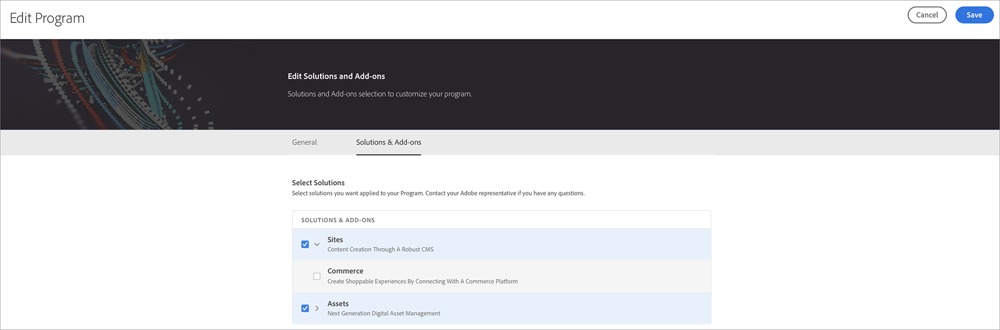

# Editar um programa de produção {#create-production-program}

Os usuários com as permissões necessárias agora podem editar um programa de Produção, permitindo que façam o seguinte de maneira automatizada:

* Adicionar a solução Sites a um programa existente com Ativos (ou vice-versa).
* Remova Sites (ou Ativos) de um programa existente com Sites e Ativos.
* Adicione o segundo direito de solução não utilizado a um programa existente ou como um novo Programa.

   >[!NOTE]
   >Um usuário na função Proprietário comercial deve estar conectado para editar o programa com êxito.

Siga as etapas abaixo para editar um programa de Produção:

1. Navegue até a página **Editar Programa** a partir da página *Visão Geral* do Cloud Manager

1. A página **Editar Programa** exibirá três opções (**Sites**, **Commerce** e **Assets**) para os programas Produção e Sandbox.

   

## Considerações ao editar um programa {#considerations-editing}

Algumas considerações devem ser revisadas durante a edição de um programa:

* Pelo menos uma solução deve ser selecionada para um Programa, ou seja, o uso não terá permissão para desmarcar todas as soluções durante o fluxo de trabalho Editar programa.

* Clicar no botão **Save**, se as soluções selecionadas forem alteradas, as atualizações de solução para ambientes entrarão em vigor após a próxima implantação.
