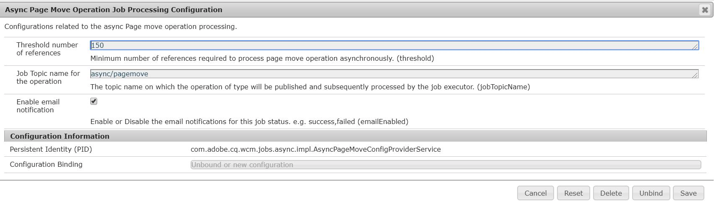

# Operações assíncronas {#asynchronous-operations}

Para reduzir o impacto negativo no desempenho, o Adobe Experience Manager processa de modo assíncrono determinadas operações de longa duração e operações que usam muitos recursos. O processamento assíncrono envolve enfileiramento de vários trabalhos e sua execução em série dependendo da disponibilidade dos recursos do sistema.

Essas operações incluem:

* Exclusão de muitos ativos
* Movimentação de muitos ativos ou ativos com muitas referências
* Exportação/importação de metadados de ativos em massa
* Busca de ativos acima do limite definido a partir de uma implantação remota do Experience Manager
* Mover páginas
* Implantação de Live Copy

Você pode visualizar o status de trabalhos assíncronos no painel **[!UICONTROL Status de trabalhos assíncronos]** em **Navegação global** -> **Ferramentas** -> **Operações** -> **Trabalhos**.

>[!NOTE]
>
>Por padrão, os trabalhos assíncronos são executados em paralelo. Se o número de núcleos da CPU for *`n`*, podem ser executados *`n/2`* trabalhos em paralelo, por padrão. Para usar configurações personalizadas para a fila de trabalhos, modifique a **[!UICONTROL Configuração da fila padrão da operação assíncrona]** e a **Configuração da movimentação e implantação de página de operação assíncrona** no console da web.
>
>Para obter mais informações, consulte [Configurações de fila](https://sling.apache.org/documentation/bundles/apache-sling-eventing-and-job-handling.html#queue-configurations).

## Monitorar o status de operações assíncronas {#monitor-the-status-of-asynchronous-operations}

Sempre que o AEM processar uma operação de modo assíncrono, você receberá uma notificação na sua [caixa de entrada](/help/sites-cloud/authoring/getting-started/inbox.md) e por email (se ativada essa opção).

Para visualizar o status das operações assíncronas em detalhes, acesse a página **[!UICONTROL Status do trabalho assíncrono]**.

1. Na interface do Experience Manager, clique em **[!UICONTROL Operações]** > **[!UICONTROL Trabalhos]**.

1. Na página **[!UICONTROL Status do trabalho assíncrono]**, verifique os detalhes das operações.

   

   Para determinar o progresso de uma operação específica, consulte o valor na coluna **[!UICONTROL Status]**. Dependendo do progresso, será exibido um dos seguintes status:

   * **[!UICONTROL Ativo]**: a operação está sendo processada

   * **[!UICONTROL Sucesso]**: a operação foi concluída

   * **[!UICONTROL Falha]** ou **[!UICONTROL Erro]**: não foi possível processar a operação

   * **[!UICONTROL Agendado]**: a operação está programada para ser processada mais tarde

1. Para interromper uma operação ativa, selecione-a na lista e clique em **[!UICONTROL Parar]** na barra de ferramentas.

   

1. Para visualizar mais detalhes, por exemplo, descrição e registros, selecione a operação e clique em **[!UICONTROL Abrir]** na barra de ferramentas.

   

   A página de detalhes do trabalho é exibida.

   

1. Para excluir a operação da lista, selecione **[!UICONTROL Excluir]** na barra de ferramentas. Para baixar os detalhes em um arquivo CSV, clique em **[!UICONTROL Baixar]**.

   >[!NOTE]
   >
   >Não é possível excluir um trabalho se o seu status for **Ativo** ou **Em fila**.

## Limpar trabalhos concluídos {#purging-completed-jobs}

O AEM executa um trabalho de limpeza todos os dias à 1h para excluir trabalhos assíncronos concluídos há mais de um dia.

Você pode modificar a programação da limpeza e a duração da retenção dos detalhes dos trabalhos concluídos, antes da sua exclusão. Você também pode configurar, a qualquer momento, o número máximo de trabalhos concluídos cujos detalhes serão retidos.

1. Na Navegação global, clique em **[!UICONTROL Ferramentas]** > **[!UICONTROL Operações]** > **[!UICONTROL Console da Web]**.
1. Abra o **[!UICONTROL Trabalho agendado de limpeza de trabalhos assíncronos no Adobe Granite]**.
1. Especifique:
   * O limite de dias após o qual os trabalhos concluídos são excluídos.
   * O número máximo de trabalhos cujos detalhes são mantidos no histórico.
   * A expressão CRON que define quando a limpeza deve ser feita.

   

1. Salve as alterações.

## Configurar o processamento assíncrono {#configuring-asynchronous-processing}

Você pode configurar o limite de ativos, páginas ou referências para que o AEM processe uma operação específica de modo assíncrono, bem como ativar notificações por email para quando os trabalhos forem processados.

### Configurar operações assíncronas de exclusão de ativos {#configuring-synchronous-delete-operations}

Se o número de ativos ou pastas que serão excluídos exceder o limite, a operação de exclusão será feita de modo assíncrono.

1. Na Navegação global, clique em **[!UICONTROL Ferramentas]** > **[!UICONTROL Operações]** > **[!UICONTROL Console da Web]**.
1. No console da Web, abra a **[!UICONTROL Configuração da fila padrão de processo assíncrono.]**
1. Na caixa **[!UICONTROL Limite de ativos]**, especifique o limite de ativos/pastas para o processamento assíncrono de operações de exclusão.

   

1. Marque a opção **Habilitar notificação por email** para receber notificações por email sobre o status do trabalho. por exemplo, sucesso, falha.
1. Salve as alterações.

### Configurar operações assíncronas de movimentação de ativos {#configuring-asynchronous-move-operations}

Se o número de ativos/pastas ou referências que serão movidos exceder o limite, a operação de movimentação será feita de modo assíncrono.

1. Na Navegação global, clique em **[!UICONTROL Ferramentas]** > **[!UICONTROL Operações]** > **[!UICONTROL Console da Web]**.
1. No console da Web, abra a **[!UICONTROL Configuração do processamento assíncrono da operação de movimentação.]**
1. Na caixa **[!UICONTROL Limite de ativos/referências]**, especifique o limite de ativos/pastas ou referências para o processamento assíncrono de operações de movimentação.

   

1. Marque a opção **Habilitar notificação por email** para receber notificações por email sobre o status do trabalho. Por exemplo, sucesso, falha.
1. Salve as alterações.

### Configurar operações assíncronas de movimentação de página {#configuring-asynchronous-page-move-operations}

Se o número de referências às páginas que serão movidas exceder o número limite, a operação de movimentação será executada de modo assíncrono.

1. Na Navegação global, clique em **[!UICONTROL Ferramentas]** > **[!UICONTROL Operações]** > **[!UICONTROL Console da Web]**.
1. No console da Web, abra a **[!UICONTROL Configuração do processamento assíncrono da operação de movimentação de página.]**
1. No campo **[!UICONTROL Limite de referências]**, especifique o número de referências para o processamento assíncrono de operações de movimentação de página.

   

1. Marque a opção **Habilitar notificação por email** para receber notificações por email sobre o status do trabalho. Por exemplo, sucesso, falha.
1. Salve as alterações.

### Configurar operações assíncronas do MSM {#configuring-asynchronous-msm-operations}

1. Na Navegação global, clique em **[!UICONTROL Ferramentas]** > **[!UICONTROL Operações]** > **[!UICONTROL Console da Web]**.
1. No console da Web, abra a **[!UICONTROL Configuração do processamento assíncrono da operação de movimentação de página.]**
1. Marque a opção **Habilitar notificação por email** para receber notificações por email sobre o status do trabalho. Por exemplo, sucesso, falha.

   

1. Salve as alterações.

>[!MORELIKETHIS]
>
>* [Criar e organizar páginas](/help/sites-cloud/authoring/fundamentals/organizing-pages.md)
>* [Importar e exportar metadados de ativos em massa](/help/assets/metadata-import-export.md).
>* [Usar ativos conectados para compartilhar ativos DAM de implantações remotas](/help/assets/use-assets-across-connected-assets-instances.md).

