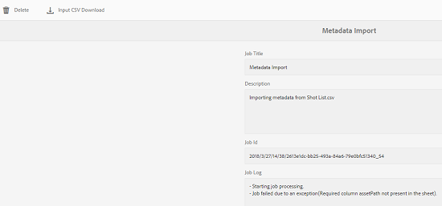

# Operações assíncronas {#asynchronous-operations}

Para reduzir o impacto negativo no desempenho, o Adobe Experience Manager processa de modo assíncrono determinadas operações de longa duração e de uso intensivo de recursos. O processamento assíncrono envolve enfileiramento de várias tarefas e sua execução em série, dependendo da disponibilidade dos recursos do sistema.

Essas operações incluem:

* Excluindo muitos ativos
* Movimentação de muitos ativos ou ativos com muitas referências
* Exportação/importação de metadados de ativos em massa
* Buscando ativos, que estão acima do limite definido, de uma implantação remota de Experience Manager
* Mover páginas
* Implantação de cópias online

Você pode visualização o status de trabalhos assíncronos do painel Status **[!UICONTROL do Trabalho]** Assíncrono na Navegação **** Global -> **Ferramentas** -> **Operações** -> **Tarefas**.

>[!NOTE]
>
>Por padrão, os trabalhos assíncronos são executados em paralelo. Se *`n`* for o número de núcleos da CPU, *`n/2`* os trabalhos podem ser executados em paralelo, por padrão. Para usar configurações personalizadas para a fila de trabalhos, modifique a Configuração **[!UICONTROL de Fila Padrão de Operação]** Assíncrona e a Configuração **de Implantação e Movimentação de Página de Operação** Assíncrona do console da Web.
>
>Para obter mais informações, consulte configurações [de](https://sling.apache.org/documentation/bundles/apache-sling-eventing-and-job-handling.html#queue-configurations)fila.

## Monitore o status das operações assíncronas {#monitor-the-status-of-asynchronous-operations}

Sempre que o AEM processar uma operação de forma assíncrona, você receberá uma notificação na sua [caixa de entrada](/help/sites-cloud/authoring/getting-started/inbox.md) e por email (se ativada).

Para visualização o status das operações assíncronas em detalhes, navegue até a página Status **[!UICONTROL do trabalho]** assíncrono.

1. Na interface do Experience Manager, clique em **[!UICONTROL Operações]** > **[!UICONTROL Tarefas]**.

1. Na página Status **[!UICONTROL do trabalho]** assíncrono, reveja os detalhes das operações.

   

   Para determinar o progresso de uma operação específica, consulte o valor na coluna **[!UICONTROL Status]** . Dependendo do progresso, um dos seguintes status é exibido:

   * **[!UICONTROL Ativo]**: A operação está sendo processada

   * **[!UICONTROL Sucesso]**: A operação está concluída

   * **[!UICONTROL Falha]** ou **[!UICONTROL erro]**: não foi possível processar a operação

   * **[!UICONTROL Agendado]**: A operação está programada para processamento posterior

1. Para interromper uma operação ativa, selecione-a na lista e clique em **[!UICONTROL Parar]** na barra de ferramentas.

   

1. Para visualização de detalhes adicionais, por exemplo, descrição e registros, selecione a operação e clique em **[!UICONTROL Abrir]** na barra de ferramentas.

   

   A página de detalhes da tarefa é exibida.

   

1. Para excluir a operação da lista, selecione **[!UICONTROL Excluir]** na barra de ferramentas. Para baixar os detalhes em um arquivo CSV, clique em **[!UICONTROL Download]**.

   >[!NOTE]
   >
   >Não é possível excluir um trabalho se seu status for **Ativo** ou **Em fila**.

## Expurgar Tarefas Concluídas {#purging-completed-jobs}

O AEM executa um trabalho de limpeza todos os dias às 01:00 para excluir trabalhos assíncronos concluídos com mais de um dia de idade.

Você pode modificar a programação para a ordem de produção de expurgação e a duração para a qual os detalhes das ordens de produção concluídas são retidos antes de serem deletados. Você também pode configurar o número máximo de trabalhos concluídos para os quais os detalhes são retidos a qualquer momento.

1. Na Navegação global, clique em **[!UICONTROL Ferramentas]** > **[!UICONTROL Operações]** > Console **[!UICONTROL da Web]**.
1. Abra o trabalho de Expurgação de trabalho **[!UICONTROL agendado do Async Jobs]** Adobe Granite.
1. Especificar:
   * O número limite de dias após os quais as tarefas concluídas são excluídas.
   * O número máximo de trabalhos para os quais os detalhes são mantidos no histórico.
   * A expressão do cron para quando a limpeza deve ser executada.

   

1. Salve as alterações.

## Configurar processamento assíncrono {#configuring-asynchronous-processing}

Você pode configurar o número limite de ativos, páginas ou referências para que o AEM processe uma operação específica de forma assíncrona, bem como alternar notificações por email para quando os trabalhos são processados.

### Configurar operações assíncronas de exclusão de ativos {#configuring-synchronous-delete-operations}

Se o número de ativos ou pastas a serem excluídos exceder o número limite, a operação de exclusão será executada de forma assíncrona.

1. Na Navegação global, clique em **[!UICONTROL Ferramentas]** > **[!UICONTROL Operações]** > Console **[!UICONTROL da Web]**.
1. No console da Web, abra a Configuração da fila padrão de processo **[!UICONTROL assíncrono.]**
1. Na caixa Número **[!UICONTROL limite de ativos]** , especifique o número limite de ativos/pastas para o processamento assíncrono de operações de exclusão.

   

1. Marque a opção **Habilitar notificação** por email para receber notificações por email sobre o status do trabalho. Por exemplo, sucesso, fracassado.
1. Salve as alterações.

### Configurar Operações Assíncronas de Movimentação de Ativos {#configuring-asynchronous-move-operations}

Se o número de ativos/pastas ou referências a serem movidos exceder o número limite, a operação de movimentação será executada de forma assíncrona.

1. Na Navegação global, clique em **[!UICONTROL Ferramentas]** > **[!UICONTROL Operações]** > Console **[!UICONTROL da Web]**.
1. No console da Web, abra a Configuração de Processamento de Trabalho da Operação de Movimentação **[!UICONTROL Assíncrona.]**
1. Na caixa Número **[!UICONTROL limite de ativos/referências]** , especifique o número limite de ativos/pastas ou referências para o processamento assíncrono de operações de movimentação.

   

1. Marque a opção **Habilitar notificação** por email para receber notificações por email sobre o status do trabalho. Por exemplo, sucesso, fracassado.
1. Salve as alterações.

### Configurar Operações Assíncronas de Movimentação de Página {#configuring-asynchronous-page-move-operations}

Se o número de referências às páginas a serem movidas exceder o número limite, a operação de movimentação será executada de forma assíncrona.

1. Na Navegação global, clique em **[!UICONTROL Ferramentas]** > **[!UICONTROL Operações]** > Console **[!UICONTROL da Web]**.
1. No console da Web, abra a Configuração de Processamento de Trabalho da Operação de Movimentação de Página **[!UICONTROL Assíncrona.]**
1. No campo Número **[!UICONTROL limite de referências]** , especifique o número limite de referências para o processamento assíncrono de operações de movimentação de página.

   

1. Marque a opção **Habilitar notificação** por email para receber notificações por email sobre o status do trabalho. Por exemplo, sucesso, fracassado.
1. Salve as alterações.

### Configurar Operações MSM assíncronas {#configuring-asynchronous-msm-operations}

1. Na Navegação global, clique em **[!UICONTROL Ferramentas]** > **[!UICONTROL Operações]** > Console **[!UICONTROL da Web]**.
1. No console da Web, abra a Configuração de Processamento de Trabalho da Operação de Movimentação de Página **[!UICONTROL Assíncrona.]**
1. Marque a opção **Habilitar notificação** por email para receber notificações por email sobre o status do trabalho. Por exemplo, sucesso, fracassado.

   

1. Salve as alterações.

>[!MORELIKETHIS]
>
>* [Criar e organizar páginas](/help/sites-cloud/authoring/fundamentals/organizing-pages.md)
>* [Importe e exporte metadados de ativos em massa](/help/assets/metadata-import-export.md).
>* [Use Ativos conectados para compartilhar ativos DAM de implantações](/help/assets/use-assets-across-connected-assets-instances.md)remotas.

