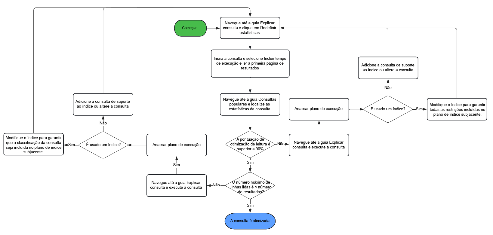

# Práticas recomendadas de consulta e indexação {#query-and-indexing-best-practices}

No AEM as a Cloud Service, todos os aspectos operacionais relativos à indexação são automatizados. Isso permite que os desenvolvedores se concentrem na criação de consultas eficientes e suas definições de índice correspondentes.

## Quando utilizar consultas {#when-to-use-queries}

As consultas são uma maneira de acessar conteúdo, mas não são a única possibilidade. Em muitas situações, o conteúdo do repositório pode ser acessado com mais eficiência por outros meios. Você deve considerar se as consultas são a melhor e mais eficiente maneira de acessar o conteúdo no seu caso de uso.

### Design de repositório e taxonomia {#repository-and-taxonomy-design}

Ao projetar a taxonomia de um repositório, vários fatores precisam ser considerados. Entre eles, controles de acesso, localização, herança de propriedade de componente e página e muito mais.

Ao projetar uma taxonomia que atenda a essas questões, também é importante considerar a flexibilidade do design de indexação. Nesse contexto, a “flexibilidade” é a capacidade de uma taxonomia permitir que o conteúdo seja acessado de forma previsível com base em seu caminho. Isso torna o sistema mais eficiente e fácil de manter do que um que requer a execução de várias consultas.

Além disso, ao projetar uma taxonomia, é importante considerar se a ordenação é importante. Nos casos em que a ordenação explícita não é obrigatória e um grande número de nós semelhantes é esperado, é preferível usar um tipo de nó não ordenado, como `sling:Folder` ou `oak:Unstructured`. Nos casos em que a ordenação é obrigatória, `nt:unstructured` e `sling:OrderedFolder` seriam mais adequados.

### Consultas em componentes {#queries-in-components}

Como as consultas podem ser uma das operações mais exigentes realizadas em um sistema AEM, é recomendável evitá-las em seus componentes. A execução de várias consultas cada vez que uma página é renderizada pode prejudicar o desempenho do sistema. Há duas estratégias que podem ser usadas para evitar a execução de consultas ao renderizar componentes: **[nós de passagem](#traversing-nodes)** e **[resultados da busca prévia](#prefetching-results)**.

### Nós de passagem {#traversing-nodes}

Se o repositório for projetado de uma forma que permita o conhecimento prévio da localização dos dados necessários, o código que recupera esses dados dos caminhos necessários poderá ser implantado sem a necessidade de executar consultas para encontrá-los.

Um exemplo disso seria a renderização de um conteúdo que se encaixe em uma determinada categoria. Uma abordagem seria organizar o conteúdo com uma propriedade de categoria que possa ser consultada para preencher um componente que mostre itens em uma categoria.

No entanto, uma melhor abordagem seria estruturar esse conteúdo em uma taxonomia por categoria para que ele possa ser recuperado manualmente.

Por exemplo, se o conteúdo for armazenado em uma taxonomia semelhante a:

```xml
/content/myUnstructuredContent/parentCategory/childCategory/contentPiece
```

o nó `/content/myUnstructuredContent/parentCategory/childCategory` pode simplesmente ser recuperado e seus filhos podem ser analisados e usados para renderizar o componente.

Além disso, ao lidar com um conjunto de resultados pequeno ou homogêneo, pode ser mais rápido percorrer o repositório e coletar os nós necessários, em vez de criar uma consulta para retornar o mesmo conjunto de resultados. Como consideração geral, as consultas devem ser evitadas sempre que possível.

### Resultados de busca prévia {#prefetching-results}

Às vezes, o conteúdo ou os requisitos do componente não permitem o uso de nós de passagem como um método de recuperação dos dados necessários. Nesses casos, as consultas obrigatórias precisam ser executadas antes que o componente seja renderizado para garantir um desempenho ideal.

Se os resultados obrigatórios para o componente puderem ser calculados no momento da criação e não houver expectativa de que o conteúdo seja alterado, a consulta poderá ser executada após uma alteração ter sido feita.

Se os dados ou o conteúdo forem alterados regularmente, a consulta poderá ser executada de acordo com uma programação ou por meio de um ouvinte para obter atualizações sobre os dados subjacentes. Em seguida, os resultados podem ser gravados em um local compartilhado no repositório. Qualquer componente que precise desses dados pode extrair os valores desse único nó, sem precisar executar uma consulta em tempo de execução.

Uma estratégia semelhante pode ser usada para manter o resultado em uma memória cache, que é preenchida na inicialização e atualizada sempre que as alterações são feitas (usando um JCR `ObservationListener` ou um Sling `ResourceChangeListener`).

## Otimização de consultas {#optimizing-queries}

A documentação do Oak fornece uma [visão geral de alto nível de como as consultas são executadas](https://jackrabbit.apache.org/oak/docs/query/query-engine.html#query-processing). Isso forma a base de todas as atividades de otimização descritas neste documento.

A AEM as a Cloud Service fornece a [Ferramenta de Desempenho de Consulta](#query-performance-tool), que foi projetada para oferecer suporte à implementação de consultas eficientes.

* Ela exibe consultas já executadas com suas características de desempenho relevantes e o plano de consulta.
* Ela permite executar consultas ad-hoc em vários níveis, desde a exibição do plano de consulta até a execução da consulta completa.

A Ferramenta de Desempenho da Consulta pode ser acessada por meio da [Developer Console no Cloud Manager](https://experienceleague.adobe.com/docs/experience-manager-learn/cloud-service/debugging/debugging-aem-as-a-cloud-service/developer-console.html?lang=pt-BR#queries). A Ferramenta de desempenho de consulta da AEM as a Cloud Service fornece mais informações sobre os detalhes da execução da consulta do que a versão AEM 6.x.

Este gráfico ilustra o fluxo geral de uso da Ferramenta de desempenho de consulta na otimização de consultas.



### Usar um índice {#use-an-index}

Cada consulta deve usar um índice para fornecer desempenho ideal. Na maioria dos casos, os índices prontos para uso existentes devem ser suficientes para lidar com as consultas.

Às vezes, as propriedades personalizadas precisam ser adicionadas a um índice existente, para que restrições adicionais possam ser consultadas usando o índice. Consulte o documento [Pesquisa e indexação de conteúdo](/help/operations/indexing.md#changing-an-index) para obter mais detalhes. A seção [Folha de características de consulta JCR](#jcr-query-cheatsheet) deste documento descreve como deve ser uma definição de propriedade em um índice para suportar um tipo de consulta específico.

### Use os critérios certos {#use-the-right-criteria}

A restrição primária em qualquer consulta deve ser uma correspondência de propriedade, pois este é o tipo mais eficiente. Adicionar mais restrições de propriedade limita ainda mais o resultado.

O mecanismo de consulta considera apenas um único índice. Isso significa que um índice existente pode e deve ser personalizado adicionando mais propriedades de índice personalizadas a ele.

A seção [Folha de características de consulta JCR](#jcr-query-cheatsheet) deste documento lista as restrições disponíveis e também descreve como criar uma definição de índice adequada para uso. Use a [Ferramenta de desempenho da consulta](#query-performance-tool) para testar a consulta e garantir que o índice correto esteja sendo usado e que o mecanismo de consulta não precise avaliar restrições fora do índice.

### Ordenação {#ordering}

Se uma ordem específica do resultado for solicitada, há duas maneiras de o mecanismo de consulta alcançar isso:

1. O índice pode entregar o resultado completo e na ordem correta.
   * Isso funciona se as propriedades usadas para a ordenação forem anotadas com `ordered=true` na definição do índice.
1. O mecanismo de consulta executa o processo de ordenação.
   * Isso pode ocorrer quando o mecanismo de consulta executa a filtragem fora do índice ou a propriedade de ordenação não é anotada com a propriedade `ordered=true`.
   * Isso requer que o conjunto completo de resultados seja lido na memória para classificação, o que é muito mais lento do que a primeira opção.

### Restringir o tamanho do resultado {#restrict-result-size}

O tamanho recuperado do resultado da consulta é um fator importante no desempenho da consulta. Como o resultado é recebido lentamente, há uma diferença entre obter apenas os primeiros 20 resultados e obter 10.000 resultados, tanto em tempo de execução quanto em uso de memória.

Isso também significa que o tamanho do conjunto de resultados só poderá ser determinado corretamente se todos os resultados forem obtidos. Por esse motivo, o conjunto de resultados obtido deve ser sempre limitado, seja aumentando a consulta (consulte a seção [Folha de características de consulta JCR](#jcr-query-cheatsheet) para obter detalhes) ou limitando as leituras dos resultados.

Esse limite também impede que o mecanismo de consulta atinja o **limite de passagem** de 100.000 nós, o que resulta em uma interrupção forçada da consulta.

Consulte a seção [Consultas com conjuntos de resultados grandes](#queries-with-large-result-sets) deste documento se um conjunto de resultados potencialmente grande tiver de ser processado por completo.

## Ferramenta de desempenho da consulta {#query-performance-tool}

A Ferramenta de Desempenho de Consulta (localizada em `/libs/granite/operations/content/diagnosistools/queryPerformance.html` e disponível por meio da [Developer Console no Cloud Manager](https://experienceleague.adobe.com/docs/experience-manager-learn/cloud-service/debugging/debugging-aem-as-a-cloud-service/developer-console.html?lang=pt-BR#queries)) fornece -

* Uma lista de quaisquer &quot;Consultas lentas&quot;; atualmente definidas como aquelas lendo/digitalizando mais de 5000 linhas.
* Uma lista de &quot;Consultas populares&quot;
* A ferramenta &quot;Explicar consulta&quot; para entender como uma consulta específica será executada pelo Oak.


As tabelas &quot;Consultas lentas&quot; e &quot;Consultas populares&quot; incluem -

* A própria instrução de consulta.
* Detalhes da última thread que executou a consulta, permitindo que a página ou o recurso do aplicativo que executa a consulta seja identificado.
* Uma pontuação de &quot;Otimização de leitura&quot; para a consulta.
   * Isso é calculado como a proporção entre o número de linhas/nós examinados para executar a consulta e o número de resultados correspondentes lidos.
   * Uma consulta para a qual cada restrição (e qualquer ordenação) pode ser tratada no índice normalmente terá uma pontuação de 90% ou superior.
* Detalhes do número máximo de linhas -
   * Lido - indicando que uma linha foi incluída como parte de um conjunto de resultados.
   * Verificado - indicando que uma linha foi incluída nos resultados da consulta de índice subjacente (no caso de uma consulta indexada) ou lida no nodestore (no caso de um percurso de repositório).

Essas tabelas ajudam a identificar consultas que não estão totalmente indexadas (consulte [Usar um Índice](#use-an-index) ou estão lendo muitos nós (consulte também [Travessia de Repositório](#repository-traversal) e [Travessia de Índice](#index-traversal)). Esses queries serão destacados - com as áreas de preocupação apropriadas marcadas em vermelho.

A opção `Reset Statistics` é fornecida para remover todas as estatísticas existentes coletadas nas tabelas. Isso permite a execução de uma consulta específica (por meio do próprio aplicativo ou da ferramenta Explain Query ) e a análise das estatísticas de execução.

### Explicar consulta

A Ferramenta de Explicação de Consulta permite que os desenvolvedores entendam o Plano de Execução de Consulta (consulte [Lendo o Plano de Execução de Consulta](#reading-query-execution-plan)), incluindo detalhes de quaisquer índices usados ao executar a consulta. Isso pode ser usado para entender com que eficiência uma consulta é indexada para prever ou analisar retrospectivamente seu desempenho.

#### Explicação de uma consulta

Para explicar uma consulta, faça o seguinte:

* Selecione o idioma de consulta apropriado usando a lista suspensa `Language`.
* Insira a instrução da consulta no campo `Query`.
* Se necessário, selecione como a consulta será executada usando as caixas de seleção fornecidas.
   * Por padrão, consultas JCR não precisam ser executadas para identificar o Plano de Execução de Consulta (esse não é o caso para consultas QueryBuilder).
   * Três opções são fornecidas para executar o query -
      * `Include Execution Time` - executar a consulta, mas não tentar ler nenhum resultado.
      * `Read first page of results` - executar a consulta e ler a primeira &#39;página&#39; de 20 resultados (replicando as práticas recomendadas para execução de consultas).
      * `Include Node Count` - executar a consulta e ler todo o conjunto de resultados (geralmente isso não é recomendável - consulte [Travessia de Índice](#index-traversal)).

#### Pop-up Explicação da consulta {#query-explanation-popup}


Depois de selecionar `Explain`, o usuário verá um pop-up descrevendo o resultado da explicação da consulta (e da execução, se selecionada).
Esse pop-up inclui detalhes de -

* Os Índices Usados ao executar a consulta (ou nenhum índice se a consulta for executada usando [Travessia de Repositório](#repository-traversal)).
* O tempo de execução (se a caixa de seleção `Include Execution Time` estiver marcada) e a contagem de resultados lidos (se as caixas de seleção `Read first page of results` ou `Include Node Count` estiverem marcadas).
* O plano de execução, que permite a análise detalhada de como a consulta é executada - consulte [Lendo o Plano de Execução da Consulta](#reading-query-execution-plan) para saber como interpretar isso.
* Os caminhos dos primeiros 20 resultados da consulta (se a caixa de seleção `Read first page of results` estiver marcada)
* Os logs completos do planejamento de consulta, mostrando os custos relativos dos índices que foram considerados para a execução desta consulta (o índice com o menor custo será o escolhido).

#### Lendo o Plano de Execução da Consulta {#reading-query-execution-plan}

O Plano de Execução de Consulta contém tudo o que é necessário para prever (ou explicar) o desempenho de uma determinada consulta. Entenda com que eficiência a consulta será executada comparando as restrições e a ordenação na consulta JCR original (ou Construtor de consultas) com a consulta executada no índice subjacente (Lucene, Elastic ou Property).

Considere a seguinte consulta -

```
/jcr:root/content/dam//element(*, dam:Asset) [jcr:content/metadata/dc:title = "My Title"] order by jcr:created
```

...que contém -

* 3 restrições
   * Nodetype (`dam:Asset`)
   * Caminho (descendentes de `/content/dam`)
   * Propriedade (`jcr:content/metadata/dc:title = "My Title"`)
* Ordenação pela propriedade `jcr:created`

A explicação desta consulta resulta no seguinte plano -

```
[dam:Asset] as [a] /* lucene:damAssetLucene-9(/oak:index/damAssetLucene-9) +:ancestors:/content/dam +jcr:content/metadata/dc:title:My Title ordering:[{ propertyName : jcr:created, propertyType : UNDEFINED, order : ASCENDING }] where ([a].[jcr:content/metadata/dc:title] = 'My Title') and (isdescendantnode([a], [/content/dam])) */
```

Neste plano, a seção que descreve a consulta executada no índice subjacente é -

```
lucene:damAssetLucene-9(/oak:index/damAssetLucene-9) +:ancestors:/content/dam +jcr:content/metadata/dc:title:My Title ordering:[{ propertyName : jcr:created, propertyType : UNDEFINED, order : ASCENDING }]
```

Esta seção do plano indica que:

* Um índice é usado para executar esta consulta -
   * Nesse caso, o índice Lucene `/oak:index/damAssetLucene-9` será usado, portanto, as informações restantes estão na Sintaxe de consulta Lucene.
* Todas as 3 restrições são tratadas pelo índice -
   * A restrição nodetype
      * implícito, porque `damAssetLucene-9` indexa somente nós do tipo dam:Asset.
   * A restrição de caminho
      * porque `+:ancestors:/content/dam` aparece na consulta Lucene.
   * A restrição de propriedade
      * porque `+jcr:content/metadata/dc:title:My Title` aparece na consulta Lucene.
* A ordenação é feita pelo índice
   * porque `ordering:[{ propertyName : jcr:created, propertyType : UNDEFINED, order : ASCENDING }]` aparece na consulta Lucene.

Essa consulta provavelmente terá um bom desempenho, já que os resultados retornados da consulta de índice não serão filtrados ainda mais no mecanismo de consulta (além da filtragem de Controle de acesso). No entanto, essa consulta ainda poderá ser executada lentamente se as práticas recomendadas não forem seguidas - consulte [Travessia de Índice](#index-traversal) abaixo.

Considerando uma consulta diferente -

```
/jcr:root/content/dam//element(*, dam:Asset) [jcr:content/metadata/myProperty = "My Property Value"] order by jcr:created
```

...que contém -

* 3 restrições
   * Nodetype (`dam:Asset`)
   * Caminho (descendentes de `/content/dam`)
   * Propriedade (`jcr:content/metadata/myProperty = "My Property Value"`)
* Ordenação pela propriedade `jcr:created`**

A explicação desta consulta resulta no seguinte plano -

```
[dam:Asset] as [a] /* lucene:damAssetLucene-9-custom-1(/oak:index/damAssetLucene-9-custom-1) :ancestors:/content/dam ordering:[{ propertyName : jcr:created, propertyType : UNDEFINED, order : ASCENDING }] where ([a].[jcr:content/metadata/myProperty] = 'My Property Value') and (isdescendantnode([a], [/content/dam])) */
```

Neste plano, a seção que descreve a consulta executada no índice subjacente é -

```
lucene:damAssetLucene-9(/oak:index/damAssetLucene-9) :ancestors:/content/dam ordering:[{ propertyName : jcr:created, propertyType : UNDEFINED, order : ASCENDING }]
```

Esta seção do plano indica que:

* Somente 2 (das 3) restrições são tratadas pelo índice -
   * A restrição nodetype
      * implícito, porque `damAssetLucene-9` indexa somente nós do tipo dam:Asset.
   * A restrição de caminho
      * porque `+:ancestors:/content/dam` aparece na consulta Lucene.
* A restrição de propriedade `jcr:content/metadata/myProperty = "My Property Value"` não é executada no índice, mas será aplicada como filtragem do Mecanismo de Consulta nos resultados da consulta Lucene subjacente.
   * Isso ocorre porque `+jcr:content/metadata/myProperty:My Property Value` não aparece na consulta Lucene, pois essa propriedade não está indexada no índice `damAssetLucene-9` usado para essa consulta.

Este plano de execução de consulta resultará na leitura do índice em cada ativo abaixo de `/content/dam` e na filtragem adicional pelo mecanismo de consulta (que incluirá somente aqueles correspondentes à restrição de propriedade não indexada no conjunto de resultados).

Mesmo que apenas uma pequena porcentagem de ativos corresponda à restrição `jcr:content/metadata/myProperty = "My Property Value"`, a consulta deve ler um grande número de nós para (tentar) preencher a &quot;página&quot; de resultados solicitada. Isso pode resultar em uma consulta com baixo desempenho, que será mostrada como tendo uma baixa pontuação `Read Optimization` na ferramenta Desempenho da Consulta) e pode levar a mensagens de AVISO indicando que um grande número de nós está sendo percorrido (consulte [Percurso de Índice](#index-traversal)).

Para otimizar o desempenho desta segunda consulta, crie uma versão personalizada do índice `damAssetLucene-9` (`damAssetLucene-9-custom-1`) e adicione a seguinte definição de propriedade -

```
"myProperty": {
  "jcr:primaryType": "nt:unstructured",
  "propertyIndex": true,
  "name": "jcr:content/metadata/myProperty"
}
```

## Folha de características de consulta JCR {#jcr-query-cheatsheet}

Para auxiliar na criação de consultas JCR e definições de índice eficientes, a [Folha de características de consulta JCR](https://experienceleague.adobe.com/docs/experience-manager-65/deploying/practices/best-practices-for-queries-and-indexing.html?lang=pt-BR#jcrquerycheatsheet) está disponível para download e uso como referência durante o desenvolvimento.

Ela contém exemplos de consulta para o QueryBuilder, XPath e SQL-2, e abrange vários cenários que se comportam de maneira diferente em termos de desempenho de consulta. Ela também fornece recomendações sobre como criar ou personalizar índices do Oak. O conteúdo desta Folha de características se aplica ao AEM as a Cloud Service e ao AEM 6.5.

## Práticas recomendadas de definição de índice {#index-definition-best-practices}

Abaixo estão algumas práticas recomendadas a serem consideradas ao definir ou estender índices.

* Para os tipos de nó que têm índices existentes (como `dam:Asset` ou `cq:Page`), prefira a extensão de índices OOTB à adição de novos índices.
   * A adição de novos índices - principalmente índices de texto completo - no tipo de nó `dam:Asset` é altamente desencorajada (consulte [esta observação](/help/operations/indexing.md##index-names-index-names)).
* Ao adicionar novos índices
   * Sempre defina índices do tipo &#39;lucene&#39;.
   * Use uma marca de índice na definição do índice (e na consulta associada) e `selectionPolicy = tag` para garantir que o índice seja usado apenas para as consultas desejadas.
   * Verifique se `queryPaths` e `includedPaths` foram fornecidos (normalmente com os mesmos valores).
   * Use `excludedPaths` para excluir caminhos que não conterão resultados úteis.
   * Use as propriedades `analyzed` somente quando necessário, por exemplo, quando precisar usar uma restrição de consulta de texto completo somente para essa propriedade.
   * Sempre especifique `async = [ async, nrt ] `, `compatVersion = 2` e `evaluatePathRestrictions = true`.
   * Especifique `nodeScopeIndex = true` somente se você precisar de um índice de texto completo de nodescope.

>[!NOTE]
>
>Para obter mais informações, consulte a [documentação do Oak Lucene Index](https://jackrabbit.apache.org/oak/docs/query/lucene.html).

As verificações automatizadas de pipeline do Cloud Manager aplicarão algumas das práticas recomendadas descritas acima.

## Consultas com conjuntos de resultados grandes {#queries-with-large-result-sets}

Embora seja recomendável evitar consultas com conjuntos de resultados grandes, há casos válidos em que eles precisam ser processados. Muitas vezes, o tamanho do resultado não é conhecido antecipadamente. Portanto, algumas precauções devem ser tomadas para tornar o processamento confiável.

* A consulta não deve ser executada dentro de uma solicitação. Em vez disso, a consulta deve ser executada como parte de uma tarefa do Sling ou de um fluxo de trabalho do AEM. Esses processos não têm limitações em seu tempo de execução total e são reiniciados caso a instância fique inativa durante o processamento da consulta e de seus resultados.
* Para superar o limite de consulta de 100.000 nós, você deve considerar usar uma [Paginação keyset](https://jackrabbit.apache.org/oak/docs/query/query-engine.html#Keyset_Pagination) e dividir a consulta em várias subconsultas.

## Passagem pelo repositório {#repository-traversal}

As consultas que percorrem o repositório não usam um índice e são registradas com uma mensagem semelhante à seguinte.

```text
28.06.2022 13:32:52.804 *WARN* [127.0.0.1 [1656415972414] POST /libs/settings/granite/operations/diagnosis/granite_queryperformance.explain.json HTTP/1.1] org.apache.jackrabbit.oak.plugins.index.Cursors$TraversingCursor Traversed 98000 nodes with filter Filter(query=select [jcr:path], [jcr:score], * from [nt:base] as a /* xpath: //* */, path=*) called by com.adobe.granite.queries.impl.explain.query.ExplainQueryServlet.getHeuristics; consider creating an index or changing the query
```

Com este trecho de log, você pode determinar:

* A própria consulta: `//*`
* O código Java que executou esta consulta: `com.adobe.granite.queries.impl.explain.query.ExplainQueryServlet::getHeuristics` para ajudar a identificar o criador da consulta.

Com essas informações, é possível otimizar a consulta usando os métodos descritos na seção [Otimização de consultas](#optimizing-queries) deste documento.

### Travessia de índice {#index-traversal}

As consultas que usam um índice, mas ainda leem um grande número de nós, são registradas com uma mensagem semelhante à seguinte (observe o termo `Index-Traversed` em vez de `Traversed`).

```text
05.10.2023 10:56:10.498 *WARN* [127.0.0.1 [1696502982443] POST /libs/settings/granite/operations/diagnosis/granite_queryperformance.explain.json HTTP/1.1] org.apache.jackrabbit.oak.plugins.index.search.spi.query.FulltextIndex$FulltextPathCursor Index-Traversed 60000 nodes with filter Filter(query=select [jcr:path], [jcr:score], * from [dam:Asset] as a where isdescendantnode(a, '/content/dam') order by [jcr:content/metadata/unindexedProperty] /* xpath: /jcr:root/content/dam//element(*, dam:Asset) order by jcr:content/metadata/unindexedProperty */, path=/content/dam//*)
```

Isso pode ocorrer por vários motivos:

1. Nem todas as restrições na consulta podem ser tratadas no índice.
   * Nesse caso, um superconjunto do conjunto de resultados final está sendo lido do índice e filtrado subsequentemente no mecanismo de consulta.
   * Isso é muitas vezes mais lento do que aplicar restrições na consulta de índice subjacente.
1. A consulta é classificada por uma propriedade que não está marcada como &#39;ordenada&#39; no índice.
   * Nesse caso, todos os resultados retornados pelo índice devem ser lidos pelo mecanismo de consulta e classificados na memória.
   * Isso é muitas vezes mais lento do que aplicar a classificação na consulta de índice subjacente.
1. O executor da consulta está tentando iterar um conjunto de resultados grande.
   * Essa situação pode ocorrer por vários motivos, conforme listado abaixo:

| Causa | Mitigação |
|----------|--------------|
| A comissão de `p.guessTotal` (ou o uso de um guessTotal muito grande) fazendo com que o QueryBuilder iterasse um grande número de resultados de contagem | Forneça um valor apropriado a `p.guessTotal` |
| O uso de um limite grande ou ilimitado no Construtor de Consultas (ou seja, `p.limit=-1`) | Usar um valor apropriado para `p.limit` (idealmente 1000 ou abaixo) |
| O uso de um predicado de filtragem no Construtor de consultas, que está filtrando um grande número de resultados da consulta JCR subjacente | Substituir os predicados de filtragem por restrições que podem ser aplicadas na consulta JCR subjacente |
| O uso de uma classificação baseada em Comparador no QueryBuilder | Substituir pela ordenação baseada em propriedades na consulta JCR subjacente (usando propriedades indexadas conforme ordenadas) |
| Filtragem de um grande número de resultados devido ao Controle de acesso | Aplicar propriedade indexada adicional ou restrição de caminho à consulta para espelhar o Controle de acesso |
| O uso de &#39;paginação de deslocamento&#39; com um deslocamento grande | Considere usar [Paginação Keyset](https://jackrabbit.apache.org/oak/docs/query/query-engine.html#Keyset_Pagination) |
| Iteração de um número grande ou ilimitado de resultados | Considere usar [Paginação Keyset](https://jackrabbit.apache.org/oak/docs/query/query-engine.html#Keyset_Pagination) |
| Índice incorreto escolhido | Use Tags na definição de consulta e índice para garantir que o índice esperado seja usado |
