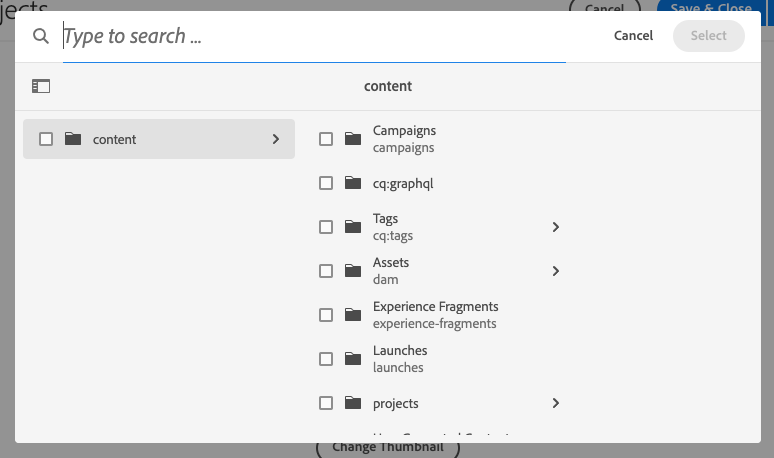

# Remoção do índice Lucene genérico {#generic-lucene-index-removal}

O Adobe pretende remover o índice &quot;Lucene genérico&quot; (`/oak:index/lucene-*`) do Adobe Experience Manager as a Cloud Service. Este índice está obsoleto desde o AEM 6.5. Neste documento, o impacto desta decisão é descrito, juntamente com descrições detalhadas sobre como examinar se uma instância do AEM é afetada. Ele também contém maneiras de alterar as consultas para que elas continuem a funcionar sem o índice Lucene genérico.

## Fundo {#background}

No AEM, as consultas de texto completo são aquelas que usam as seguintes funções:

* `jcr:contains()` em XPATH JCR
* `CONTAINS` em JCR-SQL2

Essas consultas não podem retornar resultados sem usar um índice. Ao contrário de uma consulta que contém apenas restrições de caminho ou propriedade, uma consulta que contém uma restrição de texto completo para a qual nenhum índice pode ser encontrado (e, portanto, um percurso é executado) sempre retornará zero resultado.

O índice Lucene genérico (`/oak:index/lucene-*`) existe desde o AEM 6.0 / Oak 1.0 para fornecer uma pesquisa de texto completo na maior parte da hierarquia do repositório, embora alguns caminhos, como `/jcr:system` e `/var`, sempre tenham sido excluídos disso. No entanto, esse índice foi amplamente substituído por índices em tipos de nó mais específicos (por exemplo, `damAssetLucene-*` para o tipo de nó `dam:Asset`), que oferecem suporte a pesquisas completas de texto e propriedades.

No AEM 6.5, o índice Lucene genérico foi marcado como obsoleto, indicando que seria removido em versões futuras. Desde então, um WARN foi registrado quando o índice foi usado, conforme ilustrado pelo seguinte trecho de log:

```text
org.apache.jackrabbit.oak.plugins.index.lucene.LucenePropertyIndex This index is deprecated: /oak:index/lucene-2; it is used for query Filter(query=select [jcr:path], [jcr:score], * from [nt:base] as a where contains(*, 'search term') and isdescendantnode(a, '/content/mysite') /* xpath: /jcr:root/content/mysite//*[jcr:contains(.,"search term")] */ fullText="search" "term", path=/content/mysite//*). Change the query or the index definitions.
```

Em versões recentes do AEM, o índice Lucene genérico foi usado para suportar um número muito pequeno de recursos. Eles estão sendo retrabalhados para usar outros índices ou modificados para remover a dependência desse índice.

Por exemplo, consultas de pesquisa de referência, como no exemplo a seguir, agora devem usar o índice em `/oak:index/pathreference`, que indexa somente `String` valores de propriedade que correspondem a uma expressão regular que procura caminhos JCR.

```text
//*[jcr:contains(., '"/content/dam/mysite"')]
```

Para oferecer suporte a volumes maiores de dados do cliente, o Adobe não cria mais o índice Lucene genérico em novos ambientes AEM as a Cloud Service. Além disso, o Adobe remove o índice dos repositórios existentes. [Consulte a linha do tempo](#timeline) no final deste documento para obter mais detalhes.

O Adobe já ajustou os custos de índice por meio das propriedades `costPerEntry` e `costPerExecution` para garantir que outros índices, como `/oak:index/pathreference`, sejam usados de forma preferencial sempre que possível.

Os aplicativos do cliente que usam consultas que ainda dependem desse índice devem ser atualizados imediatamente para usar outros índices existentes, que podem ser personalizados, se necessário. Como alternativa, novos índices personalizados podem ser adicionados ao aplicativo do cliente. Instruções completas sobre o gerenciamento de índice no AEM as a Cloud Service podem ser encontradas na [documentação sobre indexação](/help/operations/indexing.md).

## Você É Afetado? {#are-you-affected}

O índice Lucene genérico é usado atualmente como um fallback se nenhum outro índice de texto completo puder atender a uma consulta. Quando esse índice obsoleto é usado, uma mensagem semelhante à seguinte é registrada no nível de AVISO:

```text
org.apache.jackrabbit.oak.plugins.index.lucene.LucenePropertyIndex This index is deprecated: /oak:index/lucene-2; it is used for query Filter(query=select [jcr:path], [jcr:score], * from [nt:base] as a where contains(*, 'test') /* xpath: //*[jcr:contains(.,"test")] */ fullText="test", path=*). Change the query or the index definitions.
```

Em algumas circunstâncias, o Oak pode tentar usar outro índice de texto completo (como `/oak:index/pathreference`) para dar suporte à consulta de texto completo, mas se a cadeia de caracteres de consulta não corresponder à expressão regular na definição do índice, uma mensagem será registrada em nível WARN e a consulta provavelmente não retornará resultados.

```text
org.apache.jackrabbit.oak.query.QueryImpl Potentially improper use of index /oak:index/pathReference with queryFilterRegex (["']|^)/ to search for value "test"
```

Depois que o índice Lucene genérico for removido, uma mensagem como mostrado abaixo será registrada no nível WARN se uma consulta de texto completo não conseguir localizar nenhuma definição de índice adequada:

```text
org.apache.jackrabbit.oak.query.QueryImpl Fulltext query without index for filter Filter(query=select [jcr:path], [jcr:score], * from [nt:base] as a where contains(*, 'test') /* xpath: //*[jcr:contains(.,"test")] */ fullText="test", path=*); no results are returned
```

>[!IMPORTANT]
>
>**Ação do cliente necessária**
>
> Se qualquer uma das mensagens de aviso acima for registrada, talvez seja necessário reprocessar a consulta para usar um índice de texto completo diferente ou fornecer um novo índice para dar suporte à consulta.
>
>Detalhes dos tipos de dependências que você pode ver e como resolvê-los são fornecidos nas seções a seguir.

## Dependências potenciais em índices Lucene genéricos {#potential-dependencies}

Há várias áreas em que seus aplicativos e instalações de AEM podem ser dependentes dos índices Lucene genéricos nas instâncias de autor e publicação.

### Instância de publicação {#publish-instance}

#### Consultas de aplicativo personalizadas {#custom-application-queries}

A fonte mais comum de consultas usando o índice Lucene genérico em uma instância de publicação são consultas de aplicativo personalizadas.

Nos casos mais simples, essas consultas podem ser sem nenhum tipo de nó especificado, o que implica `nt:base` ou `nt:base` especificados explicitamente, como:

```text
/jcr:root/content/mysite//*[jcr:contains(., 'search term')]
/jcr:root/content/mysite//element(*, nt:base)[jcr:contains(., 'search term')]
```

>[!IMPORTANT]
>
>**Ação do cliente necessária**
>
>As consultas acima devem ser modificadas para usar um tipo de nó apropriado, conforme detalhado na seção a seguir.

Por exemplo, as consultas podem ser modificadas para retornar resultados que correspondam a páginas ou a qualquer agregação abaixo de `cq:Page node`. Assim, o query poderia se tornar:

```text
/jcr:root/content/mysite//element(*, cq:Page)[jcr:contains(., 'search term')]
```

Em outros casos, uma consulta pode especificar um tipo de nó, mas conter uma restrição de texto completo que não pode ser tratada por outro índice de texto completo, como:

```text
/jcr:root/content/dam//element(*, dam:Asset)[jcr:contains(jcr:content/metadata/@cq:tags, 'NewsTopics:cateogries/domestic'))]
```

Nesse caso, a consulta tem o tipo de nó `dam:Asset`, mas contém uma restrição de texto completo na propriedade relativa `jcr:content/metadata/@cq:tags`.

Esta propriedade não está marcada como analisada no índice `damAssetLucene`, que é o índice de texto completo mais usado para consultas no tipo de nó `dam:Asset`. Portanto, esse índice não pode ser usado para essa consulta.

Dessa forma, a consulta retorna ao índice de texto completo genérico em que todas as propriedades incluídas são marcadas como analisadas pela correspondência curinga em `/oak:index/lucene-2/indexRules/nt:base/properties/prop`.

>[!IMPORTANT]
>
>**Ação do cliente necessária**
>
>Marcar a propriedade `jcr:content/metadata/@cq:tags` como analisada em uma versão personalizada do índice `damAssetLucene` faz com que essa consulta seja tratada por esse índice e nenhum AVISO é registrado.

### Instância do autor {#author-instance}

Além de consultas em servlets de aplicativos do cliente, componentes OSGi e scripts de renderização, pode haver vários usos específicos do autor do índice Lucene genérico.

#### Pesquisa de referência {#reference-search}

Historicamente, o índice Lucene genérico foi usado para oferecer suporte à pesquisa de referência ou à pesquisa de conteúdo que contém referências a outro caminho de conteúdo. Essas consultas já devem ter sido atualizadas para usar o novo índice `/oak:index/pathreference`.

#### Pesquisa do Seletor de Campo de Caminho {#picker-search}

AEM inclui um componente de caixa de diálogo personalizado com o tipo de recurso Sling `granite/ui/components/coral/foundation/form/pathfield`, que fornece um navegador/seletor para selecionar outro caminho AEM. O seletor de campo de caminho padrão, que é usado quando nenhuma propriedade `pickerSrc` personalizada é definida na estrutura do conteúdo, renderiza uma barra de pesquisa na caixa de diálogo pop-up.

Os tipos de nó nos quais pesquisar podem ser especificados usando a propriedade `nodeTypes`.

No momento, se nenhuma propriedade `nodeTypes` estiver presente, a consulta de pesquisa subjacente usará o tipo de nó `nt:base` e, portanto, é provável que use o índice Lucene genérico, normalmente registrando mensagens de AVISO semelhantes às seguintes.

```text
20.01.2022 18:56:06.412 *WARN* [127.0.0.1 [1642704966377] POST /mnt/overlay/granite/ui/content/coral/foundation/form/pathfield/picker.result.single.html HTTP/1.1] org.apache.jackrabbit.oak.plugins.index.lucene.LucenePropertyIndex This index is deprecated: /oak:index/lucene-2; it is used for query Filter(query=select [jcr:path], [jcr:score], * from [nt:base] as a where contains(*, 'test') and isdescendantnode(a, '/content') /* xpath: /jcr:root/content//element(*, nt:base)[(jcr:contains(., 'test'))] order by @jcr:score descending */ fullText="test", path=/content//*). Change the query or the index definitions.
```

Antes da remoção do índice Lucene genérico, o componente `pathfield` será atualizado para que a caixa de pesquisa fique oculta para componentes que usam o seletor padrão, que não fornecem uma propriedade `nodeTypes`.

| Seletor de campo de caminho com pesquisa | Seletor de campo de caminho sem pesquisa |
|---|---|
|  |  |

>[!IMPORTANT]
>
>**Ação do cliente necessária**
>
>Se o cliente quiser manter a funcionalidade de pesquisa no seletor de campo de caminho, uma propriedade `nodeTypes` deverá ser fornecida listando os tipos de nó que ele deseja consultar. Eles podem ser especificados como uma lista separada por vírgulas de tipos de nó em uma propriedade `String`. Se nenhuma pesquisa for necessária, nenhuma ação será necessária por parte do cliente.

>[!NOTE]
>
>O Editor de Modelos de Fragmentos de Conteúdo usa campos de caminho especializados com o tipo de recurso Sling `dam/cfm/models/editor/components/contentreference`.
>
> * No momento, esses executam consultas sem tipos de nó especificados, resultando no registro de um AVISO devido ao uso do índice Lucene genérico.
> * Em breve, as instâncias desses componentes assumirão automaticamente como padrão o uso dos tipos de nó `cq:Page` e `dam:Asset` sem mais ações do cliente.
> * A propriedade `nodeTypes` pode ser adicionada para substituir esses tipos de nó padrão.

## Linha de tempo para remoção de Lucene genérico {#timeline}

O Adobe terá uma abordagem de duas fases para remover o índice Lucene genérico.

* **Fase 1** (início planejado para 31 de janeiro de 2022): não crie mais o `/oak:index/lucene-*` em novos ambientes do AEM as a Cloud Service.
* **Fase 2** (início planejado para 31 de março de 2022): remover o índice `/oak:index/lucene-*` dos ambientes existentes do AEM as a Cloud Service.

O Adobe monitorará as mensagens de log anotadas acima e tentará entrar em contato com clientes que permanecem dependentes do índice Lucene genérico.

Como uma mitigação de curto prazo, o Adobe adiciona definições de índice personalizadas diretamente aos sistemas do cliente para evitar problemas funcionais ou de desempenho como resultado da remoção do índice Lucene genérico, conforme necessário.

Nesses casos, o cliente recebe a definição de índice atualizada e é aconselhado que a inclua em versões futuras de seu aplicativo por meio do Cloud Manager.
