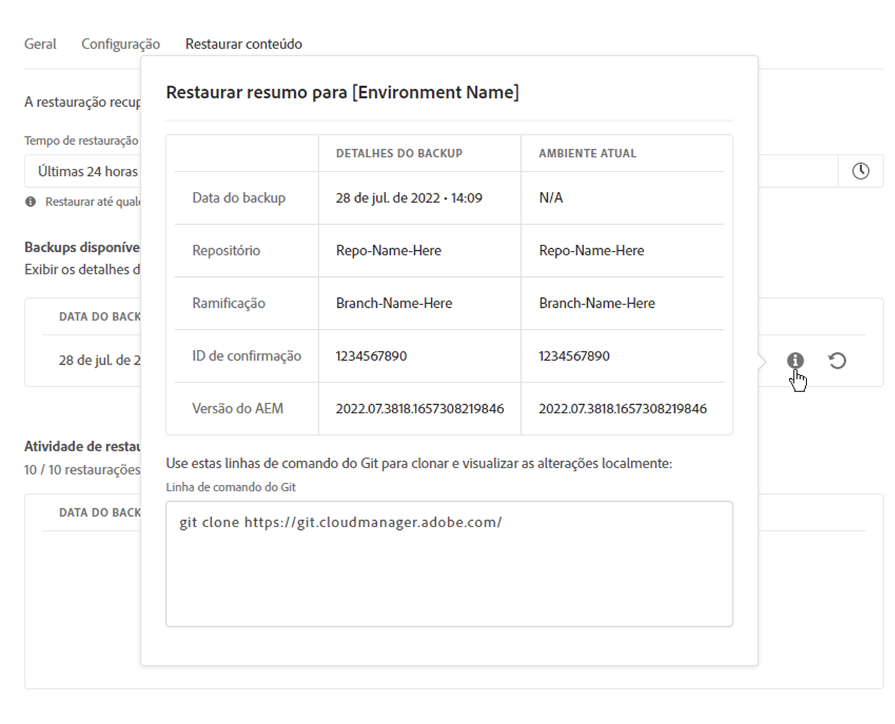
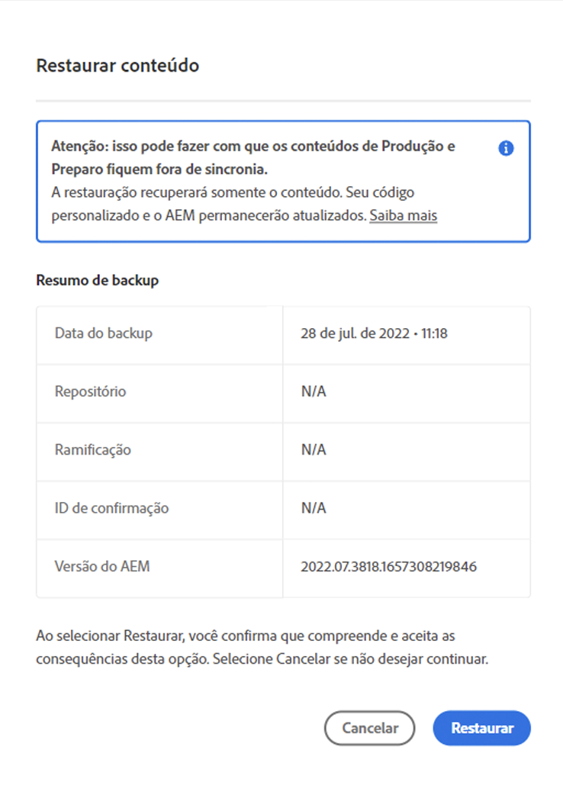
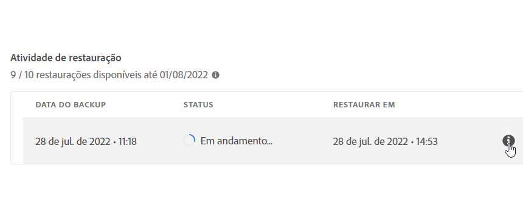

# Restaurar conteúdo no AEM como uma Cloud Service {#content-restore}

É possível restaurar suas AEM como conteúdo de Cloud Service de backup usando o Cloud Manager.

O processo de restauração de autoatendimento do Cloud Manager copia dados de backups de sistema da Adobe e os restaura em seu ambiente original. Uma restauração é realizada para retornar os dados, que foram perdidos, danificados ou excluídos acidentalmente, à sua condição original.

O processo de restauração afeta apenas o conteúdo, deixando o código e a versão do AEM inalterados. Você pode iniciar uma operação de restauração de ambientes individuais a qualquer momento.

Se você precisar restaurar o código-fonte implantado anteriormente de maneira fácil e rápida, sem a necessidade de start uma nova execução de pipeline, você pode usar [Restaurar Anterior Code Implantado](/help/operations/restore-previous-code-deployed.md).

O Cloud Manager fornece dois tipos de backups, a partir dos quais você pode restaurar o conteúdo.

* **Ponto no tempo (PIT):** essa opção restaura os backups contínuos capturados nas últimas 24 horas.
* **Semana passada:** esse tipo restaura a partir de backups de sistema dos últimos sete dias, exceto as últimas 24 horas.

Em ambos os casos, a versão do código personalizado e da AEM versão permanecem inalteradas.

>[!TIP]
>
>Também é possível restaurar backups [usando a API](https://developer.adobe.com/experience-cloud/cloud-manager/reference/api/) pública.

>[!WARNING]
>
>* Este recurso só deve ser usado quando houver sérios problemas com o código ou o conteúdo.
>* Restaurar uma backup exclui todos os dados adicionados após esse backup. O armazenamento temporário também reverte para sua versão anterior.
>* Antes de iniciar uma restauração conteúdo, considere outras opções seletivas conteúdo restauração.

## Opções seletivas de restauração do conteúdo {#selective-options}

Antes de restaurar a uma restauração conteúdo completa, considere essas opções para restaurar seus conteúdo mais facilmente.

* Se um pacote para o caminho excluído estiver disponível, instale o pacote novamente usando o [Gerenciador de pacotes](/help/implementing/developing/tools/package-manager.md).
* Se o caminho excluído for uma página no Sites, use a [função](/help/sites-cloud/authoring/sites-console/page-versions.md) Restaurar árvore.
* Se o caminho excluído for uma pasta ativos e os arquivos originais estiverem disponíveis novamente, re-upload-los através [do console](/help/assets/add-assets.md) Assets.
* Se as conteúdo de exclusão forem ativos, considere [restaurar as versões anteriores do ativos](/help/assets/manage-digital-assets.md).

Se nenhuma das opções acima funcionar e o conteúdo do caminho excluído for significativo, realize uma restauração conteúdo conforme detalhado nas seções a seguir.

## função de Criar usuário {#user-role}

Por padrão, nenhuma usuário permissão tem conteúdo para executar restaurações em ambientes de desenvolvimento, produção ou preparo. Para delegar esse permissão a usuários ou grupos específicos, use as seguintes etapas gerais.

1. Criar um perfil de produto com um nome expressivo que se refere à restauração conteúdo.
1. Forneça o **permissão de Acesso** ao Programa na programa necessária.
1. Forneça a **Criar** de Restauração do Ambiente permissão da ambiente necessária ou de todos os ambientes da programa, dependendo do seu caso de uso.
1. Atribua usuários a essa perfil.

Para obter detalhes sobre como gerenciar permissões, consulte [Permissões personalizadas](/help/implementing/cloud-manager/custom-permissions.md).

## Restaurar a conteúdo de um ambiente {#restoring-content}

>[!NOTE]
>
>Um usuário deve ter [as permissões apropriadas](#user-role) para iniciar uma operação de restauração.

**Para restaurar a conteúdo de uma ambiente:**

1. Faça logon no Cloud Manager, em [my.cloudmanager.adobe.com](https://my.cloudmanager.adobe.com/), e selecione a organização apropriada.

1. Clique na programa para a qual deseja iniciar uma restauração.

1. Liste todos os ambientes para o programa seguindo um destes procedimentos:

   * No menu do lado esquerdo, em **Serviços**, clique  de ícone **&#x200B;**&#x200B;de dados.

     

   * No menu lateral esquerdo, em Programa, clique **em Visão geral**, em seguida, no **ícone Ambientes** cartão, clique **no ícone** .**&#x200B;**

     

     >[!NOTE]
     >
     >O **cartão ambientes** lista apenas três ambientes. Clique **Exibir Tudo** no cartão para ver *todos os* ambientes do programa.

1. Na tabela Ambientes, à direita de uma ambiente cujas conteúdo que você deseja restaurar, clique  de menu elipse e, em seguida, clique **em Restaurar conteúdo**.

   

1. **Na guia Restaurar conteúdo** da página do ambiente, na hora de restaurar **o** lista suspenso, selecione o intervalo de tempo da restauração.

   

   * Se você escolheu **Últimas 24 horas**, no campo Hora **adjacente**, especifique o tempo exato nas últimas 24 horas para restaurar.
   * Se você escolheu **Semana passada**, no campo Dia **adjacente**, selecione uma data nos últimos sete dias, excluindo as 24 horas anteriores.

1. Depois de selecionar uma data ou especificar uma hora, a seção **Backups disponíveis** abaixo mostra uma lista de backups disponíveis que podem ser restaurados

1. Clique  Informações ao lado de um backup para ver sua versão de código e AEM lançamento, em seguida, pondere o impacto da restauração antes de selecionar uma backup (consulte [Escolher a backup](#choosing-backup) certa).

   

   O carimbo de data e hora exibido para as opções de restauração é baseado no fuso horário do computador da usuário.

1. No final da linha que representa a backup que deseja restaurar, clique  para start o processo de restauração.

1. Revise os detalhes na caixa de diálogo Restaurar conteúdo **e clique** em **Restaurar**.

   

O processo de backup é iniciado. Você pode visualização seu status na **[lista Restaurar atividade](#restore-activity)** . O tempo necessário para a conclusão de uma operação de restauração depende do tamanho e do perfil do conteúdo que está sendo restaurado.

Quando a restauração é concluída com êxito, a ambiente faz o seguinte:

* Executa o mesmo código e AEM versão como no momento de iniciar a operação de restauração.
* Ele tem o mesmo conteúdo que estava disponível no carimbo de data e hora do instantâneo escolhido, com os índices reconstruídos para corresponder ao código atual.

## Escolha o backup certo {#choosing-backup}

O processo de restauração autoatendimento Cloud Manager restaura apenas o conteúdo para o AEM. Por esta razão, você deve considerar cuidadosamente as alterações de código que foram feitas entre o seu ponto de restauração desejado e o horário atual. Revise o histórico de commit entre a ID de commit atual e a que está sendo restaurada.

Existem vários cenários.

* O ambiente código personalizado e a restauração estão na mesma repositório e no mesmo ramificação.
* O ambiente código personalizado e a restauração compartilham uma repositório, usam um ramificação separados e se originam de um commit comum.
* O ambiente código personalizado e a restauração estão em diferentes repositórios.
   * Nesse caso, uma ID de confirmação não é exibida.
   * Adobe Systems recomenda clonar ambos os repositórios e usar um ferramenta de diferencial para comparar as ramificações.

Além disso, lembre-se de que uma restauração pode fazer com que seus ambientes de produção e preparo caiam fora de sincronizar. Você é responsável pelas consequências da restauração do conteúdo.

## Restaurar atividade {#restore-activity}

A **Atividade** de restauração lista mostra o status das dez solicitações de restauração mais recentes, incluindo quaisquer operações de restauração ativas.

Ao clicar  Informações para um backup, você pode baixar logs para esse backup e inspecionar os detalhes do código, incluindo as diferenças entre o instantâneo e os dados no momento em que a restauração foi iniciada.

## backup externos {#offsite-backup}

Os backups normais protegem contra o risco de exclusões acidentais ou falhas técnicas nos serviços em nuvem do AEM, mas riscos adicionais podem surgir da falha de uma região. Além da disponibilidade, o maior risco durante interrupções em uma região é a perda de dados.

AEM como Cloud Service atenua esse risco para todos os ambientes de produção AEM. Ou seja, copia continuamente todas as AEM conteúdo para um região remoto. Esse processo disponibiliza o conteúdo para recuperação por três meses. Esse recurso é conhecido como um backup externo.

AEM Engenharia de confiabilidade do serviço restaura os ambientes de preparação e produção AEM Cloud Service de backups fora do local durante interrupções no região de dados.

## Princípios de mapeamento da região de dados {#data-region-mapping-principles}

Adobe Systems segue um conjunto de diretrizes internas para determinar os mapeamentos de região de dados para **AEM como Cloud Service**. Essas diretrizes são projetadas para apoiar a eficiência operacional, garantir o cumprimento dos requisitos regulatórios regionais e fornecer uma experiência do cliente consistente nos mercados globais.

### Transparência de mapeamento de região {#region-mapping-transparency}

Adobe Systems não divulga publicamente informações detalhadas de mapeamento região para região.\
Se os clientes tiverem questões específicas ou justificadas sobre implantação regionais, residência de dados ou implicações de conformidade, recomenda-se entrar em contato com Adobe Systems diretamente por meio de suporte oficial ou conta canais.

### Princípios principais do mapeamento da região de dados {#core-principles}

Ao determinar um mapeamento de região de dados adequado, Adobe Systems aplica vários critérios priorizados:

1. **Não deixe o região global**\
   As implantações permanecem dentro de uma das principais regiões globais: **APAC**, **EMEA** e **Américas**.

2. **Não deixe o continente**\
   Sempre que possível, replicação de dados e failover permanecem no mesmo continente.

3. **Não deixe o país**\
   Se tecnicamente viável, os dados permanecem dentro das mesmas fronteiras nacionais.

### Tratamento de exceções {#handling-exceptions}

Quando os critérios acima não podem ser cumpridos devido a limitações técnicas ou de infraestrutura, Adobe Systems aplica considerações adicionais:

* **Diretrizes específicas para a Europa**\
  O backup ou regiões secundárias não devem estar localizados em países fora da UE.\
  (O inverso, usando um país da UE como backup para primárias fora da UE, pode ser aceitável se não existir uma melhor opção para o mesmo país.)

* **Evitar regiões específicas**\
  Regiões com políticas de dados restritivas ou risco regulatório aumentado devem ser evitadas como locais backup ou contra falhas.

Se os clientes exigirem esclarecimentos ou tiverem necessidades orientadas pela conformidade, Adobe Systems recomenda entrar em contato com os Adobe Systems conta equipe ou organização de apoio para orientações adaptadas ao seu cenário específico.

## Limitações           {#limitations}

O uso do mecanismo de restauração de autoatendimento está sujeito às seguintes limitações.

* As operações de restauração são limitadas a sete dias, o que significa que não é possível restaurar um instantâneo com mais de sete dias.
* No máximo dez restaurações bem-sucedidas são permitidas em todos os ambientes em um programa por mês.
* Após a criação do ambiente, pode levar até seis horas para que o primeiro instantâneo de backup seja criado. Até que esse instantâneo seja criado, nenhuma restauração poderá ser executada no ambiente.
* Uma operação de restauração não é iniciada se houver um pipeline de configuração de nível de web completo em execução para o ambiente.
* Uma restauração não pode ser iniciada se outra restauração já estiver em execução na mesma ambiente.
* Em casos raros, devido ao limite de 24 horas/sete dias para backups, o backup selecionado pode se tornar indisponível devido a um atraso entre o momento em que foi selecionado e o momento em que a restauração é iniciada.
* Os dados de ambientes excluídos são perdidos permanentemente e não podem ser recuperados.
