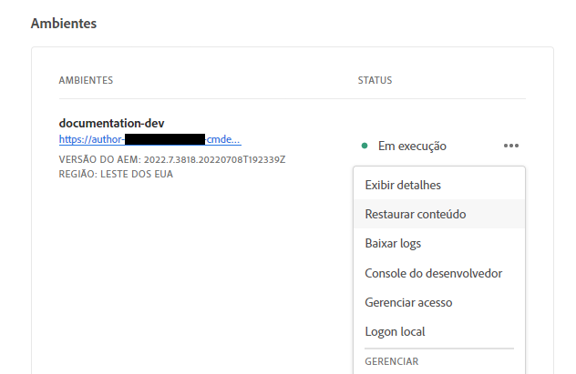
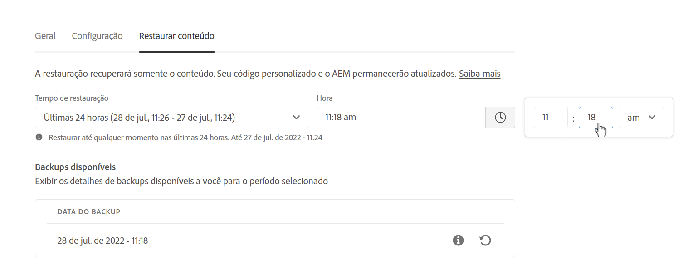
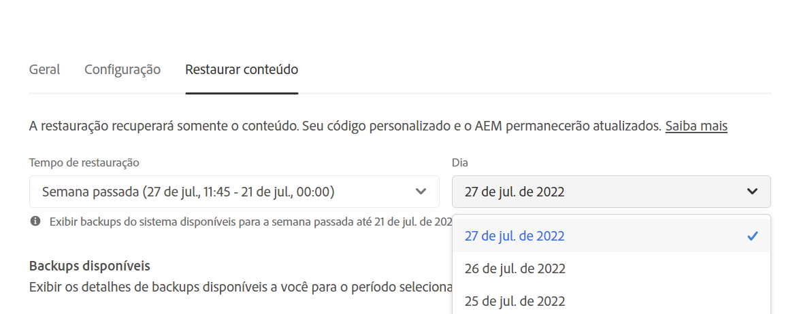
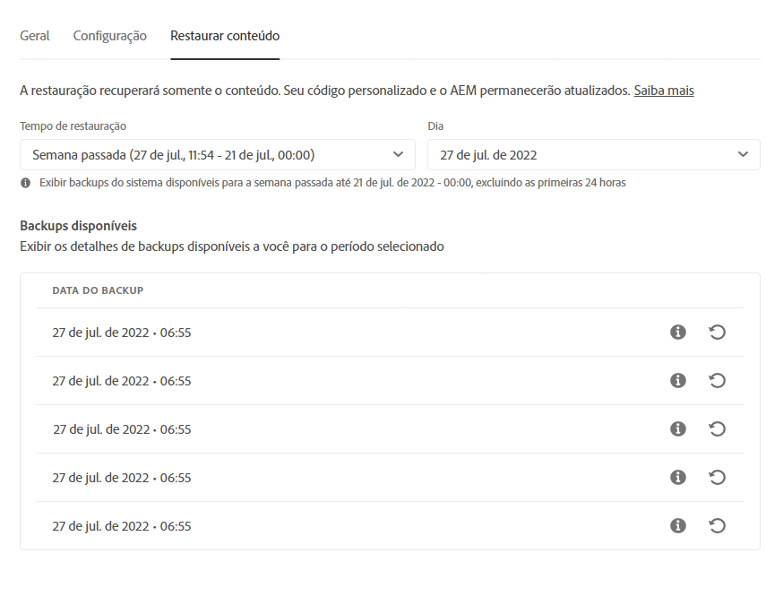

# Restauração de conteúdo no AEM as a Cloud Service {#content-restore}

Saiba como restaurar conteúdo do backup no AEM as a Cloud Service usando o Cloud Manager.

## Visão geral {#overview}

O processo de restauração de autoatendimento do Cloud Manager copia dados de backups de sistema da Adobe e os restaura em seu ambiente original. Uma restauração é executada para retornar dados que foram perdidos, danificados ou acidentalmente excluídos à sua condição original.

O processo de restauração afeta apenas o conteúdo, deixando o código e a versão do AEM inalterados. Você pode iniciar uma operação de restauração de ambientes individuais a qualquer momento.

O Cloud Manager fornece dois tipos de backups, a partir dos quais você pode restaurar o conteúdo.

* **Ponto no Tempo (PIT):** esse tipo restaura a partir de backups de sistema contínuos das últimas 24 horas, contadas a partir da hora atual.
* **Semana passada:** esse tipo restaura a partir de backups de sistema dos últimos sete dias, exceto as últimas 24 horas.

Em ambos os casos, a versão do código personalizado e a versão do AEM permanecem inalteradas.

>[!TIP]
>
>Também é possível restaurar backups [usando a API pública](https://developer.adobe.com/experience-cloud/cloud-manager/reference/api/).

>[!WARNING]
>
>* Esse recurso só deve ser usado quando houver problemas graves com código ou conteúdo.
>* A restauração de um backup resultará na perda de dados recentes entre o momento do backup e o presente. O preparo também é restaurado para a versão antiga.
>* Antes de iniciar uma restauração de conteúdo, considere outras opções de restauração seletiva de conteúdo.

## Opções de restauração de conteúdo seletivo {#selective-options}

Antes de restaurar para uma restauração completa do conteúdo, considere essas opções para restaurar seu conteúdo com mais facilidade.

* Se um pacote para o caminho excluído estiver disponível, instale-o novamente usando o [Gerenciador de Pacotes](/help/implementing/developing/tools/package-manager.md).
* Se o caminho excluído era uma página no Sites, use a [função Restaurar Árvore](/help/sites-cloud/authoring/sites-console/page-versions.md).
* Se o caminho excluído era uma pasta de ativos e os arquivos originais estão disponíveis, carregue-os novamente via [console do Assets](/help/assets/add-assets.md).
* Se o conteúdo excluído fosse de ativos, considere [restaurar versões anteriores dos ativos](/help/assets/manage-digital-assets.md).

Se nenhuma das opções acima funcionar e o conteúdo do caminho excluído for significativo, execute uma restauração de conteúdo, conforme detalhado nas seções a seguir.

## Criar função de usuário {#user-role}

Por padrão, nenhum usuário terá permissão para executar restaurações de conteúdo em ambientes de desenvolvimento, produção ou preparo. Para delegar essa permissão a usuários ou grupos específicos seguindo essas etapas gerais.

1. Crie um perfil de produto com um nome expressivo que se refere à restauração do conteúdo.
1. Forneça a permissão **Acesso ao Programa** no programa necessário.
1. Forneça a permissão **Criar Restauração do Ambiente** no ambiente necessário para todos os ambientes do programa, dependendo do seu caso de uso.
1. Atribuir usuários a esse perfil de perfil.

Para obter detalhes sobre o gerenciamento de permissões, consulte a documentação de [Permissões personalizadas](/help/implementing/cloud-manager/custom-permissions.md).

## Restauração de conteúdo {#restoring-content}

Primeiro, determine o intervalo de tempo do conteúdo que você deseja restaurar. Em seguida, para restaurar o conteúdo do ambiente a partir de um backup, execute essas etapas.

>[!NOTE]
>
>Um usuário deve ter [permissões apropriadas](#user-role) para iniciar uma operação de restauração.

1. Faça logon no Cloud Manager, em [my.cloudmanager.adobe.com](https://my.cloudmanager.adobe.com/), e selecione a organização apropriada.

1. Clique no programa para o qual deseja iniciar uma restauração.

1. Na página **Visão geral do programa**, no cartão **Ambientes**, clique no botão de reticências ao lado do ambiente para o qual deseja iniciar uma restauração e selecione **Restaurar conteúdo**.

   

   * Como alternativa, você pode navegar diretamente para a guia **Restaurar conteúdo** da página de detalhes de um ambiente específico.

1. Na guia **Restaurar conteúdo** da página de detalhes do ambiente, selecione primeiro o período da restauração na lista suspensa **Tempo para restaurar**.

   1. Se você selecionar **Últimas 24 horas**, o campo **Hora** ao lado permitirá que você especifique a hora exata a ser restaurada dentre as últimas 24 horas.

      

   1. Se você selecionar **Semana passada**, o campo **Dia** ao lado permitirá selecionar uma data dentre os últimos sete dias, exceto as 24 horas anteriores.

      

1. Depois de selecionar uma data ou especificar uma hora, a seção **Backups disponíveis** abaixo mostra uma lista de backups disponíveis que podem ser restaurados

   

1. Encontre o backup que deseja restaurar usando o ícone de informações para exibir informações sobre a versão do código e do AEM incluídas nesse backup e considere as implicações de uma restauração ao [escolher o backup](#choosing-the-right-backup).

   

   * O carimbo de data e hora exibido nas opções de restauração é baseado no fuso horário do computador do usuário.

1. Clique no ícone **Restaurar** na extremidade direita da linha que representa o backup que você deseja restaurar para iniciar o processo de restauração.

1. Revise os detalhes na caixa de diálogo **Restaurar conteúdo** antes de confirmar sua solicitação clicando em **Restaurar**.

   

O processo de backup foi iniciado e você pode visualizar seu status na lista **[Atividade de Restauração](#restore-activity)**. O tempo necessário para a conclusão de uma operação de restauração depende do tamanho e do perfil do conteúdo que está sendo restaurado.

Quando a restauração for concluída com sucesso, o ambiente:

* Executará o mesmo código e versão do AEM do momento de início da operação de restauração.
* Terá o mesmo conteúdo que estava disponível no carimbo de data e hora do instantâneo escolhido, com os índices recriados para corresponder ao código atual.

## Escolher o backup certo {#choosing-backup}

O processo de restauração de autoatendimento do Cloud Manager restaura apenas o conteúdo no AEM. Por isso, você deve considerar cuidadosamente as alterações de código que foram feitas entre o ponto de restauração desejado e o horário atual, revisando o histórico de confirmações entre a ID de confirmação atual e a que está sendo restaurada.

Existem vários cenários.

* O código personalizado no ambiente e a restauração estão no mesmo repositório e na mesma ramificação.
* O código personalizado no ambiente e a restauração estão no mesmo repositório, mas em uma ramificação diferente com uma confirmação em comum.
* O código personalizado no ambiente e a restauração estão em repositórios diferentes.
   * Nesse caso, uma ID de confirmação não será exibida.
   * É recomendável clonar ambos os repositórios e usar uma ferramenta para comparar as ramificações.

Além disso, lembre-se de que uma restauração pode fazer com que seus ambientes de produção e de preparo fiquem fora de sincronia. Você é responsável pelas consequências da restauração do conteúdo.

## Atividades de restauração {#restore-activity}

A lista **Atividade de Restauração** mostra o status das dez solicitações de restauração mais recentes, incluindo quaisquer operações de restauração ativas.

Ao clicar no ícone de informações de um backup, é possível baixar logs desse backup e inspecionar os detalhes do código, incluindo as diferenças entre o instantâneo e os dados no momento em que a restauração foi iniciada.

## Backup externo {#offsite-backup}

Os backups normais protegem contra o risco de exclusões acidentais ou falhas técnicas nos serviços em nuvem do AEM, mas riscos adicionais podem surgir da falha de uma região. Além da disponibilidade, o maior risco durante interrupções em uma região é a perda de dados.

O AEM as a Cloud Service reduz esse risco para todos os ambientes de produção do AEM, copiando continuamente todo o conteúdo do AEM para uma região remota e disponibilizando-o para recuperação por um período de três meses. Esse recurso é conhecido como backup externo.

A restauração dos serviços em nuvem do AEM para ambientes de preparo e produção a partir do backup externo é realizada pelo Serviço de engenharia de confiabilidade do AEM em caso de interrupções da região de dados.

## Limitações           {#limitations}

O uso do mecanismo de restauração de autoatendimento está sujeito às seguintes limitações.

* As operações de restauração são limitadas a sete dias, o que significa que não é possível restaurar um instantâneo com mais de sete dias.
* No máximo dez restaurações bem-sucedidas são permitidas em todos os ambientes em um programa por mês.
* Após a criação do ambiente, pode levar até seis horas para que o primeiro instantâneo de backup seja criado. Até que esse instantâneo seja criado, nenhuma restauração poderá ser executada no ambiente.
* Uma operação de restauração não será iniciada se houver uma pilha completa ou um pipeline de configuração de camada da Web em execução no momento para o ambiente.
* Uma restauração não pode ser iniciada se outra restauração já estiver em execução no mesmo ambiente.
* Em casos raros, devido ao limite de 24 horas/sete dias para backups, o backup selecionado pode se tornar indisponível devido a um atraso entre o momento em que foi selecionado e o momento em que a restauração é iniciada.
* Os dados de ambientes excluídos são perdidos permanentemente e não podem ser recuperados.
