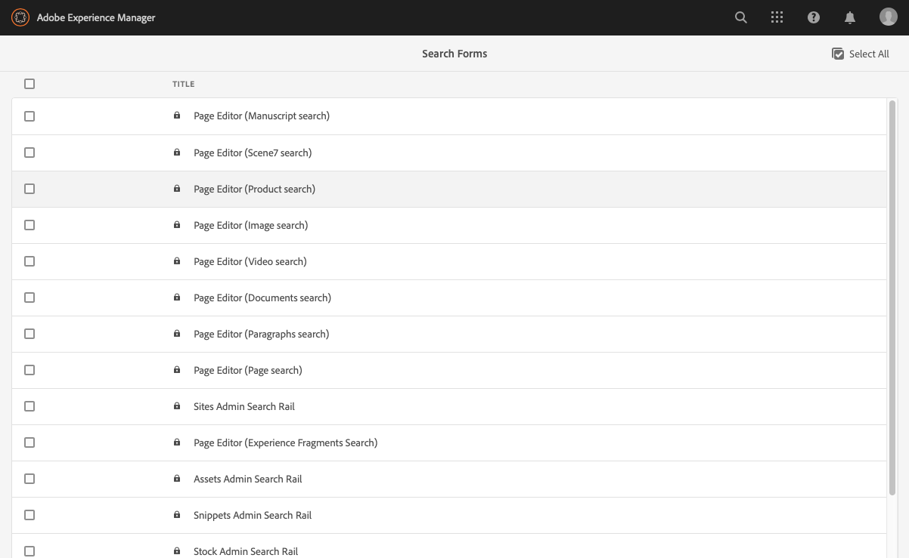

# Configuração de formulários de pesquisa {#configuring-search-forms}

Use o **Search Forms** para personalizar a seleção de predicados de pesquisa usados nos painéis de pesquisa disponíveis em vários consoles AEM e/ou painéis do ambiente do autor. A personalização desses painéis torna a funcionalidade de pesquisa versátil de acordo com suas necessidades específicas.

Uma [variedade de](#predicates-and-their-settings)predicados está disponível prontamente.

Você pode [configurar os formulários](#configuring-your-search-forms) de pesquisa usados em vários consoles e no navegador de ativos (ao editar páginas). As [caixas de diálogo para configurar esses formulários](#configuring-your-search-forms) podem ser acessadas por meio de:

* **Ferramentas**

   * **Geral**

      * **Formulários de pesquisa**

Ao acessar esse console pela primeira vez, você pode ver que todas as configurações têm um símbolo de cadeado. Isso indica que a configuração apropriada é a configuração padrão (out-of-the-box) e não pode ser excluída. Depois de personalizar a configuração, o bloqueio desaparecerá - a menos que você [exclua sua configuração](#deleting-a-configuration-to-reinstate-the-default)personalizada, caso em que o padrão (e o indicador de cadeado) será reinstalado.

## Configurações {#configurations}

As configurações padrão (listadas em ordem alfabética) disponíveis são:

* **Trilho de pesquisa do administrador de ativos:**

   Essa configuração define as opções de pesquisa disponíveis para o usuário ao usar o console Ativos.

* **Editor de páginas (Pesquisa de documentos):**

   Essa configuração define as opções disponíveis ao procurar documentos no navegador de ativos (ao editar uma página).

* **Editor de páginas (Pesquisa de Fragmentos de experiência):**

   Essa configuração define as opções disponíveis ao pesquisar por Fragmentos de experiência no navegador de ativos (ao editar uma página).

* **Editor de páginas (Pesquisa de imagens):**

   Essa configuração define as opções disponíveis ao pesquisar por imagens no navegador de ativos (ao editar uma página).

* **Editor de páginas (Pesquisa de manuscrito):**

   Essa configuração define as opções disponíveis ao pesquisar por manuscritos no navegador de ativos (ao editar uma página).

* **Editor de páginas (Pesquisa de páginas):**

   Essa configuração define as opções disponíveis ao pesquisar por páginas no navegador de ativos (ao editar uma página).

* **Editor de páginas (Pesquisa de parágrafos):**

   Essa configuração define as opções disponíveis ao procurar parágrafos no navegador de ativos (ao editar uma página).

* **Editor de páginas (Pesquisa de produto):**

   Essa configuração define as opções disponíveis ao procurar produtos no navegador de ativos (ao editar uma página).

* **Editor de páginas (pesquisa do Scene7)**:

   Essa configuração define as opções disponíveis ao pesquisar recursos do Scene7 no navegador de ativos (ao editar uma página).

* **Editor de página (Pesquisa de vídeos)**:

   Essa configuração define as opções disponíveis ao procurar vídeos no navegador de ativos (ao editar uma página).

* **Trilho de pesquisa do administrador de projetos:**

   Essa configuração define as opções de pesquisa disponíveis para o usuário ao pesquisar projetos.

* **Painel de pesquisa de tradução de projetos:**

   Essa configuração define as opções de pesquisa disponíveis para o usuário ao pesquisar traduções do projeto.

* **Trilho de pesquisa do administrador de sites**:

   Essa configuração define as opções de pesquisa disponíveis para o usuário ao usar o painel de pesquisa do console Sites.

* **Painel de pesquisa do administrador de trechos**:

   Essa configuração define as opções de pesquisa disponíveis para o usuário ao pesquisar trechos.

* **Painel de pesquisa do Admin do Stock**:

   Essa configuração define as opções de pesquisa disponíveis para o usuário ao pesquisar no stock.

## Predicados e suas configurações {#predicates-and-their-settings}

### Predicados {#predicates}

Os seguintes predicados estão disponíveis, dependendo da configuração:

<table>
 <tbody>
  <tr>
   <th>Predicado</th>
   <th>Propósito</th>
   <th>Configurações</th>
  </tr>
  <tr>
   <td>Análise</td>
   <td>Recursos de pesquisa/filtro no navegador Sites ao mostrar dados ativados pelo Analytics. Os filtros de pesquisa do Analytics são carregados para corresponder às colunas de análise personalizadas mapeadas.</td>
   <td>
    <ul>
     <li>Rótulo do campo</li>
     <li>Descrição</li>
    </ul> </td>
  </tr>
  <tr>
   <td>Status de aprovação</td>
   <td>Pesquise de acordo com o status de aprovação.</td>
   <td>
    <ul>
     <li>Rótulo do campo</li>
     <li>Nome da Propriedade*</li>
     <li>Descrição</li>
    </ul> 
   </td>
  </tr>
  <tr>
   <td>Autor</td>
   <td>Pesquise de acordo com o autor.</td>
   <td>
    <ul>
     <li>Espaço reservado</li>
     <li>Nome da Propriedade*</li>
     <li>Descrição</li>
    </ul> 
   </td>
  </tr>
  <tr>
   <td>Retirado por</td>
   <td>Procure ativos cujo check-out foi feito por um usuário específico.</td>
   <td>
    <ul>
     <li>Rótulo do campo</li>
     <li>Espaço reservado</li>
     <li>Descrição</li>
    </ul> 
   </td>
  </tr>
  <tr>
   <td>Status da retirada</td>
   <td>Procure ativos com um status de check-out específico.</td>
   <td>
    <ul>
     <li>Rótulo do campo</li>
     <li>Nome da Propriedade*</li>
     <li>Descrição</li>
    </ul> 
   </td>
  </tr>
  <tr>
   <td>Componentes</td>
   <td>Permite que um autor pesquise/filtre por páginas que têm um componente específico nele. For example an image gallery.  </td>
   <td>
    <ul>
     <li>Espaço reservado</li>
     <li>Nome da Propriedade*</li>
     <li>Profundidade da propriedade</li>
     <li>Descrição</li>
    </ul> </td>
  </tr>
  <tr>
   <td>Intervalo de datas</td>
   <td>Pesquisar ativos criados em um intervalo especificado para uma propriedade de data. No painel Pesquisar, é possível especificar as datas de início e término.</td>
   <td>
    <ul>
     <li>Rótulo do campo</li>
     <li>Espaço reservado</li>
     <li>Nome da Propriedade*</li>
     <li>Texto do intervalo (de)*</li>
     <li>Texto do intervalo (até)*</li>
     <li>Descrição</li>
    </ul> </td>
  </tr>
  <tr>
   <td>Status da expiração</td>
   <td>Pesquisar ativos com base no status de expiração.</td>
   <td>
    <ul>
     <li>Rótulo do campo</li>
     <li>Nome da Propriedade*</li>
     <li>Descrição</li>
    </ul> </td>
  </tr>
  <tr>
   <td>Tamanho do arquivo</td>
   <td>Pesquisar ativos com base no tamanho.</td>
   <td>
    <ul>
     <li>Rótulo do campo</li>
     <li>Nome da Propriedade*</li>
     <li>Caminho de opção</li>
     <li>Descrição</li>
    </ul> </td>
  </tr>
  <tr>
   <td>Tipo de arquivo</td>
   <td>Pesquisar ativos com base no tipo de arquivo/mime.</td>
   <td>
    <ul>
     <li>Rótulo do campo</li>
     <li>Nome da Propriedade*</li>
     <li>Caminho Mimetype</li>
     <li>Descrição</li>
    </ul> 
   </td>
  </tr>
  <tr>
   <td>Texto completo</td>
   <td>Projetar pesquisa para pesquisas de texto completo.</td>
   <td>
    <ul>
     <li>Espaço reservado</li>
     <li>Nome da Propriedade</li>
     <li>Descrição</li>
    </ul> </td>
  </tr>
  <tr>
   <td>Grupo</td>
   <td>Predicado de pesquisa para grupo (usado somente no Predicado de insights).</td>
   <td>
    <ul>
     <li>Rótulo do campo</li>
     <li>Descrição</li>
    </ul> </td>
  </tr>
  <tr>
   <td>Filtro oculto</td>
   <td>Um filtro na propriedade e no valor, não visível para o usuário.</td>
   <td>
    <ul>
     <li>Nome da Propriedade*</li>
     <li>Valor da propriedade*</li>
     <li>Descrição</li>
    </ul> </td>
  </tr>
  <tr>
   <td>Insights</td>
   <td>Pesquisar de acordo com uma seleção de parâmetros do Insights.</td>
   <td>Este é um predicado complexo composto de vários predicados:
    <ul>
     <li>Grupo</li>
     <li>Intervalo</li>
     <li>Opções</li>
    </ul> 
   </td>
  </tr>
  <tr>
   <td>Membro da coleção</td>
   <td>Procurar ativos que sejam membros de uma coleção</td>
   <td>
    <ul>
     <li>Descrição</li>
    </ul> 
   </td>
  </tr>
  <tr>
   <td>Propriedade de valores múltiplos</td>
   <td>Pesquisar em vários valores de uma propriedade especificada.</td>
   <td>
    <ul>
     <li>Rótulo do campo</li>
     <li>Espaço reservado</li>
     <li>Nome da Propriedade*</li>
     <li>Suporte do delimitador</li>
     <li>Delimitadores de entrada</li>
     <li>Ignorar diferença entre maiúsculas e minúsculas</li>
     <li>Descrição</li>
    </ul> 
   </td>
  </tr>
  <tr>
   <td>Opções</td>
   <td>
As opções são nós de conteúdo criados pelo usuário.
 
Consulte <a href="#addinganoptionspredicate">Adicionando um Predicado</a> de opções para obter mais informações.
 </td>
   <td>
    <ul>
     <li>Rótulo do campo</li>
     <li>Nome da Propriedade*</li>
     <li>Única seleção</li>
     <li>Adicionar opções</li>
     <li>Manual</li>
     <li>Descrição</li>
    </ul> </td>
  </tr>
  <tr>
   <td>Propriedade de opções</td>
   <td>Pesquise em uma ou mais propriedades da opção.</td>
   <td>
    <ul>
     <li>Rótulo do campo</li>
     <li>Nome da Propriedade*</li>
     <li>Caminho do nó de opções</li>
     <li>Profundidade da propriedade</li>
     <li>Única seleção</li>
     <li>Descrição</li>
    </ul> </td>
  </tr>
  <tr>
   <td>Status da página</td>
   <td>Pesquisar páginas de acordo com seu status.</td>
   <td>
    <ul>
     <li>Rótulo do campo</li>
     <li>Nome da propriedade de publicação*</li>
     <li>Nome de propriedade das páginas bloqueadas*</li>
     <li>Descrição</li>
    </ul> </td>
  </tr>
  <tr>
   <td>Caminho</td>
   <td>Pesquisar ativos localizados em um caminho específico.</td>
   <td>
    <ul>
     <li>Rótulo do campo</li>
     <li>Adicionar caminhos de pesquisa</li>
     <li>Descrição</li>
    </ul> </td>
  </tr>
  <tr>
   <td>Navegador de caminhos</td>
   <td>Forneça um navegador de caminho para pesquisar.</td>
   <td>
    <ul>
     <li>Espaço reservado</li>
     <li>Caminho raiz</li>
     <li>Descrição</li>
    </ul> 
   </td>
  </tr>
  <tr>
   <td>Caminho oculto</td>
   <td>Um filtro no caminho, não visível para o usuário.</td>
   <td>
    <ul>
     <li>Nome da Propriedade (`path`)</li>
     <li>Valor da propriedade (`/content/dam`)</li>
    </ul> 
   </td>
  </tr>
  <tr>
   <td>Propriedade</td>
   <td>Pesquisar em uma propriedade especificada.</td>
   <td>
    <ul>
     <li>Rótulo do campo</li>
     <li>Espaço reservado</li>
     <li>Nome da Propriedade</li>
     <li>Pesquisa parcial</li>
     <li>Ignorar diferença entre maiúsculas e minúsculas</li>
     <li>Descrição</li>
    </ul> 
   </td>
  </tr>
  <tr>
   <td>Publicar status</td>
   <td>Pesquisar ativos com base em seu status de publicação</td>
   <td>
    <ul>
     <li>Rótulo do campo</li>
     <li>Nome da Propriedade*</li>
     <li>Descrição</li>
    </ul> </td>
  </tr>
  <tr>
   <td>Intervalo</td>
   <td>Pesquise os recursos dentro de um intervalo especificado. No painel Pesquisar, você pode especificar valores mínimos e máximos para o intervalo.</td>
   <td>
    <ul>
     <li>Rótulo do campo</li>
     <li>Nome da Propriedade*</li>
     <li>Descrição</li>
    </ul> </td>
  </tr>
  <tr>
   <td>Classificação</td>
   <td>Pesquisar ativos de acordo com sua classificação.  </td>
   <td>
    <ul>
     <li>Rótulo do campo</li>
     <li>Nome da Propriedade*</li>
     <li>Caminho de opção</li>
     <li>Descrição</li>
    </ul> </td>
  </tr>
  <tr>
   <td>Data relativa</td>
   <td>Pesquisar ativos com base na data relativa de sua criação  </td>
   <td>
    <ul>
     <li>Rótulo do campo</li>
     <li>Nome da Propriedade*</li>
     <li>Data relativa</li>
     <li>Descrição</li>
    </ul> </td>
  </tr>
  <tr>
   <td>Intervalo do controle deslizante</td>
   <td>Um predicado de pesquisa comum que estende o predicado de intervalo com o recurso de controle deslizante. O valor da propriedade pesquisada deve estar entre os limites do controle deslizante.</td>
   <td>
    <ul>
     <li>Rótulo do campo</li>
     <li>Nome da Propriedade*</li>
     <li>Caminho do nó de opções</li>
     <li>Descrição</li>
    </ul> </td>
  </tr>
  <tr>
   <td>Status</td>
   <td>Pesquise de acordo com o status de aprovação e check-out.</td>
   <td>Este é um predicado complexo composto de vários predicados:
    <ul>
     <li>Status de aprovação</li>
     <li>Status da retirada</li>
    </ul> 
   </td>
  </tr>
  <tr>
   <td>Tags</td>
   <td>Pesquisar com base em tags.</td>
   <td>
    <ul>
     <li>Campo Lavel</li>
     <li>Espaço reservado</li>
     <li>Nome da Propriedade*</li>
     <li>Exibir a opção Corresponder todas as tags</li>
     <li>Caminho das tags raiz</li>
     <li>Descrição</li>
    </ul> </td>
  </tr>
  <tr>
   <td>Modelos</td>
   <td>Pesquisar de acordo com o modelo selecionado.</td>
   <td>
    <ul>
     <li>Espaço reservado</li>
     <li>Nome da Propriedade*</li>
     <li>Descrição</li>
    </ul> 
   </td>
  </tr>
  <tr>
   <td>Status da tradução</td>
   <td>Pesquisar de acordo com o status da tradução.</td>
   <td>
    <ul>
     <li>Rótulo do campo</li>
    </ul> 
   </td>
  </tr>
 </tbody>
</table>

<!--
  <tr>
   <td>Date ???</td>
   <td>Slider-based search of assets based on a date property.</td>
   <td>
    <ul>
     <li>Field Label</li>
     <li>Property Name*</li>
     <li>Description</li>
    </ul> </td>
  </tr>
  <tr>
   <td>Asset Last Modified ?????</td>
   <td>Date the asset was last modified.  </td>
   <td>A customized predicate, based on the Date Predicate.</td>
  </tr>
  <tr>
   <td>Range Options ???</td>
   <td>A specific search predicate for Assets and the same as common Slider Predicate. Is still available due to backward compatibilty issues.</td>
   <td>
    <ul>
     <li>Field Label</li>
     <li>Property Name*</li>
     <li>Option Path</li>
     <li>Description</li>
    </ul> </td>
  </tr>
  <tr>
   <td>Tag </td>
   <td>Search assets based on tags. You can configure the Path property to populate various tags in the Tags list.</td>
   <td>
    <ul>
     <li>Field Label</li>
     <li>Property Name*</li>
     <li>Option Path</li>
     <li>Description</li>
    </ul> </td>
  </tr>
-->

<!--
>[!NOTE]
>
>* The common search predicates are defined in:
>  `/libs/cq/gui/components/common/admin/customsearch/searchpredicates`
>
>
>* Search predicates related only to siteadmin (classic UI) are located under:
> `/libs/cq/gui/components/siteadmin/admin/searchpanel/searchpredicates`
>   * These are deprecated and only available for backward compatibility.
>
>This information is for reference only, you must not make changes to `/libs`.
-->

### Configurações de previsão {#predicate-settings}

Dependendo do predicado, uma seleção de configurações está disponível para configuração:

* **Rótulo do campo**

   O rótulo que aparecerá como o cabeçalho flexível ou como o rótulo do campo do predicado.

* **Descrição**

   Detalhes descritivos do usuário.

* **Espaço reservado**

   Texto vazio ou o espaço reservado do predicado caso nenhum texto de filtragem seja inserido.

* **Nome da Propriedade**

   A propriedade a ser pesquisada. Ele usa um caminho relativo e os curingas `*/*/*` especificam a profundidade da propriedade em relação ao `jcr:content` nó (cada asterisco representa um nível de nó).

   Se você quiser pesquisar somente em um nó filho de primeiro nível do recurso que tenha a `x` propriedade no `jcr:content` nó, use `*/jcr:content/x`

* **Profundidade da propriedade**

   A profundidade máxima para procurar essa propriedade dentro dos recursos. Portanto, uma pesquisa nessa propriedade pode ser executada em um recurso e filhos recursivos até que o nível dos filhos seja igual a profundidade especificada.

* **Valor da propriedade**

   O valor da propriedade como uma string absoluta ou como uma linguagem de expressão; por exemplo, `cq:Page` ou

   `${empty requestPathInfo.suffix ? "/content" : requestPathInfo.suffix}`.

* **Texto do intervalo**

   O rótulo do campo de intervalo no predicado Intervalo de **datas** .

* **Caminho de opção**

   O usuário pode selecionar o caminho usando o Navegador de caminhos na guia de configuração de predicado. Após selecionar o ícone **+** , a seleção é usada para adicionar à lista de opções válidas (em seguida, o ícone **-** para remover, se necessário).

   As opções são nós de conteúdo criados pelo usuário, com a seguinte estrutura:

   `(jcr:primaryType = nt:unstructured, value (String), jcr:title (String))`

* **Caminho** do nó OpçõesEfetivamente o mesmo que o Caminho **de** opções, somente isso está no campo predicado comum comum, o outro é específico para ativos.

* **Seleção**&#x200B;única Se marcada, as opções são renderizadas como caixas de seleção que permitem apenas uma seleção. Se estiver selecionado incorretamente, uma caixa de seleção pode ser desmarcada.

* **Nome(s) de propriedade de publicação e Live Copy** Os rótulos das caixas de seleção de publicação e live copy para o predicado específico Sites.

* O &amp;ast; nos rótulos de campo na guia **Configurações** significa que os campos são obrigatórios e, se deixados em branco, uma mensagem de erro será exibida.

## Configuração dos formulários de pesquisa {#configuring-your-search-forms}

### Criando/Abrindo uma Configuração Personalizada {#creating-opening-a-customized-configuration}

1. Navegue até **Ferramentas**, **Geral**, **Pesquisar formulários**.

1. Selecione a configuração que deseja personalizar.
1. Use o ícone **Editar** para abrir a configuração para atualização.
1. Se uma nova personalização você provavelmente desejará [adicionar novos campos de predicado e definir as configurações](#add-edit-a-predicate-field-and-define-field-settings) conforme necessário. Se uma personalização existente você pode selecionar um campo existente e [atualizar as configurações](#add-edit-a-predicate-field-and-define-field-settings).
1. Select **Done** to save the configuration. Suas alterações poderão ser vistas na próxima vez que a configuração for usada.

   >[!NOTE]
   >
   >As configurações personalizadas são armazenadas (conforme o caso) em:
   >
   >* `/apps/cq/gui/content/facets/<option>`
   >* `/apps/commerce/gui/content/facets/<option>`

### Adicionar/editar um campo previsto e definir configurações de campo {#add-edit-a-predicate-field-and-define-field-settings}

Você pode adicionar ou editar campos e definir/atualizar suas configurações:

1. [Abra a configuração](#creating-opening-a-customized-configuration) personalizada para atualização.
1. Se você quiser adicionar um novo campo, abra a guia **Selecionar predicado** e arraste o predicado necessário para o local desejado. Por exemplo, o Predicado **de intervalo de** datas:

   

1. Dependendo de:

   * Você está adicionando um novo campo:

      Depois de adicionar o predicado, a guia **Configurações** abrirá e mostrará as propriedades que podem ser definidas.

   * Você deseja atualizar um predicado existente:

      Selecione o campo predicado (à direita) e abra a guia **Configurações** .
   Por exemplo, as configurações para o Predicado **de intervalo de** datas:

   

1. Faça as alterações necessárias e confirme com **Concluído**. Suas alterações poderão ser vistas na próxima vez que a configuração for usada.

### Pré-visualização da Configuração de Pesquisa {#previewing-the-search-configuration}

1. Selecione o ícone Visualizar:

   

1. Isso exibirá os formulários de pesquisa da forma que eles serão exibidos (totalmente expandidos) na coluna Pesquisar do console apropriado.

   

1. **Feche** a visualização para retornar e concluir a configuração.

### Excluindo um campo de previsão {#deleting-a-predicate-field}

1. [Abra a configuração](#creating-opening-a-customized-configuration) personalizada para atualização.
1. Selecione o campo predicado (à direita), abra a guia **Configurações** e selecione o ícone **Excluir** (embaixo à esquerda).

   

1. Uma caixa de diálogo solicitará a confirmação da ação de exclusão.

1. Confirme esta e quaisquer outras alterações com **Concluído**.

### Excluindo uma configuração (para reinstalar o padrão) {#deleting-a-configuration-to-reinstate-the-default}

Depois de personalizar uma configuração, isso substituirá os padrões. É possível reinstalar a configuração padrão excluindo a configuração personalizada.

>[!NOTE]
>
>Não é possível excluir as configurações padrão.

A exclusão de uma configuração personalizada é feita do console:

1. Selecione a configuração necessária (por exemplo, Editor de **páginas (pesquisa de parágrafos)** e, em seguida, o ícone **Excluir** na barra de ferramentas:

   

1. A configuração personalizada será excluída e o padrão será reinstalado (isso é indicado pelo reaparecimento do símbolo de cadeado no console).

### Adicionando Predicados de Opções {#adding-options-predicates}

Os predicados de opção (Opções, Propriedade de opções) permitem configurar um item a ser pesquisado. Normalmente, são usados para procurar algo diretamente abaixo da página; por exemplo, uma propriedade no nó da página.

O exemplo a seguir (para pesquisar de acordo com o modelo usado para criar uma página) ilustra as etapas envolvidas:

1. Crie o nó que define a propriedade a ser pesquisada.

   Você precisará de um nó raiz contendo as definições das opções individuais para estar disponível para o usuário.

   Os nós das opções individuais precisam das propriedades:

   * `jcr:title` - o rótulo do campo a apresentar no painel de pesquisa
   * `value` - o valor da propriedade a ser pesquisada

<!--
   
-->

>[!NOTE]
>
>Você não ***deve*** alterar nada no `/libs` caminho.
>
>Isso ocorre porque o conteúdo do é substituído na próxima vez que você atualizar sua instância (e pode muito bem ser substituído quando você aplicar uma correção ou um pacote de recursos). `/libs`
>
>O método recomendado para configuração e outras alterações é:
>
>1. Recrie o item desejado, como ele existe em `/libs`, em `/apps`. Neste caso a partir de:
>1. `/libs/cq/gui/content/common/options/predicates`
>1. Faça quaisquer alterações em `/apps.`

1. Abra o console **Pesquisar formulários** e selecione a configuração que deseja atualizar. Por exemplo, Painel **de pesquisa do administrador de** sites.

   Em seguida, clique/toque no ícone **Editar formulários** de pesquisa.

1. Dependendo da configuração, adicione uma Propriedade **Options** ou **Options** à configuração.
1. Atualize os campos, em especial:

   * **Nome da Propriedade**

      Específico da propriedade node a ser pesquisada nos nós de destino. Por exemplo:

      `jcr:content/cq:template`

   * **Caminho do nó de opção**

      Selecione o caminho para onde suas opções são mantidas. Por exemplo:

      `/apps/cq/gui/content/common/options/predicates/templatetype`

<!--
   
-->

1. Select **Done** to save your configuration.
1. Navegue até o console apropriado (neste exemplo, **Sites**) e abra o painel **Pesquisar** . Os formulários de pesquisa recém-definidos, juntamente com as várias opções, estarão visíveis. Selecione a opção necessária para ver os resultados da pesquisa.

<!--
   
-->

## Permissões de usuário {#user-permissions}

A tabela a seguir lista as permissões necessárias para executar ações de edição, exclusão e visualização em formulários de pesquisa.

<table>
 <tbody>
  <tr>
   <td><strong>Ação</strong></td>
   <td><strong>Permissões</strong></td>
  </tr>
  <tr>
   <td>Editar </td>
   <td>Permissões de leitura e gravação no <code>/apps </code>nó.</td>
  </tr>
  <tr>
   <td>Excluir</td>
   <td>Permissões de Leitura, Gravação e Exclusão no <code>/apps</code> nó</td>
  </tr>
  <tr>
   <td>Visualizar</td>
   <td>Permissões de leitura, gravação e exclusão no <code>/var/dam/content</code> nó.  Permissões de leitura e gravação no <code>/apps</code> nó.</td>
  </tr>
 </tbody>
</table>
