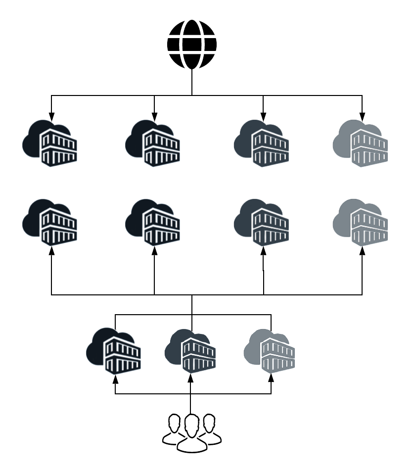
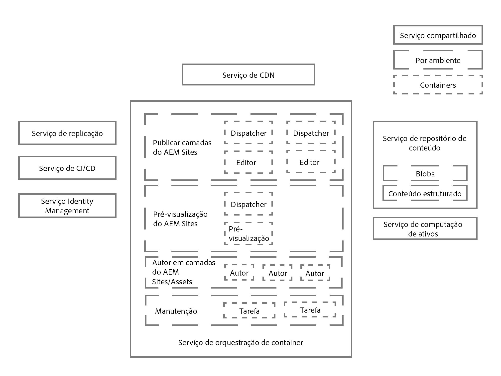
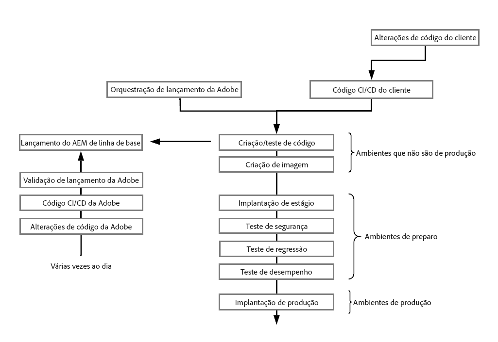
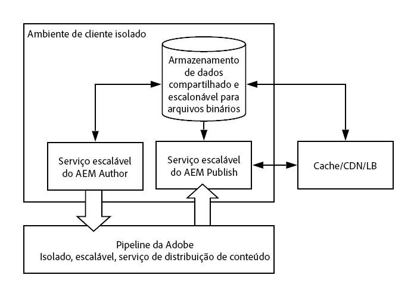

# Uma introdução à arquitetura do Adobe Experience Manager as a Cloud Service {#an-introduction-to-the-architecture-adobe-experience-manager-as-a-cloud-service}

>[!CONTEXTUALHELP]
>id="intro_aem_cloudservice_architecture"
>title="Introdução à arquitetura do AEM as a Cloud Service"
>abstract="Nesta guia, é possível visualizar a nova arquitetura do AEM as a Cloud Service e compreender as alterações. O AEM resultou em uma arquitetura dinâmica com um número variável de imagens, portanto é importante reservar um tempo para entender a arquitetura de nuvem"
>additional-url="https://video.tv.adobe.com/v/330542/" text="Visão geral da arquitetura"

O Adobe Experience Manager (AEM) as a Cloud Service resultou em mudanças na arquitetura.

## Dimensionamento {#scaling}

O AEM as a Cloud Service agora tem:

* Uma arquitetura dinâmica com diversas imagens do AEM.

Essa arquitetura:

* É dimensionada com base no tráfego *real* e na atividade *real*.

* Possui instâncias individuais que são executadas somente quando necessário.

* Usa aplicativos modulares.

* Possui um cluster de criação como padrão; isso evita o tempo de inatividade para tarefas de manutenção.

Isso permite o dimensionamento automático para vários padrões de uso:

Para isso, todas as instâncias do AEM as a Cloud Service são criadas iguais, cada uma com as mesmas características de dimensionamento padrão em termos de número de nós, memória alocada e capacidade de computação alocada.

O AEM as a Cloud Service é baseado no uso de um mecanismo de orquestração que:

* Monitora constantemente o estado do serviço.

* Dimensiona dinamicamente cada uma das instâncias de serviço de acordo com as necessidades reais, aumentando ou diminuindo conforme apropriado.

Isso:

* Aplica-se ao número de nós, à quantidade de memória e à capacidade alocada da CPU em cada nó.

* Permite que o AEM as a Cloud Service acomode os padrões de tráfego à medida que são alterados.

O dimensionamento de instâncias por locatário do serviço se aplica aos dois eixos:

* Horizontal: o número de nós para um determinado serviço é aumentado ou diminuído automaticamente, permitindo ainda configurações padrão individuais.

* Vertical: a memória alocada e a capacidade da CPU podem ser ampliadas ou diminuídas por meio da configuração de um número fixo de nós para atender aos requisitos individuais, conforme necessário.

## Ambientes {#environments}

>[!NOTE]
>Para obter mais informações, consulte [Implantação - modos de execução](/help/implementing/deploying/overview.md#runmodes)

O AEM as a Cloud Service é disponibilizado como instâncias individuais e cada instância representa um ambiente completo do AEM.

Há três tipos de ambientes disponíveis no AEM as a Cloud Service:

* **Ambiente de produção**: hospeda os aplicativos para os profissionais de negócios.

* **Ambiente de preparo**: está sempre acoplado a um único ambiente de produção em uma relação 1:1. O ambiente de preparo é usado para vários testes de desempenho e qualidade antes que as alterações no aplicativo sejam enviadas para o ambiente de produção.

* **Ambiente de desenvolvimento**: permite que os desenvolvedores implementem os aplicativos do AEM nas mesmas condições de tempo de execução que os ambientes de preparo e produção.

  Consulte [Gerenciamento de ambientes](https://experienceleague.adobe.com/docs/experience-manager-cloud-service/implementing/using-cloud-manager/manage-environments.html?lang=pt-BR#using-cloud-manager) para obter mais detalhes.

* **Ambiente de desenvolvimento rápido**: permite iterações de desenvolvimento rápido para a depuração de um código novo ou existente.

## Programas {#programs}

Os novos projetos do AEM estão sempre vinculados a exatamente uma base de código específica, em que você pode armazenar a configuração e o código personalizado do projeto. Essas informações são armazenadas em um repositório de código, acessível por meio dos clientes Git habituais, disponibilizados para você no momento em que novos programas são criados.

Um programa do AEM é o contêiner que inclui:

|  Elemento do programa |  Número |
|--- |--- |
| Repositório de código (Git) |  1 |
| Imagem da linha de base (Sites ou Ativos) |  1 |
| Conjunto de ambientes de preparo e produção (1:1) | 0 ou 1 |
| Ambientes de não produção (RDE, desenvolvimento ou demonstração) | 0 a N |
| Pipeline de cada ambiente | 0 ou 1 |

Dois tipos de programas estão disponíveis inicialmente para o AEM as a Cloud Service:

* Serviço de sites na nuvem AEM

* Serviços de ativos na nuvem AEM

Ambos permitem acesso a vários recursos e funcionalidades. O nível do autor conterá todas as funcionalidades do Sites e do Assets para todos os programas, mas os programas do Assets não terão um nível de publicação nem de pré-visualização por padrão.

## Arquitetura do tempo de execução {#runtime-architecture}

Há vários componentes principais dessa nova arquitetura:

<!--- needs reworking -->

* Para AEM Sites as a Cloud Service:

   * Continua a existir o conceito de um nível de criação e um nível de publicação para cada ambiente (em um nível alto).

   * O nível de criação é composto por dois ou mais nós em um único cluster de criação. É dimensionado automaticamente, dependendo da atividade de criação.

      * Os autores/criadores de conteúdo fazem logon no nível de criação do AEM para criar, editar e gerenciar conteúdo.

      * O logon no nível de criação é gerenciado pelo Adobe Identity Management Services (IMS).

      * A integração e o processamento de ativos usam um Serviço de cálculo de ativos dedicado.

   * O nível de pré-visualização é composto por um único nó de pré-visualização. Isso é usado para garantir a qualidade do conteúdo antes de publicar no nível de publicação.

   * O nível de publicação é composto por dois ou mais nós em um único farm de publicação.

      * Os nós podem operar independentemente uns dos outros.

      * Cada nó consiste em um editor do AEM e um servidor da Web equipado com o módulo do AEM Dispatcher.

      * É dimensionado automaticamente de acordo com as necessidades de tráfego do site.

      * Por padrão, há um único farm de publicação na região primária, no entanto [regiões de publicação adicionais](/help/operations/additional-publish-regions.md) pode ser licenciado.

      * Os usuários finais ou visitantes do site visitam o site por meio do AEM Publish Service.

* Para AEM Assets as a Cloud Service

   * A arquitetura inclui apenas um ambiente de criação.

* O níveis de criação, pré-visualização e publicação leem e persistem conteúdo de/para um Serviço de repositório de conteúdo.

   * O nível de publicação e o nível de pré-visualização somente leem o conteúdo da camada de persistência.

   * O nível de criação lê e grava conteúdo de e para a camada de persistência.

   * O armazenamento de blobs é compartilhado em todos os níveis de publicação, pré-visualização e do autor. Os arquivos não são *transferidos*.

   * Quando o conteúdo é aprovado do nível do autor, isso indica que pode ser ativado, portanto, enviado para a camada de persistência do nível de publicação ou, opcionalmente, para o nível de pré-visualização. Isso acontece por meio do Serviço de replicação, um middleware de pipeline. Esse pipeline recebe o novo conteúdo, com os nós de serviço de publicação (ou serviço de pré-visualização) individuais que assinam o conteúdo enviado para o pipeline.

     >[!NOTE]
     >
     >Para obter mais detalhes, consulte [Replicação](/help/operations/replication.md).

   * Desenvolvedores e administradores gerenciam o aplicativo do AEM as a Cloud Service usando um serviço de Integração contínua/entrega contínua (CI/CD), disponibilizado por meio do [Cloud Manager](/help/overview/what-is-new-and-different.md#cloud-manager). Isso inclui implantações de código e configuração usando o pipeline de CI/CD do Cloud Manager. Tudo o que está relacionado a monitoramento, manutenção e solução de problemas (por exemplo, arquivos de registro) é exposto aos clientes no Cloud Manager.

   * O acesso aos níveis de criação e publicação sempre ocorre por meio de um balanceador de carga. É sempre atualizado com os nós ativos em cada um dos níveis.

   * Para os níveis de publicação e pré-visualização, um Serviço de rede de entrega contínua (CDN) também está disponível como o primeiro ponto de entrada.

* Para instâncias de demonstração do AEM as a Cloud Service, a arquitetura é simplificada em um único nó de criação. Portanto, não apresenta todas as características do ambiente padrão de desenvolvimento, preparo ou produção. Isso também significa que pode haver algum tempo de inatividade e que não há suporte para operações de backup/restauração.

## Arquitetura de implantação {#deployment-architecture}

O Cloud Manager gerencia todas as atualizações nas instâncias do AEM as a Cloud Service. Isso é obrigatório e a única maneira de criar, testar e implantar o aplicativo do cliente nos níveis do autor, de pré-visualização e publicação. Essas atualizações podem ser acionadas pela Adobe, quando uma nova versão do AEM Cloud Service estiver pronta, ou pelo Cliente, quando uma nova versão do aplicativo do cliente estiver pronta.

Tecnicamente, isso é implementado devido ao conceito de um pipeline de implantação, acoplado a cada ambiente dentro de um programa. Quando um pipeline do Cloud Manager está em execução, ele cria uma nova versão do aplicativo do cliente para os níveis do autor, de pré-visualização e publicação. Isso é feito combinando os pacotes mais recentes do cliente com a imagem mais recente da linha de base da Adobe. Quando as novas imagens são criadas e testadas com êxito, o Cloud Manager automatiza totalmente a transferência para a versão mais recente da imagem, atualizando todos os nós de serviço com um padrão de atualização contínua. Isso não resulta em tempo de inatividade para o serviço de criação ou publicação.

<!--- needs reworking -->

## Distribuição de conteúdo {#content-distribution}

O Adobe Experience Manager as a Cloud Service modificou a forma como o conteúdo de publicação funciona. Com o AEM as a Cloud Service, a estrutura de replicação das versões anteriores do AEM não é mais usada para publicar páginas (mover as alterações da instância de criação para as instâncias de publicação).

O AEM as a Cloud Service agora usa o recurso de [Distribuição de conteúdo de sling](https://sling.apache.org/documentation/bundles/content-distribution.html) para mover o conteúdo apropriado. Ele usa um serviço de pipeline executado na E/S da Adobe, o que está fora do tempo de execução do AEM.

A configuração é automatizada, incluindo autoconfiguração automática quando nós de publicação são adicionados, removidos ou reciclados durante o tempo de execução.

Uma única solicitação de publicação ou cancelamento de publicação pode incluir vários recursos, mas retornará um único status aplicado a todos. Terá êxito para todos os recursos no AEM Publish Service ou falhará para todos. Isso garante que os recursos do AEM Publish Service nunca estejam em um estado inconsistente.

**Diagrama da arquitetura de distribuição de conteúdo de alto nível**

## Principais desenvolvimentos {#key-evolutions}

A nova arquitetura do AEM as a Cloud Service apresenta algumas mudanças e inovações fundamentais em relação às gerações anteriores:

* Todos os arquivos (blobs) são enviados diretamente e veiculados em um armazenamento de dados em nuvem. A transmissão de bits associada nunca passa pelo JVM dos serviços de criação e publicação do AEM. Como resultado, os nós dos serviços de criação e publicação do AEM podem ser menores e mais compatíveis com a expectativa de dimensionamento automático rápido. Para profissionais de negócios, isso resulta em uma experiência mais rápida ao carregar e baixar imagens, vídeos, etc.

* Todas as operações que consistem em publicar conteúdo agora envolvem um pipeline que segue um padrão de assinatura. O conteúdo publicado é enviado para várias filas no pipeline, que todos os nós do serviço de publicação assinam. Como resultado, o nível de criação não precisa ter conhecimento do número de nós no serviço de publicação. Isso permite o dimensionamento automático rápido do nível de publicação.

* O conceito de um golden master foi introduzido para automatizar o ciclo de vida dos nós de publicação. O golden master é um nó de publicação especializado, nunca acessado por um usuário final, e a partir do qual todos os nós do serviço de publicação são criados. As operações de manutenção, como compactação, são executadas no repositório de conteúdo anexado ao golden master. Os nós de publicação são reciclados diariamente e não exigem qualquer tipo de manutenção de rotina. Anteriormente, essa manutenção exigia algum tempo de inatividade, especialmente para a instância de criação.

* A arquitetura separa completamente o conteúdo do aplicativo do código e da configuração do aplicativo. Todos os códigos e configurações são praticamente não mudam e são enviados para a imagem de linha de base usada para criar os vários nós dos serviços de criação e publicação. Como resultado, existe uma garantia absoluta de que cada nó é idêntico, e as alterações no código e na configuração só podem ser realizadas globalmente ao executar um pipeline do Cloud Manager.
