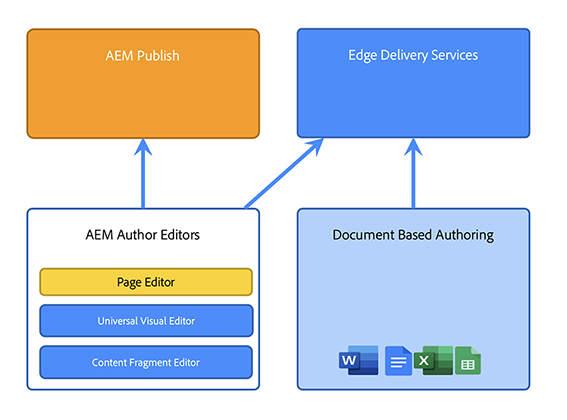

# Uma introdução à arquitetura do Adobe Experience Manager as a Cloud Service {#an-introduction-to-the-architecture-adobe-experience-manager-as-a-cloud-service}

>[!CONTEXTUALHELP]
>id="intro_aem_cloudservice_architecture"
>title="Introdução à arquitetura do AEM as a Cloud Service"
>abstract="Nesta guia, é possível visualizar a nova arquitetura do AEM as a Cloud Service e compreender as alterações. O AEM virou uma arquitetura dinâmica com um número variável de imagens, portanto é importante reservar um tempo para entender a arquitetura da nuvem."
>additional-url="https://video.tv.adobe.com/v/330542/" text="Visão geral da arquitetura"

O Adobe Experience Manager (AEM) as a Cloud Service oferece um conjunto de serviços combináveis para a criação e o gerenciamento de experiências de alto impacto.

Esta página fornece uma introdução à arquitetura lógica, à arquitetura de serviço, à arquitetura do sistema e à arquitetura de desenvolvimento do AEM as a Cloud Service.

## Arquitetura lógica {#logical-architecture}

O AEM as a Cloud Service é composto de soluções de alto nível, como AEM Sites, AEM Assets e AEM Forms. Esses serviços são licenciados individualmente, mas podem ser usados em colaboração. Cada solução usa uma combinação de serviços combináveis fornecidos pela AEM as a Cloud Service, dependendo de seus respectivos casos de uso.

### Programas {#programs}

Os aplicativos do AEM são materializados no formato de um [Programa](/help/implementing/cloud-manager/getting-access-to-aem-in-cloud/program-types.md) criado no aplicativo do Cloud Manager, de acordo com seus direitos de licenciamento. Esses programas fornecem controle total sobre como o aplicativo associado do AEM é nomeado, configurado e como as permissões são alocadas, no contexto de um projeto específico.

Como cliente, você geralmente é identificado pela Adobe como um **locatário**, também conhecido como uma *organização IMS* (Sistema Identity Management). Um locatário pode ter quantos programas forem necessários e licenciados. Por exemplo, é bastante comum ver um programa central para o AEM Assets, enquanto o AEM Sites pode ser usado em vários programas correspondentes a várias experiências online.

>[!NOTE]
>
>O AEM Edge Delivery Services é exposto como uma solução de nível superior no Cloud Manager, enquanto faz parte de outras soluções principais do ponto de vista de licenciamento. Por exemplo, AEM Sites com Edge Delivery Services.

Um programa pode ser configurado com qualquer combinação das soluções de alto nível, e cada solução pode ser compatível com complementos de um para muitos. Por exemplo, Commerce ou Screens para AEM Sites, Dynamic Media ou Brand Portal para AEM Assets.

### Ambientes {#environments}

Depois que um programa é criado com as soluções AEM Sites, AEM Assets ou AEM Forms, as instâncias associadas do AEM serão representadas no formato de ambientes AEM neste programa.

Há quatro tipos de [ambiente](/help/implementing/cloud-manager/manage-environments.md) disponíveis com o AEM as a Cloud Service:

* Ambiente de produção:

   * Um ambiente de produção hospeda os aplicativos para os profissionais de negócios e executa as experiências ativas.

* Ambiente de preparo:

   * Um ambiente de preparo geralmente é acoplado a um ambiente de produção em uma relação 1:1.
   * O ambiente de preparo foi projetado principalmente para testes automatizados, antes que as alterações no aplicativo sejam enviadas para o ambiente de produção.
      * Isso é independente das alterações que estão sendo iniciadas pelo Adobe como parte de uma atualização de manutenção ou pelas implantações de código.
      * Você também pode realizar testes manuais no caso de uma implantação de código.
   * O conteúdo do ambiente de preparo geralmente é mantido em sincronia com o conteúdo de produção usando o recurso de cópia de conteúdo de autoatendimento.
   * Realizar testes de desempenho e segurança no ambiente de preparo.  Ele tem o mesmo tamanho da produção.
* Ambiente de desenvolvimento:
   * Um ambiente de desenvolvimento permite que os desenvolvedores implementem e testem os aplicativos do AEM nas mesmas condições de tempo de execução que os ambientes de preparo e produção.
   * As alterações passam por um pipeline de implantação que permite a mesma qualidade de código e portas de segurança que nos pipelines de implantação de produção.
   * Os ambientes de desenvolvimento não têm o mesmo tamanho que os de preparo e produção e não devem ser usados para realizar testes de desempenho e segurança.
* Ambiente de desenvolvimento rápido (RDE):
   * Um ambiente RDE permite iterações de desenvolvimento rápidas ao implantar código novo ou existente nas instâncias do RDE, sem passar por um pipeline de implantação formal, conforme encontrado em ambientes de desenvolvimento regulares.

### Edge Delivery Services {#logical-architecture-edge-delivery-services}

Um programa do AEM também pode ser configurado com a [Edge Delivery Services](/help/edge/overview.md).

Depois de configurado, o AEM pode fazer referência aos repositórios de código do GitHub usados para criar as experiências com o Edge Delivery Services. Como resultado, novas opções de configuração ficam disponíveis para as experiências associadas. Isso inclui configurar a CDN gerenciada pela Adobe e acessar métricas de licenciamento ou relatórios do SLA.

## Arquitetura do serviço {#service-architecture}

A lista de serviços de composição de alto nível no AEM as a Cloud Service pode ser representada por dois segmentos - Gestão de conteúdo e Entrega de experiência:

Para o gerenciamento de conteúdo, há dois conjuntos principais de serviços para a criação de conteúdo, ambos representados como *fontes de conteúdo*:

* O nível de criação do AEM:
Fornece uma interface baseada na Web (com APIs associadas) para o gerenciamento de conteúdo da Web. Isso funciona para ambas as abordagens:
   * Headful - pelo editor de páginas e pelo editor universal
   * Headless - por meio do editor de fragmento de conteúdo
* O nível de criação baseado em documentos:
Permite criar conteúdo usando aplicativos padrão, como:
   * Microsoft Word e Excel - via SharePoint
   * Google Docs e Sheets - via Google Drive

Para entrega de experiência, ao usar o AEM Sites ou o AEM Forms, também há dois conjuntos principais de serviços, não mutuamente exclusivos e que operam em uma CDN (Content Delivery Network) gerenciada pela Adobe compartilhada como origens diferentes:

* O nível de publicação do AEM:
   * Executa um farm de editores e dispatchers padrão do AEM, permitindo a renderização dinâmica de páginas da Web e conteúdo de API (por exemplo, GraphQL) reunidos com conteúdo publicado.
   * É baseado principalmente na lógica do aplicativo do lado do servidor.
* O nível de publicação do Edge Delivery:
   * Permite a renderização dinâmica de páginas da Web e conteúdo de API de várias fontes de conteúdo, como o nível de criação do AEM ou o nível de criação baseado em documentos.
   * É baseado na lógica de aplicativos do lado do cliente e projetado para desempenho máximo.

Há também os principais serviços adjacentes:

* O nível do Edge Delivery Assets:
   * Permite a entrega de itens de mídia aprovados e publicados do AEM Assets. Por exemplo, imagens e vídeos.
   * Normalmente, os itens de mídia são referenciados a partir de experiências executadas no nível de publicação do AEM, do Edge Delivery ou de qualquer outro aplicativo do Adobe Experience Cloud integrado ao AEM Assets.
* A camada de Visualização do AEM e a camada de Visualização do Edge Delivery Services:
   * Também estão disponíveis para experiências criadas com o nível de publicação do AEM ou do Edge Delivery, respectivamente.
   * Permite que os autores de conteúdo visualizem o conteúdo no contexto antes das operações de publicação.

>[!NOTE]
>
>Por padrão, os programas exclusivos do Assets não têm um nível de publicação nem de pré-visualização.

Há outros serviços adjacentes:

* O serviço de replicação:
   * Situada entre o nível de gerenciamento de conteúdo e o nível de entrega de experiência.
   * É responsável por processar as operações *publicar* emitidas por autores de conteúdo e, em seguida, fornecer o conteúdo publicado aos níveis de publicação (AEM ou Edge Delivery).

  >[!NOTE]
  >O serviço de replicação passou por um redesign completo em comparação às versões 6.x do AEM, já que a estrutura de replicação das versões anteriores do AEM não é mais usada para publicar conteúdo.
  >
  >A arquitetura mais recente é baseada em uma abordagem de *publicar e assinar* com filas de conteúdo baseadas em nuvem. Para o nível de publicação do AEM, ele permite que um número variável de editores assine o conteúdo de publicação e é uma parte essencial para atingir o dimensionamento automático verdadeiro e rápido para o AEM as a Cloud Service

* O serviço de Repositório de conteúdo:
   * É usada pelo nível de criação do AEM.
   * É uma instância baseada em nuvem de um repositório de conteúdo compatível com JCR, implementado pela tecnologia Apache Oak.
   * A persistência do conteúdo baseia-se principalmente no armazenamento em nuvem baseado em blob.
* O serviço CI/CD:
   * Representa o subconjunto de funcionalidades do Cloud Manager dedicadas ao gerenciamento de pipelines de implantação para os ambientes do AEM.
* O serviço de teste:
   * Representa a infraestrutura subjacente usada para executar:
      * testes funcionais,
      * Testes de interface do usuário: por exemplo, com base em scripts Selenium ou Cypress,
      * testes de auditoria de experiência: por exemplo, Lighthouse scores,

     como parte de um pipeline de implantação para um ambiente do AEM ou como parte de uma solicitação de pull do GitHub para um repositório de código do Edge Delivery.
* O serviço de dados:
   * É responsável por expor os dados do cliente, como métricas de licenciamento (por exemplo, Solicitações de conteúdo, Armazenamento, Usuários) ou relatórios de uso (como o número de uploads, downloads).
   * Os dados do cliente podem ser expostos por meio de APIs e nas interfaces de usuário do produto (como o Cloud Manager).
* O serviço de Telemetria Operacional:
   * É responsável por coletar as métricas principais de uma experiência do cliente (como exibições de página, sinais vitais da Web principais, eventos de conversão) e responder a consultas associadas (por exemplo, exibições de página principais de um determinado domínio nos últimos sete dias).
* O serviço Assets Compute:
   * É responsável pelo processamento de imagens, vídeos e documentos carregados; por exemplo, arquivos PDF e Adobe Photoshop. O processamento pode usar a IA do Adobe para extrair metadados de imagem e vídeo (como tags descritivas ou tons de cores primários) e gerar representações (como tamanhos ou formatos diferentes), com acesso a APIs como as APIs do Adobe Photoshop e do Adobe Lightroom.
* O Identity Management Service (IMS):
   * É o local central responsável por gerenciar e autenticar usuários e grupos de usuários para um determinado aplicativo do Adobe Experience Cloud (por exemplo, o nível de criação do Cloud Manager ou do AEM).
   * É acessado pela Adobe Admin Console.

## Arquitetura do sistema {#system-architecture}

### Camadas de Autor, Visualização e Publicação do AEM {#aem-author-preview-publish-tiers}

Os níveis de Autor e Publicação do AEM são implementados como um conjunto de contêineres Docker, operados por um Serviço padrão de Orquestração de Contêineres. A arquitetura contida resultante significa um sistema totalmente dinâmico com um número variável de pods, dependendo da atividade real (para gerenciamento de conteúdo) e do tráfego real (para entrega de experiência). Isso permite que o AEM as a Cloud Service acomode os padrões de tráfego à medida que são alterados.

O nível de criação do AEM é operado como um cluster de pods de criação do AEM que compartilham um único repositório de conteúdo. Um mínimo de dois pods permite a continuidade dos negócios enquanto as tarefas de manutenção estão em execução ou enquanto um processo de implantação está em andamento.

O nível de publicação do AEM é operado como um farm de instâncias de publicação do AEM, cada uma com seu próprio repositório de conteúdo publicado. Cada publicador é acoplado a uma única instância do Apache equipada com o módulo Dispatcher do AEM para obter uma visualização materializada do conteúdo, servindo como origem para o CDN gerenciado pela Adobe. Um mínimo de dois pods também permite a continuidade dos negócios, mas não é incomum ver esse número se expandindo em períodos de alto tráfego.

O nível de Visualização do AEM é composto por um único nó do AEM. Isso é usado para garantir a qualidade do conteúdo antes de publicar no nível de publicação. Tempos de inatividade ocasionais, especialmente durante implantações, podem ocorrer no nível de visualização.

### Edge Delivery Services {#system-architecture-edge-delivery-services}

O Edge Delivery Services é operado sobre um CDN e uma infraestrutura sem servidor para montar as páginas com o melhor desempenho. Quando um recurso é solicitado, a infraestrutura sem servidor é responsável pela conversão do conteúdo publicado em HTML semântico e serve como origem para o CDN.

A conversão para o HTML semântico ocorre a partir do conteúdo publicado proveniente do nível de criação do AEM ou do ambiente de criação baseado em documento.

O diagrama a seguir ilustra como você pode editar o conteúdo de sites no Microsoft Word (Criação baseada em documento ) e publicar no Edge Delivery. Ele também mostra o método de publicação tradicional do AEM usando os vários editores.

Como o Edge Delivery Services faz parte do Adobe Experience Manager e, como tal, o Edge Delivery, o AEM Sites e o AEM Assets podem coexistir no mesmo domínio. Este é um caso de uso comum para sites maiores. Por exemplo, um cliente pode querer migrar uma página específica com alto tráfego para o Edge Delivery Services, enquanto todas as outras páginas podem permanecer no nível de publicação do AEM.

## Arquitetura de desenvolvimento {#development-architecture}

### Repositórios de código {#code-repositories}

O código e a configuração dos projetos do AEM são armazenados em um repositório de código, do qual os pipelines de implantação são emitidos quando alterações são feitas. Há diferentes tipos de repositórios de código:

* Pilha completa do AEM:
   * Para armazenar o código Java do lado do servidor e as configurações OSGI para os níveis de criação e publicação do AEM.
* Front-end do AEM:
   * Para armazenar o código JS, CSS e HTML do lado do cliente para os níveis de criação e publicação do AEM.
Para obter mais detalhes sobre clientlibs, consulte [Usando bibliotecas do lado do cliente no AEM as a Cloud Service](/help/implementing/developing/introduction/clientlibs.md).
* Camada da Web do AEM:
   * Armazena os arquivos de configuração do Dispatcher para o nível de publicação do AEM.
* Configuração do AEM:
   * Permite armazenar várias opções de configuração (como configurações de CDN ou configurações de tarefas de manutenção) para o nível de publicação do AEM e o nível de publicação do Edge Delivery Services.
* Entrega de borda do AEM:
   * Para armazenar o código JS, CSS e HTML do lado do cliente para sites criados com a Edge Delivery Services

### Pipelines de implantação {#deployment-pipelines}

Desenvolvedores e administradores gerenciam o aplicativo do AEM as a Cloud Service usando um serviço de Integração contínua/entrega contínua (CI/CD), disponibilizado por meio da Cloud Manager. A Cloud Manager também expõe tudo o que está relacionado a monitoramento, manutenção, solução de problemas (por exemplo, acesso a arquivos de registro) e licenciamento.

O Cloud Manager gerencia todas as atualizações nas instâncias da AEM as a Cloud Service. É obrigatório e a única maneira de criar, testar e implantar o aplicativo do cliente nos níveis de criação, pré-visualização e publicação. Essas atualizações podem ser acionadas pelo Adobe, quando uma nova versão do AEM Cloud Service estiver pronta, ou por você mesmo, quando uma nova versão do aplicativo estiver pronta.

Isso é implementado por um pipeline de implantação, acoplado a cada ambiente em um programa. Quando um pipeline do Cloud Manager está em execução, ele cria uma nova versão do aplicativo do cliente para os níveis de criação e de publicação. Isso é feito combinando os pacotes mais recentes do cliente com a imagem mais recente da linha de base do Adobe.

O pipeline de implantação é acionado quando os clientes estão fazendo alterações de código ou quando a Adobe está implantando uma nova versão de manutenção.

Em ambos os casos, o mesmo conjunto de testes automatizados é executado. Ele é composto de testes:

* contribuição da Adobe para garantir a integridade do produto
* testes contribuídos pelo cliente
   * Testes funcionais: por solicitações http para o nível de criação ou publicação do AEM
   * Testes de interface do usuário: com base na tecnologia Selenium ou Cypress

Esses testes automatizados são executados no ambiente de preparo, por isso é importante manter o conteúdo do ambiente de preparo o mais próximo possível do conteúdo na instância de produção.

Depois que todos os testes forem concluídos com êxito, o novo código será implantado no ambiente de produção.

### Atualizações contínuas {#rolling-updates}

O Cloud Manager automatiza totalmente a transição para a versão mais recente do aplicativo AEM, atualizando todos os nós de serviço usando um padrão de atualização contínua. Isso significa que **não há tempo de inatividade** para o serviço de autoria ou publicação.

## Principais inovações desde o AEM 6.x {#major-innovations-since-aem-6x}

A arquitetura mais recente do AEM as a Cloud Service apresenta algumas mudanças e inovações fundamentais em comparação às gerações anteriores (AEM 6.x e anteriores):

* Todos os arquivos são enviados diretamente e veiculados em um Armazenamento de dados na nuvem. A transmissão de bits associada nunca passa pelo JVM dos serviços de criação e publicação do AEM. Como resultado, os nós dos serviços de criação e publicação do AEM podem ser menores e, portanto, mais compatíveis com a expectativa de dimensionamento automático rápido. Para profissionais de negócios, isso resulta em uma experiência mais rápida ao carregar e baixar imagens, vídeos e outras tarefas.

* Todas as operações que consistem em publicar conteúdo agora envolvem um pipeline que segue um padrão de assinatura. O conteúdo publicado é enviado para várias filas no pipeline, que todos os nós do serviço de publicação assinam. Como resultado, o nível de criação não precisa ter conhecimento do número de nós no serviço de publicação. Isso permite o dimensionamento automático rápido do nível de publicação.

* A arquitetura separa completamente o conteúdo do aplicativo do código e da configuração do aplicativo. Todos os códigos e configurações são praticamente não mudam e são enviados para a imagem de linha de base usada para criar os vários nós dos serviços de criação e publicação. Como resultado, existe uma garantia absoluta de que cada nó é idêntico, e as alterações no código e na configuração só podem ser realizadas globalmente ao executar um pipeline do Cloud Manager.

* A arquitetura inclui vários microsserviços criados na tecnologia sem servidor, especialmente com o tempo de execução do Adobe I/O

## Informações adicionais {#further-information}

* Configuração do programa
   * [Jornada de integração](/help/journey-onboarding/overview.md)
   * [Programas e tipos de programas](/help/implementing/cloud-manager/getting-access-to-aem-in-cloud/program-types.md)
* Arquitetura de desenvolvimento
   * [Repositórios do Cloud Manager](/help/implementing/cloud-manager/managing-code/managing-repositories.md)
   * [Pipeline de CI/CD](/help/implementing/cloud-manager/configuring-pipelines/introduction-ci-cd-pipelines.md)
   * [Teste de qualidade do código](/help/implementing/cloud-manager/code-quality-testing.md)
* Edge Delivery Services:
   * [Visão geral do AEM as a Cloud Service - com o Edge Delivery Services](/help/edge/overview.md)
   * [Utilização do Edge Delivery Services](/help/edge/overview.md)
   * [Explore a arquitetura subjacente e as partes importantes do AEM as a Cloud Service com o Edge Delivery Services](https://experienceleague.adobe.com/docs/experience-manager-learn/cloud-service/introduction/architecture.html)
