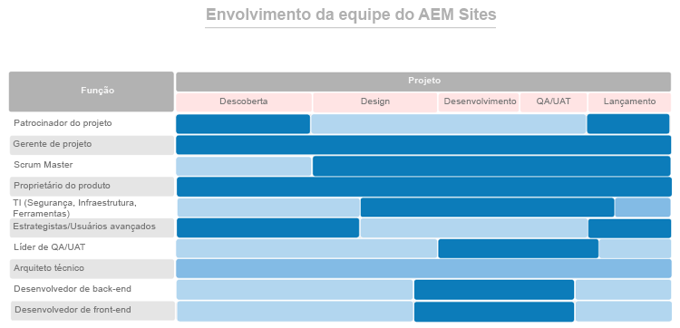

# Primeiro, tenha as pessoas certas nas funções certas {#get-the-right-people-in-the-right-roles}

>[!CONTEXTUALHELP]
>id="aemcloud_chooseteam"
>title="Escolha a equipe certa"
>abstract="Colocar as pessoas certas nos trabalhos certos para impulsionar a implantação do Adobe Experience Manager para o sucesso."
>additional-url="https://experienceleague.adobe.com/docs/experience-manager-cloud-service/onboarding/best-practices/aligning-kpis.html" text="Alinhamento de KPIs"
>additional-url="https://experienceleague.adobe.com/docs/experience-manager-cloud-service/onboarding/best-practices/assessing-kpis.html" text="Avaliação de KPIs"

Há chances de que, em sua organização, vários departamentos sejam responsáveis por diferentes aspectos da experiência digital. Sem governança, o palco está armado para discussões, lutas internas e confusão intermináveis.

A governança digital começa com a definição de quem é o responsável pelo quê e quem está fazendo qual trabalho com foco digital. Talvez seja necessário fazer contratações estratégicas para adicionar as habilidades necessárias. Um desafio ainda maior é promover uma mudança cultural, criando um amplo apoio para a nova tecnologia e ajudando as pessoas a se acostumarem com novas formas de fazer as coisas. Uma parte essencial desse esforço é criar uma comunidade digital que permita que as pessoas aprendam e se apoiem mutuamente.

Por enquanto, o foco está em colocar as pessoas certas nos cargos certos para ajudar a impulsionar a implantação do Adobe Experience Manager. Para cada produto principal (Experience Manager Sites e Experience Manager Assets) a Adobe forneceu uma lista de funções que deve ser preenchida, juntamente com as habilidades, os níveis de especialização e os atributos que tornam as pessoas eficazes nas diversas funções.

Sua atribuição desta semana é revisar ambas as listas com sua equipe de implementação e garantir que você tenha pessoas com qualificações relevantes em cada função.

## **Funções principais para o AEM Experience Manager Sites**

Uma equipe vencedora precisa de nove pessoas nas posições certas — assim como a equipe de implantação. Seu sucesso com o Adobe Experience Manager Sites depende da força dos membros da equipe e do desempenho de seu trabalho conjunto. Certifique-se de ter essas nove funções atribuídas às pessoas com as qualificações sugeridas.

| Função | Habilidades | Nível de capacidade | Qualidades |
|--- |--- |--- |--- |
| Gerenciador de Projetos | Certificação PMP, certificação ágil, experiência em gestão de riscos | Especialista | Justo, consistente, responsável, organizado, positivo, abordável, disposto a aceitar mudanças |
| Scrum Master | Certificação ScrumMaster, certificação ágil, experiência em facilitação | Especialista | Consistente e criativo |
| Dono do produto | Certificação Agile, compreensão profunda das necessidades do negócio | Especialista | Equilibrado, confiante |
| Líderes da TI para segurança, infraestrutura e ferramentas | Certificação em CISM, certificação Adobe Experience Manager Component Developer | Especialista | Orientados a detalhes |
| Estrategistas/Usuários avançados | Proficiência no Adobe Experience Manager Sites | De iniciantes a especialistas | Tenazes, curiosos, minuciosos, abertos, dispostos a aceitar mudanças, colaborativos |
| Líder de Controle de Qualidade/UAT | Certificação ágil, compreensão do SDLC | De iniciante a intermediário | Detalhista, orientado por processos, consistente |
| Arquiteto técnico | Experiência em infraestrutura de TI | Especialista | Orientado a detalhes, orientado por processos, consistente |
| Desenvolvedor de back-end | Certificação Agile, experiência em programação e ciência da computação | De iniciante a intermediário | Orientado a detalhes, orientado por processos, consistente |
| Desenvolvedor front-end | Certificação Agile, noções básicas de HTML, CSS e JavaScript | De iniciante a intermediário | Orientado a detalhes, orientado por processos, consistente |

Agora que você sabe que funções são necessárias, examine o gráfico abaixo para ver quando cada função entra em ação no processo de implementação.

 

**Revise esta lista com sua equipe de implementação** e certifique-se de ter pessoas com qualificações relevantes em cada função. Membros da equipe menos familiarizados com a Adobe Experience Cloud podem usar os recursos de aprendizagem da [Experience League](https://experienceleague.adobe.com/?lang=pt-BR#recommended/solutions/experience-manager) para obter certificação por meio do [Adobe Digital Learning](https://learning.adobe.com/certification.html).

## **Funções principais para o Experience Manager Assets do AEM**

Do Arquiteto ao ScrumMaster, todas as funções desta equipe são indispensáveis — inclusive o bibliotecário do DAM.

Talvez você já tenha maioria das pessoas necessárias para executar uma implementação bem-sucedida do Adobe Experience Manager Assets. Essa lista é semelhante à do Adobe Experience Manager Sites, com uma inclusão importante: será necessário um bibliotecário para garantir que seus ativos digitais estejam organizados e rotulados de forma que sejam fáceis de encontrar.

| Função | Habilidades | Nível de capacidade | Qualidades |
|--- |--- |--- |--- |
| Gerenciador de Projetos | Certificação PMP, certificação ágil, experiência em gestão de riscos | Especialista | Justo, consistente, responsável, organizado, positivo, abordável, disposto a aceitar mudanças |
| Scrum Master | Certificação ScrumMaster, certificação ágil, experiência em facilitação | Especialista | Consistente e criativo |
| Dono do produto | Certificação Agile, compreensão profunda das necessidades do negócio | Especialista | Equilibrado, confiante |
| Líderes da TI para segurança, infraestrutura e ferramentas | Certificação em CISM, certificação Adobe Experience Manager Component Developer | Especialista | Orientados a detalhes |
| Estrategistas/Usuários avançados | Proficiência no Adobe Experience Manager Sites | De iniciantes a especialistas | Tenazes, curiosos, minuciosos, abertos, dispostos a aceitar mudanças, colaborativos |
| Líder de Controle de Qualidade/UAT | Certificação ágil, compreensão do SDLC | De iniciante a intermediário | Detalhista, orientado por processos, consistente |
| Arquiteto técnico | Experiência em infraestrutura de TI | Especialista | Orientado a detalhes, orientado por processos, consistente |
| Desenvolvedor de back-end | Certificação Agile, experiência em programação e ciência da computação | De iniciante a intermediário | Orientado a detalhes, orientado por processos, consistente |
| Desenvolvedor front-end | Certificação Agile, noções básicas de HTML, CSS e JavaScript | De iniciante a intermediário | Orientado a detalhes, orientado por processos, consistente |
| Bibliotecário DAM | Formação e graduação em Biblioteconomia | Especialista | Orientado a detalhes, orientado por processos, organizado |

Agora que você sabe que funções são necessárias, examine o gráfico abaixo para ver quando cada função entra em ação no processo de implementação.

 

>[!TIP]
>
> Saiba mais sobre a Adobe Experience Cloud e use os recursos da [Experience League](https://experienceleague.adobe.com/?lang=pt-BR#recommended/solutions/experience-manager) e obtenha a certificação por meio da [Adobe Digital Learning](https://learning.adobe.com/certification.html).
