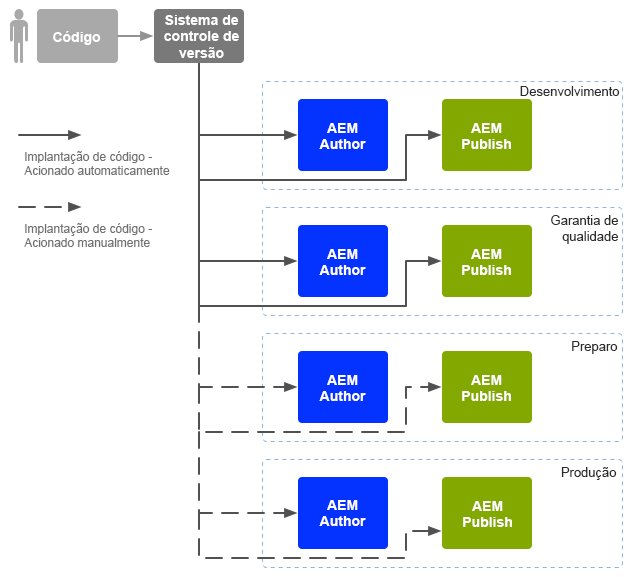
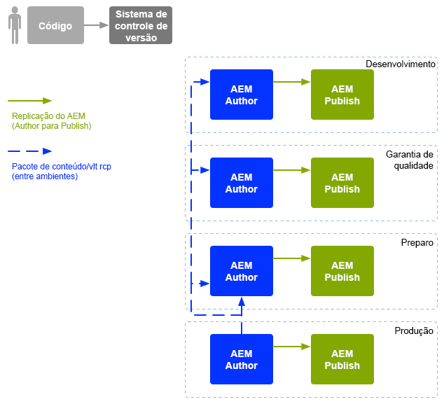

# DevOps empresarial{#enterprise-devops}

O DevOps abrange os processos, os métodos e a comunicação necessários para:

* Facilitar a implantação do seu software nos vários ambientes.
* Simplificar a colaboração entre as equipes de desenvolvimento, teste e implantação.

O DevOps tem como objetivo evitar problemas como:

* Erros manuais.
* Elementos esquecidos; por exemplo, arquivos, detalhes de configuração.
* Discrepâncias; por exemplo, entre o ambiente local de um desenvolvedor e outros ambientes.

## Ambientes {#environments}

Adobe Experience Manager (AEM) as a Cloud Service consiste geralmente em vários ambientes, usados para diferentes propósitos em diferentes níveis:

* [Desenvolvimento](#development)
* [Controle de qualidade](#quality-assurance)
* [Estágios](#staging)
* [Produção](#production-author-and-publish)

>[!NOTE]
>
>O ambiente de produção deve ter pelo menos um autor e um ambiente de publicação.
>
>Recomenda-se que todos os outros ambientes também consistam em um ambiente de autor e publicação, para refletir o ambiente de produção e permitir testes precoces.

### Desenvolvimento {#development}

Desenvolvedores(as) são responsáveis por desenvolver e personalizar o projeto proposto (sejam sites, aplicativos móveis, implementação de DAM etc.), com todas as funcionalidades necessárias. Eles:

* desenvolvem e personalizam os elementos necessários, como modelos, componentes, fluxos de trabalho, aplicativos
* realizam o design
* desenvolvem os serviços e scripts necessários para implementar a funcionalidade necessária

A configuração do ambiente de [desenvolvimento](/help/implementing/developing/introduction/development-guidelines.md) pode depender de vários fatores, embora normalmente seja composta por:

* Um sistema de desenvolvimento integrado com controle de versão para fornecer uma base de código integrada. Esse código integrado é usado para mesclar e consolidar o código dos ambientes de desenvolvimento individuais usados por cada desenvolvedor.
* Um ambiente pessoal para cada desenvolvedor; geralmente residente em seu computador local. Em intervalos adequados, o código é sincronizado com o sistema de controle de versão

Dependendo da escala do seu sistema, o ambiente de desenvolvimento pode ter instâncias de criação e de publicação.

### Controle de qualidade {#quality-assurance}

Esse ambiente é usado pela equipe de controle de qualidade para testar exaustivamente o novo sistema, tanto em termos de design quanto de função. Ele deve ter ambientes de autor e publicação, com conteúdo adequado, e fornecer todos os serviços necessários para possibilitar um conjunto completo de testes.

### Estágios {#staging}

O ambiente de preparo deve ser um espelho do ambiente de produção, incluindo a configuração, o código e o conteúdo:

* Ele é usado para testar os scripts usados para implementar a implantação real.
* Ele pode ser usado para testes finais (design, funcionalidade e interfaces) antes da implantação em ambientes de produção.
* Embora nem sempre seja possível manter o ambiente de preparo idêntico ao ambiente de produção, ele deve ser o mais semelhante possível para permitir testes de carga e desempenho.

### Produção - Autor e publicação {#production-author-and-publish}

O ambiente de produção consiste em ambientes que [criam e publicam](/help/sites-cloud/authoring/author-publish.md) sua implementação.

Um ambiente de produção consiste em pelo menos uma instância de autor e uma instância de publicação:

* Uma instância de [autoria](#author) para a entrada de conteúdo.
* Uma instância de [publicação](#publish) para o conteúdo disponibilizado para seus visitantes/usuários.

Dependendo da escala do projeto, ele geralmente consiste em vários(as) autores(as), editores(as) ou ambos. Em um nível inferior, o repositório também pode ser agrupado em várias instâncias.

#### Autor {#author}

As instâncias de criação geralmente estão localizadas atrás do firewall interno. Esse firewall interno é o ambiente no qual você e seus colegas executam tarefas de criação, como as seguintes:

* administrar todo o sistema
* inserir seu conteúdo
* configurar o layout e o design do conteúdo
* ativar o conteúdo para o ambiente de publicação

O conteúdo que foi ativado é empacotado e colocado na fila de replicação do ambiente do autor. O processo de replicação transporta esse conteúdo ao ambiente de publicação.

Para fazer a replicação reversa dos dados gerados em um ambiente de publicação de volta ao ambiente de criação, um ouvinte de replicação no ambiente de criação examinará o ambiente de publicação e recuperará esse conteúdo da caixa de saída de replicação reversa do ambiente de publicação.

#### Publicação {#publish}

Normalmente, um ambiente de publicação está na “zona desmilitarizada” (DMZ). Trata-se do ambiente onde visitantes acessam seu conteúdo (por exemplo, por meio de um site ou de um aplicativo para dispositivos móveis) e interagem com ele, seja publicamente ou dentro da sua intranet. Um ambiente de publicação:

* mantém o conteúdo replicado do ambiente de autor
* disponibiliza esse conteúdo para os visitantes
* armazena dados do usuário gerados por seus visitantes, como comentários ou outros envios de formulários
* pode ser configurado para adicionar esses dados de usuários a uma caixa de saída, para replicação reversa de volta ao ambiente de autor

O ambiente de publicação gera o conteúdo em tempo real e permite personalizá-lo para cada usuário.

## Transferência do código {#code-movement}

Sempre propagar o código de baixo para cima:

* o código é desenvolvido inicialmente nos ambientes de desenvolvimento locais e depois nos integrados
* seguido de testes completos nos ambientes de controle de qualidade
* depois testado novamente nos ambientes de preparo
* somente então esse código deve ser implantado nos ambientes de produção

O código (por exemplo, funcionalidade de aplicativo web personalizado e modelos de design) é geralmente transferido por meio da exportação e importação de pacotes entre os diferentes repositórios de conteúdo. Quando necessário, essa replicação pode ser configurada como um processo automático.

Projetos no AEM as a Cloud Service geralmente acionam a implantação do código:

* Automaticamente: para transferência aos ambientes de desenvolvimento e controle de qualidade.
* Manualmente: as implantações nos ambientes de preparação e produção são feitas de maneira mais controlada (geralmente, de forma manual), embora uma automação seja possível, se necessário.

## Transferência do conteúdo {#content-movement}

O conteúdo que está sendo criado para produção deve **sempre** ser criado na instância de autor de produção.

O conteúdo não deve seguir o código transferido de ambientes inferiores para os superiores. Ou seja, não é recomendado que autores(as) criem conteúdo em computadores locais ou ambientes inferiores e depois o transfiram para o ambiente de produção. Fazer isso poderá gerar erros e inconsistências.

O conteúdo de produção deve ser transferido do ambiente de produção ao ambiente de preparo, para garantir que o ambiente de preparo forneça um ambiente de testes eficiente e preciso.

>[!NOTE]
>
>Isso não significa que o conteúdo de preparo precise ser continuamente sincronizado com o ambiente de produção. Atualizações regulares são suficientes, mas principalmente antes de testar uma nova iteração de código. O conteúdo nos ambientes de controle de qualidade e desenvolvimento não precisa ser atualizado com tanta frequência. Ele só deve ser uma boa representação do conteúdo de produção.

O conteúdo pode ser transferido:

* Entre os diferentes ambientes, exportando e importando pacotes.
* Entre instâncias diferentes, por replicação direta (replicação do AEM as a Cloud Service) do conteúdo (usando uma conexão HTTP ou HTTPS).

