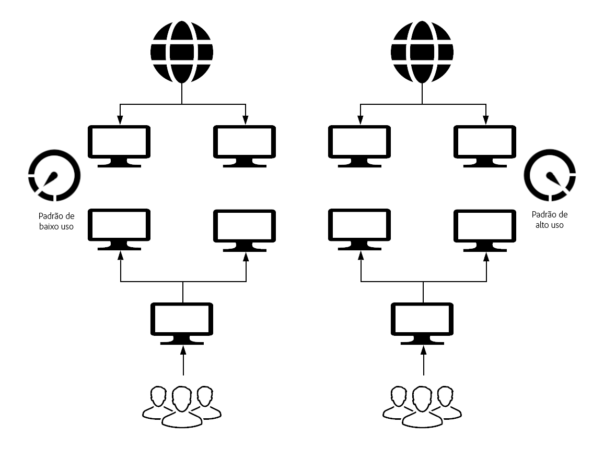

# O que é novo e o que é diferente {#what-is-new-and-what-is-different}

Há muitos anos o AEM está disponível:

* No local

* como um serviço gerenciado

Há diferenças intrínsecas entre essas abordagens anteriores e o AEM como um serviço em nuvem:

* [Arquitetura](#architecture)
* [Atualizações](#upgrades)
* [Cloud Manager](#cloud-manager)
* [Onboard](#onboarding)
* [Desenvolvimento](#developing)
* [Operações e desempenho](#operations-and-performance)
* [Gerenciamento de identidade](#identity-management)
* [Interface do usuário de criação](#authoring-user-interface)
* [AEM Sites](#aem-sites)
* [Ativos AEM](#aem-assets)

>[!NOTE]
>
>Essas visões gerais não são exaustivas, mas têm como objetivo fornecer uma introdução.

<!-- change link when 6.5 hub page migrated -->

>[!NOTE]
>
>Para obter mais detalhes sobre as versões On-Premise e Managed Service, consulte a documentação definida para o [AEM 6.5](https://helpx.adobe.com/support/experience-manager/6-5.html).

<!-- * [Miscellaneous](#miscellaneous) -->

## Arquitetura {#architecture}

>[!NOTE]
>
>Para obter mais detalhes, consulte [Arquitetura](/help/core-concepts/architecture.md).

### Versões anteriores {#previous-versions-architecture}

O AEM no local e o AEM sob Serviços gerenciados usaram uma arquitetura estática composta por um número fixo de máquinas e instâncias.

Estes:

* Foram dimensionados para *pico* de tráfego (Internet) e *pico* de atividade (marketing), o que resultou em ociosidade por períodos significativos:
   

* Eram aplicativos monolíticos (o início rápido).

* Teve uma única instância de autor; que estava sujeita a tempo ocioso durante as janelas de manutenção.

### AEM como um serviço em nuvem {#aem-as-a-cloud-service-architecture}

O AEM como serviço de nuvem agora tem:

* Uma arquitetura dinâmica com um número variável de imagens AEM.

Esta arquitetura:

* É dimensionado com base no tráfego *real* e na atividade *real* .

* Tem instâncias individuais que só são executadas quando necessário.

* Usa aplicativos modulares.

* Tem um cluster autor como padrão; isso evita a paralisação das tarefas de manutenção.

Isso permite o dimensionamento automático para padrões de uso variados:

## Atualizações {#upgrades}

<!--
>[!NOTE]
>
>For further details see the [Deploying Introduction](/help/sites/deploying/introduction.md).
-->

### Versões anteriores {#previous-versions-upgrades}

O AEM no local e o AEM sob Serviços gerenciados estavam sujeitos a um padrão fixo de uma versão principal anual aumentada por service packs, pacotes de recursos e hot fixes. Muitas vezes, as instâncias executariam uma versão principal por dois ou mais anos.

Dependendo do tipo de atualização, o processo pode exigir uma preparação significativa que consiste em análise, desenvolvimento e teste, seguido de uma janela de tempo de inatividade para a atualização real.

### AEM como um serviço em nuvem {#aem-as-a-cloud-service-upgrades}

O AEM como serviço em nuvem agora usa a integração contínua e a entrega contínua (CI/CD) para garantir que seus projetos estejam totalmente atualizados. Isso significa que todas as operações de atualização são totalmente automatizadas, portanto, não é necessário interromper o serviço para os usuários.

A Adobe cuida proativamente da atualização de todas as instâncias operacionais do serviço para a versão mais recente da base de código do AEM:

* Correções de erros:

   * Pode ser lançado diariamente.

   * As instâncias são atualizadas com frequência com as correções de erros mais recentes. Como as mudanças são aplicadas regularmente, o impacto é incremental, reduzindo o impacto sobre seu serviço.

   * A maioria das atualizações é feita por motivos de manutenção e segurança.

* Novos recursos:

   * Será lançado por meio de uma programação mensal previsível.

>[!NOTE]
>
>Para obter mais detalhes, consulte Arquitetura [de implantação](/help/core-concepts/architecture.md#deployment-architecture).

## Cloud Manager {#cloud-manager}

O Adobe Cloud Manager é parte integrante da abordagem de atualização contínua do AEM como um serviço em nuvem, pois controla todas as atualizações em suas instâncias - isso é obrigatório.

As atualizações podem ser acionadas pela Adobe quando uma nova versão do serviço de nuvem estiver disponível. Como alternativa, você pode acionar as atualizações do aplicativo usando os pipelines fornecidos pelo Cloud Manager.

O Cloud Manager é:

* usado para gerenciar programas e ambientes AEM,

* um componente essencial do AEM como um serviço em nuvem; cada novo inquilino é provisionado pela primeira vez para acesso ao Cloud Manager,

* o ponto de entrada único para sua equipe de operações e desenvolvimento.

Especificamente, o número e o tipo de programas AEM que podem ser criados no Gerenciador de nuvem são derivados:

* do acordo de licenciamento do cliente, sob a forma de um conjunto de créditos,

* de atores internos quando o AEM como um serviço em nuvem é usado para habilitação ou treinamento,

* de processos externos, como testes iniciados em Adobe.com.

O Cloud Manager evoluiu como um portal de autoatendimento no qual os principais componentes do AEM como um serviço em nuvem podem ser criados e configurados:

* Criação e gerenciamento de novos programas.

* Criar e gerenciar os ambientes AEM dentro desses programas.

* Criação e gerenciamento de pipelines para a implantação do código do cliente e da configuração relacionada a um ambiente específico.

* Ser notificado sobre eventos importantes do ciclo de vida desses componentes (por exemplo, atualizações de produtos).

Atualmente, o Cloud Manager pode criar ambientes em três regiões geográficas (com mais regiões a seguir):

* EUA (Leste)

* EMEA (Países Baixos)

* APAC (Austrália)

## Onboard {#onboarding}

<!--
>[!NOTE]
>
>For further details see [Onboarding - An Overview](/help/onboarding/overview.md).
-->

### Versões anteriores {#previous-versions-onboarding}

A implementação de um projeto do AEM seguiu os métodos tradicionais de gerenciamento de projetos.

### AEM como um serviço em nuvem {#aem-as-a-cloud-service-onboarding}

Iniciar e gerenciar um projeto do AEM é significativamente mais fácil ao usar o AEM como um serviço da Cloud, pois a Adobe é responsável por vários aspectos:

* As imagens do AEM de linha de base são otimizadas para casos de uso específicos.

* Muitas das tarefas de configuração manual foram redundantes.

Também é significativamente diferente, já que agora existe:

* Uma fase de avaliação para garantir que todos os pré-requisitos foram cumpridos; incluindo, por exemplo:

   * Requisitos legais

   * Acordos contratuais

   * Requisitos técnicos para qualquer conteúdo existente e/ou código personalizado pelo cliente

* Requisitos de implantação:

   * Atualizações de código; todos os aplicativos do cliente desenvolvidos para uma versão anterior do AEM precisarão ser revisados e possivelmente atualizados.

   * Migração de conteúdo

## Desenvolvimento {#developing}

>[!NOTE]
>
>Para obter mais detalhes, comece com a documentação das diretrizes [de](/help/implementing/developing/introduction/development-guidelines.md) desenvolvimento.

<!--
>[!NOTE]
>
>For further details start with [The Developing Experience](/help/sites/developing/introduction/developer-experience.md, [Developing - The Basics](/help/sites/developing/introduction/the-basics.md) and [Developing Best Practices](/help/sites/best-practices/developing.md).
-->

### Versões anteriores {#previous-versions-developing}

<!-- needs more detail -->
O desenvolvimento foi uma tarefa intensiva executada localmente, seguida de implantação para a instância de produção.

### AEM como um serviço em nuvem {#aem-as-a-cloud-service-developing}

<!-- Will need information for new customers -->
A nova arquitetura que suporta o AEM como um serviço em nuvem envolve algumas alterações importantes na experiência geral do desenvolvedor. Um dos principais objetivos do AEM como serviço em nuvem é permitir que clientes experientes (que usaram o AEM no local ou no contexto dos serviços gerenciados da Adobe) migrem para o AEM como um serviço em nuvem o mais rápido possível, sem precisar reescrever a maior parte do código personalizado. No entanto, poderão ainda ser necessários alguns ajustamentos.

#### Desenvolvimento em nuvem {#aem-as-a-cloud-service-developing-cloud-development}

Para que os aplicativos AEM existentes sejam executados no AEM como um serviço de nuvem, as seguintes etapas são esperadas:

* O código e a configuração do aplicativo devem ser armazenados no repositório de código Git do programa associado do Cloud Manager.
* O código e a configuração do aplicativo devem ser compatíveis com a versão mais recente da imagem AEM de linha de base (que pode estar mudando diariamente).
   * O aplicativo do cliente deve ser criado e implantado usando o pipeline do Gerenciador de nuvem associado ao ambiente do Gerenciador de nuvem.
* O aplicativo do cliente deve passar por todas as portas de qualidade, segurança e desempenho do código aplicadas no pipeline.
* As imagens criadas para o aplicativo do cliente devem ser implantadas pelo pipeline do Gerenciador de nuvem.

<!-- duration of what? -->
Esse processo é comumente chamado de desenvolvimento em nuvem. Como a duração completa deve levar minutos (de 20 a 50, dependendo da complexidade do aplicativo), é necessário adotar metodologias de desenvolvimento rápido antes que o código pendente e as alterações de configuração sejam tentadas na nuvem.

<!-- is this really relevant at this point? -->
O console da Web, onde os pacotes OSGI e suas configurações associadas são gerenciados e anteriormente parte do QuickStart do AEM, não é mais diretamente acessível aos usuários de um AEM como um ambiente de serviço em nuvem. Essa interface ainda pode ser acessada no modo somente leitura usando um novo console do desenvolvedor. Com esse console, os desenvolvedores podem selecionar e fazer logon diretamente em qualquer nó específico de um autor ou serviço de publicação e, em seguida, acessar as áreas bloqueadas por padrão.

Outro requisito comum para desenvolvedores é o acesso rápido aos arquivos de registro dos vários ambientes. Com o AEM como um serviço em nuvem, os arquivos de registro dos diferentes nós do autor e publicação são disponibilizados pelo Gerenciador de nuvem, na forma de arquivos que podem ser baixados ou por meio de APIs.

Devido à clara separação de código e conteúdo, os desenvolvedores podem usar um processo específico para atualizar o conteúdo como parte de uma implantação. Os casos de uso típicos para conteúdo mutável são:

* Conteúdo *padrão* que faz parte do projeto do cliente (por exemplo, pastas, modelos, fluxos de trabalho etc.)

* Definições de índice de pesquisa

* ACLs e permissões

* Usuários do serviço e grupos de usuários

#### Desenvolvimento local {#aem-as-a-cloud-service-developing-local-development}

Para suportar iterações e desenvolvimento rápidos, também é possível desenvolver aplicativos AEM fora do AEM como um contexto de Serviço em nuvem. Para esse efeito, os seguintes artefatos são disponibilizados aos desenvolvedores:

* O AEM como um QuickStart de serviço em nuvem: um instalador independente `.jar` baseado na base de código AEM mais recente, com a mesma superfície funcional e de API.

* O AEM como um SDK do Dispatcher do serviço em nuvem: um processo baseado em imagem para testar e validar configurações do Dispatcher localmente

>[!NOTE]
>
>Observe que o QuickStart da Cloud não permite todas as funcionalidades do AEM Sites e do AEM Assets. Consiste em um ambiente simples de criação, onde a maioria das extensões pode ser desenvolvida e testada.

## Operações e desempenho {#operations-and-performance}

>[!NOTE]
>
>Para obter mais detalhes, comece com [Backup](/help/operations/backup.md), [Indexação](/help/operations/indexing.md)e [outras Tarefas](/help/operations/maintenance.md)de manutenção.

### Versões anteriores {#previous-versions-operations-and-performance}

No passado, especialmente do lado do autor, era necessário interromper periodicamente um caso; para operações de manutenção de rotina, bem como atualizações. Para alguns clientes, isso resultava em horas de inatividade programadas semanalmente.

### AEM como um serviço em nuvem {#aem-as-a-cloud-service-operatioms-and-performance}

Com o AEM como um serviço em nuvem, essas operações são automatizadas para que nenhuma interrupção do serviço seja mais necessária.

Nestas áreas:

* Muitas tarefas foram automatizadas.

* As topologias são otimizadas para a máxima resistência e eficiência; por exemplo, a replicação sem binários é o padrão.

* Tarefas de carga intensa, como filas, trabalhos e tarefas de processamento em massa, foram removidas da instância principal do AEM para serem tratadas por microserviços compartilhados e dedicados.

As operações do AEM como um serviço em nuvem também são suportadas por uma nova infraestrutura de monitoramento, relatórios e alertas. Isso permite que os Adobe SREs (Site Reliability Engineers, engenheiros de confiabilidade do site) mantenham o serviço saudável de forma proativa. Os vários elementos da arquitetura estão equipados com uma variedade de controlos sanitários. Se, por algum motivo, um nó específico da arquitetura for considerado insalubre, ele será removido do serviço e silenciosamente substituído por um novo nó saudável.

## Gerenciamento de identidade {#identity-management}

<!--
>[!NOTE]
>
>For further details see [Security - Single Sign-On](/help/sites/security/single-sign-on.md).
-->

### Versões anteriores {#previous-versions-identity-management}

Por padrão, o gerenciamento de identidade era interno do AEM.

>[!NOTE]
>
>AEM 6.4.3.0 apresentado:
>
>* Suporte do Admin Console para instâncias do AEM.
>* Autenticação baseada no Adobe IMS (Identity Management System) para clientes do AEM Managed Services.

### AEM como um serviço em nuvem {#aem-as-a-cloud-service-identity-management}

Uma grande mudança no AEM como um serviço em nuvem é o uso totalmente integrado das Adobe IDs para acessar a camada do autor.

Isso requer o uso do console [de administração da](https://helpx.adobe.com/enterprise/using/admin-console.html) Adobe para gerenciar usuários e grupos de usuários. As contas de usuário permitem que seus usuários acessem produtos e serviços da Adobe, já que as informações de perfil do usuário estão centralizadas no Adobe Identity Management System (IMS) para serem compartilhadas em todos os serviços em nuvem. Depois que o acesso ao AEM é atribuído, as contas de usuário podem ser referenciadas no AEM como um serviço em nuvem (como antes); por exemplo, para definir funções e permissões das interfaces de usuário do AEM Security.

Isso combina os benefícios de:

* Usar o Adobe Identity Management System (IMS) para fornecer logon único em todos os aplicativos em nuvem da Adobe.

* As preferências do usuário permanecem locais para cada instância específica do AEM como um serviço em nuvem.

## Interface do usuário de criação {#authoring-user-interface}

<!--
>[!NOTE]
>
>For further details, the [Basic Handling](/help/sites/authoring/getting-started/basic-handling.md) and [Best Practices](/help/sites/best-practices/authoring.md) are good starting points.
-->

### Versões anteriores {#previous-versions-authoring}

A interface do usuário da instância do autor (IU), tanto para Sites quanto para Ativos, foi desenvolvida e otimizada progressivamente para atender a todos os casos de uso, usando as interfaces de usuário habilitadas para toque e clássica.

### AEM como um serviço em nuvem {#aem-as-a-cloud-service-authoring}

Os princípios básicos da interface do usuário de criação, tanto para sites quanto para ativos, serão familiares a qualquer pessoa que já tenha usado o AEM no passado.

A principal diferença é que a interface do usuário está habilitada para toque; a interface clássica não está mais disponível. Caso contrário, os fundamentos permanecerão inalterados, sendo apenas visíveis pequenas alterações.

## AEM Sites {#aem-sites}

O Adobe Experience Manager Sites como um serviço em nuvem permite que você forneça aos clientes experiências personalizadas e orientadas por conteúdo, combinando o poder do AEM Content Management System com o AEM Digital Asset Management.

Para obter detalhes, consulte a visão geral de [Alterações em sites](/help/sites-cloud/sites-cloud-changes.md).

## Ativos AEM {#aem-assets}

Os ativos Adobe Experience Manager como um serviço em nuvem oferecem uma solução SaaS nativa para as empresas não apenas executarem suas operações de Gerenciamento de ativos digitais e Mídia dinâmica com velocidade e impacto, mas também usarem recursos inteligentes da próxima geração, como o AI/ML, de dentro de um sistema que está sempre atualizado, sempre disponível e sempre aprendendo.

A oferta de ativos inclui o processamento de ativos da próxima geração na nuvem e a inclusão e pesquisa de ativos de alto desempenho.

Para obter detalhes, consulte [Visão geral e introdução aos Ativos como um serviço](/help/assets/overview.md)em nuvem.

<!--

#### Previous Versions {#previous-versions-aem-sites}

tbc

#### AEM as a Cloud Service {#aem-as-a-cloud-service-aem-sites}

tbc

-->

<!--

#### Previous Versions* {#previous-versions-aem-assets}

tbc

#### AEM as a Cloud Service {#aem-as-a-cloud-service-aem-assets}

tbc 

-->

<!--

### Miscellaneous {#miscellaneous}

#### AEM as a Cloud Service {#aem-as-a-cloud-service-miscellaneous}

Additionally???

-->
