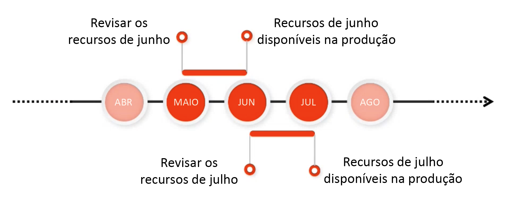

# Informações da versão {#release-information}

| Produto | Adobe Experience Manager as a Cloud Service |
|---|---|
| Versão | 2025.8.0 |
| Tipo | Atualizações contínuas |
| Data de disponibilidade | Atualização contínua |

## Programação de lançamento da AEM {#release-schedule}

Com o modelo de liberação contínua no as a Cloud Service [!DNL Adobe Experience Manager], o aplicativo é atualizado automaticamente de forma contínua. Há dois tipos de atualizações: versões de recursos e versões de manutenção.

* As **versões de recursos** são liberadas com uma frequência mensal previsível e são focadas em novos recursos e inovações de produtos.
   * Confira as [notas de versão atuais](/help/release-notes/release-notes-cloud/release-notes-current.md) para obter detalhes sobre a versão mais recente do recurso.
* **As versões de manutenção** são lançadas com frequência e seu foco são as atualizações de segurança, correções de erros e aprimoramentos de desempenho.
   * Isso garante que o [!DNL Adobe Experience Manager] as a Cloud Service esteja sempre atualizado com qualquer correção crítica.
   * Confira as [notas de versão de manutenção atuais](/help/release-notes/maintenance/latest.md) para obter detalhes sobre a versão de manutenção mais recente.

Esse modelo garante lançamentos contínuos sem interrupção do serviço. Os recursos futuros geralmente serão anunciados em uma versão e, em seguida, disponibilizados publicamente em uma versão seguinte. Dessa forma, você pode avaliar a funcionalidade futura e planejar sua possível implementação para seus próprios projetos. Ele permite planejar com antecedência a próxima versão do recurso, em que ele estará disponível.

Por exemplo, se for maio, você poderá avaliar os recursos futuros que estarão disponíveis em uma versão futura, como junho.

Essa cadência oferece uma janela contínua para avaliar o impacto de quaisquer recursos futuros em seus projetos e personalizações e planejar a implantação desses recursos, testes e treinamento de usuários.

Verifique o [roteiro de versões do Experience Manager](https://experienceleague.adobe.com/docs/experience-manager-release-information/aem-release-updates/update-releases-roadmap.html?lang=pt-BR#aem-as-cloud-service) para obter detalhes sobre versões futuras.

## Como se preparar para uma versão {#how-to-prepare}

Para se preparar para uma versão:

1. [Marcar o seu calendário](#mark-calendars)
1. [Revisar as notas de versão](#release-notes)
1. [Acesse e experimente os recursos futuros](#upcoming-features)
1. [Treinar seus usuários](#train-users)

## Marcar o seu calendário {#mark-calendars}

As versões de recursos são programadas com bastante antecedência e as datas de ativação são publicadas na [Adobe Experience League.](https://experienceleague.adobe.com/docs/experience-manager-release-information/aem-release-updates/update-releases-roadmap.html?lang=pt-BR#aem-as-cloud-service)

Anote as datas de lançamento para planejar o tempo de revisão e teste dos recursos futuros.

## Revisar as notas de versão {#release-notes}

Depois de marcar as datas de lançamento no seu calendário, verifique o site da [Adobe Experience League](/help/release-notes/release-notes-cloud/release-notes-current.md) no dia do lançamento para obter as notas de versão mais recentes.

Cada versão é acompanhada de notas de versão que documentam não apenas as novidades dessa versão, mas também os recursos futuros disponíveis para avaliação. Conheça as novidades com antecedência e planeje a adoção dos recursos mais recentes do AEMaaCS.

Você também pode [verificar os problemas conhecidos](/help/release-notes/maintenance/latest.md) que são publicados em todas as versões para estar ciente de quaisquer problemas técnicos que possam representar um desafio para a avaliação ou possível adoção de novos recursos.

## Acessar e tentar os recursos futuros {#upcoming-features}

Os recursos futuros geralmente são disponibilizados de uma das duas formas a seguir:

* Como parte de um programa Alpha, Beta ou de disponibilidade limitada
* Como parte do canal de pré-lançamento

Como um recurso futuro será disponibilizado será detalhado nas [notas de versão.](#release-notes)

* Se fizer parte de um programa Alpha, Beta ou de Disponibilidade limitada, geralmente é necessário entrar em contato com a Adobe para ativá-lo, conforme detalhado nas notas de versão.
* Se fizer parte do canal de pré-lançamento, você precisará [habilitar o canal de pré-lançamento em um ambiente de desenvolvimento ou de sandbox.](/help/release-notes/prerelease.md)

## Treinar seus usuários {#train-users}

Depois de testar os recursos futuros e decidir usá-los em seus projetos, é necessário treinar os usuários.

A Adobe Experience League oferece muitos recursos de aprendizado para o AEMaaCS.

* [A documentação do AEMaaCS](https://experienceleague.adobe.com/docs/experience-manager-cloud-service.html?lang=pt-BR)
* [Tutoriais](https://experienceleague.adobe.com/docs/experience-manager-learn/aem-tutorials/overview.html?lang=pt-BR)
* [O vídeo de visão geral da versão mensal](/help/release-notes/release-notes-cloud/release-notes-current.md#release-video) nas notas de versão

## Informações-chave sobre versão {#key-articles}

* [Notas de versão do recurso](/help/release-notes/release-notes-cloud/release-notes-current.md)
* [Notas de versão de manutenção](/help/release-notes/maintenance/latest.md)
* [Novidades](what-is-new.md)
* [Alterações importantes](aem-cloud-changes.md)
* [Recursos obsoletos e removidos](deprecated-removed-features.md)
