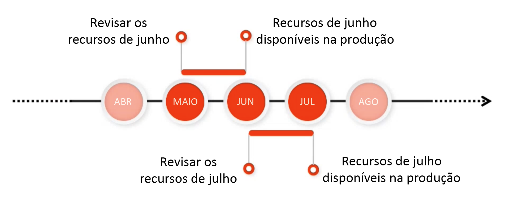

# Canal de pré-lançamento do Adobe Experience Manager as a Cloud Service {#prerelease-channel}

Saiba como usar o canal de pré-lançamento para visualizar os recursos futuros do AEM as a Cloud Service.

## Introdução {#introduction}

O Adobe Experience Manager as a Cloud Service fornece novos recursos regularmente, de acordo com o [Roteiro de versões do Experience Manager.](https://experienceleague.adobe.com/docs/experience-manager-release-information/aem-release-updates/update-releases-roadmap.html?lang=pt-BR#aem-as-cloud-service)

Para se familiarizar com os recursos programados para serem lançados no mês seguinte, você pode assinar o canal de pré-lançamento, acessível por meio da configuração dos ambientes de desenvolvimento ou de qualquer ambiente de sandbox. Você pode visualizar as alterações acessíveis pela interface do AEM e programar usando as novas APIs de pré-lançamento.

A lista de recursos de pré-lançamento de um determinado recurso é publicada nas [notas de versão.](/help/release-notes/release-notes-cloud/release-notes-current.md)

## Versões do AEM as a Cloud Service {#releases}

O AEM as a Cloud Service tem dois tipos de versões.

* Os **lançamentos de recursos** adicionam recursos e funcionalidades ao AEM as a Cloud Service após a ativação
* **Versões de manutenção** adicionam atualizações de segurança, aprimoramentos de desempenho e correções de erros, e são aplicadas com frequência.

Esse padrão garante uma atualização contínua de versões sem interrupção do serviço.

O canal de pré-lançamento permite que você visualize os recursos programados da próxima versão para avaliar as funcionalidades futuras e planejar possíveis implementações em seus próprios projetos. Permite que você se prepare com antecedência para a próxima versão.

Por exemplo, se for o mês de maio e você estiver inscrito no canal de pré-lançamento, será possível avaliar os recursos da versão de junho.



O pré-lançamento oferece uma janela de um mês para você avaliar os próximos recursos do AEMaaCS, permitindo observar o impacto deles em seus projetos e personalizações, bem como planejar a implantação desses recursos, testes e treinamentos de usuário.

Aproveitar de forma eficaz o canal de pré-lançamento é um processo de quatro etapas.

1. [Marcar o seu calendário](#mark-calendars)
1. [Revisar as notas de versão](#release-notes)
1. [Acessar e experimentar os novos recursos](#new-features)
1. [Treinar seus usuários](#train-users)

## Marcar o seu calendário {#mark-calendars}

As versões de recursos são programadas com bastante antecedência e as datas de ativação são publicadas na [Adobe Experience League.](https://experienceleague.adobe.com/docs/experience-manager-release-information/aem-release-updates/update-releases-roadmap.html?lang=pt-BR#aem-as-cloud-service)

Anote as datas de lançamento para que você possa reservar um tempo para revisar e testar os recursos futuros.

## Revisar as notas de versão {#release-notes}

Depois de marcar as datas de lançamento no seu calendário, verifique o site da [Adobe Experience League](/help/release-notes/release-notes-cloud/release-notes-current.md) no dia do lançamento para obter as notas de versão mais recentes.

Cada versão é acompanhada de notas de versão que documentam não apenas as novidades dessa versão, mas também os recursos disponíveis na avaliação de pré-lançamento. Conheça as novidades com antecedência e planeje a adoção dos recursos mais recentes do AEMaaCS.

Você também pode [verificar os problemas conhecidos](/help/release-notes/maintenance/latest.md) que são publicados em todas as versões para estar ciente de quaisquer problemas técnicos que possam representar um desafio para a avaliação ou possível adoção de novos recursos.

## Ative o canal de pré-lançamento para acessar e experimentar novos recursos {#new-features}

O canal de pré-lançamento pode ser ativado em qualquer ambiente de desenvolvimento ou sandbox. O pré-lançamento não pode ser habilitado em ambientes de preparo ou produção.

Os recursos de pré-lançamento podem ser vistos de diferentes maneiras:

* [Ambientes de nuvem](#cloud-environments)
* [SDK local](#local-sdk)

### Ambientes em nuvem {#cloud-environments}

Para atualizar um ambiente de nuvem para usar o pré-lançamento, você deve adicionar uma nova variável de ambiente. Você pode fazer isso usando a interface do Cloud Manager ou através da CLI.

#### Adicionar variável de ambiente usando a interface {#add-with-ui}

1. Faça logon no Cloud Manager, em [my.cloudmanager.adobe.com](https://my.cloudmanager.adobe.com/), e selecione a organização apropriada.

1. Navegue até o programa em que deseja ativar o pré-lançamento.

1. Selecione o ambiente em que deseja ativar o pré-lançamento e acesse suas configurações em **Programa** > **Ambiente** > **Configuração do ambiente**.

1. Adicione uma nova [variável de ambiente:](../implementing/cloud-manager/environment-variables.md)

   | Nome | Valor | Serviço aplicado | Tipo |
   |------|-------|-----------------|------|
   | `AEM_RELEASE_CHANNEL` | `prerelease` | Todos | Variável |

1. Salve as alterações e o ambiente será atualizado com as opções do recurso de pré-lançamento ativadas.

   

#### Adicionar variável de ambiente usando a CLI {#add-with-cli}

Você também pode usar a API e a CLI do Cloud Manager para atualizar as variáveis de ambiente.

* Usando o [ponto de acesso das variáveis de ambiente da API do Cloud Manager,](https://developer.adobe.com/experience-cloud/cloud-manager/reference/api/#operation/patchEnvironmentVariables) configure a variável de ambiente `AEM_RELEASE_CHANNEL` com o valor `prerelease`.

   ```text
   PATCH /program/{programId}/environment/{environmentId}/variables
   [
           {
                   "name" : "AEM_RELEASE_CHANNEL",
                   "value" : "prerelease",
                   "type" : "string"
           }
   ]
   ```

* [A CLI do Cloud Manager](https://github.com/adobe/aio-cli-plugin-cloudmanager#aio-cloudmanagerset-environment-variables-environmentid) também pode ser usada

   ```shell
   aio cloudmanager:environment:set-variables <ENVIRONMENT_ID> --programId=<PROGRAM_ID> --variable AEM_RELEASE_CHANNEL “prerelease
   ```

A variável pode ser excluída ou retornada a um valor diferente se você desejar que o ambiente seja restaurado ao comportamento do canal padrão (que não seja o de pré-lançamento)

### SDK local {#local-sdk}

Você pode ver novos recursos no console Sites no Quickstart do SDK local e programar usando as novas APIs de pré-lançamento, configurando o seu projeto Maven para fazer referência à `API Jar` de pré-lançamento localizada na Maven Central. Você também pode ver esses recursos de pré-lançamento no seu ambiente de desenvolvimento local, iniciando o Quickstart do SDK tradicional no modo de pré-lançamento.

#### Iniciar o Quickstart do SDK no modo de pré-lançamento {#prerelease-mode}

1. Baixe o SDK no portal de distribuição de softwares e instale como descrito em [Acesso ao SDK do AEM as a Cloud Service.](/help/implementing/developing/introduction/aem-as-a-cloud-service-sdk.md)
1. Ao iniciar o Quickstart do SDK, inclua o argumento `-r prerelease`.

O valor é aderente, assim, ele só pode ser selecionado na primeira inicialização. Reinstale o SDK para alterar a opção de linha de comando.

Como pode haver várias versões de manutenção do AEM entre as versões de recursos mensais, você pode baixar esses novos SDKs e fazer referência às novas versões do Jar da API do SDK em projetos maven. As versões de manutenção não incluirão recursos adicionais de pré-lançamento, mas poderão incluir outras alterações menores, como correções de erros, correções de segurança e aprimoramentos de desempenho.
Javadocs são publicados no Maven Central.

#### Criar usando o SDK de pré-lançamento {#build-sdk}

1. Modifique o `pom.xml` do seu projeto Maven para fazer referência a um API.jar do SDK de pré-lançamento distinto, que será publicado na Maven Central. Ele contém qualquer nova API Java para recursos de pré-lançamento e é dependente do API.jar do SDK. Ele usa a mesma versão.

   Como exemplo, veja um trecho da seção de gerenciamento de dependência do POM principal que faz referência ao API.jar padrão:

   ```
   <dependencyManagement>
    <dependencies>
        <dependency>
            <groupId>com.adobe.aem</groupId>
            <artifactId>aem-sdk-api</artifactId>
            <version>${aem.sdk.api}</version>
            <scope>provided</scope>
        </dependency>
   ```

   E o uso em um módulo:

   ```
    <dependencies>
     <dependency>
         <groupId>com.adobe.aem</groupId>
         <artifactId>aem-sdk-api</artifactId>
     </dependency>
   ```

   Para alterar para o SDK de pré-lançamento, basta alterar a dependência de `com.adobe.aem:aem-sdk-api` para `com.adobe.aem:aem-prerelease-sdk-api`, conforme observado abaixo:

   ```
   <dependencyManagement>
    <dependencies>
      <dependency>
            <groupId>com.adobe.aem</groupId>
            <artifactId>aem-prerelease-sdk-api</artifactId>
            <version>${aem.sdk.api}</version>
            <scope>provided</scope>
      </dependency>
   <dependencies>
      <dependency>
         <groupId>com.adobe.aem</groupId>
         <artifactId>aem-prerelease-sdk-api</artifactId>
      </dependency>
   ```

   Como de costume, projetos individuais podem usar a dependência.

1. Implante no servidor local.

1. Se ele funcionar conforme esperado localmente, confirme o código em uma ramificação de desenvolvimento e use um pipeline de não produção do Cloud Manager para implantar em um ambiente que assine o canal de pré-lançamento.

>[!CAUTION]
> 
> O artifactId `aem-prerelease-sdk-api` nunca deve ser usado ao implantar no ambiente de preparo ou produção. Sempre use `aem-sdk-api` ao implantar pelo pipeline de produção. Da mesma forma, o código que faz referência às APIs de pré-lançamento não deve ser implantado por meio do pipeline de produção.

O [plug-in Maven Build Analyzer do SDK do AEM CS v1.0 e superior](https://experienceleague.adobe.com/docs/experience-manager-core-components/using/developing/archetype/build-analyzer-maven-plugin.html?lang=pt-BR#developing) detectará se a API de pré-lançamento é usada em um projeto inspecionando as dependências. Se o analisador a encontrar, ele usará a API de pré-lançamento do SDK para analisar o projeto.

## Treinar seus usuários {#train-users}

Depois de testar os novos recursos no canal de pré-lançamento e decidir aproveitá-los em seus projetos, é necessário treinar seus usuários.

A Adobe Experience League oferece muitos recursos de aprendizado para o AEMaaCS.

* [A documentação do AEMaaCS](https://experienceleague.adobe.com/docs/experience-manager-cloud-service.html?lang=pt-BR)
* [Tutoriais](https://experienceleague.adobe.com/docs/experience-manager-learn/aem-tutorials/overview.html?lang=pt-BR)
* [O vídeo de visão geral da versão mensal](/help/release-notes/release-notes-cloud/release-notes-current.md#release-video) nas notas de versão

## Considerações {#considerations}

Há alguns detalhes que devem ser observados ao usar o canal de pré-lançamento.

* O canal de pré-lançamento não contém necessariamente todos os novos recursos a serem implementados na próxima versão.
* Os recursos no pré-lançamento são submetidos a uma garantia de qualidade rigorosa e se destinam a ser completos em recursos, e não de qualidade beta. Caso detecte problemas, reporte-os, como faria se suspeitasse de erros em recursos em uma versão comum do AEM.
* Para determinar se um ambiente está configurado para o canal de pré-lançamento, vá até a página **Sobre** do console do AEM e verifique se o número da versão do AEM inclui um sufixo de *pré-lançamento*, como ```Adobe Experience Manager 2021.4.5226.20210427T070726Z-210429-PRERELEASE```.


