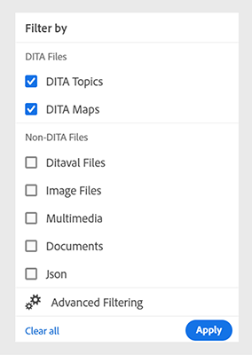

# Notas de versão atuais do [!DNL Adobe Experience Manager] as a Cloud Service {#release-notes}

A seção a seguir descreve as notas da versão de recurso atual (mais recente) do [!DNL Experience Manager] as a Cloud Service.

>[!NOTE]
>
>A partir desta seção, você pode navegar até as notas das versões anteriores, como as de 2021 ou 2022.
>
>Dê uma olhada no [Roteiro de versões do Experience Manager](https://experienceleague.adobe.com/en/docs/experience-manager-release-information/aem-release-updates/update-releases-roadmap) para saber mais sobre as próximas ativações de recursos do [!DNL Experience Manager] as a Cloud Service.

>[!NOTE]
>
>Consulte [Atualizações recentes na documentação](https://experienceleague.adobe.com/en/docs/experience-manager-release-information/aem-release-updates/doc-updates/documentation-updates) para obter detalhes de atualizações de documentação não relacionadas diretamente a uma versão.

## Data de lançamento {#release-date}

A data de lançamento da versão atual (2024.4.0) do [!DNL Adobe Experience Manager] as a [!DNL Cloud Service] é sexta-feira, 25 de abril de 2024. O próximo lançamento de recursos (2024.5.0) está planejado para sexta-feira, 30 de maio de 2024.

## Notas da versão de manutenção {#maintenance}

Encontre as notas de versão de manutenção mais recentes [aqui](/help/release-notes/maintenance/latest.md).

<!-- ## Release Video {#release-video}

Have a look at the April 2024 Release Overview video for a summary of the features added in the 2024.4.0 release:

>[!VIDEO](https://video.tv.adobe.com/v/3428342?quality=12)

-->

## [!DNL Experience Manager Sites] as a [!DNL Cloud Service] {#sites}

### Programa de adoção antecipada {#sites-early-adopter}

**Gerar variações**

Aproveite a GenAI por meio do novo recurso AEM, [gerar variações](/help/generative-ai/generate-variations.md), acessível agora no Cloud Service. Gerar variações ajuda a gerar e dimensionar a criação de conteúdo por meio do uso de IA gerativa. Entre em contato com a equipe de conta do Adobe para consideração no programa.

**Navegação de ativos no Console de fragmentos de conteúdo**

Os autores de conteúdo agora podem navegar, visualizar e realizar ações em imagens e outros ativos sem precisar sair do Console de fragmentos de conteúdo.

Interessado em experimentar o recurso e compartilhar feedback? Envie um email para aemcs-headless-adopter@adobe.com a partir de sua ID de email oficial para saber mais sobre o programa dos participantes antecipados.

## [!DNL Experience Manager Assets] as a [!DNL Cloud Service] {#assets}

### Novos recursos na visualização de ativos {#assets-view-new-features}

**Pesquisa contextual**

Agora, você também pode [pesquisar ativos disponíveis no repositório definindo solicitações de texto](/help/assets/search-assets-view.md#contextual-search). O Experience Manager Assets transforma automaticamente esses prompts de texto em filtros de pesquisa e exibe os resultados da pesquisa. Você pode visualizar e modificar filtros automáticos usando o Painel de filtros para restringir ainda mais os resultados da pesquisa.

**Ações rápidas de vídeo expresso**

O Experience Manager Assets agora inclui [ferramentas de edição de vídeo fáceis e intuitivas, viabilizadas pelo Adobe Express](/help/assets/edit-videos-assets-view.md) para aumentar a reutilização de conteúdo e acelerar a velocidade do conteúdo. As opções de edição incluem aparar, cortar, redimensionar um vídeo e também converter um MP4 em um arquivo GIF.

**Representações dinâmicas**

Agora você pode [exibir e baixar representações dinâmicas (incluindo cortes inteligentes)](/help/assets/renditions.md) no Experience Manager Assets. As representações dinâmicas são versões personalizadas de ativos de imagem criados em tempo real para atender a necessidades específicas, como redimensionar imagens com base na resolução do dispositivo ou recortar para se ajustar a diferentes taxas de aspecto. Essas representações permitem que as organizações entreguem experiências personalizadas e otimizadas para diversas necessidades do público-alvo.

**Renomeação no local para ativos e pastas**

O Experience Manager Assets agora oferece uma experiência do usuário simplificada ao fornecer [capacidade de renomear um ativo ou uma pasta com um único clique](/help/assets/manage-organize-assets-view.md).

**Atribuir ou remover um formulário de metadados a várias pastas**

Agora você pode [atribuir ou remover formulário de metadados a várias pastas](/help/assets/metadata-assets-view.md#assign-metadata-form-to-a-folder).

### Novos recursos na exibição do Administrador {#admin-view-new-features}

**Configuração de compartilhamento de link**

Uma nova experiência de usuário aprimorada para [criar compartilhamentos de links](/help/assets/share-assets.md) e um novo conjunto de configurações que permite que admins personalizem o comportamento padrão desse recurso para seus usuários.

## [!DNL Experience Manager Forms] as a [!DNL Cloud Service] {#forms}

<!-- 

* **Configure a shard for Adobe Sign for AEM Forms**: Adobe distributes Acrobat Sign API around the globe in many deployment units called "shards." Each shard serves a customer's account, such as NA1, NA2, NA3, EU1, JP1, AU1, IN1, and others. The shard names correspond to geographic locations. You can now use more than one shard while using Adobe Sign integration with AEM Forms. 

-->

### Novos recursos no AEM Forms {#forms-new-features}

* **Editor de regras visuais aprimorado para Forms adaptável baseado em componentes principais**: esta versão traz uma atualização significativa ao editor visual de regras para formulários adaptáveis com base em componentes principais. Esta versão traz uma atualização significativa para o editor visual de regras para formulários adaptáveis com base em componentes principais. Essa atualização se concentra em simplificar as interações com funções personalizadas, permitindo que você crie formulários mais robustos e eficientes.

  Agora é possível simplificar as interações de funções personalizadas ao:

   * [Como aproveitar novas anotações para fornecer definições de função mais claras](/help/forms/create-and-use-custom-functions.md#supported-javascript-annotations-for-custom-function).
   * [Uso de mecanismos de cache para funções personalizadas, resultando em um desempenho de formulário mais rápido](/help/forms/create-and-use-custom-functions.md#caching-support-for-custom-function).
   * [Trabalho contínuo com objetos globais dentro de funções personalizadas](/help/forms/create-and-use-custom-functions.md#field-and-global-scope-objects-in-custom-functions).
   * [Definição e utilização de parâmetros opcionais em funções personalizadas](/help/forms/create-and-use-custom-functions.md#parameter).

  Essa atualização também traz os seguintes aprimoramentos para a funcionalidade do editor de regras. É possível:

   * Implementar soluções [&quot;when-then-else&quot;](/help/forms/rule-editor-core-components.md#when) lógica para execução condicional.
   * Aproveite os recursos modernos do JavaScript, como as funções de seta e de esquerda (suporte para ES10).
   * Valide ou redefina não apenas campos, mas também painéis e formulários inteiros, expandindo o controle sobre as interações do usuário.

  Esses avanços fornecem uma experiência mais intuitiva e poderosa para criar regras e funções personalizadas no editor visual de regras.

* **[Criar várias versões de um Formulário adaptável](/help/forms/add-comments-annotations-versioning-adaptive-form-core-components.md)**: Agora é possível gerenciar facilmente variações de formulários existentes. Isso simplifica o controle de versões e facilita a comparação para a otimização de formulários, tudo em um único fluxo de trabalho simplificado.

* **[Comparar formulário adaptável](/help/forms/compare-forms.md)**: agora é possível comparar facilmente dois formulários para identificar as diferenças entre dois. Ele facilita a colaboração perfeita, permitindo que os membros da equipe comparem revisões e discutam alterações com eficiência.

* **Aprimoramentos de acessibilidade para o componente de assinatura assinável**: esta atualização traz melhorias significativas de acessibilidade para o componente de Assinatura Escrita:

  **Navegação do teclado aprimorada:**
   * Pressionar a tecla Tab permite que os usuários naveguem por todos os elementos interativos na caixa de diálogo de assinatura.
   * Assinar com um pincel ou teclado e pressionar Enter fecha a caixa de diálogo.
   * O foco permanece no controle de assinatura após assinar e clicar em &quot;OK&quot;.

  **Limpar funcionalidade de assinatura:**

   * Um ícone de cruz claro para apagar a assinatura é acessível através da tecla Tab.
   * A caixa de diálogo &quot;Limpar confirmação de assinatura&quot; também pode ser acessada por meio da navegação de guias.

  **Rótulos e controles aprimorados:**
   * O rótulo do botão de assinatura do teclado agora está mais claro, usando &quot;aria-label&quot; para anunciar a funcionalidade (como &quot;aria-label=&#39;Sign using Keyboard&#39;&quot;).
   * O contraste aprimorado garante que todos os controles dentro da assinatura de rabisco sejam facilmente distinguíveis.
   * O botão OK/marca de seleção agora indica visualmente quando está inativo.

  **Feedback de assinatura para Reader de tela:**
   * Quando uma assinatura é digitada, os usuários de leitores de tela podem ouvir o texto usado para criar a assinatura.

Essa atualização garante uma experiência mais inclusiva para usuários portadores de deficiências, melhorando a navegação, a clareza e o feedback do componente Assinatura Escrita.

### Programa de adoção antecipada {#forms-early-adopter}

* **[Enviar um formulário adaptável para o cenário do Adobe Workfront Fusion](/help/forms/submit-adaptive-form-to-workfront-fusion.md)**: o Forms as a Cloud Service oferece uma opção pronta para uso para conectar facilmente um Formulário adaptável ao Adobe Workfront. Isso simplifica o processo de envio de um Formulário adaptável para um cenário do Adobe Workfront, permitindo acionar um cenário do Workfront Fusion no envio de um Formulário adaptável.

       Usando o Adobe Workfront Fusion Connector, você pode projetar fluxos de trabalho que são acionados automaticamente no envio de um Formulário adaptável. Por exemplo, preveja um cenário em que um fluxo de trabalho é iniciado para atribuir a um indivíduo específico a tarefa de revisar dados enviados, permitindo a aprovação ou a rejeição de um aplicativo com base nas informações capturadas por meio do formulário adaptável. Essa integração simplificada aumenta a eficiência e traz um novo nível de automação para seus processos de workflow.|

* **[Serviço de extensão Reader](/help/forms/aem-forms-cloud-service-communications-introduction.md#reader-extension-service)**: as APIs de comunicação da AEM Forms trouxeram o Serviço de extensão do Reader para permitir que você adicione funcionalidades como preenchimento de formulário e comentários a PDF regulares, tornando-os interativos para usuários com o Adobe Reader gratuito.

* [Suporte de idiomas da direita para a esquerda](/help/forms/supporting-new-language-localization-core-components.md): o Forms adaptável incorporado aos Componentes principais agora pode ser apresentado em um idioma da direita para a esquerda (RTL), como árabe, persa e urdu. As línguas RTL são faladas por mais de 2 bilhões de pessoas em todo o mundo. Usar um formulário em linguagem RTL permite estender o alcance dos formulários adaptáveis para atender a esses públicos diferentes e selecionar mercados de RTL. Em algumas regiões, também é um mandato legal fornecer formulários no idioma local. Ao acomodar idiomas locais, você não só abre portas para um público mais amplo, como também garante a conformidade com as leis e regulamentos relevantes.

* **[Protect seus documentos com as APIs DocAssurance (Parte das APIs de comunicação)](/help/forms/aem-forms-cloud-service-communications-introduction.md#document-assurance-doc-assurance)**: As APIs do DocAssurance permitem proteger informações confidenciais, assinando e criptografando os documentos. Por meio da criptografia, o conteúdo de um documento é transformado em um formato ilegível, garantindo que somente usuários autorizados possam ter acesso. Essa camada fortificada de proteção não apenas protege dados valiosos de olhos não autorizados, mas também proporciona tranquilidade. As APIs de assinatura permitem que sua organização proteja a segurança e a privacidade dos documentos do Adobe PDF que distribui e recebe. Esse serviço usa assinaturas digitais e certificação para garantir que somente os recipients desejados possam alterar os documentos.

  Você pode escrever para `aem-forms-ea@adobe.com` do seu id de email oficial para participar do programa de adoção antecipada e solicitar acesso ao recurso.

* **[Você pode aproveitar o Serviço de dados de monitoramento de usuário real (RUM)](/help/implementing/cloud-manager/content-requests.md#real-user-monitoring-for-aem-as-a-cloud-service)** para ativar a coleta no lado do cliente para o AEM as a Cloud Service.
O Serviço de dados de monitoramento de usuário real (RUM) oferece um reflexo mais preciso das interações do usuário, garantindo uma medida confiável do engajamento do site. É uma ótima oportunidade para obter insights avançados sobre o desempenho da página. Embora isso seja benéfico para clientes que usam CDN gerenciada por Adobe ou CDN não gerenciada por Adobe. Além disso, para clientes que usam um CDN não gerenciado por Adobe, o relatório de tráfego automatizado agora pode ser ativado para eles, eliminando a necessidade de compartilhar qualquer relatório de tráfego com o Adobe.

  Se você estiver interessado em testar esse novo recurso e compartilhar seu feedback, envie um email para `aemcs-rum-adopter@adobe.com`, juntamente com o nome de domínio para cada um dos ambientes para os quais você deseja habilitar o RUM, a partir do seu endereço de email associado à sua Adobe ID. A equipe de produtos do Adobe habilitará o Serviço de dados de monitoramento de usuário real (RUM) para você.

## [!DNL Experience Manager] as a [!DNL Cloud Service] Foundation {#foundation}

### Configuração de CDN {#cdn-config}

Configure o tráfego no CDN do Adobe das seguintes maneiras:

* [Solicitar transformações](/help/implementing/dispatcher/cdn-configuring-traffic.md#request-transformations) : modifica aspectos de solicitações recebidas, incluindo caminhos, parâmetros de consulta e cabeçalhos HTTP antes que sejam roteados para AEM.
* [Transformações de resposta](/help/implementing/dispatcher/cdn-configuring-traffic.md#response-transformations) - alterar cabeçalhos HTTP das respostas de saída antes que elas sejam enviadas ao navegador.
* [Seletores de origem](/help/implementing/dispatcher/cdn-configuring-traffic.md#response-transformations#origin-selectors) - rotear o tráfego pela CDN para sites e aplicativos fora do AEM.

Depois que essas regras forem declaradas no controle do código-fonte (Git), você poderá implantá-las na CDN usando o Pipeline de configuração do Cloud Manager. Consulte também o recurso de redirecionamentos do lado do cliente na seção inicial do adotante abaixo.

### Páginas de erro personalizadas do CDN {#cdn-error-pages}

No caso improvável de o CDN não conseguir rotear o tráfego para a origem do AEM, uma página de erro personalizada pode ser declarada, substituindo a versão genérica. [Saiba mais](/help/implementing/dispatcher/cdn-error-pages.md) sobre como fornecer páginas de erro de marca.

### Programas de adoção antecipada {#foundation-early-adopter}

#### Redirecionamentos do lado do cliente (Programa de primeiros usuários) {#client-side-redirects-early-adopter}

Configure os redirecionamentos do lado do cliente 301/302 no controle do código-fonte e implante na CDN. [Saiba mais](/help/implementing/dispatcher/cdn-configuring-traffic.md#client-side-redirectors) e se juntar ao programa de adoção antecipada enviando e-mail **<aemcs-cdn-config-adopter@adobe.com>**.

#### Alertas de regras de filtro de tráfego (Programa de adoção antecipada) {#traffic-filter-rules-alerts-early-adopter}

O recém-lançado [Regras de filtro de tráfego](/help/security/traffic-filter-rules-including-waf.md), que incluem as regras opcionalmente licenciáveis do Web Application Firewall (WAF), permite configurar o tráfego que deve ser permitido ou negado.

Agora você pode enviar um email **<aemcs-cdn-config-adopter@adobe.com>** para participar do programa de adoção antecipada para que você possa ser alertado sempre que as regras de filtro de tráfego forem acionadas. As notificações por email do Centro de ações manterão você informado quando ocorrerem determinadas condições de tráfego para que você possa tomar as medidas apropriadas.

#### Assimilação de tempo de execução de mapas de regravação do Apache/Dispatcher (Programa de adoção antecipada) {#apache-rewritemaps-early-adopter}

Semelhante ao AEM 6.5, o Apache/Dispatcher assimilará mapas de regravação colocados em um local específico no repositório de publicação e os carregará, sem exigir uma execução de pipeline no nível da Web. Isso abre oportunidades para que um usuário empresarial declare redirecionamentos usando uma interface do usuário, como a oferecida pelo ACS Commons Redirect Map Manager. Entre em contato com **<aemcs-cdn-config-adopter@adobe.com>** para obter mais informações.

#### Edge Side Includes (ESI) para o carregamento de conteúdo dinâmico (Early Adoter Program) {#esi-early-adopter}

O CDN gerenciado por Adobe agora é compatível com ESI (Edge Side Includes), uma linguagem de marcação para a montagem de conteúdo dinâmico da Web no nível da borda. Ao incluir trechos ESI, você pode armazenar em cache a página de HTML geral na CDN com TTLs mais altos, enquanto busca com mais frequência a partir da origem as seções menores que exigem atualizações de cadência mais altas (TTLs mais baixos). Entre em contato com **<aemcs-cdn-config-adopter@adobe.com>** para obter mais informações.

#### Suporte RDE para código de front-end usando temas de site e modelos de site (programa de adoção antecipada) {#rde-frontend-early-adopter}

[RDEs (Rapid Development Environments, ambientes de desenvolvimento rápido)](/help/implementing/developing/introduction/rapid-development-environments.md) O agora oferece suporte ao código de front-end com base no [temas de site](/help/sites-cloud/administering/site-creation/site-themes.md) e [modelos de site](/help/sites-cloud/administering/site-creation/site-templates.md), para os participantes iniciais. Com RDEs, isso é feito usando uma diretiva de linha de comando, em vez de uma [pipeline de front-end](/help/sites-cloud/administering/site-creation/enable-front-end-pipeline.md). Entre em contato com **<aemcs-rde-support@adobe.com>** para experimentar e fornecer feedback.

#### Melhoria no registro para RDEs (Early Adoter Program, programa de adoção antecipada) {#rde-logging-early-adopter}

Ao depurar o código em um [RDE (Rapid Development Environment, ambiente de desenvolvimento rápido)](/help/implementing/developing/introduction/rapid-development-environments.md), os desenvolvedores agora podem configurar e transmitir logs com mais eficiência, usando a linha de comando e sem modificar as propriedades OSGI no controle de versão. Os recursos incluem:

* declarar níveis de log em um nível por pacote ou classe
* personalizar o formato de saída do registro
* transmitir vários logs em paralelo

Entre em contato com **<aemcs-rde-support@adobe.com>** para experimentar e fornecer feedback.

## [!DNL Experience Manager] Guias {#guides}

### Capacidade de traduzir conteúdo em vários idiomas usando grupos de idiomas pré-configurados

O Experience Manager Guides agora permite criar grupos de idiomas e traduzir facilmente seu conteúdo em vários idiomas. Esse recurso ajuda a organizar e gerenciar traduções de acordo com as necessidades da organização.

Por exemplo, se você precisar traduzir o conteúdo para alguns países na Europa, é possível criar um grupo de idiomas para idiomas europeus, como inglês (EN), francês (FR), alemão (DE), espanhol (ES) e italiano (IT).

*Selecione os grupos de idiomas ou idiomas para os quais deseja traduzir os documentos.*

>[!NOTE]
>
>Se a pasta de destino de um idioma estiver ausente ou se o idioma de destino for o mesmo da origem, ele ficará esmaecido e exibirá um sinal de aviso.

Como administrador, você pode criar grupos de idiomas e configurá-los para vários perfis de pasta. Como autor, você pode exibir os grupos de idiomas configurados no perfil da pasta.

De modo geral, a criação de grupos de idiomas aumenta a eficiência e a produtividade dos projetos de tradução, melhorando, em última análise, o processo de localização em vários idiomas.

Saiba como [traduzir documentos a partir do Editor da Web](https://experienceleague.adobe.com/en/docs/experience-manager-guides/using/user-guide/author-content/create-preview-topics/author-content-aem-guides/work-with-web-editor/translate-documents-web-editor)

### Experiência remodelada para pesquisar e filtrar arquivos na visualização de repositório

Agora, você tem uma experiência aprimorada ao filtrar arquivos. A funcionalidade renovada para filtrar arquivos fornece uma maneira aprimorada de pesquisar e navegar facilmente pelos arquivos.

*Procurar os arquivos que contêm o texto`general purpose.`*

Aproveite benefícios como acesso mais rápido a arquivos relevantes e uma interface do usuário mais intuitiva, tornando sua experiência de pesquisa mais estável e eficiente.

*Use os filtros rápidos para procurar arquivos DITA e não DITA.*

Saiba mais sobre o **Filtrar pesquisa** recurso no [Painel esquerdo](https://experienceleague.adobe.com/en/docs/experience-manager-guides/using/user-guide/author-content/create-preview-topics/author-content-aem-guides/work-with-web-editor/web-editor-features#id2051EA0M0HS) seção.

### Aprimoramentos nos Conectores de origem de dados

Os seguintes aprimoramentos foram feitos nos conectores de fonte de dados da versão 2024.4.0:

#### Conecte-se às Fontes de Dados dos Quadros de Desenvolvimento (ADO) do Salsify, Akeneo e Microsoft Azure

Além dos conectores prontos para uso existentes, o Experience Manager Guides também fornece conectores para fontes de dados do Salsify, Akeneo e Microsoft Azure DevOps Boards (ADO). Como administrador, você pode baixar e instalar esses conectores. Em seguida, configure os conectores instalados.

#### Copie e cole a amostra de consulta para criar um trecho de conteúdo ou tópico

Você pode copiar e colar facilmente uma amostra de consulta de dados no gerador para criar um trecho de conteúdo ou tópico. Com esse recurso, não é necessário lembrar a sintaxe ou criar um query manualmente. Em vez de digitar manualmente a consulta, você pode copiar e colar uma consulta de exemplo, editá-la e usá-la para buscar os dados de acordo com suas necessidades.

*Copie e edite um exemplo de consulta para criar o trecho de conteúdo.*

#### Conectar-se a arquivos de dados JSON usando um conector de arquivos

Agora, como administrador, você pode configurar um conector de arquivo JSON para usar arquivos de dados JSON como fonte de dados. Use o conector para importar os arquivos JSON do seu computador ou do Adobe Experience Manager Assets. Em seguida, como autor, você pode criar fragmentos de conteúdo ou tópicos usando os geradores.

Esse recurso ajuda você a usar os dados armazenados em seus arquivos JSON e reutilizá-los em vários snippets. O conteúdo também é atualizado dinamicamente sempre que você atualiza os arquivos JSON.

#### Configurar vários URLs de recursos para um conector criar trechos de conteúdo ou tópicos

Como administrador, você pode configurar vários URLs de recursos para alguns conectores, como Cliente REST genérico, Salsify, Akeneo e placas DevOps (ADO) do Microsoft Azure.
Em seguida, como autor, conecte-se às fontes de dados para criar trechos de conteúdo ou tópicos usando os geradores. Esse recurso é útil, pois você não precisa criar uma fonte de dados para cada URL. Ele ajuda você a buscar dados rapidamente de qualquer um dos recursos de uma fonte de dados específica em um único trecho de conteúdo ou tópico. Exibir mais detalhes sobre os conectores de fonte de dados e como [configurar um conector de fonte de dados na interface do usuário](https://experienceleague.adobe.com/en/docs/experience-manager-guides/using/install-guide/cs-ig/web-editor-configs-cs/conf-data-source-connector-tools). Saiba como [usar dados da sua fonte de dados](https://experienceleague.adobe.com/en/docs/experience-manager-guides/using/user-guide/author-content/create-preview-topics/author-content-aem-guides/work-with-web-editor/web-editor-content-snippet).

Para obter mais informações sobre os novos recursos e aprimoramentos, consulte [Novidades da versão 2024.04.0](https://experienceleague.adobe.com/en/docs/experience-manager-guides/using/release-info/release-notes/cloud-release-notes/2024-releases/2404-release/whats-new-2024-04-0).

Para obter a lista de problemas corrigidos nessa versão, consulte [Correção de problemas na versão 2024.4.0](https://experienceleague.adobe.com/en/docs/experience-manager-guides/using/release-info/release-notes/cloud-release-notes/2024-releases/2404-release/fixed-issues-2024-04-0).

## Cloud Manager {#cloud-manager}

Você pode encontrar uma lista completa de versões mensais do Cloud Manager [aqui](/help/implementing/cloud-manager/release-notes/current.md).

## Ferramentas de migração {#migration-tools}

Você pode encontrar uma lista completa de versões das ferramentas de migração [aqui](/help/journey-migration/release-notes/release-notes-migration-tools-current.md).
