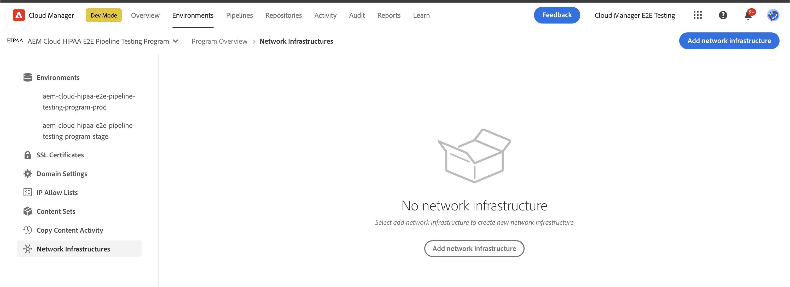
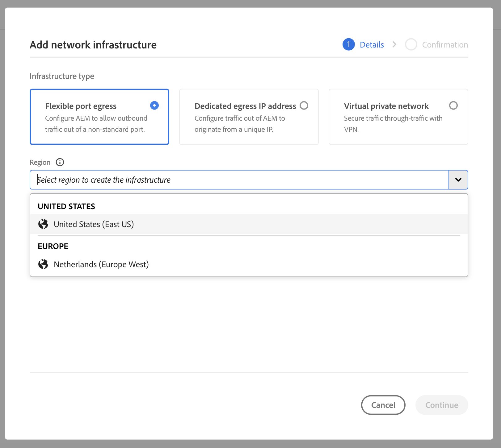
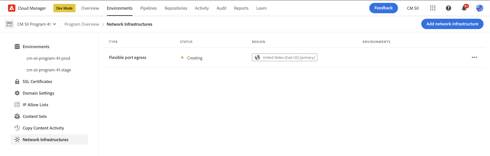
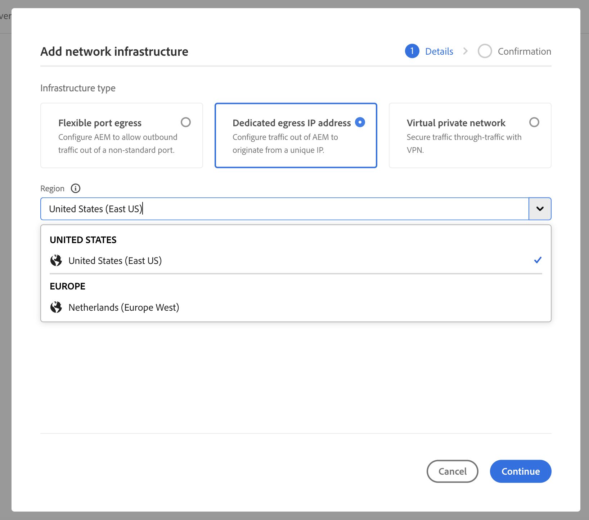
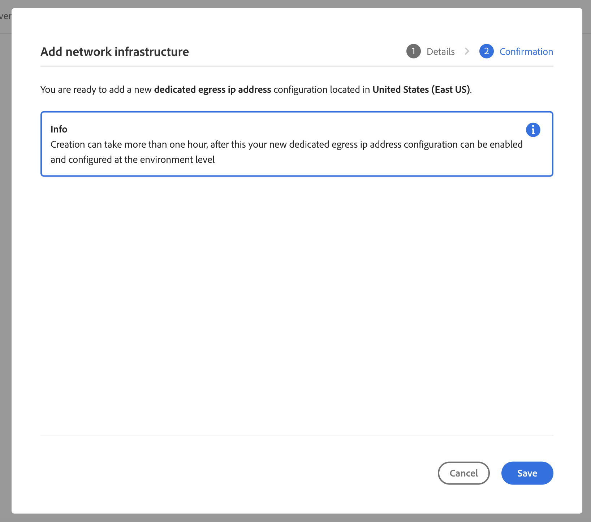
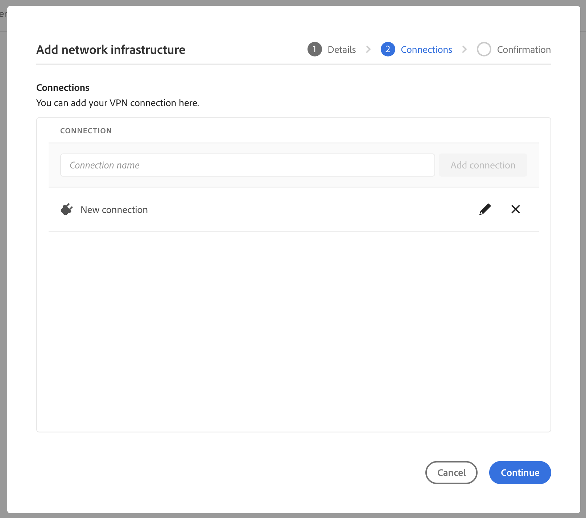
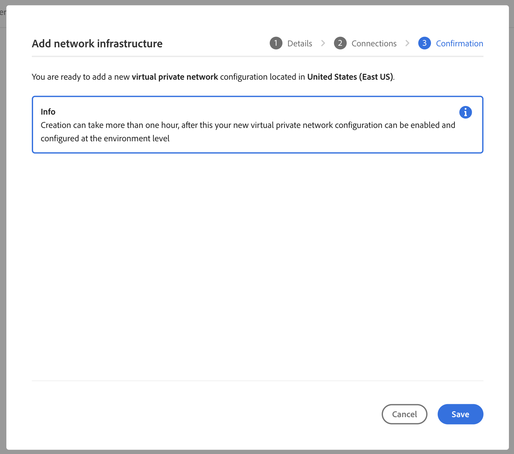
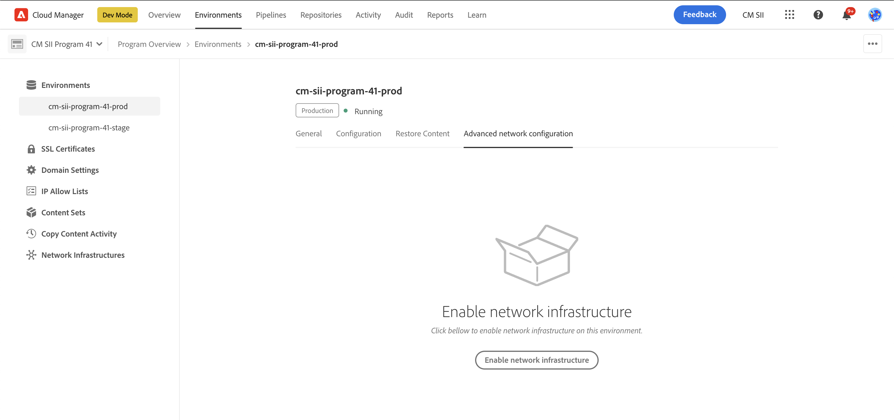
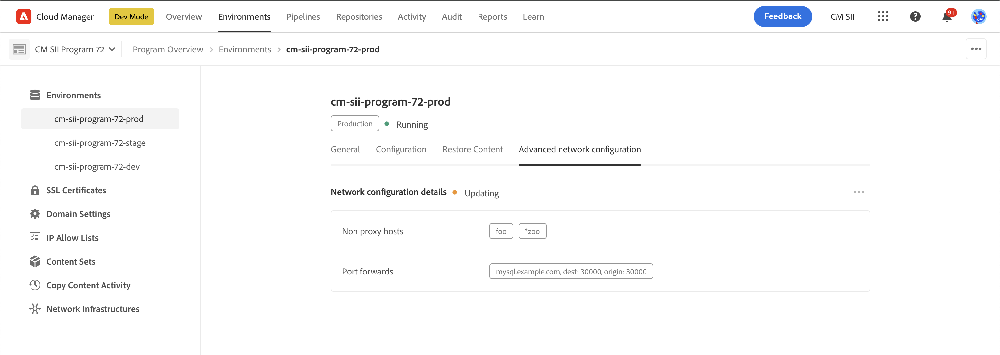
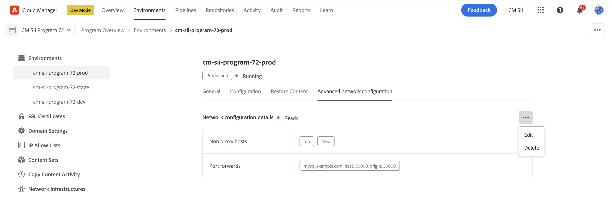

# Configurar redes avançadas para o AEM as a Cloud Service {#configuring-advanced-networking}

Este artigo apresenta os recursos avançados de rede disponíveis no AEM as a Cloud Service. Esses recursos incluem autoatendimento e provisionamento de API de VPN, portas não padrão e endereços IP de saída dedicados.

Além dessa documentação, também há uma série de tutoriais criados para orientá-lo em cada uma das opções avançadas de rede. Consulte [Rede avançada](https://experienceleague.adobe.com/pt-br/docs/experience-manager-learn/cloud-service/networking/advanced-networking).

>[!IMPORTANT]
>
>Você pode configurar redes avançadas no AEM as a Cloud Service por meio da interface do usuário do Cloud Manager ou usando a API do Cloud Manager (por exemplo, cURL).
>
>Este artigo se concentra no uso do método da interface do usuário do. Se preferir automatizar a configuração por meio da API, consulte o [tutorial sobre VPN (Virtual Private Network)](https://experienceleague.adobe.com/pt-br/docs/experience-manager-learn/cloud-service/networking/vpn).
>
>**Automatizando a rede avançada com a API**
>Para automatizar a configuração avançada de rede (como criação de VPN), é possível usar a API do Cloud Manager:
>
>```bash
>curl -X POST https://cloudmanager.adobe.io/api/program/{PROGRAM_ID}/environment/{ENV_ID}/vpn \
>   -H "Authorization: Bearer {ACCESS_TOKEN}" \
>   -H "x-api-key: {API_KEY}" \
>   -H "Content-Type: application/json" \
>   -d '{
>       "providerId": "aws",
>       "portMappings": [
>           {
>               "name": "SSH",
>               "protocol": "TCP",
>               "port": 22
>           }
>       ]
>   }'
>```
>
>Veja o tutorial completo e mais exemplos de API no [tutorial de VPN (Virtual Private Network)](https://experienceleague.adobe.com/pt-br/docs/experience-manager-learn/cloud-service/networking/vpn).
>

## Visão geral {#overview}

A AEM as a Cloud Service oferece as seguintes opções avançadas de rede:

* [Saída flexível da porta](#flexible-port-egress) - Configure o AEM as a Cloud Service para permitir tráfego de saída em portas não padrão.
* [Endereço IP de saída dedicado](#dedicated-egress-ip-address) - Configure o tráfego do AEM as a Cloud Service para se originar de um IP exclusivo.
* [VPN (Virtual Private Network)](#vpn) - Tráfego seguro entre sua infraestrutura e a AEM as a Cloud Service, se você tiver uma VPN.

Este artigo descreve cada uma dessas opções em detalhes e por que você pode usá-las, antes de descrever como elas são configuradas usando a interface do usuário do Cloud Manager e a API. O artigo termina com alguns casos de uso avançados.

>[!CAUTION]
>
>Se você já tiver sido provisionado com a tecnologia de saída dedicada herdada e quiser configurar uma dessas opções avançadas de rede, [contate o Atendimento ao Cliente da Adobe](https://experienceleague.adobe.com/pt-br?support-solution=Experience+Manager&lang=pt-BR#home).
>
>Tentar configurar redes avançadas com a tecnologia de saída herdada pode afetar a conectividade do site.

### Requisitos e limitações {#requirements}

Ao configurar recursos avançados de rede, as seguintes restrições se aplicam.

* Um programa pode provisionar uma única opção avançada de rede (saída de porta flexível, endereço IP de saída dedicado ou VPN).
* A rede avançada não está disponível para [programas de sandbox](/help/implementing/cloud-manager/getting-access-to-aem-in-cloud/program-types.md).
* Um usuário deve ter a função de **Administrador** para adicionar e configurar a infraestrutura de rede em seu programa.
* O ambiente de produção deve ser criado antes que a infraestrutura de rede possa ser adicionada ao seu programa.
* A infraestrutura de rede deve estar na mesma região da região principal de seu ambiente de produção.
   * Caso seu ambiente de produção tenha [regiões de publicação extras](/help/implementing/cloud-manager/manage-environments.md#multiple-regions), você poderá criar outra infraestrutura de rede que espelhe cada região adicional.
   * Você não tem permissão para criar mais infraestrutura de rede do que o número máximo de regiões configuradas em seu ambiente de produção.
   * Você pode definir quantas infraestruturas de rede forem regiões disponíveis em seu ambiente de produção, mas a nova infraestrutura deve ser do mesmo tipo da infraestrutura criada anteriormente.
   * Ao criar várias infraestruturas, você pode selecionar somente aquelas regiões nas quais a infraestrutura de rede avançada não foi criada.

### Configurando e Ativando a Rede Avançada {#configuring-enabling}

O uso de recursos avançados de rede requer duas etapas:

1. A configuração da opção de rede avançada, seja [saída de porta flexível](#flexible-port-egress), [endereço IP de saída dedicado](#dedicated-egress-ip-address) ou [VPN](#vpn), deve ser feita primeiro no nível do programa.
1. Para ser usada, a opção de rede avançada deve ser [habilitada no nível de ambiente](#enabling).

Ambas as etapas podem ser realizadas usando a interface do usuário do Cloud Manager ou a API do Cloud Manager.

* Ao usar a interface do usuário do Cloud Manager, isso significa criar configurações avançadas de rede usando um assistente no nível do programa e editar cada ambiente no qual deseja habilitar a configuração.

* Ao usar a API do Cloud Manager, o ponto de extremidade da API `/networkInfrastructures` é chamado no nível do programa para declarar o tipo desejado de rede avançada. Ela é seguida por uma chamada ao endpoint `/advancedNetworking` para cada ambiente para habilitar a infraestrutura e configurar parâmetros específicos do ambiente.

## Saída flexível da porta {#flexible-port-egress}

Esse recurso avançado de rede permite configurar o AEM as a Cloud Service para direcionar o tráfego de saída por portas diferentes da HTTP (porta 80) e HTTPS (porta 443), que são abertas por padrão.

>[!TIP]
>
>Ao decidir entre a saída de porta flexível e o endereço IP de saída dedicado, é recomendável escolher a saída de porta flexível se um endereço IP específico não for necessário. O motivo é que o Adobe pode otimizar o desempenho do tráfego de saída de porta flexível.

>[!NOTE]
>
>Após a criação, os tipos flexíveis de infraestrutura de saída de porta não podem ser editados. A única maneira de alterar os valores de configuração é excluí-los e recriá-los.

### Configuração da interface {#configuring-flexible-port-egress-provision-ui}

1. Faça logon no Cloud Manager, em [my.cloudmanager.adobe.com](https://my.cloudmanager.adobe.com/), e selecione a organização apropriada.

1. No console **[Meus Programas](/help/implementing/cloud-manager/navigation.md#my-programs)**, selecione o programa.

1. Na página **Visão geral do programa**, navegue até a guia **Ambientes** e selecione **Infraestrutura de rede** no painel esquerdo.

   

1. No assistente **Adicionar infraestrutura de rede**, selecione **Saída de porta flexível**.
1. No menu suspenso **Região**, escolha a região desejada e clique em **Continuar**.

   

1. A guia **Confirmação** resume a seleção e as próximas etapas. Clique em **Salvar** para criar a infraestrutura.

   

Um novo registro aparece abaixo do cabeçalho **Infraestrutura de Rede** no painel lateral. Inclui detalhes como o tipo de infraestrutura, status, região e os ambientes em que está ativado.



>[!NOTE]
>
>A criação da infraestrutura para saída de porta flexível pode levar até uma hora depois da qual ela pode ser configurada no nível do ambiente.

### Configuração da API {#configuring-flexible-port-egress-provision-api}

Uma vez por programa, o endpoint `/program/<programId>/networkInfrastructures` POST é chamado, passando o valor de `flexiblePortEgress` para o parâmetro e região `kind`. O ponto de extremidade responde com `network_id` e outras informações, incluindo o status.

Uma vez chamada, normalmente leva aproximadamente 15 minutos para a infraestrutura de rede ser provisionada. Uma chamada para o [ponto de extremidade GET da infraestrutura de rede](https://developer.adobe.com/experience-cloud/cloud-manager/reference/api/#operation/getNetworkInfrastructure) da Cloud Manager mostraria o status de **pronto**.

>[!TIP]
>
>O conjunto completo de parâmetros, a sintaxe exata e informações importantes, como quais parâmetros não poderão ser alterados posteriormente, [pode ser referenciado na documentação da API](https://developer.adobe.com/experience-cloud/cloud-manager/reference/api/#operation/createNetworkInfrastructure).

### Roteamento de tráfego {#flexible-port-egress-traffic-routing}

Para o tráfego http ou https fluindo para portas que não sejam a 80 ou a 443, um proxy deve ser configurado usando as seguintes variáveis de ambiente de host e porta:

* para HTTP: `AEM_PROXY_HOST`/ `AEM_HTTP_PROXY_PORT ` (padrão para `proxy.tunnel:3128` em versões AEM &lt; 6094)
* para HTTPS: `AEM_PROXY_HOST`/ `AEM_HTTPS_PROXY_PORT ` (padrão para `proxy.tunnel:3128` em versões AEM &lt; 6094)

Por exemplo, este é um exemplo de código para enviar uma solicitação para `www.example.com:8443`:

```java
String url = "www.example.com:8443"
String proxyHost = System.getenv().getOrDefault("AEM_PROXY_HOST", "proxy.tunnel");
int proxyPort = Integer.parseInt(System.getenv().getOrDefault("AEM_HTTPS_PROXY_PORT", "3128"));
HttpClient client = HttpClient.newBuilder()
      .proxy(ProxySelector.of(new InetSocketAddress(proxyHost, proxyPort)))
      .build();
 
HttpRequest request = HttpRequest.newBuilder().uri(URI.create(url)).build();
HttpResponse<String> response = client.send(request, BodyHandlers.ofString());
```

Se estiver usando bibliotecas de rede Java™ não padrão, configure proxies usando as propriedades acima para todo o tráfego.

O tráfego não http/s com destinos por meio de portas declaradas no parâmetro `portForwards` deve fazer referência a uma propriedade chamada `AEM_PROXY_HOST`, juntamente com a porta mapeada. Por exemplo:

```java
DriverManager.getConnection("jdbc:mysql://" + System.getenv("AEM_PROXY_HOST") + ":53306/test");
```

A tabela abaixo descreve o roteamento de tráfego:

<table>
<thead>
  <tr>
    <th>Tráfego</th>
    <th>Condição de destino</th>
    <th>Porta </th>
    <th>Conexão</th>
    <th>Exemplo de destino externo</th>
  </tr>
</thead>
<tbody>
  <tr>
    <td><b>Protocolo http ou https</b></td>
    <td>Tráfego http/s padrão</td>
    <td>80 ou 443</td>
    <td>Permitido</td>
    <td></td>
  </tr> 
  <tr>
    <td></td>
    <td>Tráfego não padrão (em outras portas fora a 80 ou 443) por proxy http configurado, usando a variável de ambiente a seguir e o número da porta do proxy. Não declare a porta de destino no parâmetro portForwards da chamada da API do Cloud Manager:<br><ul>
     <li>AEM_PROXY_HOST (padrão para `proxy.tunnel` em versões AEM &lt; 6094)</li>
     <li>AEM_HTTPS_PROXY_PORT (padrão para a porta 3128 em versões AEM &lt; 6094)</li>
    </ul>
    <td>Exceto portas 80 ou 443</td>
    <td>Permitido</td>
    <td>example.com:8443</td>
  </tr>
  <tr>
    <td></td>
    <td>Tráfego não padrão (em outras portas fora das portas 80 ou 443) não usando proxy http</td>
    <td>Exceto portas 80 ou 443</td>
    <td>Bloqueado</td>
    <td></td>
  </tr>
  <tr>
    <td><b>Não http ou não https</b></td>
    <td>O cliente se conecta à variável de ambiente <code>AEM_PROXY_HOST</code> usando um <code>portOrig</code> declarado no parâmetro da API <code>portForwards</code>.</td>
    <td>Qualquer</td>
    <td>Permitido</td>
    <td><code>mysql.example.com:3306</code></td>
  </tr>
  <tr>
    <td></td>
    <td>Todo o resto</td>
    <td>Qualquer</td>
    <td>Bloqueado</td>
    <td><code>db.example.com:5555</code></td>
  </tr>
</tbody>
</table>

#### Configuração do Apache/Dispatcher {#apache-dispatcher}

A diretiva `mod_proxy` da camada do AEM Cloud Service Apache / Dispatcher pode ser configurada usando as propriedades descritas acima.

```
ProxyRemote "http://example.com:8080" "http://${AEM_PROXY_HOST}:3128"
ProxyPass "/somepath" "http://example.com:8080"
ProxyPassReverse "/somepath" "http://example.com:8080"
```

```
SSLProxyEngine on //needed for https backends
 
ProxyRemote "https://example.com:8443" "http://${AEM_PROXY_HOST}:3128"
ProxyPass "/somepath" "https://example.com:8443"
ProxyPassReverse "/somepath" "https://example.com:8443"
```

## Endereço IP de saída dedicado {#dedicated-egress-ip-address}

Um endereço IP dedicado pode melhorar a segurança ao ser integrado a fornecedores SaaS (como um fornecedor de CRM) ou outras integrações fora da AEM as a Cloud Service que oferecem um incluo na lista de permissões de endereços IP. Adicionar o endereço IP dedicado ao incluo na lista de permissões garante que somente o tráfego do AEM Cloud Service possa fluir para o serviço externo. Essa abordagem está além do tráfego de qualquer outro IP permitido.

O mesmo IP dedicado é aplicado a todos os ambientes em um programa e se aplica aos serviços Autor e Publicação.

Sem o recurso de endereço IP dedicado habilitado, o tráfego do AEM as a Cloud Service flui por meio de um conjunto compartilhado de IPs. Esses IPs são usados por outros clientes da AEM as a Cloud Service.

Configurar um endereço IP de saída dedicado é semelhante a [saída de porta flexível](#flexible-port-egress). A principal diferença é que, após a configuração, o tráfego sempre sairá de um IP dedicado e exclusivo. Para localizar esse IP, use um resolvedor de DNS para identificar o endereço IP associado a `p{PROGRAM_ID}.external.adobeaemcloud.com`. Não é esperado que o endereço IP mude, mas se precisar mudar, é fornecida uma notificação com antecedência.

>[!TIP]
>
>Ao decidir entre saída de porta flexível e endereço IP de saída dedicado, escolha saída de porta flexível se um endereço IP específico não for necessário. O motivo é que o Adobe pode otimizar o desempenho do tráfego de saída de porta flexível.

>[!NOTE]
>
>Se você tiver sido provisionado com um IP de saída dedicado antes de 30/09/2021 (ou seja, antes da versão de setembro de 2021), seu recurso de IP de saída dedicado só será compatível com portas HTTP e HTTPS.
>
>Esse resultado inclui HTTP/1.1 e HTTP/2 quando criptografado. Além disso, um endpoint de saída dedicado pode se comunicar com qualquer público-alvo somente por HTTP/HTTPS nas portas 80/443, respectivamente.

>[!NOTE]
>
>Depois de criados, os tipos de infraestrutura de endereço IP de saída dedicados não podem ser editados. A única maneira de alterar os valores de configuração é excluí-los e recriá-los.

### Configuração da interface {#configuring-dedicated-egress-provision-ui}

1. Faça logon no Cloud Manager, em [my.cloudmanager.adobe.com](https://my.cloudmanager.adobe.com/), e selecione a organização apropriada.

1. No console **[Meus Programas](/help/implementing/cloud-manager/navigation.md#my-programs)**, selecione o programa.

1. Na página **Visão geral do programa**, navegue até a guia **Ambientes** e selecione **Infraestrutura de rede** no painel esquerdo.

   

1. No assistente **Adicionar infraestrutura de rede** aberto, clique em **Endereço IP de saída dedicado**.
1. No menu suspenso **Região**, escolha a região desejada e clique em **Continuar**.

   

1. A guia **Confirmação** resume a seleção e as próximas etapas. Clique em **Salvar** para criar a infraestrutura.

   

Um novo registro aparece abaixo do cabeçalho **Infraestrutura de Rede** no painel lateral. Inclui detalhes como o tipo de infraestrutura, status, região e os ambientes em que está ativado.


>[!NOTE]
>
>A criação da infraestrutura para saída de porta flexível pode levar até uma hora depois da qual ela pode ser configurada no nível do ambiente.

### Configuração da API {#configuring-dedicated-egress-provision-api}

Uma vez por programa, o endpoint `/program/<programId>/networkInfrastructures` POST é chamado, passando o valor de `dedicatedEgressIp` para o parâmetro e região `kind`. O ponto de extremidade responde com `network_id` e outras informações, incluindo o status.

Uma vez chamada, normalmente leva aproximadamente 15 minutos para a infraestrutura de rede ser provisionada. Uma chamada para o [ponto de extremidade GET da infraestrutura de rede](https://developer.adobe.com/experience-cloud/cloud-manager/reference/api/#operation/getNetworkInfrastructure) da Cloud Manager mostraria o status de **pronto**.

>[!TIP]
>
>O conjunto completo de parâmetros, a sintaxe exata e informações importantes, como quais parâmetros não poderão ser alterados posteriormente, [pode ser referenciado na documentação da API](https://developer.adobe.com/experience-cloud/cloud-manager/reference/api/#operation/createNetworkInfrastructure).

### Roteamento de tráfego {#dedicated-egress-ip-traffic-routing}

O tráfego http ou https passa por um proxy pré-configurado, desde que use propriedades padrão do sistema Java™ para configurações de proxy.

O tráfego não http/s com destinos por meio de portas declaradas no parâmetro `portForwards` deve fazer referência a uma propriedade chamada `AEM_PROXY_HOST`, juntamente com a porta mapeada. Por exemplo:

```java
DriverManager.getConnection("jdbc:mysql://" + System.getenv("AEM_PROXY_HOST") + ":53306/test");
```

<table>
<thead>
  <tr>
    <th>Tráfego</th>
    <th>Condição de destino</th>
    <th>Porta </th>
    <th>Conexão</th>
    <th>Exemplo de destino externo</th>
  </tr>
</thead>
<tbody>
  <tr>
    <td><b>Protocolo http ou https</b></td>
    <td>Tráfego para serviços do Azure (*.windows.net) ou da Adobe</td>
    <td>Qualquer</td>
    <td>Por meio dos IPs de cluster compartilhados (não o IP dedicado)</td>
    <td>adobe.io<br>api.windows.net</td>
  </tr>
  <tr>
    <td></td>
    <td>Host correspondente ao parâmetro <code>nonProxyHosts</code></td>
    <td>80 ou 443</td>
    <td>Por meio dos IPs de cluster compartilhados</td>
    <td></td>
  </tr>
  <tr>
    <td></td>
    <td>Host correspondente ao parâmetro <code>nonProxyHosts</code></td>
    <td>Exceto portas 80 ou 443</td>
    <td>Bloqueado</td>
    <td></td>
  </tr>
  <tr>
    <td></td>
    <td>Por meio da configuração de proxy http, configurada por padrão para tráfego http/s usando a biblioteca padrão do cliente HTTP Java™</td>
    <td>Qualquer</td>
    <td>Por meio do IP de saída dedicado</td>
    <td></td>
  </tr>
  <tr>
    <td></td>
    <td>Ignora a configuração do proxy http (por exemplo, se for removido explicitamente da biblioteca HTTP Java™ padrão do cliente ou se uma biblioteca Java™ que ignora a configuração de proxy padrão for usada)</td>
    <td>80 ou 443</td>
    <td>Por meio dos IPs de cluster compartilhados</td>
    <td></td>
  </tr>
  <tr>
    <td></td>
    <td>Ignora a configuração do proxy http (por exemplo, se for removido explicitamente da biblioteca HTTP Java™ padrão do cliente ou se uma biblioteca Java™ que ignora a configuração de proxy padrão for usada)</td>
    <td>Exceto portas 80 ou 443</td>
    <td>Bloqueado</td>
    <td></td>
  </tr>
  <tr>
    <td><b>Não http ou não https</b></td>
    <td>O cliente se conecta à variável env <code>AEM_PROXY_HOST</code> usando uma <code>portOrig</code> declarada no parâmetro de API <code>portForwards</code></td>
    <td>Qualquer</td>
    <td>Por meio do IP de saída dedicado</td>
    <td><code>mysql.example.com:3306</code></td>
  </tr>
  <tr>
    <td></td>
    <td>Qualquer outra coisa</td>
    <td></td>
    <td>Bloqueado</td>
    <td></td>
  </tr>
</tbody>
</table>

### Uso de recursos {#feature-usage}

O recurso é compatível com código Java™ ou bibliotecas que resultam em tráfego de saída, desde que usem propriedades padrão do sistema Java™ para configurações de proxy. Na prática, essa abordagem deve incluir as bibliotecas mais comuns.

Abaixo está uma amostra de código:

```java
public JSONObject getJsonObject(String relativePath, String queryString) throws IOException, JSONException {
  String relativeUri = queryString.isEmpty() ? relativePath : (relativePath + '?' + queryString);
  URL finalUrl = endpointUri.resolve(relativeUri).toURL();
  URLConnection connection = finalUrl.openConnection();
  connection.addRequestProperty("Accept", "application/json");
  connection.addRequestProperty("X-API-KEY", apiKey);

  try (InputStream responseStream = connection.getInputStream(); Reader responseReader = new BufferedReader(new InputStreamReader(responseStream, Charsets.UTF_8))) {
    return new JSONObject(new JSONTokener(responseReader));
  }
}
```

Algumas bibliotecas exigem configuração explícita para usar as propriedades padrão do sistema Java™ para configurações de proxy.

Um exemplo usando o Apache HttpClient que requer chamadas explícitas ao
[`HttpClientBuilder.useSystemProperties()`](https://hc.apache.org/httpcomponents-client-4.5.x/current/httpclient/apidocs/org/apache/http/impl/client/HttpClientBuilder.html) ou use
[`HttpClients.createSystem()`](https://hc.apache.org/httpcomponents-client-4.5.x/current/httpclient/apidocs/org/apache/http/impl/client/HttpClients.html#createSystem()):

```java
public JSONObject getJsonObject(String relativePath, String queryString) throws IOException, JSONException {
  String relativeUri = queryString.isEmpty() ? relativePath : (relativePath + '?' + queryString);
  URL finalUrl = endpointUri.resolve(relativeUri).toURL();

  HttpClient httpClient = HttpClientBuilder.create().useSystemProperties().build();
  HttpGet request = new HttpGet(finalUrl.toURI());
  request.setHeader("Accept", "application/json");
  request.setHeader("X-API-KEY", apiKey);
  HttpResponse response = httpClient.execute(request);
  String result = EntityUtils.toString(response.getEntity());
}
```

### Considerações sobre depuração {#debugging-considerations}

Para validar se o tráfego está realmente saindo do endereço IP dedicado, como esperado, verifique os logs no serviço de destino, se disponível. Caso contrário, pode ser útil chamar um serviço de depuração como [https://ifconfig.me/ip](https://ifconfig.me/ip), que retorna o endereço IP de chamada.

## VPN (Virtual Private Network) {#vpn}

Uma VPN permite a conexão com uma infraestrutura local ou data center a partir das instâncias de autor, publicação ou pré-visualização. Essa capacidade pode ser útil, por exemplo, para proteger o acesso a um banco de dados. Também permite a conexão com fornecedores SaaS, como um fornecedor CRM que oferece suporte a VPN.

A maioria dos dispositivos VPN com tecnologia IPSec é compatível. Consulte as informações na coluna **instruções de configuração RouteBased** em [esta lista de dispositivos](https://learn.microsoft.com/en-us/azure/vpn-gateway/vpn-gateway-about-vpn-devices#devicetable). Configure o dispositivo conforme descrito na tabela.

>[!NOTE]
>
>Veja a seguir as limitações para uma infraestrutura VPN:
>
>* Suporte limitado a uma única conexão VPN
>* Os Resolvedores de DNS devem ser listados no espaço de Endereço de Gateway para resolver nomes de host privados.

### Configuração da interface {#configuring-vpn-ui}

1. Faça logon no Cloud Manager, em [my.cloudmanager.adobe.com](https://my.cloudmanager.adobe.com/), e selecione a organização apropriada.

1. No console **[Meus Programas](/help/implementing/cloud-manager/navigation.md#my-programs)**, selecione o programa.

1. Na página **Visão geral do programa**, navegue até a guia **Ambientes** e selecione **Infraestrutura de rede** no painel esquerdo.

   

1. No assistente **Adicionar infraestrutura de rede** que é iniciado, selecione **Rede privada virtual** e forneça as informações necessárias antes de clicar em **Continuar**.

   * **Região** - A região na qual a infraestrutura deve ser criada.
   * **Espaço de Endereço** - O espaço de endereço só pode ter um /26 CIDR (64 endereços IP) ou um intervalo IP maior em seu próprio espaço.
      * Este valor não pode ser alterado posteriormente.
   * **Informações de DNS** - Uma lista de resolvedores de DNS remotos.
      * Pressione `Enter` depois de inserir um endereço de servidor DNS para adicionar outro.
      * Clique em `X` depois de um endereço para removê-lo.
   * **Chave Compartilhada** - Sua chave pré-compartilhada VPN.
      * Selecione **Mostrar chave compartilhada** para revelar a chave para que você possa verificar seu valor.

   

1. Na guia **Conexões** do assistente, forneça um **nome da conexão** para identificar sua conexão VPN e clique em **Adicionar conexão**.

   

1. Na caixa de diálogo **Adicionar conexão**, defina sua conexão VPN e clique em **Salvar**.

   * **Nome da conexão** - Um nome descritivo da sua conexão VPN, fornecido na etapa anterior e que pode ser atualizado aqui.
   * **Endereço** - O endereço IP do dispositivo VPN.
   * **Espaço de endereçamento** - Os intervalos de endereços IP que devem ser roteados pela VPN.
      * Pressione `Enter` depois de inserir um intervalo para adicionar outro.
      * Clique em `X` após um intervalo para removê-lo.
   * **Política de Segurança IP** - Ajuste a partir dos valores padrão conforme necessário

   

1. A caixa de diálogo é fechada e você retorna à guia **Conexões** do assistente. Clique em **Continuar**.

   

1. A guia **Confirmação** resume a seleção e as próximas etapas. Clique em **Salvar** para criar a infraestrutura.

   

Um novo registro aparece abaixo do cabeçalho **Infraestrutura de Rede** no painel lateral. Inclui detalhes como o tipo de infraestrutura, status, região e os ambientes em que está ativado.

### Configuração da API {#configuring-vpn-api}

Uma vez por programa, o ponto de extremidade POST `/program/<programId>/networkInfrastructures` é chamado. Ele passa em uma carga de informações de configuração. Essas informações incluem o valor de **vpn** para o parâmetro `kind`, região, espaço de endereço (lista de CIDRs - observe que esse valor não pode ser modificado posteriormente), resolvedores de DNS (para resolver nomes na rede). Também inclui informações de conexão VPN, como configuração de gateway, chave VPN compartilhada e política de segurança IP. O ponto de extremidade responde com `network_id` e outras informações, incluindo o status.

Uma vez chamada, normalmente leva de 45 a 60 minutos para a infraestrutura de rede ser provisionada. O método GET na API pode ser chamado para retornar o status, que eventualmente muda de `creating` para `ready`. Consulte a documentação da API para todos os estados.

>[!TIP]
>
>O conjunto completo de parâmetros, a sintaxe exata e informações importantes, como quais parâmetros não poderão ser alterados posteriormente, [pode ser referenciado na documentação da API](https://developer.adobe.com/experience-cloud/cloud-manager/reference/api/#operation/createNetworkInfrastructure).

### Roteamento de tráfego {#vpn-traffic-routing}

A tabela abaixo descreve o roteamento de tráfego.

<table>
<thead>
  <tr>
    <th>Tráfego</th>
    <th>Condição de destino</th>
    <th>Porta</th>
    <th>Conexão</th>
    <th>Exemplo de destino externo</th>
  </tr>
</thead>
<tbody>
  <tr>
    <td><b>Protocolo http ou https</b></td>
    <td>Tráfego para serviços do Azure ou da Adobe</td>
    <td>Qualquer</td>
    <td>Por meio dos IPs de cluster compartilhados (não o IP dedicado)</td>
    <td>adobe.io<br>api.windows.net</td>
  </tr>
  <tr>
    <td></td>
    <td>Host correspondente ao parâmetro <code>nonProxyHosts</code></td>
    <td>80 ou 443</td>
    <td>Por meio dos IPs de cluster compartilhados</td>
    <td></td>
  </tr>
  <tr>
    <td></td>
    <td>Host correspondente ao parâmetro <code>nonProxyHosts</code></td>
    <td>Exceto portas 80 ou 443</td>
    <td>Bloqueado</td>
    <td></td>
  </tr>
  <tr>
    <td></td>
    <td>Se o IP cair no intervalo de espaço <i>Endereço de gateway de VPN</i> e por meio da configuração de proxy http (configurada por padrão para tráfego http/s usando a biblioteca Java™ padrão do cliente HTTP)</td>
    <td>Qualquer</td>
    <td>Através da VPN</td>
    <td><code>10.0.0.1:443</code><br>Também pode ser um nome de host.</td>
  </tr>
  <tr>
    <td></td>
    <td>Se o IP não cair no intervalo <i>Espaço de endereço do gateway de VPN</i> e por meio da configuração de proxy http (configurada por padrão para tráfego http/s usando a biblioteca Java™ padrão do cliente HTTP)</td>
    <td>Qualquer</td>
    <td>Por meio do IP de saída dedicado</td>
    <td></td>
  </tr>
  <tr>
    <td></td>
    <td>Ignora a configuração do proxy http (por exemplo, se for removido explicitamente da biblioteca HTTP Java™ padrão do cliente ou se estiver usando uma biblioteca Java™ que ignora a configuração de proxy padrão)
</td>
    <td>80 ou 443</td>
    <td>Por meio dos IPs de cluster compartilhados</td>
    <td></td>
  </tr>
  <tr>
    <td></td>
    <td>Ignora a configuração do proxy http (por exemplo, se for removido explicitamente da biblioteca HTTP Java™ padrão do cliente ou se estiver usando uma biblioteca Java™ que ignora a configuração de proxy padrão)</td>
    <td>Exceto portas 80 ou 443</td>
    <td>Bloqueado</td>
    <td></td>
  </tr>
  <tr>
    <td><b>Não http ou não https</b></td>
    <td>Se o IP cai no intervalo de <i>espaço de endereço do gateway de VPN</i> e o cliente se conecta à <code>AEM_PROXY_HOST</code> variável env usando uma <code>portOrig</code> declarada no parâmetro <code>portForwards</code> de API</td>
    <td>Qualquer</td>
    <td>Através da VPN</td>
    <td><code>10.0.0.1:3306</code><br>Também pode ser um nome de host.</td>
  </tr>
  <tr>
    <td></td>
    <td>Se o IP não estiver no <i>espaço do endereço do gateway de VPN</i> e o cliente se conectar à variável de ambiente <code>AEM_PROXY_HOST</code> usando um <code>portOrig</code> declarado no parâmetro de API <code>portForwards</code></td>
    <td>Qualquer</td>
    <td>Por meio do IP de saída dedicado</td>
    <td></td>
  </tr>
  <tr>
    <td></td>
    <td>Qualquer outra coisa</td>
    <td>Qualquer</td>
    <td>Bloqueado</td>
    <td></td>
  </tr>
</tbody>
</table>

### Domínios úteis para configuração {#vpn-useful-domains-for-configuration}

O diagrama abaixo fornece uma representação visual de um conjunto de domínios e IPs associados que são úteis para configuração e desenvolvimento. A tabela abaixo do diagrama descreve esses domínios e IPs.


<table>
<thead>
  <tr>
    <th>Padrão de domínio</th>
    <th>Descrição</th>
  </tr>
</thead>
<tbody>
  <tr>
    <td><code>p{PROGRAM_ID}.external.adobeaemcloud.com</code></td>
    <td>Endereço IP de saída dedicado para o tráfego flui para a Internet e não para redes privadas.</td>
  </tr>
  <tr>
    <td><code>p{PROGRAM_ID}.{REGION}-gateway.external.adobeaemcloud.com</code></td>
    <td>O IP do gateway de VPN no lado do AEM. Sua equipe de engenharia de rede pode usar esse IP para permitir somente conexões VPN, de um endereço IP específico, ao seu gateway de VPN. </td>
  </tr>
</tbody>
</table>

## Ativar configurações avançadas de rede em ambientes {#enabling}

Depois de configurar uma opção de rede avançada para um programa, seja [saída de porta flexível](#flexible-port-egress), [endereço IP de saída dedicado](#dedicated-egress-ip-address) ou [VPN](#vpn), para usá-lo, você deverá habilitá-lo no nível do ambiente.

Ao habilitar uma configuração avançada de rede para um ambiente, você também pode habilitar o encaminhamento de portas opcional e hosts não proxy. Os parâmetros são configuráveis por ambiente para oferecer flexibilidade.

* **Encaminhamento de Porta** - As regras de encaminhamento de porta devem ser declaradas para qualquer porta de destino diferente de 80/443, mas somente se não estiverem usando o protocolo http ou https.
   * As regras de encaminhamento de portas são definidas especificando o conjunto de hosts de destino (nomes ou IP e portas).
   * A conexão de cliente que usa a porta 80/443 sobre http / https ainda deve usar configurações de proxy em sua conexão para que as propriedades de rede avançada sejam aplicadas à conexão.
   * Para cada host de destino, você deve mapear a porta de destino pretendida para uma porta de 30000 a 30999.
   * As regras de encaminhamento de portas estão disponíveis para todos os tipos avançados de rede.

* **Hosts sem Proxy** - Os hosts sem proxy permitem que você declare um conjunto de hosts que devem ser roteados por um intervalo de endereços IPs compartilhados em vez do IP dedicado.
   * Essa abordagem pode ser útil, pois a criação de tráfego por meio de IPs compartilhados pode ser otimizada ainda mais.
   * Os hosts não proxy estão disponíveis apenas para endereços IP de saída dedicados e tipos avançados de rede VPN.

>[!NOTE]
>
>Você não pode habilitar uma configuração avançada de rede para um ambiente se ele estiver com o status **Atualizando**.

### Ativação do uso da interface {#enabling-ui}

1. Faça logon no Cloud Manager, em [my.cloudmanager.adobe.com](https://my.cloudmanager.adobe.com/), e selecione a organização apropriada.

1. No console **[Meus Programas](/help/implementing/cloud-manager/navigation.md#my-programs)**, selecione o programa.

1. Na página **Visão geral do programa**, navegue até a guia **Ambientes** e selecione o ambiente em que deseja habilitar a configuração de rede avançada no cabeçalho **Ambientes** do painel esquerdo. Em seguida, selecione a guia **Configuração avançada de rede** do ambiente selecionado e clique em **Habilitar a infraestrutura de rede**.

   

1. A caixa de diálogo **Configurar rede avançada** é aberta.

1. Na guia **Hosts não proxy**, para endereços IP de saída dedicados e VPNs, é possível definir um conjunto de hosts. Esses hosts definidos devem ser roteados por um intervalo de endereços IPs compartilhados, em vez do IP dedicado, fornecendo o nome do host no campo **Host Não Proxy** e clicando em **Adicionar**.

   * O host é adicionado à lista de hosts na guia.
   * Repita esta etapa se quiser adicionar vários hosts.
   * Clique no X à direita da linha se desejar remover um host.
   * Esta guia não está disponível para configurações flexíveis de saída de porta.

   

1. Na guia **Encaminhamentos de porta**, é possível definir regras de encaminhamento de porta opcionais para qualquer porta de destino diferente de 80/443 se não estiver usando HTTP ou HTTPS. Forneça um **Nome**, **Porta Orig** e **Porta Dest** e clique em **Adicionar**.

   * A regra é adicionada à lista de regras na guia.
   * Repita essa etapa se desejar adicionar várias regras.
   * Clique no X à direita da linha se desejar remover uma regra.

   

1. Clique em **Salvar** na caixa de diálogo para que você possa aplicar a configuração ao ambiente.

A configuração avançada de rede é aplicada ao ambiente selecionado. De volta à guia **Ambientes**, você pode ver os detalhes da configuração aplicada ao ambiente selecionado e seus status.



### Ativação do uso da API {#enabling-api}

Para habilitar uma configuração avançada de rede para um ambiente, o ponto de extremidade `PUT /program/<program_id>/environment/<environment_id>/advancedNetworking` deve ser chamado por ambiente.

A API deve responder em apenas alguns segundos, indicando o status `updating`. Após cerca de 10 minutos, uma chamada para o endpoint do GET de ambiente do Cloud Manager mostra um status de `ready`, indicando que a atualização do ambiente foi aplicada.

As regras de encaminhamento de porta por ambiente podem ser atualizadas chamando o ponto de extremidade `PUT /program/{programId}/environment/{environmentId}/advancedNetworking` e incluindo o conjunto completo de parâmetros de configuração, em vez de um subconjunto.

O endereço IP de saída dedicado e os tipos de rede avançados VPN dão suporte a um parâmetro `nonProxyHosts`. Esse suporte permite declarar um conjunto de hosts que devem rotear por um intervalo de endereços IPs compartilhados em vez do IP dedicado. Os URLs `nonProxyHost` podem seguir os padrões `example.com` ou `*.example.com`, em que o curinga é compatível somente no início do domínio.

Mesmo se não houver regras de roteamento de tráfego de ambiente (hosts ou ignoradas), `PUT /program/<program_id>/environment/<environment_id>/advancedNetworking` ainda deve ser chamado, apenas com uma carga vazia.

>[!TIP]
>
>O conjunto completo de parâmetros, a sintaxe exata e informações importantes, como quais parâmetros não poderão ser alterados posteriormente, [pode ser referenciado na documentação da API](https://developer.adobe.com/experience-cloud/cloud-manager/reference/api/#operation/createNetworkInfrastructure).

## Editar e excluir configurações avançadas de rede em ambientes {#editing-deleting-environments}

Depois de [habilitar configurações avançadas de rede para ambientes](#enabling), você pode atualizar os detalhes dessas configurações ou excluí-las.

>[!NOTE]
>
>Não é possível editar a infraestrutura de rede se ela tiver o status **Criando**, **Atualizando** ou **Excluindo**.

### Edição ou exclusão usando a interface do {#editing-ui}

1. Faça logon no Cloud Manager, em [my.cloudmanager.adobe.com](https://my.cloudmanager.adobe.com/), e selecione a organização apropriada.

1. No console **[Meus Programas](/help/implementing/cloud-manager/navigation.md#my-programs)**, selecione o programa.

1. Na página **Visão geral do programa**, navegue até a guia **Ambientes** e selecione o ambiente em que deseja habilitar a configuração de rede avançada no cabeçalho **Ambientes** do painel esquerdo. Em seguida, selecione a guia **Configuração avançada de rede** do ambiente selecionado e clique no botão de reticências.

   

1. No menu de reticências, selecione **Editar** ou **Excluir**.

   * Se você escolher **Editar**, atualize as informações de acordo com as etapas descritas na seção anterior, [Habilitando Usando a Interface do Usuário](#enabling-ui), e clique em **Salvar**.
   * Se você escolher **Excluir**, confirme a exclusão na caixa de diálogo **Excluir configuração de rede** com **Excluir** ou cancele com **Cancelar**.

As alterações são refletidas na guia **Ambientes**.

### Edição ou exclusão usando a API {#editing-api}

Para excluir a rede avançada de um ambiente específico, chame `DELETE [/program/{programId}/environment/{environmentId}/advancedNetworking]()`.

>[!TIP]
>
>O conjunto completo de parâmetros, a sintaxe exata e informações importantes, como quais parâmetros não poderão ser alterados posteriormente, [pode ser referenciado na documentação da API](https://developer.adobe.com/experience-cloud/cloud-manager/reference/api/#operation/createNetworkInfrastructure).

## Editar e excluir a infraestrutura de rede de um programa {#editing-deleting-program}

Depois que a infraestrutura de rede é criada para um programa, somente as propriedades limitadas podem ser editadas. Se não precisar mais dela, você poderá excluir a infraestrutura de rede avançada de todo o programa.

>[!NOTE]
>
>Veja a seguir as limitações para editar e excluir a infraestrutura de rede:
>
>* A exclusão exclui a infraestrutura somente se todos os ambientes tiverem suas redes avançadas desativadas.
>* Não é possível editar a infraestrutura de rede se ela tiver o status **Criando**, **Atualizando** ou **Excluindo**.
>* Somente o tipo de infraestrutura de rede avançada VPN pode ser editado depois de criado e somente em campos limitados.
>* Por motivos de segurança, a **Chave compartilhada** sempre deve ser fornecida ao editar uma infraestrutura avançada de rede VPN, mesmo que você não esteja editando a chave.

### Edição e exclusão com a interface {#delete-ui}

1. Faça logon no Cloud Manager em [my.cloudmanager.adobe.com](https://my.cloudmanager.adobe.com/) e selecione a organização apropriada

1. No console **[Meus Programas](/help/implementing/cloud-manager/navigation.md#my-programs)**, selecione o programa.

1. Na página **Visão geral do programa**, navegue até a guia **Ambientes**.
1. No painel esquerdo, clique em **Infraestrutura de Rede**.
1. Clique no ícone  ao lado da infraestrutura que você deseja excluir.

   

1. Clique em **Editar** ou **Excluir**.

1. Siga uma das seguintes opções:

   * Se você escolher **Editar**, o assistente **Editar infraestrutura de rede** será aberto. Edite conforme necessário seguindo as etapas descritas ao criar a infraestrutura.

   * Se você escolheu **Excluir**, confirme a exclusão na caixa de diálogo **Excluir configuração de rede** com **Excluir** ou cancele com **Cancelar**.

As alterações são refletidas na guia **Ambientes**.

### Edição e exclusão com a API {#delete-api}

Para **excluir** a infraestrutura de rede de um programa, chame `DELETE /program/{program ID}/networkinfrastructure/{networkinfrastructureID}`.

## Alterando o Tipo de Infraestrutura Avançada de Rede de um Programa {#changing-program}

Só é possível ter um tipo de infraestrutura avançada de rede configurada para um programa de cada vez. A infraestrutura de rede avançada deve ser de saída de porta flexível, endereço IP de saída dedicado ou VPN.

Se você decidir que precisa de outro tipo de infraestrutura de rede avançada além daquele que você já configurou, exclua o existente e crie outro. Faça o seguinte:

1. [Excluir rede avançada em todos os ambientes](#editing-deleting-environments).
1. [Excluir a infraestrutura de rede avançada](#editing-deleting-program).
1. Crie o tipo de infraestrutura de rede avançada que você agora precisa, [saída de porta flexível](#flexible-port-egress), [endereço IP de saída dedicado](#dedicated-egress-ip-address) ou [VPN](#vpn).
1. [Reabilitar rede avançada no nível do ambiente](#enabling).

>[!WARNING]
>
> Esse procedimento resulta em um tempo de inatividade dos serviços avançados de rede entre a exclusão e a recriação.
> Se o tempo de inatividade causar um impacto significativo nos negócios, entre em contato com o suporte ao cliente para obter assistência, descrevendo o que já foi criado e o motivo da alteração.

## Configuração avançada de rede para outras regiões de publicação {#advanced-networking-configuration-for-additional-publish-regions}

Quando uma região adicional é adicionada a um ambiente com rede avançada já configurada, o tráfego da região de publicação adicional segue as regras existentes. Por padrão, o tráfego correspondente é roteado pela região principal. No entanto, se a região primária ficar indisponível, o tráfego de rede avançada será interrompido se a rede avançada não tiver sido habilitada na região adicional. Se você quiser otimizar a latência e aumentar a disponibilidade caso uma das regiões sofra uma interrupção, será necessário ativar a rede avançada para as regiões de publicação adicionais. Dois cenários diferentes são descritos nas seções a seguir.

>[!NOTE]
>
>Todas as regiões compartilham a [configuração de rede avançada do ambiente](https://developer.adobe.com/experience-cloud/cloud-manager/reference/api/#tag/Environment-Advanced-Networking-Configuration), portanto, não é possível rotear o tráfego para destinos diferentes com base na região da qual o tráfego está saindo.

### Endereço IP de saída dedicado {#additional-publish-regions-dedicated-egress}

#### Rede avançada já habilitada na região principal {#already-enabled}

Se uma configuração de rede avançada já estiver habilitada na região principal, siga estas etapas:

1. Se você bloqueou sua infraestrutura de modo que o endereço IP dedicado da AEM incluir na lista de permissões seja, desative temporariamente todas as regras de negação nessa infraestrutura. Se você ignorar esta etapa, sua infraestrutura negará temporariamente solicitações dos endereços IP da nova região. Esta etapa não será necessária se você tiver bloqueado sua infraestrutura usando um FQDN (Nome de Domínio Totalmente Qualificado), como `p1234.external.adobeaemcloud.com`. Todas as regiões do AEM geram tráfego de rede avançado do mesmo FQDN.
1. Crie a infraestrutura de rede com escopo de programa para a região secundária por meio de uma chamada POST para a API de criação de infraestrutura de rede do Cloud Manager, conforme descrito na documentação de rede avançada. A única diferença na configuração JSON do conteúdo em relação à região principal será a propriedade de região
1. Se você precisar bloquear sua infraestrutura por IP para permitir o tráfego do AEM, adicione os IPs que correspondem a `p1234.external.adobeaemcloud.com`. Deve haver um por região.

#### Rede avançada ainda não configurada em nenhuma região {#not-yet-configured}

O procedimento é basicamente semelhante às instruções anteriores. No entanto, se o ambiente de produção ainda não tiver sido habilitado para redes avançadas, haverá uma oportunidade de testar a configuração, primeiro habilitando-a em um ambiente de preparo:

1. Crie uma infraestrutura de rede para todas as regiões por meio de uma chamada POST para a [API Criar Infraestrutura de Rede do Cloud Manager](https://developer.adobe.com/experience-cloud/cloud-manager/reference/api/#tag/Network-infrastructure/operation/createNetworkInfrastructure). A única diferença na configuração JSON do payload em relação à região principal é a propriedade region.
1. Para o ambiente de preparo, habilite e configure a rede avançada com escopo de ambiente executando `PUT api/program/{programId}/environment/{environmentId}/advancedNetworking`. Para obter mais informações, consulte [a documentação da API](https://developer.adobe.com/experience-cloud/cloud-manager/reference/api/#tag/Environment-Advanced-Networking-Configuration/operation/enableEnvironmentAdvancedNetworkingConfiguration)
1. Se necessário, bloqueie a infraestrutura externa, de preferência por FQDN (por exemplo, `p1234.external.adobeaemcloud.com`). Caso contrário, você pode fazer isso por meio do endereço IP
1. Se o ambiente de preparo funcionar como esperado, habilite e defina a configuração de rede avançada com escopo de ambiente para produção.

#### VPN {#vpn-regions}

O procedimento é quase idêntico às instruções fornecidas para endereços IP de saída dedicados. A única diferença é que a propriedade region é configurada de forma diferente da região principal. Além disso, você pode configurar o campo `connections.gateway`. A configuração pode rotear para um terminal VPN diferente operado por sua organização, geograficamente mais próximo da nova região.

## Resolução de problemas

Observe que os pontos a seguir são fornecidos como diretrizes informativas e abrangem as práticas recomendadas para a solução de problemas. Essas recomendações têm como objetivo auxiliar no diagnóstico e na resolução de problemas com eficiência.

### Pool de conexão {#connection-pooling-advanced-networking}

O pool de conexões é uma técnica personalizada para criar e manter um repositório de conexões, que estão prontas para uso imediato por qualquer thread que precise delas. Várias técnicas de agrupamento de conexões podem ser encontradas em várias plataformas e recursos on-line, cada uma com seus méritos e considerações únicos. A Adobe incentiva os clientes a investigar essas metodologias para identificar a mais compatível com a arquitetura de seus sistemas.

A implementação de uma estratégia apropriada de pool de conexões é uma medida proativa para corrigir uma supervisão comum na configuração do sistema, o que geralmente leva a um desempenho abaixo do ideal. Ao estabelecer corretamente um pool de conexão, o Adobe Experience Manager (AEM) pode melhorar a eficiência das chamadas externas. Essa abordagem não apenas reduz o consumo de recursos, mas também reduz o risco de interrupções do serviço e diminui a probabilidade de encontrar solicitações com falha ao se comunicar com servidores upstream.

Com base nessas informações, a Adobe recomenda analisar a configuração atual do AEM. Considere também o uso intencional do pool de conexões juntamente com as configurações avançadas de rede. O gerenciamento do número de conexões paralelas e a redução de conexões obsoletas ajudam a otimizar o desempenho da rede. Essas ações reduzem o risco de os servidores proxy atingirem seus limites de conexão. Consequentemente, essa implementação estratégica foi projetada para diminuir a probabilidade de solicitações não alcançarem endpoints externos.

#### Perguntas frequentes sobre limites de conexão

Ao usar redes avançadas, o número de conexões é limitado para garantir a estabilidade entre ambientes e impedir que ambientes mais baixos esgotem as conexões disponíveis.

As conexões são limitadas a 1000 por instância do AEM e os alertas são enviados aos clientes quando o número atinge 750.

##### O limite de conexão é aplicado apenas ao tráfego de saída de portas não padrão ou a todo o tráfego de saída?

O limite é apenas para conexões que usam rede avançada (saída em portas não padrão, usando IP de saída dedicado ou VPN).

##### Não parece haver um aumento significativo no número de conexões de saída. Por que a notificação está sendo recebida agora?

Se o cliente criar conexões dinamicamente (por exemplo, uma ou mais para cada solicitação), um aumento no tráfego pode causar o pico das conexões.

##### Poderia ter ocorrido uma situação semelhante no passado sem disparar um alerta?

Os alertas são enviados somente quando o limite flexível é atingido.

##### O que acontece se o limite máximo for atingido?

Quando o limite rígido é atingido, novas conexões de saída do AEM por meio de redes avançadas (saída em portas não padrão, usando IP de saída dedicado ou VPN) são descartadas para proteger contra um ataque de DoS.

##### O limite pode ser aumentado?

Não, ter um grande número de conexões pode causar um impacto significativo no desempenho e um DoS em pods e ambientes.

##### As conexões são automaticamente fechadas pelo sistema AEM após um determinado período?

Sim, as conexões são fechadas no nível da JVM e em diferentes pontos da infraestrutura de rede. No entanto, esse fluxo de trabalho é muito tarde para qualquer serviço de produção. As conexões devem ser explicitamente fechadas quando não forem mais necessárias ou retornadas ao pool ao usar o pool de conexões. Caso contrário, o consumo de recursos é muito alto e pode causar esgotamento de recursos.

##### Se o limite máximo de conexões for atingido, isso afetará as licenças e resultará em custos adicionais?

Não, não há licença ou custo associado a esse limite. É um limite técnico.

##### Qual é a proximidade do limite de uso atual? Qual é o limite máximo permitido?

O alerta é disparado quando as conexões excedem 750. O limite máximo é de 1000 conexões por instância do AEM.

##### Esse limite é aplicável a VPNs?

Sim, o limite se aplica a conexões usando rede avançada, incluindo VPNs.

##### O limite ainda se aplica ao usar um IP de saída dedicado?

Sim, o limite ainda é aplicável se estiver usando um IP de saída dedicado.
