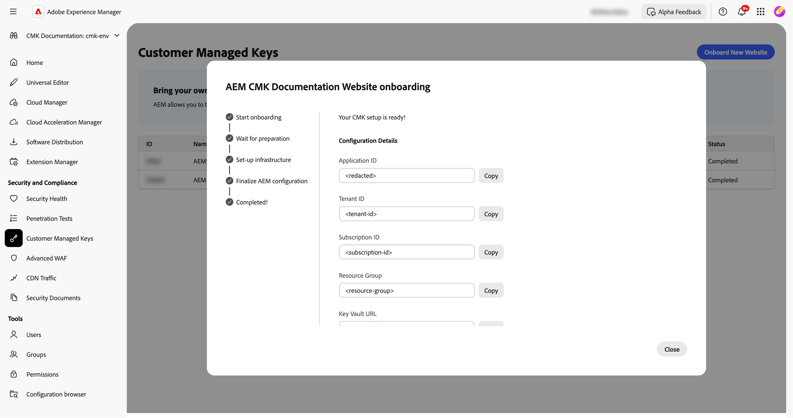

# Configuração de chaves gerenciadas pelo cliente para AEM as a Cloud Service {#customer-managed-keys-for-aem-as-a-cloud-service}

Atualmente, a AEM as a Cloud Service armazena dados do cliente no Armazenamento Azure Blob e no MongoDB, utilizando chaves de criptografia gerenciadas por provedor por padrão para proteger os dados. Embora essa configuração atenda às necessidades de segurança de muitas organizações, as empresas de setores regulamentados ou que precisem de segurança de dados aprimorada podem buscar maior controle sobre suas práticas de criptografia. Para organizações que priorizam a segurança de dados, a conformidade e a capacidade de gerenciar suas chaves de criptografia, a solução CMK (Customer-Managed Keys, chaves gerenciadas pelo cliente) oferece um aprimoramento essencial.

## O problema que está sendo resolvido {#the-problem-being-solved}

Chaves gerenciadas pelo provedor podem criar preocupações para empresas que exigem privacidade e integridade adicionais. Sem controle sobre o gerenciamento de chaves, as organizações enfrentam desafios para atender aos requisitos de conformidade, implementar políticas personalizadas de segurança e garantir a segurança completa dos dados.

A introdução do CMK (Customer-Managed Keys, chaves gerenciadas pelo cliente) resolve essas preocupações, pois capacita os clientes da AEM com controle total sobre suas chaves de criptografia. Ao autenticar por meio da Microsoft Entra ID (antigo Azure Ative Diretory), o AEM CS se conecta com segurança ao Cofre de Chaves do Azure do cliente, permitindo que eles gerenciem o ciclo de vida de suas chaves de criptografia — abrangendo criação, rotação e revogação de chaves.

A CMK oferece várias vantagens:

* **Controlar Criptografia de Dados e Aplicativos:** aumente a segurança com o controle direto do aplicativo AEM e das chaves criptográficas de dados.
* **Aumentar a Confidencialidade e a Integridade:** reduza a probabilidade de acesso inadvertido e divulgação de dados confidenciais ou proprietários com o gerenciamento completo de criptografia.
* **Suporte ao Cofre de Chaves do Azure:** O uso do Cofre de Chaves do Azure permite o armazenamento de chaves, o processamento de operações de segredos e a execução de rotações de chaves.

Com a adoção do CMK, os clientes podem aumentar o controle sobre suas práticas de segurança e criptografia de dados, aprimorando a segurança e reduzindo riscos, tudo isso enquanto continuam a aproveitar a escalabilidade e a flexibilidade do AEM CS.

O AEM as a Cloud Service permite trazer suas próprias chaves de criptografia para criptografar dados em repouso. Este guia fornece etapas para configurar uma chave gerenciada pelo cliente (CMK) no Cofre de Chaves do Azure para AEM as a Cloud Service.

>[!WARNING]
>
>Após configurar o CMK, não é possível reverter para chaves gerenciadas pelo sistema. Você é responsável por gerenciar com segurança suas chaves e fornecer acesso ao Cofre da Chave, Chave e aplicativo CMK no Azure para evitar a perda de acesso aos seus dados.

Você também será guiado pelas seguintes etapas para criar e configurar a infraestrutura necessária:

1. Configurar o ambiente
1. Obter uma ID de aplicativo do Adobe
1. Criar um novo grupo de recursos
1. Criar um cofre de chaves
1. Conceder acesso à Adobe para o cofre de chaves
1. Criar uma chave de criptografia

Você precisará compartilhar o URL do cofre de chaves, o nome da chave de criptografia e as informações sobre o cofre de chaves com a Adobe.

## Configurar o ambiente {#setup-your-environment}

A Interface de Linha de Comando (CLI) do Azure é o único requisito para este guia. Se você ainda não tiver o Azure CLI instalado, siga as instruções oficiais de instalação [aqui](https://learn.microsoft.com/en-us/cli/azure/install-azure-cli).

Antes de prosseguir com o restante deste guia, faça logon na CLI com o `az login`.

>[!NOTE]
>
>Embora este guia use a CLI do Azure, é possível executar as mesmas operações por meio do console do Azure. Se preferir usar o console do Azure, use os comandos abaixo como referência.


## Iniciar o processo de configuração do CMK para o AEM as a Cloud Service {#request-cmk-for-aem-as-a-cloud-service}

Você precisa solicitar a configuração das Chaves gerenciadas pelo cliente (CMK) para seu ambiente do AEM as a Cloud Service por meio da interface do. Para fazer isso, navegue até a interface do usuário do AEM Home Security, na seção **Chaves gerenciadas pelo cliente**.
Você pode iniciar o processo de integração clicando no botão **Iniciar integração**.


## Obter uma ID de aplicativo do Adobe {#obtain-an-application-id-from-adobe}

Após iniciar o processo de integração, a Adobe fornecerá uma ID do aplicativo Entra. Essa ID do aplicativo é necessária para o restante do guia e será usada para criar uma entidade de serviço que permita que o Adobe acesse seu cofre de chaves. Se você ainda não tiver uma ID do aplicativo, será necessário aguardar até que ela seja fornecida pelo Adobe.


Após concluir a solicitação, você poderá ver a ID do aplicativo na interface do CMK.


## Criar um novo grupo de recursos {#create-a-new-resource-group}

Crie um novo grupo de recursos em um local de sua escolha.

```powershell
# Choose a location and a name for the resource group.
$location="<AZURE LOCATION>"
$resourceGroup="<RESOURCE GROUP>"

# Create the resource group.
az group create --location $location --resource-group $resourceGroup
```

Se você já tiver um grupo de recursos, sinta-se à vontade para usá-lo. No restante deste guia, o local do grupo de recursos e seu nome são identificados com `$location` e `$resourceGroup`, respectivamente.

## Criar um Cofre de Chaves {#create-a-key-vault}

Será necessário criar um cofre de chaves para conter sua chave de criptografia. O cofre de chaves deve ter a proteção de limpeza habilitada. A proteção de limpeza é necessária para criptografar dados em repouso de outros serviços do Azure. O acesso à rede pública deve ser ativado para garantir que os serviços da Adobe possam acessar o cofre de chaves.

>[!IMPORTANT]
>A criação do Cofre da Chave com Acesso de Rede Pública desativado impõe que todas as operações relacionadas ao Cofre da Chave, como Criação ou Rotação de Chaves, tenham que ser executadas de um ambiente que tenha acesso de rede ao Cofre da Chave - por exemplo, uma VM que possa acessar o Cofre da Chave.

```powershell
# Reuse this information from the previous step.
$location="<AZURE LOCATION>"
$resourceGroup="<RESOURCE GROUP>"

# Choose a name for the key vault.
$keyVaultName="<KEY VAULT NAME>"

# Create the key vault.
az keyvault create `
  --location $location `
  --resource-group $resourceGroup `
  --name $keyVaultName `
  --default-action=Allow `
  --enable-purge-protection `
  --enable-rbac-authorization `
  --public-network-access Enabled
```

## Conceder acesso à Adobe para o Cofre da Chave {#grant-adobe-access-to-the-key-vault}

Nesta etapa, você permitirá que o Adobe acesse seu cofre de chaves por meio de um aplicativo Entra. A ID do aplicativo Entra já deve ter sido fornecida pela Adobe.

Primeiro, você deve criar uma entidade de serviço anexada ao aplicativo Entra e atribuir a ela as funções **Cofre de Chaves Reader** e **Usuário de Criptografia do Cofre de Chaves**. As funções estão limitadas ao cofre de chaves criado neste guia.

```powershell
# Reuse this information from the previous steps.
$resourceGroup="<RESOURCE GROUP>"
$keyVaultName="<KEY VAULT NAME>"

# The application ID is provided by Adobe.
$appId="<APPLICATION ID>"

# Retrieve the ID of the key vault.
$keyVaultId=(az keyvault show --resource-group $resourceGroup --name $keyVaultName --query id --output tsv)

# Create a new service principal.
$servicePrincipalId=(az ad sp create --id $appId --query id --out tsv)

# Assign the roles to the service principal.
az role assignment create --assignee $servicePrincipalId --role "Key Vault Reader" --scope $keyVaultId
az role assignment create --assignee $servicePrincipalId --role "Key Vault Crypto User" --scope $keyVaultId
```

## Criar uma chave de criptografia {#create-an-encryption-key}

Por fim, você pode criar uma chave de criptografia no cofre de chaves. Observe que você precisará da função **Criptografador do Cofre de Chaves** para concluir esta etapa. Se o usuário conectado não tiver essa função, entre em contato com o administrador do sistema para que essa função seja concedida a você ou peça a alguém que já tenha essa função para concluir esta etapa para você.

O acesso de rede ao cofre de chaves é necessário para criar a chave de criptografia. Primeiro, verifique se você pode acessar o cofre de chaves e prossiga com a criação da chave:

```powershell
# Reuse this information from the previous steps.
$keyVaultName="<KEY VAULT NAME>"

# Choose a name for your key.
$keyName="<KEY NAME>"

# Create the key.
az keyvault key create --vault-name $keyVaultName --name $keyName
```

## Compartilhar as informações do Cofre de Chaves {#share-the-key-vault-information}

Neste ponto, você está pronto. Você só precisa compartilhar algumas informações necessárias por meio da interface do CMK, que iniciará o processo de configuração do ambiente.

```powershell
# Reuse this information from the previous steps.
$resourceGroup="<RESOURCE GROUP>"
$keyVaultName="<KEY VAULT NAME>"

# Retrieve the URL of your key vault.
$keyVaultUri=(az keyvault show --name $keyVaultName `
    --resource-group $resourceGroup `
    --query properties.vaultUri `
    --output tsv)

# In addition we would need the tenantId and the subscriptionId in order to setup the connection.
$tenantId=(az keyvault show --name $keyVaultName `
    --resource-group $resourceGroup `
    --query properties.tenantId `
    --output tsv)
$subscriptionId="<Subscription ID>"
```

Forneça essas informações na interface do CMK:


## Implicações da revogação do acesso à chave {#implications-of-revoking-key-access}

Revogar ou desabilitar o acesso ao Cofre da chave, chave ou aplicativo CMK pode resultar em interrupções significativas, que incluem alterações nas operações da sua plataforma. Depois que essas chaves forem desativadas, os dados na Platform poderão se tornar inacessíveis e qualquer operação downstream que depende desses dados deixará de funcionar. É fundamental entender totalmente os impactos downstream antes de fazer qualquer alteração nas principais configurações.

Se você decidir revogar o acesso da Platform aos seus dados, poderá fazê-lo removendo a função de usuário associada ao aplicativo do Cofre de Chaves no Azure.

## Próximas etapas {#next-steps}

Depois de fornecer as informações necessárias na interface do CMK, o Adobe iniciará o processo de configuração do seu ambiente AEM as a Cloud Service. Esse processo pode levar algum tempo, e você será notificado quando ele for concluído.


## Conclua a configuração do CMK {#complete-the-cmk-setup}

Quando o processo de configuração for concluído, você poderá ver o status da configuração do CMK na interface. Você também pode ver o cofre de chaves e a chave de criptografia.


## Perguntas e suporte {#questions-and-support}

Entre em contato conosco se tiver dúvidas, dúvidas ou precisar de assistência com a configuração de Chaves gerenciadas pelo cliente do AEM as a Cloud Service. O Suporte da Adobe pode ajudá-lo com qualquer dúvida que você tiver.