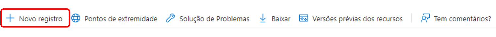

# Suporte OAuth2 para o serviço de email {#oauth2-support-for-the-mail-service}

O AEM as a Cloud Service oferece suporte de OAuth2 no seu serviço de email integrado, permitindo que as organizações cumpram com os requisitos de segurança de email.

Você pode configurar o OAuth para vários provedores de email. Abaixo estão as instruções passo a passo para configurar o serviço de email do AEM para autenticar via OAuth2 com o Microsoft® Office 365 Outlook. Outros fornecedores podem ser configurados de maneira semelhante.

Para obter mais informações sobre o Serviço de email do AEM as a Cloud Service, consulte [Envio de email](/help/implementing/developing/introduction/development-guidelines.md#sending-email).

## Microsoft® Outlook {#microsoft-outlook}

1. Acesse [https://portal.azure.com/](https://portal.azure.com/) e faça logon.
1. Digite **Azure Active Directory** na barra de pesquisa e clique no resultado. Como alternativa, você pode navegar diretamente para [https://portal.azure.com/#blade/Microsoft_AAD_IAM/ActiveDirectoryMenuBlade/Overview](https://portal.azure.com/#blade/Microsoft_AAD_IAM/ActiveDirectoryMenuBlade/Overview)
1. Clique em **Registro do aplicativo** > **Novo registro**.

   

1. Preencha as informações de acordo com suas necessidades e clique em **Registrar**.
1. Vá para o aplicativo criado e selecione **Permissões de API**.
<!-- Alexandru: removing as a result of CQDOC-20609 
1. Click **Add Permission** > **Graph Permission** > **Delegated Permissions**. -->
1. Selecione as permissões abaixo para seu aplicativo e clique em **Adicionar permissão**:

   >[!NOTE]
   >
   >A configuração de permissões pode evoluir com o tempo. Trabalhe com a Microsoft® se eles não funcionarem como esperado.

   * `https://outlook.office.com/SMTP.Send`
   * `openid`
   * `offline_access`
   * `email`
   * `profile`
1. Acesse **Autenticação** > **Adicionar uma plataforma** > **Web** e na seção **URLs de redirecionamento**, adicione os URLs abaixo, um com a barra e o outro sem:
   * `http://localhost/`
   * `http://localhost`
1. Clique em **Configurar** depois de adicionar cada URL e defina as configurações de acordo com seus requisitos.
1. Em seguida, acesse **Certificados e segredos**, clique em **Novo segredo de cliente** e siga as etapas na tela para criar um segredo. Anote este segredo para uso posterior.
1. Clique em **Visão geral** no painel esquerdo e copie os valores de **ID do aplicativo (cliente)** e **ID do diretório (locatário)** para uso posterior.

Resumindo, você precisará das seguintes informações para configurar o OAuth2 para o serviço de email no lado do AEM:

* O URL de autenticação, que será gerado com a ID do locatário. Ele tem este formato: `https://login.microsoftonline.com/<tenantID>/oauth2/v2.0/authorize`
* O URL do token, que será gerado com a ID do locatário. Ele tem este formato: `https://login.microsoftonline.com/<tenantID>/oauth2/v2.0/token`
* O URL de atualização, que será gerado com a ID do locatário. Ele tem este formato: `https://login.microsoftonline.com/<tenantID>/oauth2/v2.0/token`
* A ID do cliente
* O segredo do cliente

### Geração do token de atualização {#generating-the-refresh-token}

Em seguida, gere o token de atualização, que faz parte da configuração OSGi em uma etapa subsequente, seguindo este método:

1. Abra a seguinte URL no navegador depois de substituir `clientID` e `tenantID` pelos valores específicos da sua conta:

   ```
   https://login.microsoftonline.com/%3ctenantID%3e/oauth2/v2.0/authorize?client_id=%3cclientId%3e&response_type=code&redirect_uri=http://localhost&response_mode=query&scope=https://outlook.office.com/SMTP.Send%20email%20openid%20profile%20offline_access&state=12345`
   ```

1. Quando solicitado, conceda a permissão.
1. O URL redireciona para um novo local, construído neste formato:

   ```
   http://localhost/?code=<code>&state=12345&session_state=4f984c6b-cc1f-47b9-81b2-66522ea83f81#`
   ```

1. Copie o valor de `<code>` no exemplo acima.
1. Use o seguinte comando cURL para obter o refreshToken. Substitua tenantID, clientID e clientSecret pelos valores da sua conta e o valor por `<code>`:

   ```
   curl --location --request POST 'https://login.microsoftonline.com/<tenantId>/oauth2/v2.0/token' \
   --header 'Content-Type: application/x-www-form-urlencoded' \
   --header 'Cookie: buid=0.ARgAep0nU49DzUGmoP2wnvyIkcQjsx26HEpOnvHS0akqXQgYAAA.AQABAAEAAAD--DLA3VO7QrddgJg7Wevry9XPJSKbGVlPt5NWYxLtTl3K1W0LwHXelrffApUo_K02kFrkvmGm94rfBT94t25Zq4bCd5IM3yFOjWb3V22yDM7-rl112sLzbBQBRCL3QAAgAA; esctx=AQABAAAAAAD--DLA3VO7QrddgJg7Wevr4a8wBjYcNbBXRievdTOd15caaeAsQdXeBAQA3tjVQaxmrOXFGkKaE7HBzsJrzA-ci4RRpor-opoo5gpGLh3pj_iMZuqegQPEb1V5sUVQV8_DUEbBv5YFV2eczS5EAhLBAwAd1mHx6jYOL8LwZNDFvd2-MhVXwPd6iKPigSuBxMogAA; x-ms-gateway-slice=estsfd; stsservicecookie=estsfd; fpc=Auv6lTuyAP1FuOOCfj9w0U_5vR5dAQAAALDXP9gOAAAAwIpkkQEAAACT2T_YDgAAAA' \
   --data-urlencode 'client_id=<clientID>' \
   --data-urlencode 'redirect_uri=http://localhost' \
   --data-urlencode 'grant_type=authorization_code' \
   --data-urlencode 'client_secret=<clientSecret>' \
   --data-urlencode 'code=<code>'
   ```

1. Anote o refreshToken e o accessToken.

### Validação dos tokens {#validating-the-tokens}

Antes de continuar a configurar o OAuth no lado do AEM, valide o accessToken e o refreshToken com o procedimento abaixo:

1. Gere o accessToken usando o refreshToken produzido no procedimento anterior por meio do seguinte cURL, substituindo os valores de `<client_id>`, `<client_secret>` e `<refreshToken>`:

   ```
   curl --location --request POST 'https://login.microsoftonline.com/<tenetId>/oauth2/v2.0/token' \
   --header 'Content-Type: application/x-www-form-urlencoded' \
   --header 'Cookie: buid=0.ARgAep0nU49DzUGmoP2wnvyIkcQjsx26HEpOnvHS0akqXQgYAAA.AQABAAEAAAD--DLA3VO7QrddgJg7Wevry9XPJSKbGVlPt5NWYxLtTl3K1W0LwHXelrffApUo_K02kFrkvmGm94rfBT94t25Zq4bCd5IM3yFOjWb3V22yDM7-rl112sLzbBQBRCL3QAAgAA; esctx=AQABAAAAAAD--DLA3VO7QrddgJg7Wevr4a8wBjYcNbBXRievdTOd15caaeAsQdXeBAQA3tjVQaxmrOXFGkKaE7HBzsJrzA-ci4RRpor-opoo5gpGLh3pj_iMZuqegQPEb1V5sUVQV8_DUEbBv5YFV2eczS5EAhLBAwAd1mHx6jYOL8LwZNDFvd2-MhVXwPd6iKPigSuBxMogAA; x-ms-gateway-slice=estsfd; stsservicecookie=estsfd; fpc=Auv6lTuyAP1FuOOCfj9w0U_IezHLAQAAAPeNSdgOAAAA' \
   --data-urlencode 'client_id=<client_id>' \
   --data-urlencode 'scope=https://outlook.office.com/SMTP.Send https://graph.microsoft.com/Mail.Read https://graph.microsoft.com/Mail.Send https://graph.microsoft.com/User.Read email openid profile offline_access' \
   --data-urlencode 'redirect_uri=http://localhost' \
   --data-urlencode 'grant_type=refresh_token' \
   --data-urlencode 'client_secret=<client_secret>' \
   --data-urlencode 'refresh_token=<refreshToken>'
   ```

1. Envie um email usando o accessToken para ver se ele está funcionando corretamente.

>[!NOTE]
>
> Você pode obter a coleção da API do Postman [aqui](https://learn.microsoft.com/en-us/entra/identity-platform/v2-oauth2-auth-code-flow).
>
> Consulte a [documentação do MSFT OAuth](https://learn.microsoft.com/pt-BR/exchange/client-developer/legacy-protocols/how-to-authenticate-an-imap-pop-smtp-application-by-using-oauth) para obter mais detalhes.

### Integração com o AEM as a Cloud Service {#integration-with-aem-as-a-cloud-service}

1. Crie um arquivo de propriedade OSGI chamado `com.day.cq.mailer.oauth.impl.OAuthConfigurationProviderImpl.cfg.json` em `/apps/<my-project>/osgiconfig/config` com a seguinte sintaxe:

   ```
   {
       authUrl: "<Authorization Url>",
       tokenUrl: "<Token Url>",
       clientId: "<clientID>",
       clientSecret: "$[secret:SECRET_SMTP_OAUTH_CLIENT_SECRET]",
       scopes: [
          "scope1",
          "scope2"
       ],
       authCodeRedirectUrl: "http://localhost",
       refreshUrl: "<Refresh token Url>",
       refreshToken: "$[secret:SECRET_SMTP_OAUTH_REFRESH_TOKEN]"
   }
   ```

1. Preencha o `authUrl`, `tokenUrl` e `refreshURL`, gerando-os conforme descrito na seção anterior.
1. Adicione os seguintes escopos à configuração:

   >[!NOTE]
   >
   >Os escopos podem evoluir com o tempo. Trabalhe com a Microsoft® se eles não funcionarem como esperado.

   * `https://outlook.office.com/SMTP.Send`
   * `openid`
   * `offline_access`
   * `email`
   * `profile`
1. Criar um arquivo de propriedade OSGI `called com.day.cq.mailer.DefaultMailService.cfg.json`
em `/apps/<my-project>/osgiconfig/config` com a sintaxe abaixo. Os valores `smtp.host` e `smtp.port` refletem a configuração avançada de rede, conforme descrito na seção [Tutorial do serviço de email](https://experienceleague.adobe.com/pt-br/docs/experience-manager-learn/cloud-service/networking/examples/email-service).

   ```
   {
    "smtp.host": "$[env:AEM_PROXY_HOST;default=proxy.tunnel]",
    "smtp.user": "<user account that logged into get the oauth tokens>",
    "smtp.password": "value not used",
    "smtp.port": 30465,
    "from.address": "<from address used for sending>",
    "smtp.ssl": false,
    "smtp.starttls": true,
    "smtp.requiretls": true,
    "debug.email": false,
    "oauth.flow": true
   }
   ```

1. Para o Outlook, o valor de configuração do `smtp.host` é `smtp.office365.com`
1. No tempo de execução, forneça os segredos `refreshToken values` e `clientSecret` usando a [API de variáveis do Cloud Manager](/help/implementing/deploying/configuring-osgi.md#setting-values-via-api) ou o [Cloud Manager para adicionar variáveis](/help/implementing/cloud-manager/environment-variables.md). Os valores das variáveis `SECRET_SMTP_OAUTH_REFRESH_TOKEN` e `SECRET_SMTP_OAUTH_CLIENT_SECRET` devem ser definidos.

### Resolução de problemas {#troubleshooting}

Se o serviço de email não estiver funcionando corretamente, você precisará gerar o `refreshToken` novamente conforme descrito acima, fornecendo o novo valor por meio da API do Cloud Manager. Levará alguns minutos para o novo valor ser implantado.
