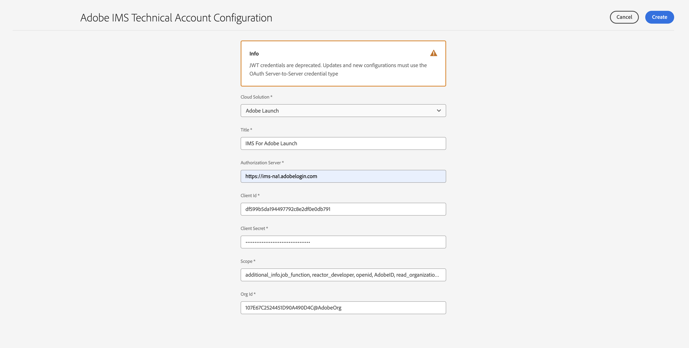
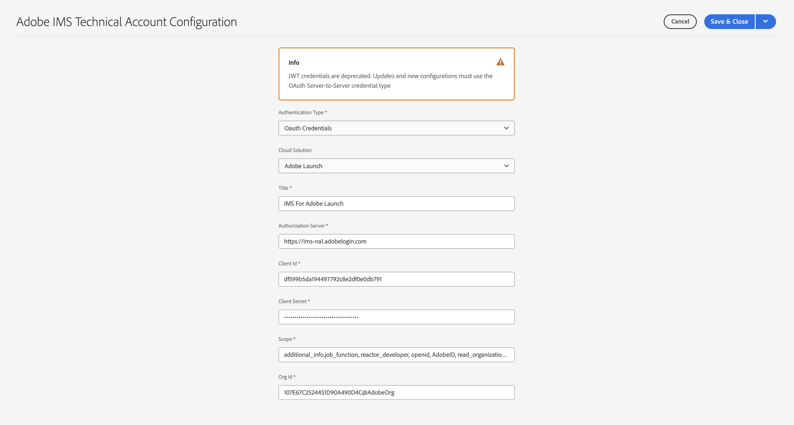

# Configuração de integrações IMS para o AEM as a Cloud Service {#setting-up-ims-integrations-for-aemaacs}

>[!NOTE]
>
>As configurações JWT provisionadas automaticamente não devem ser migradas manualmente, pois serão tratadas automaticamente pelo Adobe.

O Adobe Experience Manager (AEM) as a Cloud Service pode ser integrado a muitas outras soluções de Adobe. Por exemplo, Adobe Target, Adobe Analytics e outros.

As integrações usam uma integração IMS, configurada com S2S OAuth.

* Depois de criar:

   * [Credenciais no Console do desenvolvedor](#credentials-in-the-developer-console)

* Em seguida, é possível:

   * Criar um (novo) [Configuração do OAuth](#creating-oauth-configuration)

   * [Migrar uma configuração JWT existente para uma configuração OAuth](#migrating-existing-JWT-configuration-to-oauth)

>[!CAUTION]
>
>Anteriormente, as configurações eram feitas com [Credenciais JWT que agora estão sujeitas a desativação no console do Adobe Developer](/help/security/jwt-credentials-deprecation-in-adobe-developer-console.md).
>
>Essas configurações não podem mais ser criadas ou atualizadas, mas podem ser migradas para configurações OAuth.

## Credenciais no Console do desenvolvedor {#credentials-in-the-developer-console}

Como primeira etapa, é necessário configurar as credenciais do OAuth no console do Adobe Developer.

Para obter detalhes sobre como fazer isso, consulte a documentação do Developer Console, dependendo de seus requisitos:

* Visão geral:

   * [Autenticação de servidor para servidor](https://developer.adobe.com/developer-console/docs/guides/authentication/ServerToServerAuthentication/)

* Criação de uma nova credencial OAuth:

   * [Guia de implementação de credenciais do OAuth de servidor para servidor](https://developer.adobe.com/developer-console/docs/guides/authentication/ServerToServerAuthentication/implementation/)

* Migrar uma credencial JWT existente para uma credencial OAuth:

   * [Migração da credencial de conta de serviço (JWT) para a credencial de servidor para servidor do OAuth](https://developer.adobe.com/developer-console/docs/guides/authentication/ServerToServerAuthentication/migration/)

Por exemplo:

## Criação de uma configuração OAuth {#creating-oauth-configuration}

Para criar uma nova Integração do Adobe IMS usando o OAuth:

1. No AEM, navegue até **Ferramentas**, **Segurança**, **Integração do Adobe IMS**.

1. Selecione **Criar**.

1. Conclua a configuração com base nos detalhes do [Console do desenvolvedor](https://developer.adobe.com/developer-console/docs/guides/authentication/ServerToServerAuthentication/implementation/). Por exemplo:

   

1. **Salvar** suas alterações.

## Migração de uma configuração JWT existente para uma configuração OAuth {#migrating-existing-JWT-configuration-to-oauth}

Para migrar uma Integração do Adobe IMS existente com base em credenciais JWT:

>[!NOTE]
>
>Este exemplo mostra uma Configuração IMS do Launch.

1. No AEM, navegue até **Ferramentas**, **Segurança**, **Integração do Adobe IMS**.

1. Selecione a configuração JWT que precisa ser migrada. As configurações do JWT são marcadas com o aviso **Credenciais JWT (obsoleto)**.

1. Selecionar **Propriedades**:

   

1. A configuração será aberta como somente leitura:

   

1. Selecionar **OAuth** do **Tipo de autenticação** lista suspensa:

   

1. As propriedades disponíveis serão atualizadas. Use os detalhes no Console do desenvolvedor para concluí-los:

   

1. Uso **Salvar e fechar** para continuar com suas atualizações.
Ao retornar ao console, a variável **Credenciais JWT (obsoleto)** o aviso desaparecerá.