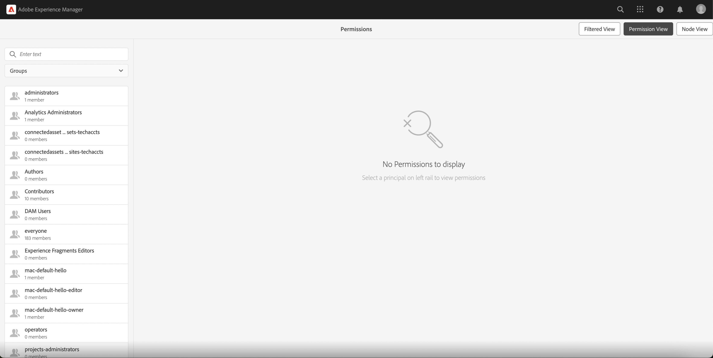
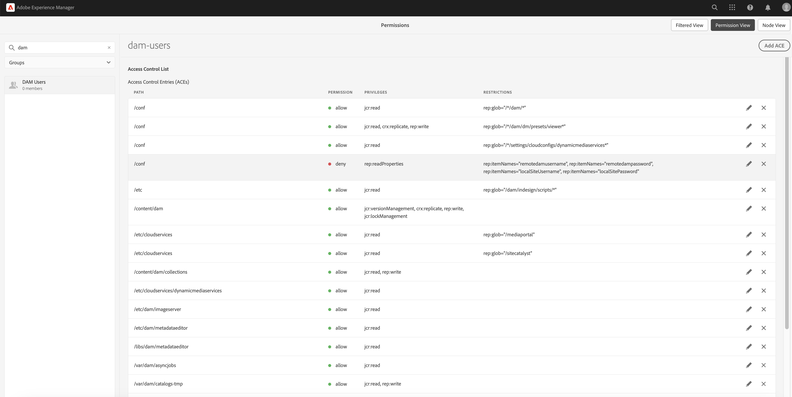
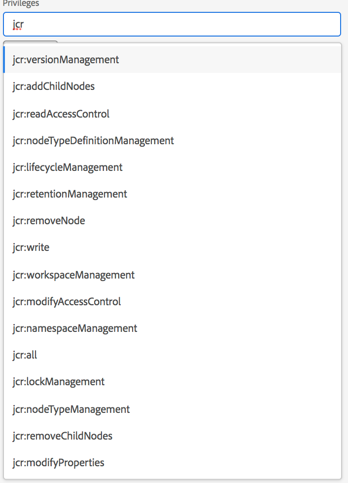
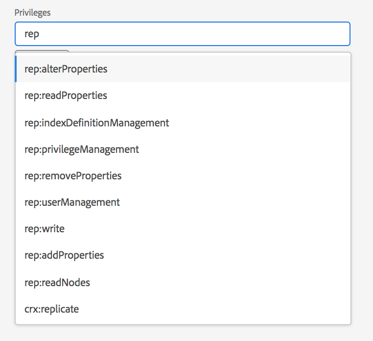
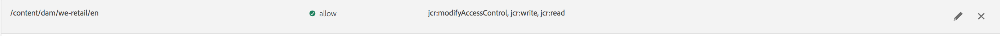
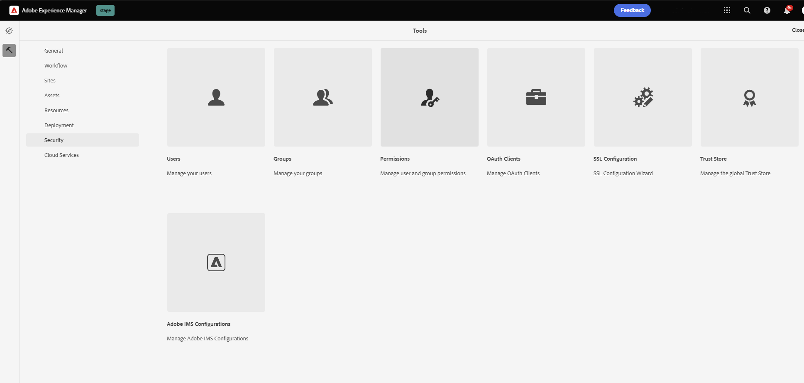
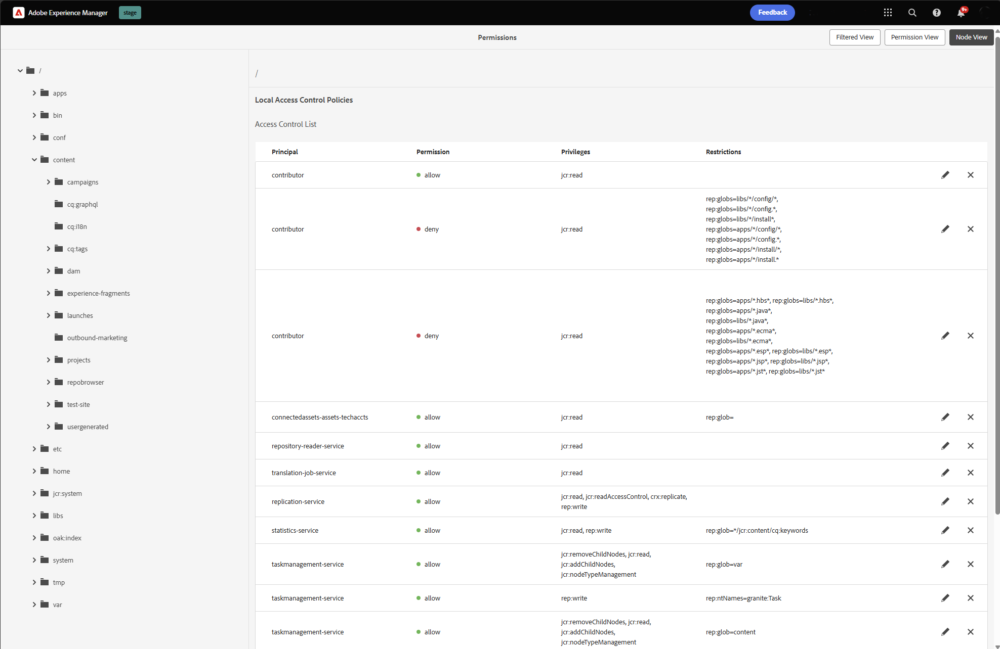
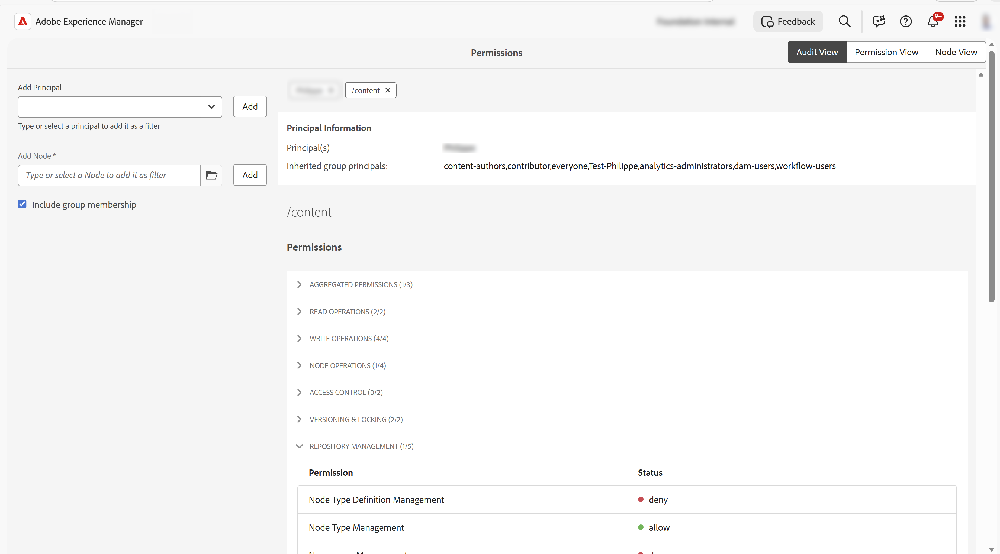
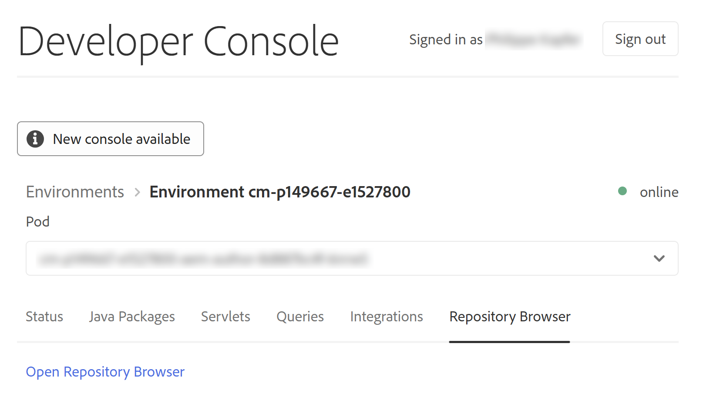

# Exibição principal para gerenciamento de permissões {#principal-view-for-permissions-management}

## Visão geral {#overview}

O AEM apresenta o Gerenciamento de permissões para usuários e grupos. A funcionalidade principal permanece a mesma da interface clássica, mas é mais amigável e eficiente.

## Acesso à interface {#accessing-the-ui}

O novo gerenciamento de permissões com base em interface é acessado por meio do cartão Permissões, em Segurança, conforme mostrado abaixo:

A nova exibição facilita a análise de todo o conjunto de privilégios e restrições para uma determinada entidade de segurança em todos os caminhos nos quais as Permissões foram concedidas explicitamente. Isso elimina a necessidade de ir para

CRXDE para gerenciar privilégios e restrições avançados. Ela foi consolidada na mesma visão.

Há um filtro que permite ao usuário selecionar o tipo de entidades de segurança a serem observadas em **Usuários**, **Grupos** ou **Todos os** e procurar qualquer entidade de segurança **.**

## Exibindo permissões para um Principal {#viewing-permissions-for-a-principal}

O quadro à esquerda permite que os usuários rolem para baixo para encontrar qualquer principal ou pesquisar por um Grupo ou um Usuário com base no filtro selecionado, conforme mostrado abaixo:

Clicar no nome mostra as permissões atribuídas à direita. O painel de permissões mostra a lista de Entradas de controle de acesso em caminhos específicos, juntamente com as restrições configuradas.

## Adicionando uma nova Entrada de Controle de Acesso para um Principal {#adding-new-access-control-entry-for-a-principal}

Novas permissões podem ser adicionadas adicionando uma Entrada de controle de acesso. Simply click the Add ACE button.

This brings up the window shown below, the next step is to choose a path where the permission must be configured.

Here, a path is selected where you can configure a permission for **dam-users**:

After the path is selected, the workflow goes back to this screen, where the user can then select one or more of the privileges from the available namespaces (like `jcr`, `rep` or `crx`) as shown i below.

Privileges can be added by searching using the text field and then selecting from the list.

>[!NOTE]
>
>For a complete list of privileges and descriptions, see [User, Group, and Access Rights Administration](https://experienceleague.adobe.com/pt-br/docs/experience-manager-65/content/security/user-group-ac-admin#access-right-management).

 

After the list of privileges has been selected, the user can choose the Permission Type : Deny or Allow, as shown below.

 

## Using Restrictions {#using-restrictions}

In addition to the list of privileges and the Permission Type on a given path, this screen also lets you add restrictions for fine grained access control as shown below:

>[!NOTE]
>
>For more information on what each restriction means, see [the Jackrabbit Oak Documentation](https://jackrabbit.apache.org/oak/docs/security/authorization/restriction.html).

Restrictions can be added as shown below by choosing the restriction type, entering the value and hitting the **+** icon.

 

The new ACE is reflected in the Access Control List as shown below. Note that `jcr:write` is an aggregate privilege that includes `jcr:removeNode` that was added above, but is not shown below as its covered under `jcr:write`.

## Editing ACEs {#editing-aces}

Access Control Entries can be edited by selecting a principal and choosing the ACE that you want to edit.

For example,  here you can edit the below entry for **dam-users** by clicking the pencil icon on the right:

A tela de edição é exibida com ACEs configuradas pré-selecionadas, que podem ser excluídas clicando no ícone cruzado ao lado delas ou novos privilégios podem ser adicionados ao caminho fornecido, conforme mostrado abaixo.

Aqui o privilégio `addChildNodes` é adicionado para **dam-users** no caminho especificado.

As alterações podem ser salvas clicando no botão **Salvar** na parte superior direita, e são refletidas nas novas permissões para **dam-users**, conforme mostrado abaixo:

## Exclusão de ACEs {#deleting-aces}

As Entradas de Controle de Acesso podem ser excluídas para remover todas as permissões concedidas a um principal em um caminho específico. O ícone X ao lado de ACE pode ser usado para excluí-lo, conforme mostrado abaixo:

 

## Exibição de permissões {#permissions-view}

### Exibição de Permissões da Interface para Toque {#touch-ui-permisions-view}

Os administradores precisam de controle e visibilidade mais granulares das atribuições de permissões no nível do nó para melhorar a segurança e o gerenciamento no AEM. Anteriormente, apenas uma visualização de permissões baseada no principal estava disponível, limitando a capacidade de ver como as ACLs são aplicadas a nós específicos ou visualizações filtradas. O novo nó e a visualização filtrada fornecem uma perspectiva detalhada e contextualizada das atribuições de permissões, permitindo um melhor gerenciamento e auditoria das configurações de segurança. Esse recurso melhora a supervisão administrativa e simplifica o gerenciamento de permissões, melhora a segurança, reduz erros de configuração e simplifica os controles de acesso do usuário no AEM.

Você pode acessar o modo de exibição da Interface para Toque de Permissões clicando em **Ferramentas - Segurança - Permissões**, conforme mostrado abaixo:

Depois de iniciar a exibição de Permissões, você pode clicar em **Exibição do Nó** ou **Exibição Filtrada** no canto superior direito da tela, dependendo da sua preferência de exibição.

#### Visualização de nós {#node-view}

Nesta visualização, as ACLs são apresentadas para cada Nó individual (caminho). Ele fornece informações sobre:

ACLs locais para o nó selecionado.
ACLs efetivas, que incluem ACLs aplicadas a cada nó principal até a raiz (&quot;/&quot;).
Os usuários têm a opção de adicionar, remover ou atualizar ACLs. Quando um caminho é clicado, o painel esquerdo exibe seus filhos, enquanto o lado direito apresenta uma visualização de tabela de todas as ACLs associadas a esse caminho.

#### Visualização de auditoria {#audit-view}

Essa visualização permite que os usuários pesquisem com eficiência as permissões aplicadas em um caminho especificado e entidades de segurança selecionadas. Nessa visualização, os usuários podem identificar claramente o tipo de permissões concedidas a uma ou mais entidades para o caminho selecionado.

Como opção, a associação de grupo pode ser exibida marcando a caixa de seleção dedicada. Quando essa opção estiver habilitada, a avaliação de permissão considerará todos os grupos do principal, não apenas o principal selecionado.

Além disso, a Visualização de auditoria fornece informações sobre ACLs eficazes. Ele exibe as ACLs associadas ao nó principal do caminho selecionado, levando em conta o principal selecionado e todos os principais comuns.

### As permissões do navegador do repositório e a visualização de auditoria {#the-repository-browser-permissions-and-audit-view}

A exibição de permissões também pode ser acessada pelo [Navegador do Repositório](/help/implementing/developing/tools/repository-browser.md).

Você pode acessá-lo ao:

1. Abrindo o console do Desenvolvedor, clicando na guia **Navegador do Repositório** e, em seguida, em **abrir Navegador do Repositório**

   

1. Uma vez no Navegador do repositório, clique na guia **Permissões**

   

1. A visualização de auditoria permite que os usuários pesquisem com eficiência as permissões aplicadas em um caminho especificado e entidades de segurança selecionadas. Como opção, a associação de grupo pode ser exibida marcando a caixa de seleção dedicada.

   

**Observação**: para exibir as permissões, são necessários direitos de administrador. Siga as etapas mencionadas [aqui](/help/implementing/developing/tools/repository-browser.md#navigate-the-hierarchy-navigate-the-hierarchy) para acessar as permissões.

## Combinações de Privilégios da Interface Clássica {#classic-ui-privilege-combinations}

A nova interface de permissões usa explicitamente o conjunto básico de privilégios em vez de combinações predefinidas que não refletem realmente os privilégios subjacentes exatos que foram concedidos.

Causou confusão sobre o que exatamente está sendo configurado. A tabela a seguir lista o mapeamento entre as combinações de privilégios da interface clássica para os privilégios reais que as constituem:

<table>
 <tbody>
  <tr>
   <th>Combinações de Privilégios da Interface Clássica</th>
   <th>Privilégio de Permissões da Interface do Usuário</th>
  </tr>
  <tr>
   <td>Ler</td>
   <td><code>jcr:read</code></td>
  </tr>
  <tr>
   <td>Modificar</td>
   <td>
<code>jcr:modifyProperties</code>
 
<code>jcr:lockManagement</code>
 
<code>jcr:versionManagement</code>
 </td>
  </tr>
  <tr>
   <td>Criar</td>
   <td>
<code>jcr:addChildNodes</code>
 
<code>jcr:nodeTypeManagement</code>
 </td>
  </tr>
  <tr>
   <td>Excluir</td>
   <td>
<code>jcr:removeNode</code>
 
<code>jcr:removeChildNodes</code>
 </td>
  </tr>
  <tr>
   <td>Ler ACL</td>
   <td><code>jcr:readAccessControl</code></td>
  </tr>
  <tr>
   <td>Editar ACL</td>
   <td><code>jcr:modifyAccessControl</code></td>
  </tr>
  <tr>
   <td>Replicar</td>
   <td><code>crx:replicate</code></td>
  </tr>
 </tbody>
</table>
