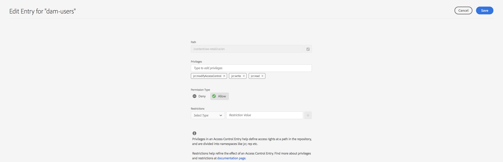

# Exibição principal para gerenciamento de permissões {#principal-view-for-permissions-management}

## Visão geral {#overview}

O AEM apresenta o Gerenciamento de permissões para usuários e grupos. A funcionalidade principal permanece a mesma da interface clássica, mas é mais amigável e eficiente.

## Acesso à interface {#accessing-the-ui}

O novo gerenciamento de permissões com base em interface é acessado por meio do cartão Permissões, em Segurança, conforme mostrado abaixo:

A nova exibição facilita a análise de todo o conjunto de privilégios e restrições para uma determinada entidade de segurança em todos os caminhos nos quais as Permissões foram concedidas explicitamente. Isso elimina a necessidade de ir para

CRXDE para gerenciar privilégios e restrições avançados. Ela foi consolidada na mesma visão.

Há um filtro que permite ao usuário selecionar o tipo de entidades de segurança a serem observadas em **Usuários**, **Grupos** ou **Todos os** e procurar qualquer entidade de segurança **.**

## Exibindo permissões para um Principal {#viewing-permissions-for-a-principal}

O quadro à esquerda permite que os usuários rolem para baixo para encontrar qualquer principal ou pesquisar por um Grupo ou um Usuário com base no filtro selecionado, conforme mostrado abaixo:

Clicar no nome mostra as permissões atribuídas à direita. O painel de permissões mostra a lista de Entradas de controle de acesso em caminhos específicos, juntamente com as restrições configuradas.

## Adicionando uma nova Entrada de Controle de Acesso para um Principal {#adding-new-access-control-entry-for-a-principal}

Novas permissões podem ser adicionadas adicionando uma Entrada de controle de acesso. Basta clicar no botão Adicionar ACE.

Isso exibe a janela mostrada abaixo. A próxima etapa é escolher um caminho em que a permissão deve ser configurada.

Aqui, um caminho é selecionado onde você pode configurar uma permissão para **dam-users**:

Depois que o caminho é selecionado, o fluxo de trabalho volta para essa tela, onde o usuário pode selecionar um ou mais privilégios dos namespaces disponíveis (como `jcr`, `rep` ou `crx`), conforme mostrado abaixo.

Os privilégios podem ser adicionados pesquisando usando o campo de texto e selecionando na lista.

>[!NOTE]
>
>Para obter uma lista completa de privilégios e descrições, consulte [Administração de Usuários, Grupos e Direitos de Acesso](https://experienceleague.adobe.com/en/docs/experience-manager-65/content/security/user-group-ac-admin#access-right-management).

 

Depois que a lista de privilégios for selecionada, o usuário poderá escolher o Tipo de permissão: Negar ou Permitir, conforme mostrado abaixo.

 

## Uso de restrições {#using-restrictions}

Além da lista de privilégios e do Tipo de permissão em um determinado caminho, essa tela também permite adicionar restrições para controle de acesso refinado, como mostrado abaixo:

>[!NOTE]
>
>Para obter mais informações sobre o que significa cada restrição, consulte [a Documentação do Jackrabbit Oak](https://jackrabbit.apache.org/oak/docs/security/authorization/restriction.html).

É possível adicionar restrições, como mostrado abaixo, escolhendo o tipo de restrição, inserindo o valor e clicando no ícone **+**.

 

O novo ACE é refletido na Lista de controle de acesso conforme mostrado abaixo. Observe que `jcr:write` é um privilégio agregado que inclui `jcr:removeNode` que foi adicionado acima, mas não é mostrado abaixo como coberto por `jcr:write`.

## Edição de ACEs {#editing-aces}

As Entradas de controle de acesso podem ser editadas selecionando um principal e escolhendo o ACE que você deseja editar.

Por exemplo, aqui você pode editar a entrada abaixo para **dam-users** clicando no ícone de lápis à direita:

A tela de edição é exibida com ACEs configuradas pré-selecionadas, que podem ser excluídas clicando no ícone cruzado ao lado delas ou novos privilégios podem ser adicionados ao caminho fornecido, conforme mostrado abaixo.

Aqui o privilégio `addChildNodes` é adicionado para **dam-users** no caminho especificado.

As alterações podem ser salvas clicando no botão **Salvar** na parte superior direita, e são refletidas nas novas permissões para **dam-users**, conforme mostrado abaixo:

## Exclusão de ACEs {#deleting-aces}

As Entradas de Controle de Acesso podem ser excluídas para remover todas as permissões concedidas a um principal em um caminho específico. O ícone X ao lado de ACE pode ser usado para excluí-lo, conforme mostrado abaixo:

 

## Exibição de permissões {#permissions-view}

### Exibição de Permissões da Interface para Toque {#touch-ui-permisions-view}

Os administradores precisam de controle e visibilidade mais granulares das atribuições de permissões no nível do nó para melhorar a segurança e o gerenciamento no AEM. Anteriormente, apenas uma visualização de permissões baseada no principal estava disponível, limitando a capacidade de ver como as ACLs são aplicadas a nós específicos ou visualizações filtradas. O novo nó e a visualização filtrada fornecem uma perspectiva detalhada e contextualizada das atribuições de permissões, permitindo um melhor gerenciamento e auditoria das configurações de segurança. Esse recurso melhora a supervisão administrativa e simplifica o gerenciamento de permissões, melhora a segurança, reduz erros de configuração e simplifica os controles de acesso do usuário no AEM.

Você pode acessar o modo de exibição da Interface para Toque de Permissões clicando em **Ferramentas - Segurança - Permissões**, conforme mostrado abaixo:

Depois de iniciar a exibição de Permissões, você pode clicar em **Exibição do Nó** ou **Exibição Filtrada** no canto superior direito da tela, dependendo da sua preferência de exibição.

#### Visualização de nós

Nesta visualização, as ACLs são apresentadas para cada Nó individual (caminho). Ele fornece informações sobre:

ACLs locais para o nó selecionado.
ACLs efetivas, que incluem ACLs aplicadas a cada nó principal até a raiz (&quot;/&quot;).
Os usuários têm a opção de adicionar, remover ou atualizar ACLs. Quando um caminho é clicado, o painel esquerdo exibe seus filhos, enquanto o lado direito apresenta uma visualização de tabela de todas as ACLs associadas a esse caminho.

#### Visualização filtrada

Essa visualização permite que os usuários pesquisem com eficiência por permissões em um caminho e principais especificados. Nessa visualização, os usuários podem determinar facilmente o tipo de permissões concedidas a um grupo de principais para o caminho selecionado.
Além disso, a Exibição filtrada fornece informações sobre ACLs eficazes. Ele exibe as ACLs associadas ao nó principal do caminho selecionado, considerando o principal selecionado e quaisquer principais comuns.

### A Visualização De Permissões Do Navegador Do Repositório {#the-repository-browser-permissions-view}

A exibição de permissões também pode ser acessada pelo [Navegador do Repositório](/help/implementing/developing/tools/repository-browser.md).

Você pode acessá-lo ao:

1. Abrindo o console do Desenvolvedor, clicando na guia **Navegador do Repositório** e, em seguida, em **abrir Navegador do Repositório**

   

1. Uma vez no Navegador do repositório, clique na guia **Permissões**

   

**Observação**: para exibir as permissões, são necessários direitos de administrador. Siga as etapas mencionadas [aqui](/help/implementing/developing/tools/repository-browser.md#navigate-the-hierarchy-navigate-the-hierarchy) para acessar as permissões.

## Combinações de Privilégios da Interface Clássica {#classic-ui-privilege-combinations}

A nova interface de permissões usa explicitamente o conjunto básico de privilégios em vez de combinações predefinidas que não refletem realmente os privilégios subjacentes exatos que foram concedidos.

Causou confusão sobre o que exatamente está sendo configurado. A tabela a seguir lista o mapeamento entre as combinações de privilégios da interface clássica para os privilégios reais que as constituem:

<table>
 <tbody>
  <tr>
   <th>Combinações de Privilégios da Interface Clássica</th>
   <th>Privilégio de Permissões da Interface do Usuário</th>
  </tr>
  <tr>
   <td>Ler</td>
   <td><code>jcr:read</code></td>
  </tr>
  <tr>
   <td>Modificar</td>
   <td>
<code>jcr:modifyProperties</code>
 
<code>jcr:lockManagement</code>
 
<code>jcr:versionManagement</code>
 </td>
  </tr>
  <tr>
   <td>Criar</td>
   <td>
<code>jcr:addChildNodes</code>
 
<code>jcr:nodeTypeManagement</code>
 </td>
  </tr>
  <tr>
   <td>Excluir</td>
   <td>
<code>jcr:removeNode</code>
 
<code>jcr:removeChildNodes</code>
 </td>
  </tr>
  <tr>
   <td>Ler ACL</td>
   <td><code>jcr:readAccessControl</code></td>
  </tr>
  <tr>
   <td>Editar ACL</td>
   <td><code>jcr:modifyAccessControl</code></td>
  </tr>
  <tr>
   <td>Replicar</td>
   <td><code>crx:replicate</code></td>
  </tr>
 </tbody>
</table>
